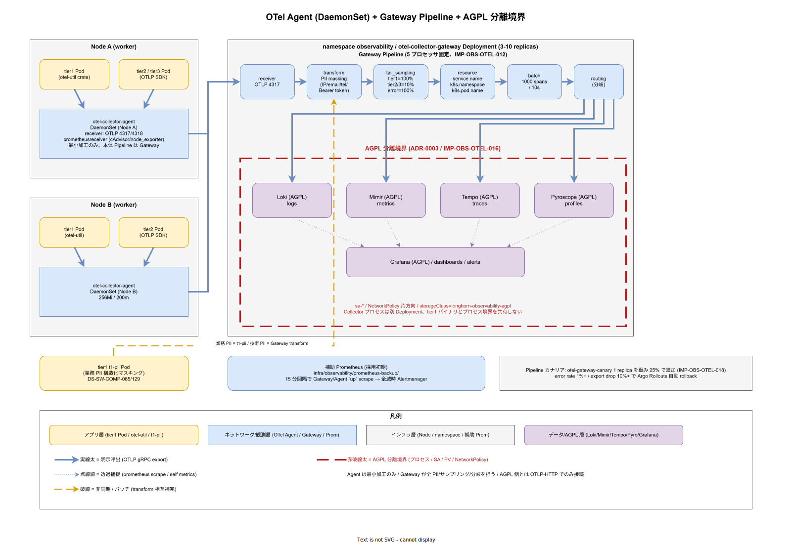

# 01. OTel Collector 配置

本ファイルは ADR-OBS-002 で採択した OpenTelemetry Collector の物理配置を Agent + Gateway の 2 段構成として確定する。60 章方針の IMP-OBS-POL-001（全テレメトリは OTel Collector 経由）と IMP-OBS-POL-002（LGTM Stack の AGPL 分離）を配置レベルに落とし、tier1 アプリから LGTM Stack（Loki / Mimir / Tempo / Pyroscope）までのテレメトリ経路と PII マスキング点、サンプリング戦略を 1 本の Pipeline 図に統合する。

アプリから LGTM へ直送する単層構成は、バックエンド変更がアプリ改修を誘発する、ネットワーク分離境界が崩れる、PII マスキング責務の位置が曖昧になる、という 3 点で破綻する。本節は Agent（Node ローカル）+ Gateway（集約層）の 2 段に分離し、Agent は収集と最小加工、Gateway は PII マスキング・サンプリング・バックエンド分岐を担う構成で固定する。Agent の設置単位は Node、Gateway は namespace とし、責務境界を Pod ではなく層で切る。

AGPL 分離（ADR-0003）は本節の前提として常に効く。Grafana / Loki / Tempo / Mimir / Pyroscope は OTel Collector から OTLP / HTTP で接続し、tier1 バイナリとプロセス境界を共有しない。Collector 自身は Apache 2.0 であり、tier1 / tier2 と同居する配置を許容する。

## Agent 配置（Node ローカル）

Agent は各 Kubernetes Node に DaemonSet として配置する。配置定義は `infra/observability/otel-agent/` に Helm chart で持ち、tier / namespace 区別なく単一構成で立てる（IMP-OBS-OTEL-010）。

- DaemonSet 名: `otel-collector-agent`
- Host 側: `hostNetwork: false`（Node IP 依存を避ける）、`hostPort: 4317`（gRPC）と `4318`（HTTP）は expose しない
- Pod 側: ClusterIP Service `otel-agent.observability.svc.cluster.local:4317` を各 Node の Pod へ DNS 経由で配信
- 受信プロトコル: OTLP gRPC（4317）/ OTLP HTTP（4318）/ Prometheus scrape（自前 exporter 吸収用）
- メモリ / CPU: 256Mi / 200m（Node 数 × これで観測オーバーヘッドを予測可能にする）

Agent の責務は「Pod からテレメトリを受け、Gateway へ中継」のみとし、PII マスキングとサンプリングは Gateway に集中する。Agent 側で複雑な加工を入れると Node ごとの Pipeline 版数がズレ、トラブル時の再現性が落ちる。Agent 設定は `infra/observability/otel-agent/config.yaml` に固定し、版管理は Argo CD が担う。

アプリ側の接続先は環境変数 `OTEL_EXPORTER_OTLP_ENDPOINT=http://otel-agent.observability:4317` を Pod Template で注入する。tier1 の Rust crate `otel-util`（`src/tier1/rust/crates/otel-util/`、DS-SW-COMP-129）と tier1 Go 共通 package が、この環境変数を既定値として参照する。

## Gateway 配置（namespace `observability`）

Gateway は Deployment としてレプリカ分散配置し、HPA でスケールする（IMP-OBS-OTEL-011）。Pod は 3 replicas 最小、10 replicas 最大。配置定義は `infra/observability/otel-gateway/`。

- Deployment 名: `otel-collector-gateway`
- Service: ClusterIP `otel-gateway.observability.svc.cluster.local:4317`（内部向け）
- HPA: CPU 70% 閾値 + OTLP `requests_per_second` カスタムメトリクス（KEDA 経由で Mimir を見る）
- メモリ / CPU: 1Gi / 500m per pod、Limit は 2Gi / 1000m
- Readiness: `/healthz`（OTel Collector 標準）、Liveness は OTLP gRPC ping

Gateway は Agent からの OTLP を受け、以下の Pipeline で加工する（IMP-OBS-OTEL-012）。

- `transform` プロセッサ: PII マスキング（後節）
- `tail_sampling` プロセッサ: tier2/tier3 のトレースを 10% にサンプリング（tier1 公開 API は 100%）
- `resource` プロセッサ: `service.name` / `k8s.namespace.name` / `k8s.pod.name` を必須属性として注入
- `batch` プロセッサ: 1000 spans / 10s のバッチング
- `routing` プロセッサ: バックエンド分岐（metrics → Mimir、logs → Loki、traces → Tempo、profiles → Pyroscope）

Gateway Pipeline は `infra/observability/otel-gateway/config.yaml` に固定し、Pipeline 変更は `infra/observability/otel-gateway/` 配下の PR レビューで段階適用（カナリア 1 replica → 全台）する運用とする（IMP-OBS-POL-001 の Pipeline 変更規約）。

## PII マスキング点の責務分担

PII マスキングは tier1 `t1-pii` Pod（DS-SW-COMP-085 / 129）と Gateway の二段で実装するが、責務を明確に分ける（IMP-OBS-OTEL-013）。

- `t1-pii` Pod: tier2 / tier3 からの業務データ内 PII（個人名・住所・生年月日など業務文脈の PII）を構造化マスキング
- OTel Gateway `transform`: テレメトリに紛れ込む技術文脈の PII（IP アドレス・email・電話番号・クレデンシャル断片）を正規表現マスキング

Gateway の `transform` 規則は以下を最小集合として設定する。

- IP アドレス（IPv4 / IPv6）: `xxx.xxx.xxx.xxx` に置換、最終オクテットを保持
- email: ユーザー部を `***@` に置換
- 電話番号（JP 形式）: 市外局番 + `****-****` に置換
- Bearer token 断片: `Bearer ***` に置換
- UUID: そのまま保持（追跡に必要）

責務分担の理由は、業務 PII と技術 PII の検出ロジックが別進化するためである。`t1-pii` はドメイン特化の正規表現辞書を持ち、Gateway の `transform` は OSS 定番の正規表現集で済む。両者を同じ場所に詰め込むと、観測性の変更が tier1 のビジネスロジック改修を誘発する逆依存が生じる。

## サンプリング戦略

サンプリングは Gateway の `tail_sampling` プロセッサで一元管理する（IMP-OBS-OTEL-014）。head sampling（Agent 側）は使わない。

- tier1 公開 11 API: **100% サンプリング**（SLI 計測の基礎、40 章の SLO 計算に使う）
- tier2 ドメインサービス: 10% サンプリング（エラー trace は 100%、p99 超過 trace は 100%）
- tier3 BFF / Web: 10% サンプリング（ユーザー識別子付き trace は追跡用に 100%）
- バッチ / cron: 1% サンプリング（実行成否の span のみ 100%）

`tail_sampling` の条件式は OTTL（OpenTelemetry Transformation Language）で記述し、条件式は `infra/observability/otel-gateway/sampling-rules.yaml` に分離。PR レビューで Security（D）の確認を必須化する（監査性に直結するため）。

## Kubernetes メトリクスと外部 receiver

Kubernetes インフラ系メトリクス（kube-state-metrics / node_exporter / cAdvisor）は OTel Collector の `prometheusreceiver` 経由で取り込み、Mimir へ統一送信する（IMP-OBS-OTEL-015）。

- `kube-state-metrics` は `infra/observability/kube-state-metrics/` に配置、Service Monitor 相当の scrape 設定を Collector Pipeline に組込
- `node_exporter` は各 Node の DaemonSet で立て、Agent が localhost:9100 を scrape
- cAdvisor は kubelet 組込のため追加配置なし、Agent が `/metrics/cadvisor` を scrape
- 外部 OSS（Keycloak / Dapr / OpenBao / Istio）の Prometheus exporter は Agent で受け、Gateway で OTLP 変換済みで Mimir へ

この経路で、k1s0 内の全メトリクスが `otlp.gateway -> mimir` の単一経路を通る。Prometheus の scrape 経路を LGTM 側に残さないことで、IMP-OBS-POL-001 の「アプリから直接 push 禁止」を Kubernetes インフラ側にも拡張適用する。

## AGPL 分離の物理化

Grafana / Loki / Tempo / Mimir / Pyroscope は namespace `observability` 内でも Collector とは別 Deployment、別 PV、別 ServiceAccount として隔離する（IMP-OBS-OTEL-016）。

- namespace 同居は許容（観測基盤としての一体運用性を優先）
- ServiceAccount: `sa-grafana` / `sa-loki` / `sa-tempo` / `sa-mimir` / `sa-pyroscope` / `sa-otel-agent` / `sa-otel-gateway` を個別発行
- NetworkPolicy: Collector Gateway → LGTM のみ許可、逆方向と横方向は拒否
- AGPL コンポーネントの PV は `storageClass=longhorn-observability-agpl` で分離し、スナップショット取得時も mount 先を分ける
- Helm values は `agpl: true` / `agpl: false` のラベルで境界を明示

この配置は ADR-0003 の「プロセス境界＋公開プロトコル」を運用可能なレベルまで具体化するもので、監査エビデンスとして `ops/dr/agpl-isolation-evidence/otel-collector/` に Helm values と NetworkPolicy の snapshot を四半期毎に保管する。

## Collector 自身の観測性（自己監視）

OTel Collector 自体の稼働が監視の前提条件になるため、Collector の内部メトリクスを別経路で Mimir に送る必要がある。自己ループ（Collector のメトリクスを同じ Collector に流して可視化）は Collector ダウン時に盲点となるため、二重化を入れる（IMP-OBS-OTEL-017）。

- Agent の内部メトリクス: `otelcol_receiver_*` / `otelcol_exporter_*` / `otelcol_processor_*` を Prometheus 形式で expose、Gateway 経由で Mimir へ
- Gateway の内部メトリクス: 同上。加えて `otelcol_processor_tail_sampling_*` で sampling 効果を可視化
- ただし Gateway 全台停止時の検知は、Mimir へ直接 scrape する補助 Prometheus（`infra/observability/prometheus-backup/`）で担保
- 補助 Prometheus は 15 分間隔で Gateway と Agent の `up` を scrape し、全滅時に Alertmanager 経由で SRE 起床

この二重化は リリース時点 から必須とする。Collector 不在で SLI が 0 になる盲点は、Google SRE Book の「meta-observability」問題そのもので、SRE 運用の初日から意識する必要がある。リリース時点 で補助 Prometheus も Mimir + recording rules の内部監視へ統合するが、採用初期 は外部補助経路を残す。

## Pipeline カナリアリリース運用

Gateway Pipeline の変更は 3 replicas のうち 1 台をまず新設定に差し替え、10 分間 SLI 劣化が無いか観測してから全台適用する（IMP-OBS-OTEL-018）。変更経路は Argo CD のローリングではなく、専用の `otel-gateway-canary` Deployment を同一 Service の endpoints に加える方式とする。

- 通常時: `otel-gateway` 3 replicas が Service `otel-gateway` の endpoints を占有
- カナリア時: `otel-gateway-canary` 1 replicas を一時的に追加、重み 25% でトラフィック分散
- 監視指標: `otelcol_processor_transform_errors_total` / `otelcol_exporter_sent_metric_points_total` の差分
- 異常検知: 5 分以内に error rate 1% 超 or export drop 10% 超なら自動 rollback（Argo Rollouts AnalysisTemplate）
- 正常時: 10 分後に weight 100% に昇格、旧 Deployment を decommission

Pipeline の変更は PII マスキング規則の変更や sampling 率の変更など、観測性そのものに致命的影響を与える可能性があるため、カナリア必須とする。変更 PR は Security（D）の PII ルール妥当性レビュー + SRE（B）の SLI 影響評価を両方必須化する。

## バージョン固定と upstream 追従

OTel Collector は OSS として上流で月次リリースが進み、新 processor や receiver が継続的に追加される。一方で設定ファイル互換性が破れる minor 更新もあり、無思慮な追従は Pipeline 停止を招く。本節のバージョン運用を次の規律で固定する（IMP-OBS-OTEL-019）。

- `otelcol-contrib` の minor バージョンを リリース時点 で 1 つ固定（リリース時点 開始時点の LTS 候補）
- upstream の minor 更新は Renovate が検知し、PR 作成から 14 日間は staging 環境で観察
- staging で SLI 劣化なし + processor 仕様変更の読み合わせが完了した時点で production へ昇格
- patch 更新（security fix 含む）は staging を 3 日間通過後、production へ自動適用
- 設定ファイル（`config.yaml`）の schema 変更は PR で必ず `otelcol validate` を通す

この規律により、upstream の進化を取り込みつつ、production の Pipeline 停止を四半期に 0 回まで抑える。Collector の停止は tier1 API の SLI 計測自体を止めるため、Pipeline 更新の慎重さは SLO 運用の土台となる。

## 対応 IMP-OBS ID

- IMP-OBS-OTEL-010: Agent DaemonSet 配置と最小加工の責務固定
- IMP-OBS-OTEL-011: Gateway Deployment + HPA 3-10 構成
- IMP-OBS-OTEL-012: Gateway 5 プロセッサ Pipeline（transform / tail_sampling / resource / batch / routing）
- IMP-OBS-OTEL-013: PII マスキングの tier1 `t1-pii` と Gateway `transform` 二段責務分担
- IMP-OBS-OTEL-014: tail_sampling 一元管理と API 種別ごとのサンプリング率
- IMP-OBS-OTEL-015: Kubernetes メトリクスの prometheusreceiver 吸収統一
- IMP-OBS-OTEL-016: AGPL 分離の ServiceAccount / NetworkPolicy / PV レベル物理化
- IMP-OBS-OTEL-017: Collector 自己監視の二重化（補助 Prometheus）
- IMP-OBS-OTEL-018: Pipeline カナリアリリース運用（25% 重み + 10 分観測）
- IMP-OBS-OTEL-019: バージョン固定と upstream 追従規律

## 対応 ADR / DS-SW-COMP / NFR

- ADR: [ADR-OBS-001](../../../02_構想設計/adr/ADR-OBS-001-grafana-lgtm.md)（Grafana LGTM）/ [ADR-OBS-002](../../../02_構想設計/adr/ADR-OBS-002-otel-collector.md)（OTel Collector）/ [ADR-0003](../../../02_構想設計/adr/ADR-0003-agpl-isolation-architecture.md)（AGPL 分離）
- DS-SW-COMP: DS-SW-COMP-085（PII）/ DS-SW-COMP-124（観測性サイドカー統合）/ DS-SW-COMP-129（Rust crates）
- NFR: NFR-A-CONT-001（SLA 99%）/ NFR-C-NOP-001（監視スタック）/ NFR-B-PERF-001（p99 < 500ms、サンプリング 100% 維持）/ NFR-G-*（PII / プライバシー関連、Gateway transform で対応）
- 関連節: `20_LGTM_Stack/`（Loki / Grafana / Tempo / Mimir 本体）/ `30_Pyroscope/`（プロファイル）/ `40_SLO_SLI定義/`（100% サンプリングの SLI 計測依存）
