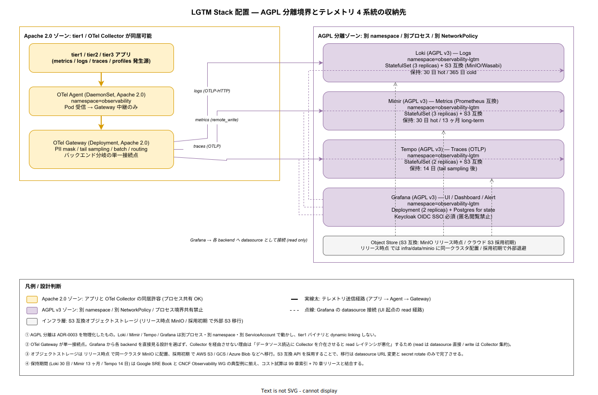

# 01. LGTM Stack 配置

本ファイルは ADR-OBS-001 で採択した Grafana LGTM Stack（Loki / Grafana / Tempo / Mimir）の物理配置を実装段階の確定版として固定する。OTel Collector が集約したテレメトリ 4 系統（metrics / logs / traces / profiles）の収納先を `observability-lgtm` namespace に物理隔離し、ADR-0003（AGPL 分離）を Kubernetes リソース境界として実装する。本章は配置のみを扱い、`Grafana` のダッシュボード設計や Alert 規約は別途 70_Runbook連携 / 50_ErrorBudget運用で展開する。



## なぜ LGTM Stack を `observability-lgtm` namespace に隔離するのか

ADR-0003 で確定した AGPL 分離方針は「ライセンスの感染リスクを物理境界で遮断する」ことを目的とする。Loki / Grafana / Tempo / Mimir は Grafana Labs が AGPL v3 で配布しており、tier1 / tier2 のバイナリと dynamic linking した瞬間に「結合した著作物」として AGPL の伝染条件が発火する解釈が成立しうる。これを避ける最も確実な方法が**プロセス境界・namespace 境界・NetworkPolicy 境界の三重隔離**であり、本章はそれを Kubernetes 上で実装する。

OTel Collector（Apache 2.0）は AGPL 側に所属させない設計とし、LGTM へは「OTLP / HTTP / remote_write」という標準プロトコル経由のみで接続する。これにより、AGPL ゾーン側の停止 / 入替 / バックアップ復元はアプリ側の改修を一切伴わず行える。LGTM 自体を将来 Grafana Cloud（マネージド AGPL 互換 SaaS）や Mimir のフォーク版に置き換えるシナリオでも、Collector の routing 設定変更だけで完結する構造を保つ。

## namespace と Pod 配置

LGTM Stack は **`observability-lgtm`** namespace に集約配置する（`observability` namespace は Collector 側で占有済み）。配置定義は `infra/observability/lgtm/` に Helm chart で持ち、`@k1s0/sre` が単独レビュー権を持つ。

| コンポーネント | 種別 | replicas | namespace | 永続化 |
|---|---|---|---|---|
| Loki | StatefulSet | 3 | observability-lgtm | S3 互換（chunks + index） |
| Mimir | StatefulSet | 3 | observability-lgtm | S3 互換（blocks） |
| Tempo | StatefulSet | 2 | observability-lgtm | S3 互換（blocks） |
| Grafana | Deployment | 2 | observability-lgtm | Postgres（CloudNativePG） |

StatefulSet を選ぶのは「Pod 名が安定しないと Loki の ring / Mimir の compactor が ring rebalance を頻発させる」ため。Deployment ではなく StatefulSet が必要なのは Loki / Mimir / Tempo の 3 つで、Grafana は state を Postgres に外出ししているため Deployment で十分。

namespace は `observability` と分離する。これにより NetworkPolicy で「`observability-lgtm` への ingress は `observability` namespace の OTel Gateway と Grafana 自身のみ許可」という規則が単純な label selector で書ける。

## NetworkPolicy による境界実装

`infra/observability/lgtm/networkpolicy.yaml` で以下を強制する。

- ingress: `observability` namespace の `app=otel-collector-gateway` および `observability-lgtm` namespace の `app=grafana` のみ許可
- egress: `observability-lgtm` namespace内 + `infra-data` namespace の `app=minio` のみ許可
- DNS: `kube-system/kube-dns` への egress のみ許可

これにより、tier1 / tier2 / tier3 アプリから LGTM へ直接接続する経路は物理的に閉じる。アプリが LGTM のクエリ結果を必要とする場合（例: ダッシュボード埋め込み）は Grafana の embed API 経由で行う設計を本章で固定し、tier1 アプリが Mimir に直接 PromQL を投げる構造を禁ずる。

## オブジェクトストレージ

Loki / Mimir / Tempo の 3 つは S3 互換オブジェクトストレージを永続化先とする。リリース時点では `infra/data/minio/` の MinIO（同一クラスタ内）を採用し、採用初期で AWS S3 / Google Cloud Storage / Azure Blob などの外部マネージド S3 へ移行する設計とする。

S3 互換 API を選んだ理由は、移行が `datasource URL 変更 + IAM credential rotate` のみで完結するため。Loki / Mimir / Tempo の chunk 形式は S3 互換どこでも同一なので、データ自体の変換は不要。

```yaml
# infra/observability/lgtm/values.yaml の抜粋（Loki）
loki:
  storage:
    type: s3
    s3:
      endpoint: minio.infra-data.svc.cluster.local:9000
      bucketnames: loki-chunks,loki-ruler,loki-admin
      region: us-east-1  # MinIO の dummy region
      access_key_id: ${LOKI_S3_ACCESS_KEY}
      secret_access_key: ${LOKI_S3_SECRET_KEY}
      s3forcepathstyle: true
      insecure: true  # 同一クラスタ内 plain HTTP（NetworkPolicy で守る）
```

採用初期で外部 S3 に移行する際は、`endpoint` / `region` / `s3forcepathstyle` / `insecure` を切替え、credential を ExternalSecret 経由で OpenBao から渡す形に変更する（IMP-SEC-OBO-043 の KV-v2 path 設計 経由で取得）。本章で固定するのは「S3 互換 API 採用」と「移行経路の単純性確保」の 2 点で、具体的なクラウドベンダー選択は採用初期の課題。

## 保持期間

保持期間は CNCF Observability WG の典型例に揃え、Google SRE Book の運用観点から逆算する。

| backend | hot retention | long-term retention | 根拠 |
|---|---|---|---|
| Loki | 30 日 | 365 日（compacted） | インシデント分析は最大 30 日、監査は 1 年 |
| Mimir | 30 日 | 13 ヶ月 | YoY 比較に 13 ヶ月必要（last year 同月含む） |
| Tempo | 14 日 | なし（保持期間 = hot） | tail sampling 後の trace のみ保存、長期は不要 |

Tempo は他の 2 つと異なり long-term を持たない。理由は「2 週間より古い trace は監査価値がほぼゼロで、metrics（Mimir）から異常時刻を特定し改めて再現する方が実用的」という現場運用の経験則。Tempo の長期保存は採用拡大期で「forensic 用に永続化」要件が出てから導入する。

Mimir の 13 ヶ月は「last year same month」比較を成立させる最小値。12 ヶ月だと境界月で前年データが欠落する。

## Grafana の認証 / 認可

Grafana は **匿名閲覧禁止 / Keycloak OIDC SSO 必須**で起動する（IMP-SEC-KC-* と接続）。`grafana.ini` の核を以下に固定する。

```ini
[auth]
disable_login_form = true
disable_signout_menu = false

[auth.generic_oauth]
enabled = true
name = Keycloak
client_id = grafana
client_secret = $__file{/etc/secrets/grafana-oidc-secret}
scopes = openid profile email groups
auth_url = https://auth.k1s0.example/realms/k1s0/protocol/openid-connect/auth
token_url = https://auth.k1s0.example/realms/k1s0/protocol/openid-connect/token
api_url = https://auth.k1s0.example/realms/k1s0/protocol/openid-connect/userinfo
role_attribute_path = contains(groups[*], '/sre') && 'Admin' || contains(groups[*], '/dev') && 'Editor' || 'Viewer'

[users]
allow_sign_up = false
auto_assign_org = true
```

Keycloak 側の group → Grafana role マッピングは「`/sre` group → Admin / `/dev` group → Editor / それ以外 → Viewer」とする。匿名閲覧の禁止により、ダッシュボード URL を漏洩しても認証なしでは見えない構造を保つ。

## datasource 接続

Grafana から各 backend への接続は **datasource として直接接続**し、Collector を介在させない。理由は「read 経路に Collector を挟むと UI のレスポンス時間が悪化し、ダッシュボード起点の調査効率が下がる」ため。

write 経路（Collector → backend）と read 経路（Grafana → backend）を物理的に分離するこの構造により、片方の障害が他方に伝播しない。例えば Collector Gateway が落ちても Grafana からは過去データの分析が継続できる。

datasource 設定は `infra/observability/lgtm/grafana/datasources.yaml` に provisioning 形式で固定し、UI からの追加は無効化する。

## バックアップとリストア

Postgres（Grafana state）と S3（Loki / Mimir / Tempo data）の 2 系統で別戦略を採る。

- Postgres: CloudNativePG の `Backup` リソースで日次に MinIO へ取得、保持 30 日
- S3 オブジェクトストレージ: バージョニング有効化 + replication で別 region / 別 bucket へ複製

Grafana state の喪失は「ダッシュボード定義 + alert 定義の喪失」を意味するが、両方とも `infra/observability/lgtm/grafana/` 配下に Git 管理されているため、空の Postgres から provisioning 経由で完全復元できる。S3 側の喪失は時系列データの喪失となり、復元は不可（直近データは backend がメモリに持っているため、即時 fail-over 時の損失は数分程度）。

## 障害時の挙動

LGTM Stack 全体が停止しても、tier1 / tier2 / tier3 アプリは観測できないだけで処理は継続する。OTel Collector Gateway は backend への送信失敗を検知して **memory + disk queue にバッファリング**し、復旧後に再送する設定を行う（リリース時点で disk queue を 1 GB / Pod 上限とし、超過分は drop）。

復旧優先順位は「Mimir → Loki → Tempo → Grafana」で、SLO 計算に必要な metrics（Mimir）を最優先とする。Tempo / Grafana は復旧が遅れても SLO violation の検知自体は阻害しないため、優先度を下げる。

## 対応 IMP-OBS ID

- `IMP-OBS-LGTM-020` : LGTM 4 コンポーネントを `observability-lgtm` namespace に集約配置し、AGPL 分離境界を namespace で実装
- `IMP-OBS-LGTM-021` : Loki / Mimir / Tempo を StatefulSet、Grafana を Deployment + Postgres state で配置
- `IMP-OBS-LGTM-022` : NetworkPolicy で ingress を `observability/otel-gateway` と `observability-lgtm/grafana` のみに限定
- `IMP-OBS-LGTM-023` : S3 互換オブジェクトストレージ採用（リリース時点 MinIO / 採用初期で外部 S3 移行）
- `IMP-OBS-LGTM-024` : 保持期間（Loki 30 日/365 日 / Mimir 30 日/13 ヶ月 / Tempo 14 日）の根拠と固定
- `IMP-OBS-LGTM-025` : Grafana 匿名閲覧禁止 + Keycloak OIDC SSO 必須化と group → role マッピング
- `IMP-OBS-LGTM-026` : datasource を Grafana から各 backend へ直接接続し、read / write 経路を物理分離
- `IMP-OBS-LGTM-027` : Postgres は CloudNativePG Backup で日次取得、S3 はバージョニング + replication で冗長化
- `IMP-OBS-LGTM-028` : Collector Gateway の disk queue 1 GB バッファ（backend 障害時のバッファリング）
- `IMP-OBS-LGTM-029` : 復旧優先順位 Mimir → Loki → Tempo → Grafana の固定

## 対応 ADR / DS-SW-COMP / NFR

- ADR-OBS-001（Grafana LGTM 採用） / ADR-0003（AGPL 分離） / ADR-OBS-002（OTel Collector 経由）
- DS-SW-COMP-124（観測性サイドカー統合） / DS-SW-COMP-135（配信系インフラ）
- NFR-A-CONT-001（SLA 99%） / NFR-I-SLO-001（内部 SLO 99.9%） / NFR-I-SLI-001（Availability SLI）
- NFR-C-NOP-001（小規模運用 / 監視スタック） / NFR-E-MON-001（特権監査） / NFR-C-MGMT-003（SBOM 100%）
- IMP-OBS-OTEL-010〜019（Collector Agent + Gateway 配置との接続点）
- IMP-SEC-KC-*（Keycloak OIDC との接続） / IMP-SEC-OBO-043（OpenBao KV-v2 経由の S3 credential 取得 / 採用初期の外部 S3 移行時）
