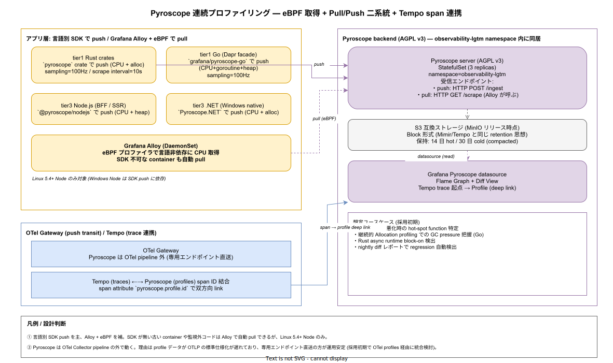

# 01. Pyroscope 統合

本ファイルは Grafana Pyroscope による連続プロファイリング（Continuous Profiling）の物理統合を実装段階確定版として固定する。tier1 Rust / tier1 Go / tier3 Node.js / tier3 .NET の 4 ランタイムから「言語別 SDK による push」を主経路とし、SDK が使えない container には「Grafana Alloy + eBPF による pull」を補完経路として併用する。Tempo の trace span との双方向リンクにより「遅い trace から hot-spot function に直接降りる」運用を可能にする。



## なぜ連続プロファイリングが必要なのか

metrics（latency / RPS / error rate）と traces（リクエスト経路）が揃っていても、「どの関数が遅い理由か」は別の道具が必要になる。1 リクエストの flame graph をオンデマンドで取る `perf` / `pprof` 直接実行は、本番障害発生中に行うのが難しく、再現性も低い。**連続プロファイリングは「全期間で常に flame graph を取り続け、後から任意の時間範囲を切り出す」**運用を可能にし、p99 latency 悪化が起きた瞬間の hot-spot を 5 分後にも分析できる。

k1s0 の SLO（70_リリース設計の Canary 判定 / 50_ErrorBudget運用の budget 計算）は metrics ベースで判定するが、SLO 違反の **原因究明** は profile が無いと「アプリ側か runtime 側か」を切り分けるだけで数時間消費する。Pyroscope を常時稼働させることで、Canary 失敗時の自動 rollback と並行して「hot-spot function を 5 分以内に特定」できる体制を作る。

## 4 ランタイムの SDK push

主経路は言語別 SDK による push。各 SDK は対応 runtime に組込み、起動時に Pyroscope server へ HTTP POST で送る。

| ランタイム | SDK | 取得対象 | sampling rate |
|---|---|---|---|
| Rust（tier1 crates） | `pyroscope` crate（pyroscope-rs） | CPU + allocation | 100 Hz |
| Go（tier1 Dapr facade） | `grafana/pyroscope-go` | CPU + goroutine + heap | 100 Hz |
| Node.js（tier3 BFF / SSR） | `@pyroscope/nodejs` | CPU + heap | 100 Hz |
| .NET（tier3 Windows native） | `Pyroscope.NET` | CPU + allocation | 100 Hz |

各 SDK は環境変数 `PYROSCOPE_SERVER_ADDRESS=http://pyroscope.observability-lgtm:4040` を Pod Template で受け取り、起動時に自動で session を確立する。tier1 の Rust common crate `otel-util`（DS-SW-COMP-129）に Pyroscope SDK を組込み、各 binary は数行の初期化で完結させる。

```rust
// src/tier1/rust/crates/otel-util/src/profiling.rs
pub fn init_pyroscope(service_name: &str) -> Result<PyroscopeAgent<PyroscopeAgentRunning>> {
    PyroscopeAgentBuilder::new(
        std::env::var("PYROSCOPE_SERVER_ADDRESS")?,
        service_name.to_string(),
    )
    .backend(pprof_backend(PprofConfig::new().sample_rate(100)))
    .tags([
        ("env".into(), std::env::var("DEPLOY_ENV").unwrap_or_else(|_| "dev".into())),
        ("k8s_namespace".into(), std::env::var("K8S_NAMESPACE").unwrap_or_default()),
    ].into())
    .build()?
    .start()
}
```

`tags` には `env` / `k8s_namespace` を必須注入し、Grafana 上で multi-tenant 風の絞り込みを可能にする。tier3 .NET は Windows native のため eBPF pull は不可で、SDK push が唯一の経路となる（IMP-OBS-PYR-031）。

## eBPF pull（Grafana Alloy）

SDK push が不可能な container（古い base image / SDK 提供のない言語 / 計装が未対応の middleware）を補完するため、Grafana Alloy を DaemonSet として配置し、eBPF プロファイラで言語非依存に CPU profile を取得する。

- 配置: `infra/observability/pyroscope/alloy/` 配下に Helm chart
- 対象: Linux Node のみ（kernel 5.4+ 必須、Windows Node は対象外）
- 取得: CPU profile のみ（heap / allocation は eBPF では取れない）
- 識別: container metadata から `service.name` を自動推論、推論不能な場合は `unknown_<image_name>` で記録

eBPF pull は **「監視死角を残さない」** ための保険であり、本流ではない。SDK push が利く container は SDK 経路を優先し、Alloy には集約閾値（CPU 5% 以下の container は無視）を設けて Pyroscope 側のストレージ負荷を抑える（IMP-OBS-PYR-032）。

## OTel Collector との分離

Pyroscope は OTel Collector pipeline の **外側** で動かし、専用エンドポイント直送とする。理由は OTLP の profiles signal（`pprofextension` / OTLP/Profile）が CNCF で正式仕様化中（2026-04 時点で experimental）で、本番運用の安定性が SDK 直送より劣るため。

リリース時点では「Pyroscope 専用エンドポイントへ SDK / Alloy が直接送る」設計を採り、採用初期で OTLP profiles signal が GA に至った段階で OTel Collector 経由に統合する候補を ADR で別途検討する。Collector 経由化のメリットは「PII マスキングの一元化 / sampling 戦略の統合」だが、現時点では実装の枯れていない遠回りとなる（IMP-OBS-PYR-033）。

## Tempo trace span との双方向リンク

Pyroscope の真価は「trace から profile に降りる動線」で発揮される。Tempo の span attribute に `pyroscope.profile.id` を注入することで、Grafana Tempo UI 上で「この span の実行中に取られた profile」へワンクリックで遷移できる。

実装は OTel SDK の TracerProvider に SpanProcessor を追加し、span 開始時に Pyroscope 側へ「この span の実行中の profile sample」を tag 付与する形で行う。tier1 共通 crate `otel-util` がこの統合を提供し、各 binary は意識せず使える（IMP-OBS-PYR-034）。

```rust
// 概念コード
let span = tracer.start("process_request");
let _profile_guard = pyroscope.add_label("trace_id", span.context().trace_id().to_string());
// ... process ...
drop(_profile_guard); // span 終了時に label 解除
span.end();
```

Grafana の trace view 上では、span を開いた状態で「Profiles」タブが追加され、その span の実行時間帯の flame graph が即座に見える。これにより「遅い trace を 1 件特定 → 5 秒で hot-spot function 特定」が回るようになる。

## Pyroscope server 配置

Pyroscope backend は AGPL v3 のため、`observability-lgtm` namespace に LGTM Stack と同居配置する（IMP-OBS-PYR-035）。

- StatefulSet（3 replicas）/ namespace=`observability-lgtm`
- 受信: `:4040` HTTP（push の `/ingest`、pull の Alloy からの scrape）
- 永続化: S3 互換ストレージ（MinIO / リリース時点）の `pyroscope-blocks` bucket
- 保持: 14 日 hot / 30 日 cold（compacted）

保持期間 14/30 日は「インシデント発生から root cause 分析が完了するまでの最大期間 + 余裕」を逆算した値。それより古い profile は監査価値がほぼ無い（コードが既に変わっており再現困難）。長期保存が必要なケース（性能劣化の年単位トレンド分析）は、必要時点で nightly ジョブから aggregate flame graph を別途保存する設計とし、Pyroscope 自体には抱え込まない（IMP-OBS-PYR-036）。

## Grafana datasource 統合

Grafana に Pyroscope datasource を provisioning 形式で追加し、3 種のビューを標準提供する（IMP-OBS-PYR-037）。

- Flame Graph: 任意時間範囲の hot-spot 可視化
- Diff View: 2 つの時間範囲を比較し、回帰検出（例: deploy 前後 1 時間の差分）
- Profile from Trace: Tempo span の `pyroscope.profile.id` から自動展開

Diff View は採用初期で「nightly ジョブ: 過去 1 週間の flame graph を baseline として、今日の flame graph と diff 取得 → Slack 通知」運用を組む計画。これにより、ある関数が静かに肥大化していくケースを検出できる（IMP-OBS-PYR-038）。

## 想定ユースケース

リリース時点〜採用初期で本章が想定するユースケースを以下に列挙する。

- p99 latency 悪化時に Tempo で遅い span を特定 → Pyroscope で hot-spot function を 5 分以内に判明させる
- 継続的 Allocation profiling での GC pressure 把握（Go の heap profile から allocation rate 推移を見る）
- Rust async runtime の `block_on` 検出（CPU profile に `tokio::runtime::block_on` が頻出するケースを発見）
- nightly diff レポートで regression 自動検出（前週 baseline との差分が閾値超過したら alert）

採用拡大期では「本番障害時に Pyroscope を見ずに復旧する」ことを禁ずる文化を作る。Runbook（70_Runbook連携）に Pyroscope 確認手順を必ず含め、profile を見ずに復旧した場合は post-mortem で言及する。

## 障害時の挙動

Pyroscope server が停止しても、各 SDK は in-memory bufferで一時保持し、復旧後に再送する（最大 5 分の buffer、超過分は drop）。Alloy も同様に local file system に最大 100 MB バッファ。tier1 / tier2 / tier3 アプリの動作には一切影響しない。

S3 ストレージが破損した場合、過去 profile は復元不可能（増分バックアップは取らない、サイズが大きすぎる）。直近 5 分以内のデータは Pyroscope server のメモリにあるため即時消失は数分程度。重大インシデントの調査中であれば、その期間の profile を Grafana から CSV エクスポートしておく運用とする（IMP-OBS-PYR-039）。

## 対応 IMP-OBS ID

- `IMP-OBS-PYR-030` : 4 ランタイム（Rust / Go / Node.js / .NET）の SDK push を主経路とし、`tags` に `env` / `k8s_namespace` を必須注入
- `IMP-OBS-PYR-031` : tier1 Rust の `otel-util` crate に Pyroscope 初期化を集約、各 binary は数行で完結
- `IMP-OBS-PYR-032` : Linux Node に Grafana Alloy + eBPF pull を補完配置、CPU 5% 以下の container は無視
- `IMP-OBS-PYR-033` : Pyroscope は OTel Collector pipeline 外で運用、OTLP profiles GA 後に統合検討
- `IMP-OBS-PYR-034` : Tempo span attribute `pyroscope.profile.id` で双方向 link、tier1 共通 crate で透過注入
- `IMP-OBS-PYR-035` : Pyroscope server を `observability-lgtm` namespace に配置（AGPL 同居）
- `IMP-OBS-PYR-036` : 保持期間 14 日 hot / 30 日 cold、長期は nightly aggregate で別保存
- `IMP-OBS-PYR-037` : Grafana datasource provisioning で Flame Graph / Diff View / Profile from Trace の 3 ビュー提供
- `IMP-OBS-PYR-038` : nightly diff レポートで regression 自動検出（採用初期）
- `IMP-OBS-PYR-039` : 障害時 SDK 5 分 buffer / Alloy 100 MB buffer / 重大インシデント時 CSV export

## 対応 ADR / DS-SW-COMP / NFR

- ADR-OBS-001（Grafana LGTM 採用、Pyroscope 含む） / ADR-0003（AGPL 分離）
- DS-SW-COMP-124（観測性サイドカー統合） / DS-SW-COMP-135（配信系インフラ）
- NFR-B-PERF-001（p99 < 500ms の根本原因分析を 5 分以内）
- NFR-C-NOP-001（小規模運用 / プロファイル取得の自動化）
- NFR-C-IR-001（Severity 別応答 / profile による迅速な root cause）
- IMP-OBS-OTEL-010〜019（Tempo span との link 経路）
- IMP-OBS-LGTM-020〜029（Pyroscope の AGPL 同居 namespace 共有）
- IMP-OBS-RB-080〜089（Runbook で profile 確認手順を必須化、後節）
