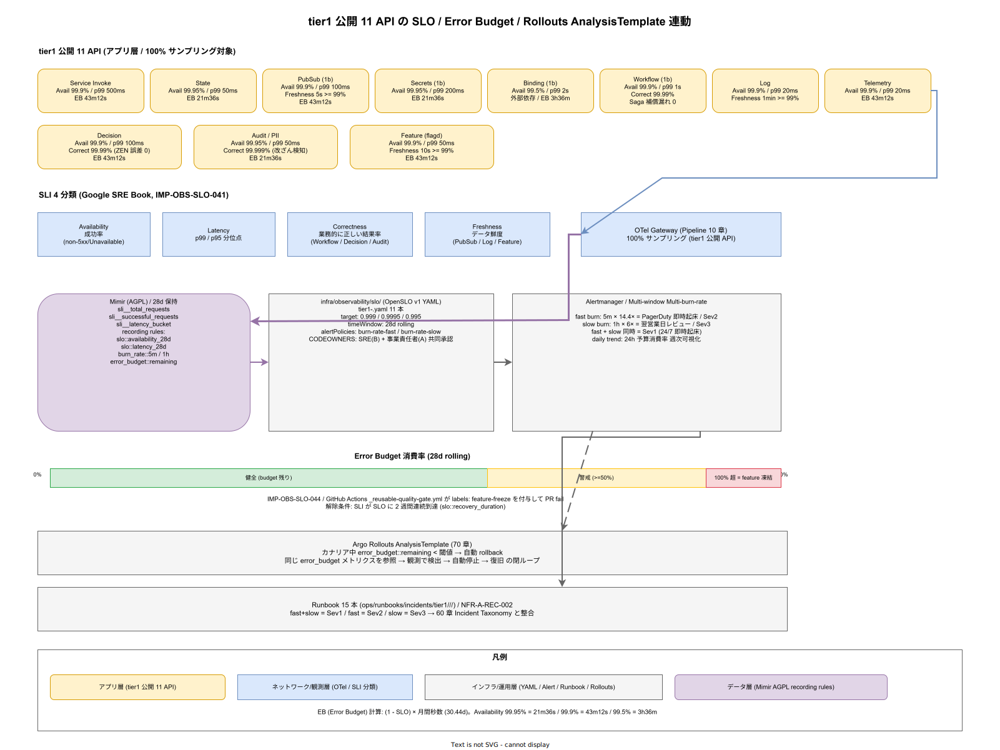

# 01. tier1 公開 11 API の SLO / SLI

本ファイルは tier1 が tier2 / tier3 に公開する 11 種類の API に対する SLO / SLI の初期定義を確定する。60 章方針の IMP-OBS-POL-003（Google SRE Book 準拠）と IMP-OBS-POL-005（Error Budget 月次 100% 消費で feature 凍結）を tier1 公開 11 API 単位に具体化し、SLI 分類・SLO 目標値・Error Budget 計算・Multi-window Multi-burn-rate Alert・Runbook 対応の 5 軸を同一表で管理する基盤を敷く。




SLO の初期設定は「現実的に達成可能で、かつ事業側に意味がある」水準で置く必要がある。楽観的すぎる目標は Error Budget 運用を形骸化させ、悲観的すぎる目標は feature 凍結の発動閾値を日常化させる。本節は NFR-A-CONT-001（SLA 99%）と NFR-I-SLO-001（内部 SLO 99.9%）を基底に、API 種別ごとの SLI を 4 分類（Availability / Latency / Correctness / Freshness）に整理したうえで、tier1 の 11 API それぞれに SLO 値を確定する。

SLO 定義ファイルは `infra/observability/slo/` 配下に OpenSLO 互換 YAML で配置し、Mimir の recording rules が SLI を継続計算、Grafana のダッシュボードで可視化、Alertmanager が Burn Rate 超過で PagerDuty を叩く構成とする（IMP-OBS-SLO-040）。

## SLI 4 分類の定義

Google SRE Book の SLI 分類を k1s0 の 11 API に適用するため、4 分類を次のように整理する（IMP-OBS-SLO-041）。

- **Availability（成功率）**: `sum(rate(successful_requests)) / sum(rate(total_requests))` の比。HTTP 5xx / gRPC Unavailable / Timeout を failure と定義し、それ以外を success とする。クライアント側 4xx は failure に含めない（k1s0 側の責務ではない）
- **Latency（p99 / p95）**: 応答時間の分位点。SLI は「SLO 目標値以下で応答した割合」で定義し、例えば p99 500ms の場合は「500ms 以下で応答した比率 >= 99%」を計測対象とする
- **Correctness（正常レスポンス率）**: Dapr Workflow API のような長時間処理・非同期処理系で「業務的に正しい結果が返った割合」。decision API であればルール評価結果の検証誤差率、audit API であれば改ざん検知率
- **Freshness（データ鮮度）**: PubSub API や Workflow API で「データが期待する鮮度で届いた割合」。PubSub であれば publish から subscriber 到達までの遅延、Workflow であれば起動遅延

各 SLI は `sli_<category>_<api>_<metric>` の命名（例: `sli_availability_state_success_ratio`）で Mimir に記録し、SLO 計算式の結果は `slo_<category>_<api>_compliance` で記録する。命名は IMP-OBS-POL-003 の命名規約（`<service>.<api>.<slo-type>`）と整合させる。

## tier1 公開 11 API の SLO 一覧

tier1 公開 11 API は [`03_要件定義/20_機能要件/10_tier1_API要件/`](../../../03_要件定義/20_機能要件/10_tier1_API要件/) で一次的に列挙される。これを以下の SLO で固定する。Phase 1a 時点の値で、Phase 1b で実測値に応じた再調整を行う（IMP-OBS-SLO-042）。

| API | Phase | Availability 目標 | p99 目標 | Correctness / Freshness | Error Budget（月次） |
|---|---|---|---|---|---|
| Service Invoke | 1a | 99.9% | 500 ms | — | 43 分 12 秒 |
| State | 1a | 99.95% | 50 ms | — | 21 分 36 秒 |
| PubSub | 1b | 99.9% | 100 ms（publish） | Freshness: 5 秒以内到達率 99% | 43 分 12 秒 |
| Secrets | 1b | 99.95% | 200 ms | — | 21 分 36 秒 |
| Binding | 1b | 99.5% | 2 s | — | 3 時間 36 分 |
| Workflow | 1b | 99.9% | 1 s（state 遷移） | Correctness: 99.99%（Saga 補償漏れ 0） | 43 分 12 秒 |
| Log | 1a | 99.9% | 20 ms | Freshness: 1 分以内到達率 99% | 43 分 12 秒 |
| Telemetry | 1a | 99.9% | 20 ms | — | 43 分 12 秒 |
| Decision | 1a | 99.9% | 100 ms | Correctness: 99.99%（ZEN Engine 評価誤差 0） | 43 分 12 秒 |
| Audit / PII | 1a | 99.95% | 50 ms | Correctness: 99.999%（改ざん検知率）| 21 分 36 秒 |
| Feature | 1a | 99.9% | 50 ms | Freshness: flag 反映 10 秒以内率 99% | 43 分 12 秒 |

目標値の根拠は次の通り整理する。

- Availability 99.95% は Audit / PII / State / Secrets など「壊れた際の業務影響が回復困難」な API に割り当てる
- Availability 99.9% は一般的な同期呼出（Service Invoke / Decision 等）と復旧可能な非同期系（PubSub / Workflow）に割り当てる
- Availability 99.5% は Binding のような外部依存系で、外部側 SLA の影響を受ける API
- p99 は `03_要件定義/30_非機能要件/B_性能.md` の NFR-B-PERF-001（tier1 内部目標 500ms）を基底に API 種別の実装特性で刻む

Error Budget は `(1 - SLO) × 月間秒数` で自動計算（30.44 日/月）、SLO YAML 内で `target` と `window: 28d` から rolling で算出する。

## Multi-window Multi-burn-rate Alert

Error Budget の消費速度（Burn Rate）で異常を検知する。Google SRE Book の Multi-window Multi-burn-rate パターンを採用し、fast burn / slow burn / daily trend の 3 段を Alertmanager に定義する（IMP-OBS-SLO-043）。

- **fast burn**: 5 分窓で Burn Rate 14.4 倍（1 時間で月次予算の 2% を焼く速度）を検出 → PagerDuty 即時起床
- **slow burn**: 1 時間窓で Burn Rate 6 倍（1 日で月次予算の 20% を焼く速度）を検出 → 翌営業日レビュー、Slack 通知
- **daily trend**: 24 時間窓の予算消費率を毎日レポート、週次で可視化

Alert ルールは `infra/observability/alerts/tier1-slo-burn-rate.yaml` に API ごとに記述し、`runbook_url` アノテーションで `ops/runbooks/incidents/<api>/<severity>/` へ誘導する。fast burn と slow burn の両方が同時発火した場合は Sev1、fast のみなら Sev2、slow のみなら Sev3 にマッピングする（60 章 Incident Taxonomy と整合、IMP-OBS-INC-060 系参照）。

## SLI 収集経路と SLO 定義ファイル

SLI の収集は OTel Collector Gateway（10 章）→ Mimir の recording rules で継続計算する。tier1 公開 API は 100% サンプリング（IMP-OBS-OTEL-014）で、SLI 計測の母数が失われないことを保証する。

- SLI 生メトリクス: `sli_<api>_total_requests` / `sli_<api>_successful_requests` / `sli_<api>_latency_bucket` を Mimir で 28 日保持
- SLO 計算: Mimir recording rule `slo:<api>:availability_28d` / `slo:<api>:latency_28d` を 1 分間隔で計算
- Burn Rate: `burn_rate:<api>:5m` / `burn_rate:<api>:1h` を derived metric として計算
- Error Budget 残量: `error_budget:<api>:remaining` を percent で記録し、ダッシュボード表示

SLO 定義 YAML のフォーマットは OpenSLO 互換とし、以下の断片を `infra/observability/slo/tier1-state.yaml` の例として置く。

```yaml
apiVersion: openslo/v1
kind: SLO
metadata:
  name: tier1-state-availability
spec:
  service: t1-state
  indicator:
    ratioMetric:
      good: sli_state_successful_requests
      total: sli_state_total_requests
  objectives:
    - target: 0.9995  # 99.95%
      op: gte
  timeWindow:
    - duration: 28d
      isRolling: true
  alertPolicies:
    - burn-rate-fast
    - burn-rate-slow
```

11 API 分の SLO YAML は `infra/observability/slo/tier1-*.yaml` に分離し、Argo CD が監視して変更を反映する。SLO 改訂は SRE（B）+ 事業責任者の共同承認で、PR 時に CODEOWNERS で強制する。

## Error Budget と feature 凍結連動

月次 Error Budget の消費 100% 超過時は、該当 API の feature PR を自動で block する（IMP-OBS-SLO-044）。実装は以下の経路で行う。

- Mimir の `error_budget:<api>:remaining` が 0 未満に入った時点で Alertmanager が `budget_exhausted_<api>` フラグを発行
- GitHub Actions の reusable workflow（30 章 `_reusable-quality-gate.yml`）が PR の `changed_files` から tier1 公開 API 対応コンポーネントを判定し、該当 API に対する `budget_exhausted` フラグが立っていれば `labels: feature-freeze` を付与して fail
- security fix / rollback / 運用 toil 削減 PR は labels で除外（`allow-during-freeze`）
- 凍結解除は SLI が SLO 目標値に 2 週間連続で到達したことを Mimir の `slo:<api>:recovery_duration` で確認

70 章 `70_リリース設計/` が扱う Argo Rollouts AnalysisTemplate も同じ `error_budget:*` メトリクスを参照し、カナリア中の SLI 劣化で自動 rollback を発火する。この連動により「観測で検出 → 自動停止 → 復旧」の閉ループが完成する。

## Runbook 対応マトリクス

各 SLO 違反には対応する Runbook を `ops/runbooks/incidents/tier1/<api>/<severity>/` 配下に配置する。`04_概要設計/55_運用ライフサイクル方式設計/09_Runbook目録方式.md` の 15 本（NFR-A-REC-002）と一対一対応させる（IMP-OBS-SLO-045）。

- Service Invoke: `ops/runbooks/incidents/tier1/service-invoke/sev1-timeout-cascade.md` 他 2 本
- State: `ops/runbooks/incidents/tier1/state/sev1-valkey-down.md` 他 2 本
- Audit / PII: `ops/runbooks/incidents/tier1/audit-pii/sev1-tamper-detected.md`（改ざん検知即時起床）
- （以下 11 API × Sev1/Sev2 で網羅、計 15 本）

Runbook 内の TL;DR は 30 秒で読める長さとし（IMP-OBS-POL-006）、アラート起動時の PagerDuty 通知にも Runbook URL を埋め込む。Runbook 実行後はふりかえりを post-mortem（`ops/postmortems/`）に追記し、Runbook 側も改訂 PR を同サイクルで回す。

## SLO 改訂の承認と頻度

SLO 値は「一度決めたら動かさない」運用は不健全である。実測値との乖離が大きい値を放置すると、Burn Rate Alert が鳴りすぎて疲弊する（SLO が厳しすぎる）か、逆に実害が出ても何も鳴らない（緩すぎる）状態に陥る。本節の SLO は Phase 1b 時点で第 1 回改訂を行い、以降は四半期ごとに見直す（IMP-OBS-SLO-046）。

- 改訂トリガ: 実測 Availability が SLO 目標から ±0.05 ポイント以上乖離、または p99 が目標の ±20% を逸脱
- 改訂承認: SRE（B） + 事業責任者（A）の共同承認、記録を `ops/runbooks/quarterly/slo-review/` に保管
- 改訂禁止期間: 該当 API で Sev1 / Sev2 が未解決の期間中は改訂不可（動機付けの歪みを避ける）
- 改訂版は OpenSLO YAML の `metadata.annotations.revision` で版管理

この運用規律は SLO 値を「データで更新される仮説」として扱うことを意味する。初期値に固執せず、かつ都合よく緩めもしない中間地点を、四半期レビューで事業側と合意する。

## 第三者監査と外部公開用 SLA への波及

NFR-A-CONT-001 の SLA 99% は契約文書に記載される外部向け数値で、本節の内部 SLO 99.9% / 99.95% とは別レイヤである。両者の関係は以下で固定する（IMP-OBS-SLO-047）。

- 内部 SLO: 本節で定義、計測窓 28 日 rolling、改善の内部目標
- 外部 SLA: 契約書記載、計測窓 暦月、顧客への返金基準
- バッファ: 内部 SLO は外部 SLA の 1 桁上（99% に対する 99.9%）で設定し、内部目標を逃しても外部約束を守る余裕を確保
- 外部 SLA 違反時: 内部 SLO からの乖離を含めて四半期監査レポートに記載、`ops/audit/sla-breach-reports/` に保管

この階層構造により、内部 SLO の改訂が直接外部 SLA を揺さぶらないようバッファが効く。内部 SLO を超えた実測劣化が観測された場合は、外部 SLA を守る防衛線として Incident Taxonomy の Sev2 として扱い、60 章の体系で応答する。

- IMP-OBS-SLO-040: OpenSLO 互換 YAML と Mimir recording rules の基盤
- IMP-OBS-SLO-041: SLI 4 分類（Availability / Latency / Correctness / Freshness）の定義
- IMP-OBS-SLO-042: tier1 公開 11 API の SLO 初期値固定と Phase 1b 再調整
- IMP-OBS-SLO-043: Multi-window Multi-burn-rate Alert（fast / slow / daily）
- IMP-OBS-SLO-044: Error Budget 100% 消費時の feature PR 自動凍結
- IMP-OBS-SLO-045: Runbook 15 本との一対一対応
- IMP-OBS-SLO-046: SLO 改訂トリガと四半期レビュー運用
- IMP-OBS-SLO-047: 内部 SLO と外部 SLA のバッファ階層構造

## 対応 ADR / DS-SW-COMP / NFR

- ADR: [ADR-OBS-001](../../../02_構想設計/adr/ADR-OBS-001-grafana-lgtm.md)（Grafana LGTM）/ ADR-OBS-003（Incident Taxonomy 統合、60 章初版策定時に起票予定）
- DS-SW-COMP: DS-SW-COMP-001 / DS-SW-COMP-002（tier1 公開 API 基盤）/ DS-SW-COMP-124（観測性サイドカー統合）
- NFR: NFR-A-CONT-001（SLA 99%）/ NFR-I-SLO-001（内部 SLO 99.9%）/ NFR-I-SLI-001（Availability SLI）/ NFR-A-REC-002（Runbook 15 本）/ NFR-B-PERF-001（p99 < 500ms）
- 関連節: `50_ErrorBudget運用/`（月次レビューとバジェット管理）/ `60_Incident_Taxonomy/`（Sev レベル対応）/ `70_Runbook連携/`（15 本の目録）
