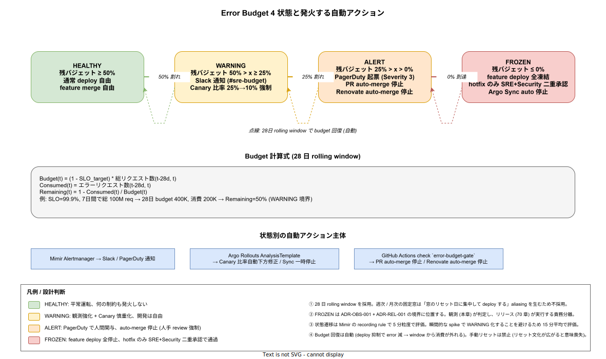

# 01. Error Budget 運用

本ファイルは Google SRE Book に準拠した Error Budget の物理運用を実装段階確定版として固定する。40_SLO_SLI定義 で確定した tier1 公開 11 API の SLO に対し、**残バジェットの 4 状態**（HEALTHY / WARNING / ALERT / FROZEN）を機械判定し、各状態が発火する自動アクション（Slack 通知 / Canary 比率調整 / PR auto-merge 停止 / deploy 凍結）を Argo Rollouts と GitHub Actions と Mimir Alertmanager の 3 経路で実装する。



## なぜ Error Budget を「自動アクション付きの状態機械」にするのか

SLO を定義しただけで終わらせると、違反が起きても「観測されただけで動かない」という構造になり、現場が SLO を「報告書の数字」として扱うようになる。Google SRE Book は **Error Budget Policy** で「budget が尽きたら deploy を止める」運用を提唱しており、この**機械的な強制**が SLO を生かすか殺すかの境界となる。

k1s0 では Error Budget を 4 状態に離散化し、各状態への遷移時に自動で発火するアクションをコードで定義する（人間の判断を最小化）。これにより「金曜の夜に budget 0% でも deploy する」「budget 0% を見て見ぬふりして merge する」という個人判断による拘束力の崩壊を物理的に防ぐ。FROZEN 状態の解除は SRE+Security 二重承認のみで、誰か 1 人が判断できない構造とする。

## Budget 計算式

28 日 rolling window で計算する。窓幅は Google SRE Book の典型例（28〜30 日）に合わせ、k1s0 では「4 週間きっかり」を採用。週次・月次の **固定窓**（毎月 1 日リセット等）は採らない。固定窓は「リセット日に集中して deploy する」という aliasing を生み、本来均すべき deploy 集中度を逆に高める。

```text
SLI(t)        = 1 - (エラーリクエスト数(t-28d, t) / 総リクエスト数(t-28d, t))
SLO_target    = 0.999  （tier1 公開 API の例）
Budget(t)     = (1 - SLO_target) * 総リクエスト数(t-28d, t)
Consumed(t)   = エラーリクエスト数(t-28d, t)
Remaining(t)  = max(0, 1 - Consumed(t) / Budget(t))
```

例: 28 日間で総 100M リクエスト、SLO 99.9% → Budget は 100K エラー。実エラー 50K → Remaining = 50% で WARNING 境界。実エラー 100K → Remaining = 0% で FROZEN。

Mimir の recording rule で 5 分粒度で評価するが、瞬間的な spike で WARNING に振り切れることを防ぐため、状態遷移判定は 15 分平均で行う（IMP-OBS-EB-050）。

```yaml
# infra/observability/mimir/rules/error-budget.yaml
groups:
- name: error_budget
  interval: 5m
  rules:
  - record: api:budget_remaining_ratio:28d
    expr: |
      1 - (
        sum_over_time(api:error_requests_total[28d])
        /
        ((1 - 0.999) * sum_over_time(api:total_requests_total[28d]))
      )
  - record: api:budget_remaining_ratio:15m_avg
    expr: avg_over_time(api:budget_remaining_ratio:28d[15m])
```

## 4 状態の定義と自動アクション

| 状態 | 残バジェット | 通知 | 自動アクション |
|---|---|---|---|
| HEALTHY | ≥ 50% | なし | 通常 deploy 自由 / feature merge 自由 |
| WARNING | 50% > x ≥ 25% | Slack #sre-budget | Canary 比率を 25% → 10% に強制下方修正 |
| ALERT | 25% > x > 0% | Slack + PagerDuty Severity 3 | PR auto-merge 停止 / Renovate auto-merge 停止 |
| FROZEN | ≤ 0% | Slack + PagerDuty Severity 2 | feature deploy 全凍結 / hotfix のみ SRE+Security 二重承認 / Argo Sync auto 停止 |

各状態の境界（50 / 25 / 0%）は Google SRE Book と Microsoft SRE Workbook の典型値に合わせた。境界をプロジェクトごとにチューニングしたくなる衝動を排し、**ベストプラクティスの初期値で運用開始 → 半年運用後に ADR 起票で見直し**という運用ルールを採る。

### HEALTHY → WARNING の遷移

50% 割れを検知すると Mimir Alertmanager が Slack `#sre-budget` に通知（IMP-OBS-EB-051）。同時に、tier1 該当 service の Canary 比率を 25% → 10% に強制下方修正する Argo Rollouts の `AnalysisTemplate` が発火する。

```yaml
# infra/observability/argocd-rollouts/analysistemplate-budget.yaml
apiVersion: argoproj.io/v1alpha1
kind: AnalysisTemplate
metadata:
  name: budget-aware-canary
spec:
  metrics:
  - name: budget-remaining
    interval: 5m
    failureCondition: result < 0.5
    provider:
      prometheus:
        address: http://mimir.observability-lgtm:9009/prometheus
        query: |
          api:budget_remaining_ratio:15m_avg{service="{{args.service}}"}
```

Argo Rollouts は AnalysisRun 失敗時に Canary 比率を下方修正する設計で、IMP-REL-PD-* と接続する。

### WARNING → ALERT の遷移

25% 割れを検知すると PagerDuty Severity 3 で起票し、人間関与を強制する。同時に GitHub Actions の `error-budget-gate` reusable workflow が PR の `merge` ステップを block する設定に変わる。

```yaml
# .github/workflows/_reusable-error-budget-gate.yml
on:
  workflow_call:
    outputs:
      budget_status:
        description: HEALTHY / WARNING / ALERT / FROZEN
        value: ${{ jobs.check.outputs.status }}
jobs:
  check:
    runs-on: ubuntu-24.04
    outputs:
      status: ${{ steps.q.outputs.status }}
    steps:
    - id: q
      run: |
        budget=$(curl -s "${MIMIR_QUERY_URL}/api/v1/query?query=min(api:budget_remaining_ratio:15m_avg)" \
          | jq -r '.data.result[0].value[1]')
        if (( $(echo "$budget < 0" | bc -l) )); then
          echo "status=FROZEN" >> $GITHUB_OUTPUT
        elif (( $(echo "$budget < 0.25" | bc -l) )); then
          echo "status=ALERT" >> $GITHUB_OUTPUT
        elif (( $(echo "$budget < 0.5" | bc -l) )); then
          echo "status=WARNING" >> $GITHUB_OUTPUT
        else
          echo "status=HEALTHY" >> $GITHUB_OUTPUT
        fi
```

`ci-overall` 集約 check（IMP-CI-BP-070）が `budget_status != FROZEN` を必須条件として含む構造に切り替わり、ALERT 中も auto-merge は止まるが手動 merge は通る（人間 review が入る）。Renovate の `automerge: true` 設定も同 gate を通過するため、ALERT 中は dependency PR が止まる。

### ALERT → FROZEN の遷移

0% 到達は最後の砦で、feature deploy を全凍結する。Argo CD の Application は `syncPolicy.automated.selfHeal: false` に切替え、main へ push しても自動 sync しない状態にする（IMP-OBS-EB-052）。

hotfix のみ通すルートは「`hotfix/` prefix branch + `[hotfix]` PR title prefix + SRE 1 名 + Security 1 名の review approval」を満たす場合のみ `error-budget-gate` を bypass する。bypass の判定は同 reusable workflow 内で行い、bypass 履歴は GitHub の audit log に残る。

### budget 回復

deploy が止まれば error 発生は減り、28 日 window から古い error が外れていくため、budget は **自動回復**する。手動リセット（「budget 計算をリセットして deploy 再開する」）は禁ずる。リセット文化が広がると budget の意味が消失するため、「困っても待つ」運用とする。これは ADR-OBS-001 の付帯条項として記載する候補（IMP-OBS-EB-053）。

## エラーの定義（SLO ごとに区別）

エラー判定の閾値は SLO ごとに異なる。40_SLO_SLI定義 で確定した API ごとの定義に従う。

| SLI 種別 | エラー定義 |
|---|---|
| Availability | HTTP 5xx / gRPC UNAVAILABLE, INTERNAL, DEADLINE_EXCEEDED |
| Latency | p99 > 500ms（`<API>_latency_p99_seconds > 0.5`） |
| Correctness | アプリ層が手動 export する `correctness_failure_total` インクリメント |

Latency SLO の budget は「p99 が target を超えた **時間の割合**」で計算する（リクエスト数ではなく時間）。これは Google SRE Workbook の "windows-based SLI" の標準パターンで、瞬間的な p99 spike が即 budget を消費する設計を避ける。

## 例外: セキュリティインシデントによる SLO 違反

CVSS 9.0+ の脆弱性対応で deploy を急ぐ場合、本章の budget gate が hotfix を阻害してはならない。`hotfix/sec-` prefix branch には `error-budget-gate` の bypass を自動付与し、Security 1 名の approval のみで通過させる（SRE approval は事後でも可）。これは ADR-POL-* で定義する Severity 1 セキュリティ対応の deploy 経路と接続する（IMP-OBS-EB-054）。

例外の使用履歴は monthly review で `@k1s0/sre` + `@k1s0/security` が確認し、誤用（hotfix 経路で feature を入れる等）が見つかれば即 ADR 起票で運用厳格化する。

## ダッシュボード

`infra/observability/lgtm/grafana/dashboards/error-budget.json` で provisioning する。表示要素:

- 28 日 rolling の budget 推移（線グラフ、4 状態ごとに背景色付き）
- 残バジェット % の現在値（ゲージ表示、状態色で塗り分け）
- 状態遷移履歴（テーブル、過去 28 日の遷移時刻と原因）
- 直近 7 日の error 発生 top 10 service（棒グラフ）

経営層・PM 向けに **simplified dashboard**（残 % のゲージ + 状態色のみ）も別途用意し、技術詳細を抑えた可視化を提供する（IMP-OBS-EB-055）。

## 障害時の挙動

Mimir 自体が停止すると budget 計算が止まり、`error-budget-gate` workflow が `unknown` 結果を返す。この場合、安全側に倒して `gate=block`（pessimistic）として扱う設計とする。「Mimir が落ちている = 観測能力が無い = deploy すべきでない」という素直な解釈を採る。

Mimir 復旧後、過去 28 日 window の再計算が完了するまで（数分）は判定が gate side で保留される。判定再開後に状態遷移が起これば通常通り通知する（IMP-OBS-EB-056）。

## ポストモーテムとの連動

FROZEN 状態到達は自動的に post-mortem 起票対象となる。ADR-POL-* で定義する post-mortem 規約に従い、`docs/40_運用ライフサイクル/postmortems/` 配下に template から起票する Issue を SRE が手動作成する（IMP-OBS-EB-057）。

post-mortem の analysis 結果は SLO 値の見直し / Canary 規模の見直し / 監視盲点の補強につながり、本章の構造そのものに反映する。半年で 2 回以上 FROZEN 到達が発生した service は、SLO 値（99.9% → 99.95% など）または service 設計自体の見直しを ADR で扱う。

## 対応 IMP-OBS ID

- `IMP-OBS-EB-050` : 28 日 rolling window で budget を計算、瞬間 spike 回避のため 15 分平均で状態判定
- `IMP-OBS-EB-051` : 4 状態（HEALTHY / WARNING / ALERT / FROZEN）と境界（50/25/0%）の定義
- `IMP-OBS-EB-052` : FROZEN 時の Argo CD `syncPolicy.automated.selfHeal: false` 切替で自動 sync 停止
- `IMP-OBS-EB-053` : budget 自動回復のみ許容、手動リセット禁止（リセット文化の防止）
- `IMP-OBS-EB-054` : セキュリティ hotfix（CVSS 9.0+）の `hotfix/sec-` prefix bypass 経路
- `IMP-OBS-EB-055` : ダッシュボード 4 表示要素 + simplified dashboard の二段提供
- `IMP-OBS-EB-056` : Mimir 障害時は安全側 `block` 判定で deploy 抑止（pessimistic gate）
- `IMP-OBS-EB-057` : FROZEN 到達は post-mortem 自動起票対象、半年 2 回で SLO 見直し ADR

## 対応 ADR / DS-SW-COMP / NFR

- ADR-OBS-001（Grafana LGTM） / ADR-REL-001（Progressive Delivery 必須） / ADR-OBS-002（OTel Collector）
- DS-SW-COMP-124（観測性サイドカー） / DS-SW-COMP-135（配信系インフラ）
- NFR-A-CONT-001（SLA 99%） / NFR-I-SLO-001（内部 SLO 99.9%） / NFR-I-SLI-001（Availability SLI）
- NFR-C-IR-002（Circuit Breaker） / NFR-C-MGMT-002（変更監査）
- IMP-OBS-SLO-040〜047（40_SLO_SLI定義 が budget 計算の入力源）
- IMP-REL-POL-002〜003（70_リリース設計の PD 必須化と AnalysisTemplate 強制）
- IMP-CI-BP-070〜077（30_CI/CD設計 の branch protection / `ci-overall` 集約 check）
- IMP-OBS-INC-060〜071（FROZEN 時の post-mortem との接続）
