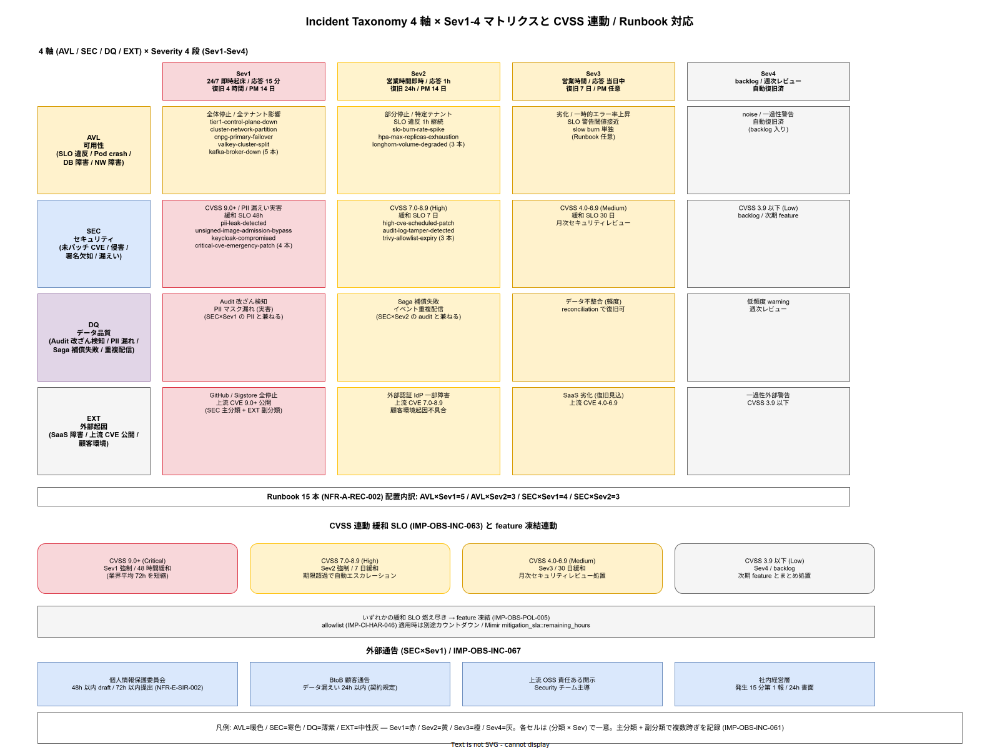

# 01. Incident Taxonomy 統合分類

本ファイルは k1s0 の Incident Taxonomy を可用性系とセキュリティ系を同一の分類体系で扱う統合方式として確定する。60 章方針の IMP-OBS-POL-004（Incident Taxonomy は可用性＋セキュリティを統合）を物理化し、CVSS 連動の緩和 SLO、Severity 定義、Runbook 対応マトリクス、外部通告判定の接続点を 1 本の運用体系に束ねる。ADR-OBS-003（本章初版策定時に起票予定）の本体定義もここで具体化する。

可用性担当とセキュリティ担当が別々の台帳でインシデントを扱うと、「SLA 99% / 99.9% の SLO は両方 green だが、CVSS 9.0 の脆弱性が 2 週間放置され、実害が発生する」という典型的盲点が生じる。本節は可用性・セキュリティ・データ品質・外部起因を 4 最上位分類として統合し、Severity（Sev1-Sev4）を共通軸で運用する。CVSS 連動の緩和 SLO をこの Taxonomy と接続することで、「エラーバジェット消費」と「未パッチ脆弱性の放置」を同じ運用板に載せる。

Taxonomy の運用は `ops/runbooks/incidents/` の Runbook 構造、`ops/postmortems/` のポストモーテム運用、PagerDuty のエスカレーション、個人情報保護委員会への 72 時間通告（NFR-E-SIR-002）を貫通する。したがって Taxonomy 改訂は SRE（B）+ Security（D）+ Compliance の共同承認で、`tools/ci/` のインシデントトリアージ自動化とも整合させる。

## 最上位 4 分類の定義

最上位分類は次の 4 つで固定する。下位は分類ラベルと Severity の組み合わせで識別する（IMP-OBS-INC-060）。

- **AVL（Availability）**: 可用性系インシデント。SLO 違反、Pod クラッシュ、ネットワーク障害、データベース障害など「稼働が劣化または停止」した事象
- **SEC（Security）**: セキュリティ系インシデント。未パッチ脆弱性の検出、不正アクセス、認証突破、秘密情報漏えい、Admission 侵害、供給網攻撃（cosign 署名欠如イメージの検出）など
- **DQ（Data Quality）**: データ品質系インシデント。Audit ログ改ざん検知、PII マスク漏れ、Workflow Saga 補償失敗、イベント重複配信、データ不整合検知など
- **EXT（External）**: 外部起因インシデント。SaaS 外部依存の障害（GitHub / Sigstore / 外部認証プロバイダ）、上流 OSS の CVE 公開、顧客環境起因の不具合など

この 4 分類は排他ではなく、1 つのインシデントが複数分類に跨る場合がある。例えば「Harbor 改ざんにより未署名イメージがデプロイされた」は SEC 主分類 + AVL 副分類で記録する。主分類は「原因が生じたレイヤ」、副分類は「影響が現れたレイヤ」の順で選ぶ運用規約を IMP-OBS-INC-061 として固定する。

## Severity 定義（Sev1-Sev4）

Severity は業務影響ベースで 4 段階に分類する（IMP-OBS-INC-062）。可用性とセキュリティで Severity の閾値は異なるが、運用フロー（エスカレーション / 応答 SLA / ポストモーテム要件）は共通化する。

- **Sev1**: 全体停止 / 全テナントへの重大影響 / 個人情報漏えいの実害発生 / CVSS 9.0+ 検出 → 24/7 即時起床、応答 15 分以内、復旧目標 4 時間、ポストモーテム 14 日以内公開必須
- **Sev2**: 部分停止 / 特定テナント影響 / CVSS 7.0-8.9 検出 / SLO 違反のまま 1 時間継続 → 営業時間内即時対応、応答 1 時間以内、復旧目標 24 時間、ポストモーテム 14 日以内公開必須
- **Sev3**: 劣化 / 一時的エラー率上昇 / CVSS 4.0-6.9 検出 / SLO 警告閾値に接近 → 営業時間内対応、応答当日中、復旧目標 7 日、ポストモーテム任意
- **Sev4**: noise / 一過性の警告 / CVSS 3.9 以下 / 自動復旧済 → backlog 入り、週次レビューで処置判定

Severity の判定は Alertmanager ルールで初期判定 → オンコールが 15 分以内に再判定 → 必要に応じて昇格／降格の 3 段階で運用する。SLI の Burn Rate（40 章 `40_SLO_SLI定義/`）は Sev1/Sev2 の判定入力となる（fast + slow 同時 = Sev1、fast のみ = Sev2、slow のみ = Sev3）。

## CVSS 連動の緩和 SLO

SEC 系インシデントの Severity は CVSS スコアで機械的に決定し、それぞれに緩和期限（Mitigation SLO）を設ける（IMP-OBS-INC-063）。CVSS 運用の情報源は Trivy / Harbor 内蔵スキャナの出力を一次情報とし、NVD / ベンダ情報で補正する。

- **CVSS 9.0+（Critical）**: Sev1 強制。緩和 SLO **48 時間**（業界平均 72 時間を参考に短縮）。期限内に patch / 緩和策が入らない場合はサービス停止を検討
- **CVSS 7.0-8.9（High）**: Sev2 強制。緩和 SLO **7 日**。期限超過で自動エスカレーション
- **CVSS 4.0-6.9（Medium）**: Sev3。緩和 SLO **30 日**。月次セキュリティレビューで処置判定
- **CVSS 3.9 以下（Low）**: Sev4。backlog、次期 feature とまとめて処置

緩和 SLO は 40 章の Error Budget と並列運用し、「両方の SLO に違反していない」ことを毎月の月次レビューで確認する。どちらか片方でも燃え尽きた場合は feature 凍結（IMP-OBS-POL-005）を発動する。

緩和 SLO の計測は Mimir の `mitigation_sla:<cve_id>:remaining_hours` メトリクスで管理し、残時間が閾値を下回った時点で Alertmanager が発火する。allowlist による時限例外（30 章 IMP-CI-HAR-046）が適用された CVE は緩和 SLO から除外されるが、allowlist 期限が別途カウントダウンされる。

## Runbook 対応マトリクス（4 セル × 15 本）

(AVL / SEC) × (Sev1 / Sev2) の 4 セルに、それぞれ最低 1 本の Runbook を配置する（IMP-OBS-INC-064）。Runbook 15 本（NFR-A-REC-002）の配置は以下に固定する。`04_概要設計/55_運用ライフサイクル方式設計/09_Runbook目録方式.md` の目録と一対一対応する。

- **AVL × Sev1**: `tier1-control-plane-down.md` / `cluster-network-partition.md` / `cnpg-primary-failover.md` / `valkey-cluster-split.md` / `kafka-broker-down.md`（5 本）
- **AVL × Sev2**: `slo-burn-rate-spike.md` / `hpa-max-replicas-exhaustion.md` / `longhorn-volume-degraded.md`（3 本）
- **SEC × Sev1**: `pii-leak-detected.md` / `unsigned-image-admission-bypass.md` / `keycloak-compromised.md` / `critical-cve-emergency-patch.md`（4 本）
- **SEC × Sev2**: `high-cve-scheduled-patch.md` / `audit-log-tamper-detected.md` / `trivy-allowlist-expiry.md`（3 本）

各 Runbook は冒頭に TL;DR（30 秒読み）、対象 SLI / アラート ID、エラーバジェット影響、復旧目標時間、エスカレーション連絡先を明記する（IMP-OBS-POL-006 との整合）。Sev1 は 24/7 オンコールに直結し、Runbook URL を PagerDuty の Incident Description に自動挿入する。

## インシデント ID 体系とラベル付与

インシデント ID は `INC-<YYYYMMDD>-<NNN>` の形式で採番する（IMP-OBS-INC-065）。`NNN` は日次連番、分類は Label で付与する。

- Label 命名: `avl`, `sec`, `dq`, `ext`（主分類）+ `sev1`〜`sev4`（Severity）+ `api:<api-name>`（影響 API）+ `cvss:<score>`（SEC 時）
- 採番は GitHub Issue / PagerDuty / Backstage Incident プラグインで共通化し、同一インシデントを同一 ID で参照
- 採番元は Backstage の `incident-id` plugin（Phase 1a で導入）、それまでは手動採番

この ID 体系により、可用性系とセキュリティ系の台帳を統合し、月次レビューで両者を一覧可能にする。IMP-OBS-POL-004 の「統合台帳」要件はこの ID 体系で物理化される。

## ポストモーテムと外部通告判定

Sev1 / Sev2 は 14 日以内のポストモーテム公開を必須化する（IMP-OBS-INC-066）。公開先は `ops/postmortems/` 配下で、非公開版は Backstage 内、公開版は顧客向けポータル（Phase 1b）に展開する。

ポストモーテムは「事実（timeline）→ 根本原因（5 whys）→ 対策（action items）→ 対策の PR リンク」の 4 構成で記述する。blame-less を徹底し、人物名ではなく役割で記述する。

外部通告判定は SEC × Sev1 の一部で必要となる（IMP-OBS-INC-067）。

- **個人情報保護委員会 72 時間通告**: PII 漏えいを伴う Sev1 が確定した時点で、48 時間以内に通告文書ドラフト、72 時間以内に提出（NFR-E-SIR-002）
- **顧客通告**: BtoB SaaS 顧客に対して、データ漏えいを伴う Sev1 は 24 時間以内に通告（契約による）
- **上流 OSS への責任ある開示**: OSS 側の脆弱性発見の場合、upstream への報告を Security チームが担当
- **社内経営層への報告**: Sev1 発生 15 分以内に経営層へ第 1 報、24 時間以内に書面報告

通告判定フローは `ops/runbooks/incidents/external-notification-decision.md` に配置し、SEC Sev1 の Runbook から必ず参照されるよう連鎖リンクを張る。

## 月次レビューと Error Budget 統合集計

月次インシデントレビューは SRE + Security + 事業責任者の三者合同で実施し、以下を集計する（IMP-OBS-INC-068）。

- AVL 系のエラーバジェット消費率（API 別、全 11 API 合算）
- SEC 系の緩和 SLO 達成率（CVSS 帯別）
- DQ / EXT 系の発生件数と根本原因分類
- Runbook 発動実績と陳腐化リスク評価
- ポストモーテム action item の消化率

結果は `ops/runbooks/monthly/error-budget-review/YYYY-MM.md` に記録し、feature 凍結判定の入力とする。凍結期間中の解除条件は 40 章の IMP-OBS-SLO-044 と統合運用する。

## PagerDuty エスカレーションと On-Call ローテ

Sev1 は 24/7 即時起床、Sev2 は営業時間内即時、Sev3 は当日中、Sev4 は週次の対応となるため、On-Call ローテと PagerDuty エスカレーションポリシーを Severity × 分類で設計する（IMP-OBS-INC-069）。

- **AVL / DQ の Sev1**: Primary SRE → 15 分で応答なしなら Secondary SRE → 追加 15 分で SRE マネージャ → 事業責任者
- **SEC の Sev1**: Primary Security + Primary SRE 同時通知 → 15 分で応答なしなら Security マネージャ → CISO → 事業責任者
- **Sev2 全般**: 営業時間内は当番、時間外は翌営業時間までに応答で OK、時間外の Sev2 は翌朝自動 Sev1 昇格判定
- **Sev3**: PagerDuty ではなく Slack 通知のみ、翌営業日の stand-up で処置判定
- **Sev4**: Backstage Incident plugin で backlog 入り、週次レビューで処置判定

On-Call ローテは 1 週間単位で Primary / Secondary を割り当て、2 名以下の初期体制では Primary と Secondary が同じメンバーになり得る。この場合は必ず「復帰不能時の最終エスカレーション先」を事業責任者まで明記し、連絡網の断絶を防ぐ。

## Taxonomy の年次棚卸し

Taxonomy 自体も陳腐化する。新しい種類のインシデント（例: AI 系ハルシネーション障害、サプライチェーン攻撃の新型）が登場した際、既存 4 分類に無理に押し込むと後追いで盲点が生じる。年次で Taxonomy 棚卸しを行う（IMP-OBS-INC-070）。

- 年次タイミング: 毎年 4 月（事業年度開始月）、結果を `ops/runbooks/yearly/taxonomy-review/YYYY.md` に保管
- 入力: 過去 12 ヶ月のインシデント全件、特に「分類に迷った」ケースの洗い出し
- 出力: 分類追加 / 細分化 / 合併の提案、ADR-OBS-003 の改訂 PR
- 承認: SRE（B） + Security（D） + Compliance + 事業責任者の共同承認

この棚卸しにより、Taxonomy は「一度決めたら死ぬまで同じ」ではなく、「事業と技術の進化に合わせて更新される仮説」として扱う。棚卸し結果が Runbook 15 本の構成見直しに波及する場合は、同時に Runbook 目録（`04_概要設計/55_運用ライフサイクル方式設計/09_Runbook目録方式.md`）も改訂 PR を出す。

## 関連章との境界

本節の Taxonomy は観測性基盤（60 章）で定義されるが、以下の章で具体的な運用ポイントとして再利用される。

- 30 章 `40_Harbor_Trivy_push/`: CVSS 連動の Severity は Harbor 内蔵 Trivy スキャン結果の分類に使われ、CVSS 9.0+ 検出が Sev1 / SEC 分類として即時昇格する
- 70 章 `70_リリース設計/`: Argo Rollouts の AnalysisTemplate が Sev1 / Sev2 の判定に従い、カナリアデプロイを自動 rollback する
- 80 章 `80_サプライチェーン設計/`: SBOM 欠如 / cosign 署名欠如の検出を SEC 分類の新規インシデント種別として追加
- 90 章 `90_ガバナンス設計/`: Taxonomy 年次棚卸しの承認フローをガバナンス規定として固定

Taxonomy は「インシデント管理の単一言語」として、これらの章が共有する語彙基盤を提供する。Severity や分類ラベルの値を他章が独自に追加することを禁止し、追加が必要な場合は本節の改訂 PR を経由する規律を IMP-OBS-INC-071 として固定する。

## 対応 IMP-OBS ID

- IMP-OBS-INC-060: 最上位 4 分類（AVL / SEC / DQ / EXT）の定義
- IMP-OBS-INC-061: 主分類・副分類の付与規約
- IMP-OBS-INC-062: Severity 4 段階（Sev1-Sev4）の定義と運用 SLA
- IMP-OBS-INC-063: CVSS 連動の緩和 SLO（48h / 7d / 30d / backlog）
- IMP-OBS-INC-064: Runbook 対応マトリクス 4 セル × 15 本
- IMP-OBS-INC-065: インシデント ID 体系とラベル付与
- IMP-OBS-INC-066: ポストモーテム 14 日以内公開と記述フォーマット
- IMP-OBS-INC-067: 外部通告判定（72 時間ルール等）の接続
- IMP-OBS-INC-068: 月次レビューと Error Budget 統合集計
- IMP-OBS-INC-069: PagerDuty エスカレーションと On-Call ローテ
- IMP-OBS-INC-070: Taxonomy の年次棚卸し
- IMP-OBS-INC-071: Taxonomy 値の単一真実源化（他章での独自追加禁止）

## 対応 ADR / DS-SW-COMP / NFR

- ADR: ADR-OBS-003（Incident Taxonomy 統合、本章初版策定時に起票予定）/ ADR-SEC-*（PII / 認証 / 秘匿）
- DS-SW-COMP: DS-SW-COMP-141（監査・インシデント管理）
- NFR: NFR-E-SIR-001（インシデント検知）/ NFR-E-SIR-002（72 時間通告）/ NFR-E-SIR-003（通告記録保全）/ NFR-A-REC-002（Runbook 15 本）/ NFR-C-IR-001（インシデント対応体制）
- 関連節: `40_SLO_SLI定義/`（Severity の Burn Rate 判定入力）/ `50_ErrorBudget運用/`（月次レビュー統合）/ `70_Runbook連携/`（15 本の配置）/ `30_CI_CD設計/40_Harbor_Trivy_push/`（CVSS 閾値運用との連動）
