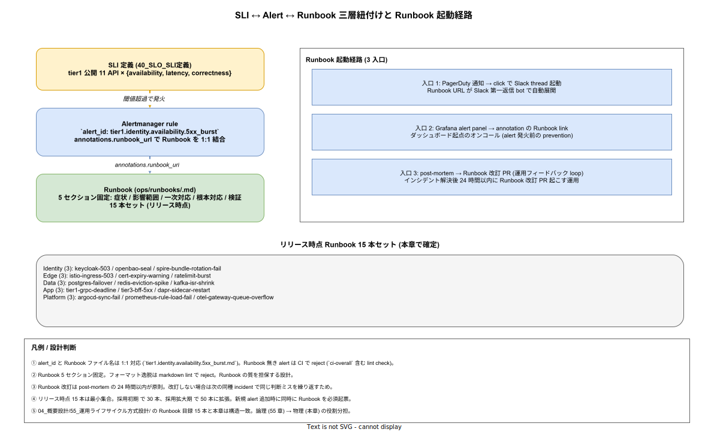

# 01. Runbook 連携

本ファイルは SLI / Alert / Runbook の三層を 1:1 で結合する物理連携を実装段階確定版として固定する。`04_概要設計/55_運用ライフサイクル方式設計/` で確定した Runbook 目録 15 本に対し、各 Runbook を `ops/runbooks/` 配下に配置し、Alertmanager の `annotations.runbook_url` に紐付けることで「アラートが鳴ったら Runbook が必ず開ける」状態を CI で機械保証する。



## なぜ Runbook を SLI / Alert と 1:1 結合するのか

オンコール対応で最も時間を浪費するのは「アラートを見て **何をすべきか思い出すまで** の間」である。新人オンコールにとっては「過去にこの alert が鳴ったらしいが、当時の対応者しか手順を知らない」という状況が頻発し、復旧時間（MTTR）の主成分となる。

k1s0 では Alert と Runbook を **1:1 強制結合** する。alert_id をキーに Runbook ファイル名が決まり（`tier1.identity.availability.5xx_burst.md`）、Runbook が存在しない alert は CI で reject する設計とする。これにより、**新規 alert の追加 = Runbook の同時整備** が物理的に強制される。Google SRE Book の "Runbook をペアで作る" 原則を、CI gate で機械化したものに相当する。

論理面（どんな Runbook を持つか / 各 Runbook の対応方針）は `04_概要設計/55_運用ライフサイクル方式設計/` で確定済みで、本章はその物理配置 / Alert との結合 / 起動経路の定義のみを扱う。

## ID 体系

各 alert / Runbook の ID は以下の構造を取る（IMP-OBS-RB-080）。

```
<tier>.<service>.<sli_kind>.<symptom>
例: tier1.identity.availability.5xx_burst
    tier1.edge.latency.p99_breach
    platform.argocd.sync.fail
```

- `tier`: tier1 / tier2 / tier3 / platform / data / edge
- `service`: 該当コンポーネント名（k8s service 名と一致）
- `sli_kind`: availability / latency / correctness / sync / restart など
- `symptom`: 具体的な症状の slug

ID は alertmanager rule の `alert` フィールドと Runbook ファイル名（`<id>.md`）で同一文字列とする。区切り文字に `.` を選んだのは、Prometheus の label 命名規約と Alertmanager の routing pattern に親和性があるため。

## ファイル配置

```
ops/runbooks/
├── README.md                                    # 索引
├── tier1.identity.availability.5xx_burst.md
├── tier1.identity.availability.cert_expiry.md
├── tier1.edge.availability.istio_503.md
├── tier1.edge.latency.p99_breach.md
├── tier1.data.availability.postgres_failover.md
├── tier1.data.availability.redis_eviction_spike.md
├── tier1.data.availability.kafka_isr_shrink.md
├── tier1.identity.availability.openbao_seal.md
├── tier1.identity.security.spire_bundle_rotation_fail.md
├── tier1.app.latency.grpc_deadline.md
├── tier3.app.availability.bff_5xx.md
├── tier1.app.restart.dapr_sidecar.md
├── platform.argocd.sync.fail.md
├── platform.prometheus.config.rule_load_fail.md
└── platform.otel.queue.gateway_overflow.md
```

リリース時点で 15 本（5 領域 × 3 本）。論理面は `04_概要設計/55_運用ライフサイクル方式設計/` に揃え、物理本数は同じ 15 本に固定（IMP-OBS-RB-081）。新規 alert を追加する PR が同時に対応 Runbook を追加しない場合、CI は reject する。

## Runbook 5 セクション固定

Runbook の各ファイルは以下 5 セクション固定で書く（IMP-OBS-RB-082）。フォーマット逸脱は markdown lint で reject。

```markdown
# tier1.identity.availability.5xx_burst

> alert_id: tier1.identity.availability.5xx_burst
> severity: SEV2
> sli: tier1-identity-api availability (target: 99.9%)
> last_updated: 2026-04-25

## 1. 症状（Symptom）
Identity API（POST /token）の 5xx 応答率が直近 5 分で 1% を超えた。
具体的には Mimir で `rate(identity_api_request_total{code=~"5.."}[5m]) > 0.01` の状態。

## 2. 影響範囲（Impact）
全 tier3 frontend が新規ログイン不可。既ログインユーザーは token 期限まで継続可能（最大 1 時間）。
影響テナント: 全テナント。経営報告閾値（5 分超継続）に達するまで内部対応。

## 3. 一次対応（Immediate Action）
1. Grafana ダッシュボード `identity-overview` を開き、5xx の内訳（DB 接続 / OIDC 検証 / 内部例外）を確認
2. Tempo で直近 5 分の遅い span を 3 件確認、DB 接続待ちか rate limit かを切り分け
3. DB 接続起因なら 4-1 へ、rate limit 起因なら 4-2 へ、それ以外は 4-3 へ

## 4. 根本対応（Resolution）
### 4-1. DB 接続起因
- `kubectl exec` で identity-api Pod に入り、`pg_isready` で Postgres 確認
- Postgres 側障害なら `tier1.data.availability.postgres_failover.md` へ転送
### 4-2. rate limit 起因
- Istio EnvoyFilter で `identity-api` の rate limit 値を一時 200% に増やす（PR は事後）
### 4-3. それ以外
- Pyroscope で直近 10 分の hot-spot function を確認
- 直近 deploy が原因なら Argo Rollouts で 1 つ前の revision に rollback

## 5. 検証（Verification）
- Mimir で `rate(identity_api_request_total{code=~"5.."}[5m]) < 0.001` が 10 分継続することを確認
- 復旧後、`#sre-incident` に解決を post し、24 時間以内に post-mortem 起票（このファイルの改訂 PR を含む）
```

5 セクション以外（背景・歴史・余談）は禁ずる。深夜オンコールで読まれる文書は、最短経路で復旧手順に至る構造でなければ価値がない。

## CI 強制 lint

`.github/workflows/_reusable-lint-runbook.yml` で 3 種類の lint を行う（IMP-OBS-RB-083）。

1. **alert ↔ Runbook 1:1 検証**: `infra/observability/alertmanager/rules/*.yaml` の全 alert に対応する `ops/runbooks/<alert_id>.md` の存在確認
2. **5 セクション存在検証**: `# 1. 症状 / # 2. 影響範囲 / # 3. 一次対応 / # 4. 根本対応 / # 5. 検証` の見出しが揃うこと
3. **メタデータ検証**: 冒頭の `> alert_id: / severity: / sli: / last_updated:` 4 行が揃い、`last_updated` が ISO 8601 形式であること

`ci-overall` 集約 check（IMP-CI-BP-070）に本 lint を含める。Runbook の品質を機械保証することで、ベテランしか書けない属人的ノウハウを構造化する。

## Alertmanager rule の `runbook_url` annotation

各 alert は `annotations.runbook_url` に Runbook URL を必須付与する（IMP-OBS-RB-084）。

```yaml
# infra/observability/mimir/rules/identity.yaml
groups:
- name: tier1.identity
  rules:
  - alert: tier1.identity.availability.5xx_burst
    expr: rate(identity_api_request_total{code=~"5.."}[5m]) > 0.01
    for: 5m
    labels:
      severity: SEV2
      tier: tier1
      service: identity
    annotations:
      summary: "Identity API 5xx burst > 1% over 5min"
      runbook_url: "https://github.com/k1s0/k1s0/blob/main/ops/runbooks/tier1.identity.availability.5xx_burst.md"
      dashboard_url: "https://grafana.k1s0.example/d/identity-overview"
```

Slack / PagerDuty の通知 template にも `{{ .Annotations.runbook_url }}` を埋込み、通知本文に Runbook URL が常に含まれる構造とする。

## Runbook 起動 3 経路

Runbook を読む経路は 3 つを公式化する（IMP-OBS-RB-085）。

### 入口 1: PagerDuty 通知 → Slack thread

PagerDuty 通知から Slack incident channel が自動作成され、bot が第一返信で Runbook URL を展開する。オンコールは Slack で「`/runbook ack`」コマンドを叩き、Runbook の進捗を 5 セクションごとに記録する。記録は post-mortem の素材になる。

### 入口 2: Grafana dashboard alert panel

Grafana の alert panel に annotation として Runbook link を表示する。これは alert 発火 **前** に「メトリクスがおかしい」と気付いた予防的オンコールが、対応すべきか判断する入口となる。Grafana datasource provisioning で全 alert に annotation を付与する設計。

### 入口 3: post-mortem → Runbook 改訂 PR

インシデント解決後 24 時間以内に post-mortem を起票し、Runbook の改訂 PR を必ず起こす運用とする。Runbook が「使えなかった / 不正確だった」場合、次の同種インシデントで同じ判断ミスが繰り返されるため、改訂 cycle を強制する。改訂 PR には `last_updated` を必ず更新し、Runbook lint がそれを CI で検証する（IMP-OBS-RB-086）。

## 採用初期以降の拡張

リリース時点 15 本 → 採用初期 30 本 → 採用拡大期 50 本に段階拡大する（IMP-OBS-RB-087）。新規 alert 追加時に同時に Runbook を必須起票する CI gate により、本数増加は alert 追加に同期する。

50 本を超える段階で Runbook 索引（`ops/runbooks/README.md`）を「症状起点」「サービス起点」の 2 軸検索可能にする README 整理 PR を採用拡大期に予定（採番済 IMP-OBS-RB-088）。

## 障害時の挙動

GitHub.com（Runbook の置き場）が停止した場合、Runbook URL 経由でアクセス不可になる。バックアップ経路として、`ops/runbooks/` を毎晩 Pyroscope と同じ MinIO bucket に同期し、`https://runbooks.k1s0.internal/` で別 URL から閲覧可能にする（IMP-OBS-RB-089）。

オンコール用 PC の `~/.k1s0-runbooks/` にも `git pull` で最新版をローカルキャッシュする運用を採用初期で導入予定（採用拡大期に必須化）。

## post-mortem との連動

Runbook 改訂 PR は post-mortem 起票時に必須提出物とする。post-mortem template に「Runbook 改訂 PR の URL」フィールドを設け、空欄では起票完了とみなさない設計を ADR-POL-* で別途規定する候補とする（本章の責務外、Identity / セキュリティ post-mortem との整合は 85 章で扱う）。

## 対応 IMP-OBS ID

- `IMP-OBS-RB-080` : ID 体系 `<tier>.<service>.<sli_kind>.<symptom>` を alert / Runbook で 1:1 採用
- `IMP-OBS-RB-081` : リリース時点 Runbook 15 本の物理配置（`ops/runbooks/` 配下、5 領域 × 3 本）
- `IMP-OBS-RB-082` : Runbook 5 セクション固定（症状 / 影響範囲 / 一次対応 / 根本対応 / 検証）
- `IMP-OBS-RB-083` : CI lint 3 種（alert↔Runbook 1:1 / 5 セクション / メタデータ）の `ci-overall` 必須化
- `IMP-OBS-RB-084` : Alertmanager rule の `annotations.runbook_url` 必須付与
- `IMP-OBS-RB-085` : Runbook 起動 3 経路（PagerDuty / Grafana / post-mortem）の公式化
- `IMP-OBS-RB-086` : post-mortem 24 時間以内の Runbook 改訂 PR 必須化と `last_updated` 検証
- `IMP-OBS-RB-087` : 段階拡大（リリース時点 15 本 → 採用初期 30 本 → 採用拡大期 50 本）
- `IMP-OBS-RB-088` : 採用拡大期 50 本超過時の Runbook 索引 2 軸検索化（症状起点 / サービス起点）
- `IMP-OBS-RB-089` : GitHub 障害時のバックアップ経路（MinIO 同期 + ローカル `~/.k1s0-runbooks/`）

## 対応 ADR / DS-SW-COMP / NFR

- ADR-OBS-001（Grafana LGTM） / ADR-OBS-002（OTel Collector） / ADR-OBS-003（Incident Taxonomy 統合）
- DS-SW-COMP-124（観測性サイドカー） / DS-SW-COMP-135（配信系インフラ）
- NFR-C-IR-001（Severity 別応答 / MTTR 短縮）
- NFR-C-NOP-001（小規模運用 / 属人化排除） / NFR-C-NOP-002（可視性）
- NFR-E-OPR-001（運用性）
- IMP-OBS-SLO-040〜047（40_SLO_SLI定義 が alert 入力源）
- IMP-OBS-INC-060〜071（60_Incident_Taxonomy が Severity 区分）
- IMP-OBS-EB-050〜057（50_ErrorBudget運用 の FROZEN 到達時の post-mortem 連動）
- IMP-CI-BP-070〜077（30_CI/CD設計 の `ci-overall` 集約 check）
- 04_概要設計/55_運用ライフサイクル方式設計/（論理 Runbook 目録、本章は物理配置）
