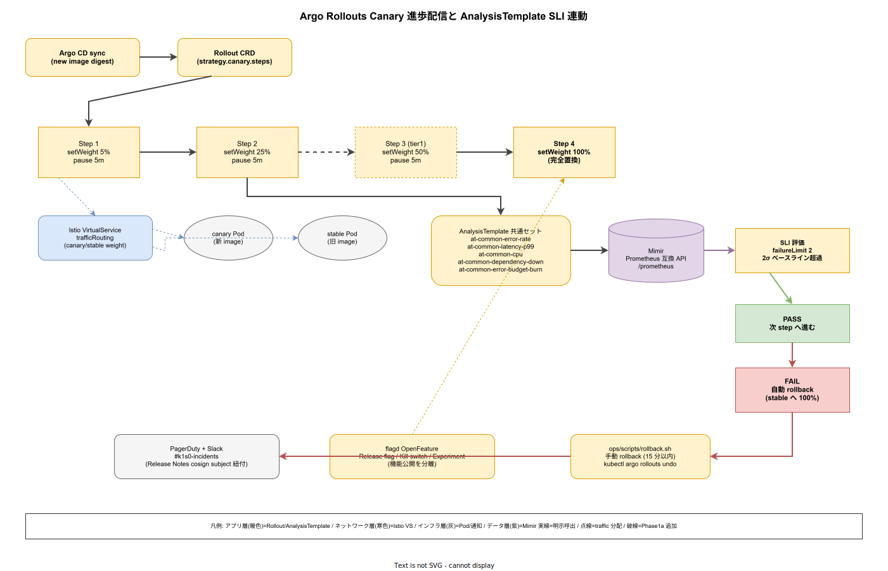

# 01. Argo Rollouts PD 設計

本ファイルは k1s0 の Progressive Delivery（PD）を実装段階確定版として固定する。ADR-CICD-002 で選定した Argo Rollouts 1.7+ と ADR-REL-001 で全リリース必須化した PD を、Canary の段階数・AnalysisTemplate の共通セット・SLI 連動の自動 rollback・例外経路・rollback runbook との結合までを物理配置レベルで規定する。



## なぜ PD を リリース時点 から全リリース必須化するのか

一気通貫リリース（Deployment の RollingUpdate のみ）は「事故が起きた時点で全ユーザーに波及している」状態であり、採用側組織の 10 年保守では許容しない。ADR-REL-001 の核心は「PD を特定コンポーネントのみに絞ると境界判定コストが体制拡大で線形に増え、10 年後に必ず曖昧化する」であり、リリース時点 から全リリース必須化することで境界判定自体を消す設計とした。

例外範囲（内部ツール / バッチ / emergency patch）を明文化しつつ、SLI 連動の自動 rollback を AnalysisTemplate で共通セット化することで、PD は「リリース担当者が意識しない既定」として回る。本ファイルはこの既定の物理配置（Rollout CRD / AnalysisTemplate / rollback 経路）を `deploy/rollouts/` 配下に固定する。

## Canary 3 段階の既定構成

Canary の既定は `5% → 25% → 100%` の 3 段階とする。最小 3 段階は IMP-REL-POL-006 で固定しており、これ以下への短縮は SRE リード + 事業責任者の両者承認 + 理由の ADR 化を要する。各段階の `waitDuration` は 5 分を既定とし、AnalysisTemplate が並行して SLI を評価する。

tier1 公開 11 API は リリース時点 で 10 段階（`5% → 10% → 20% → 30% → ... → 100%`）に細分化する。tier1 は影響範囲が広く、中間段階の観測窓を厚くすることで異常検知精度を上げる。細分化後の waitDuration は各 3 分とし、全体所要時間を約 30 分以内に収める。

```yaml
# deploy/charts/tier1/templates/rollout.yaml（抜粋）
spec:
  strategy:
    canary:
      canaryService: {{ .Values.name }}-canary
      stableService: {{ .Values.name }}-stable
      trafficRouting:
        istio:
          virtualService:
            name: {{ .Values.name }}-vs
      steps:
        - setWeight: 5
        - pause: {duration: 5m}
        - analysis:
            templates:
              - templateName: at-common-error-rate
              - templateName: at-common-latency-p99
        - setWeight: 25
        - pause: {duration: 5m}
        - analysis:
            templates:
              - templateName: at-common-error-rate
              - templateName: at-common-latency-p99
              - templateName: at-common-cpu
        - setWeight: 100
```

Istio Ambient の VirtualService と連携することで、Canary / Stable への重み付けを L7 トラフィック制御で正確に行う。NGINX Ingress や ALB のトラフィック分割は使わない。理由は Istio Ambient（ADR-0001）で mTLS / 認可ポリシーを統合済みであり、経路を二重化する意味がないため。

## AnalysisTemplate 共通セット

ADR-REL-001 で定めた共通 AnalysisTemplate セットを `deploy/rollouts/analysis/` 配下に物理配置する。コンポーネント固有の AnalysisTemplate は共通セットを継承して差分記述する（Argo Rollouts の `spec.templates[].templateRef` で参照、同一 CRD 内の合成）。

- `deploy/rollouts/analysis/at-common-error-rate.yaml` : HTTP 5xx / gRPC error 比率が過去 30 分ベースラインを 2σ 超過で fail。Mimir の Prometheus API を provider として参照
- `deploy/rollouts/analysis/at-common-latency-p99.yaml` : レイテンシ p99 が SLO 値（`60_観測性設計/` で定義）を超過で fail
- `deploy/rollouts/analysis/at-common-cpu.yaml` : Pod CPU 使用率が 80% を 10 分継続で fail
- `deploy/rollouts/analysis/at-common-dependency-down.yaml` : 依存コンポーネント（Postgres / Kafka / Valkey）の down 判定で即時 fail
- `deploy/rollouts/analysis/at-common-error-budget-burn.yaml` : エラーバジェット消費率が 2x（fast burn） を超過で fail

SLI 参照は Mimir（Grafana LGTM スタック、ADR-OBS-001）の Prometheus 互換 API を provider として使う。AnalysisTemplate の `provider.prometheus.address` は `http://mimir-query-frontend.k1s0-observability:8080/prometheus` に統一する。failureLimit は既定 2 とし、2 連続 NG で fail を確定 → 自動 rollback に接続する。

## サービス固有 AnalysisTemplate の配置

共通セットでカバーできない指標（例: Temporal ワークフロー完了率、ZEN Engine ルール評価の判定確信度）はコンポーネント固有 AnalysisTemplate として次の位置に配置する。

```text
deploy/charts/<tier>/templates/
├── rollout.yaml                      # Rollout 本体
└── analysis-template.yaml            # コンポーネント固有 AnalysisTemplate
```

サービス固有テンプレは共通セットとの二重記述を避けるため、`rollout.yaml` の `spec.steps[].analysis.templates` で共通セット + 固有テンプレを合成する。固有テンプレの追加・閾値変更は SRE 承認必須（`60_観測性設計/` の SLO 改訂と同じ厳格さ）。

## 例外経路：Deployment / RollingUpdate の許容範囲

ADR-REL-001 に従い、次のカテゴリのみ標準 Kubernetes Deployment の RollingUpdate を許容する。例外対象は `catalog-info.yaml` の `annotations.k1s0.io/release-strategy` で明示し、Backstage 可視化と Kyverno admission 検証でダブルチェックする。

- `release-strategy: progressive` : Rollout 必須（既定）。未指定も progressive として扱う
- `release-strategy: rolling-internal` : 内部ツール（Backstage / 社内ダッシュボード / ヘルプデスク系）。エンドユーザートラフィックがないため Canary Weight 判定が無意味
- `release-strategy: rolling-batch` : CronJob / Argo Workflows / Temporal バッチ。顧客トラフィック無依存
- `release-strategy: rolling-emergency` : CVSS 9.0+ の即時修正、業務停止級インシデント復旧。SRE オンコール承認 + `emergency-bypass` ラベル + 24 時間以内の事後レビュー必須

`rolling-internal` と `rolling-batch` は Kyverno が CI / admission で自動承認するが、`rolling-emergency` は Kyverno が admission 時に SRE 承認 label の存在を検証し、未承認リソースは拒否する構成とする。四半期ごとに例外発動率を集計し、月次 5% 超過で PD 設計の見直しを発動する。

## Blue-Green 戦略の限定採用

Blue-Green は `tier3/native/`（MAUI）の配布パイプラインにのみ リリース時点 で採用する。他領域で採用しない理由は「状態を持たないサービスでは Canary の方が情報量が多い」「Blue-Green は切替えの瞬間に全トラフィックが移動するため、中間段階の観測窓が消失する」ためである。MAUI 配布だけが例外な理由は、アプリストア配布（Apple App Store / Google Play / Microsoft Store）の本質が Blue-Green であり、Canary の段階重み付けが不可能なためである。

## flagd 連動：リリースと機能公開の分離

ADR-FM-001 の flagd / OpenFeature を PD と結合することで、「コードデプロイ」と「機能公開」を分離する。PD は Rollout によるコードデプロイの段階的公開、flagd は機能フラグによる機能公開の段階的制御を担う。具体的な結合パターンは次の 3 つ。

- **Release flag** : 新機能をコード上で実装しつつ `release.<feature>` フラグで有効化制御。PD 完了後にフラグを段階的に on にする
- **Kill switch** : 本番で問題が顕在化した機能を `kill.<feature>` フラグで即座に off。rollback より高速（30 秒以内反映）
- **Experiment flag** : A/B テストで `experiment.<feature>` を targetingKey（user_id）別に切替

`70_リリース設計/30_flagd_フィーチャーフラグ/` で詳細を定義する。本ファイルは Rollout と flagd の役割分担のみを固定する。

## rollback runbook との結合

自動 rollback は AnalysisTemplate の failureLimit 超過で Argo Rollouts が自動実行するが、手動 rollback も SRE が 15 分以内に完了できる必要がある（IMP-REL-POL-005、NFR-A-FT-001）。手動 rollback の経路を `ops/scripts/rollback.sh` で wrap し、次の手順を 1 コマンド化する。

- Argo CD で対象 Application の `sync revision` を前版に戻す（`argocd app set <app> --revision <prev-sha>` + `argocd app sync <app>`）
- または `kubectl argo rollouts undo <rollout-name>` を実行（Rollout CRD の rollback API）
- 実行ログを PagerDuty Incident に自動添付
- 完了通知を `#k1s0-incidents` Slack チャネルに発信

15 分の内訳目安は IMP-REL-POL-005 の通り（Git revert 2 分 / Argo CD sync 3 分 / AnalysisTemplate 判定 5 分 / 安定化観測 5 分）。四半期ごとに staging で rollback 演習を実施し、詰まりポイントを `ops/runbooks/quarterly/rollback-drill/` に記録する。

## Release Notes の image hash 連動

IMP-REL-POL-007 の Release Notes 自動紐付けを PD パイプラインと結合する。PR body の `release-notes:` ブロックから conventional commits で Release Notes を自動生成（release-please / git-cliff）、image hash を cosign 署名のサブジェクトに含めて Backstage TechDocs から参照可能にする。

- Scaffold CLI が PR テンプレートに `release-notes:` ブロックを埋め込む
- CI が image push 時に cosign 署名 + Release Notes を subject として結合
- Backstage の Argo CD Plugin が Rollout の現行 image hash を表示し、クリックで Release Notes に遷移
- Forensics Runbook（`80_サプライチェーン設計/`）は image hash から変更内容を逆引きする際にこの結合を利用する

## 対応 IMP-REL ID

本ファイルで採番する実装 ID は以下とする。

- `IMP-REL-PD-020` : Canary 3 段階既定（5% → 25% → 100%、各 waitDuration 5 分）
- `IMP-REL-PD-021` : tier1 公開 11 API の リリース時点 10 段階細分化（所要 30 分以内）
- `IMP-REL-PD-022` : AnalysisTemplate 共通セット 5 本の `deploy/rollouts/analysis/` 配置
- `IMP-REL-PD-023` : Mimir Prometheus 互換 API を provider として統一（failureLimit 2）
- `IMP-REL-PD-024` : 例外経路（rolling-internal / rolling-batch / rolling-emergency）の catalog-info.yaml 明示と Kyverno 検証
- `IMP-REL-PD-025` : Blue-Green の `tier3/native/` MAUI 配布パイプライン限定採用
- `IMP-REL-PD-026` : flagd 3 パターン連動（Release flag / Kill switch / Experiment flag）
- `IMP-REL-PD-027` : 手動 rollback の 1 コマンド化（`ops/scripts/rollback.sh`）と四半期演習
- `IMP-REL-PD-028` : Release Notes の image hash 連動（cosign subject + Backstage TechDocs）

## 対応 ADR / DS-SW-COMP / NFR

- ADR: [ADR-CICD-002](../../../02_構想設計/adr/ADR-CICD-002-argo-rollouts.md)（Argo Rollouts）/ [ADR-FM-001](../../../02_構想設計/adr/ADR-FM-001-flagd-openfeature.md)（flagd / OpenFeature）/ [ADR-REL-001](../../../02_構想設計/adr/ADR-REL-001-progressive-delivery-required.md)（PD 必須化）/ [ADR-0001](../../../02_構想設計/adr/ADR-0001-istio-ambient-vs-sidecar.md)（Istio Ambient）
- DS-SW-COMP: DS-SW-COMP-135（配信系）
- NFR: NFR-A-CONT-001（SLA 99%）/ NFR-A-FT-001（自動復旧 15 分以内）/ NFR-D-MTH-002（Canary / Blue-Green）/ NFR-C-IR-002（Circuit Breaker）

## 関連章との境界

- [`00_方針/01_リリース原則.md`](../00_方針/01_リリース原則.md) の IMP-REL-POL-002 / 003 / 006（PD 必須 / AnalysisTemplate / canary 3 段階）の物理配置を本ファイルで固定する
- [`../10_ArgoCD_App構造/01_ArgoCD_App構造.md`](../10_ArgoCD_App構造/01_ArgoCD_App構造.md) の Helm chart 内 `rollout.yaml` が本ファイルの既定を継承する
- `../30_flagd_フィーチャーフラグ/`（節新設予定）が flagd の詳細運用を扱い、本ファイルは PD との結合のみを規定する
- `../40_AnalysisTemplate/`（節新設予定）が AnalysisTemplate の詳細閾値を扱い、本ファイルは共通セット配置のみを規定する
- `../50_rollback_runbook/`（節新設予定）が rollback 手順を詳細化し、本ファイルは 15 分目標との結合点を規定する
- [`../../60_観測性設計/`](../../60_観測性設計/) の SLI が AnalysisTemplate の provider 参照先となる
