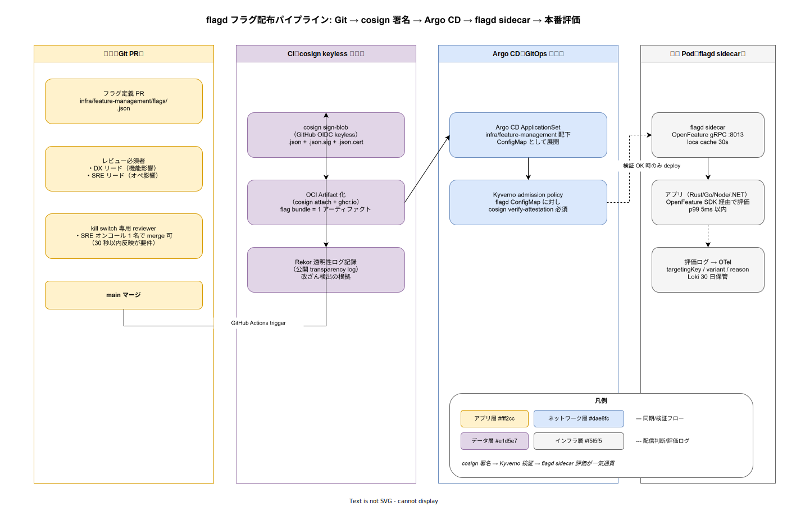

# 01. flagd フィーチャーフラグ設計

本ファイルは k1s0 の機能フラグ運用を実装段階確定版として固定する。ADR-FM-001 で選定した flagd / OpenFeature を、フラグ定義の Git 管理、cosign 署名による配布経路、sidecar 配置と SDK 統合、3 利用パターン（Release / Kill / Experiment）、targetingKey の設計、評価ログの監査基盤連動までを物理配置レベルで規定する。



## なぜ flagd を Argo CD と一体運用するのか

フィーチャーフラグはコード変更を伴わずに本番挙動を変更できる強力な仕組みであるが、配布経路が CI と分離されると「誰がいつ何を配布したか」の追跡が消える。本書ではフラグ定義を `infra/feature-management/flags/` 配下の Git 管理下に置き、Argo CD の ApplicationSet 経由で flagd ConfigMap を更新する経路に一本化する。これにより IMP-REL-POL-001（GitOps 唯一経路）の規約をフラグ配布にも適用し、`80_サプライチェーン設計/` の cosign 署名検証もそのまま流用できる。

flagd 自体は CNCF Sandbox の OpenFeature 公式実装であり、ベンダロックインを避けつつ多言語 SDK（Rust / Go / Node / .NET の 4 種、ADR-FM-001 で確定）を提供する。sidecar 配置にすることで、各 Pod 内で gRPC :8013 を介して評価し、外部 SaaS 依存を排除する。

## フラグ定義ファイルの構造

`infra/feature-management/flags/` 配下に以下の構造でフラグを管理する。フラグ単位で 1 ファイルとし、kill switch とそれ以外で reviewer を分離する。

```text
infra/feature-management/
├── flags/
│   ├── release.<feature-name>.json       # 段階的公開フラグ
│   ├── kill.<feature-name>.json          # 緊急停止フラグ（30 秒以内反映 SLO）
│   ├── experiment.<feature-name>.json    # A/B テスト
│   └── ops.<config-name>.json            # 運用パラメータ（rate limit 等）
├── CODEOWNERS                            # フラグ種別ごとの reviewer
└── schemas/
    └── flag-schema.json                  # JSON Schema による構造検証
```

CODEOWNERS は次のように分離する。`release.*` と `experiment.*` は DX リード + SRE リードの両者承認、`kill.*` は SRE オンコール 1 名で merge 可（30 秒以内反映が要件のため、4-eyes より速度を優先）、`ops.*` は SRE 担当者承認のみとする。フラグ定義の差分は CI で JSON Schema 検証 + 構文チェック（targetingKey の存在 / variant の網羅性）を必須とする。

```json
{
  "$schema": "https://flagd.dev/schema/v0/flags.json",
  "flags": {
    "release.workflow-v2": {
      "state": "ENABLED",
      "variants": { "on": true, "off": false },
      "defaultVariant": "off",
      "targeting": {
        "if": [
          { "in": [{ "var": "tenant_id" }, ["tenant-001", "tenant-005"]] },
          "on", "off"
        ]
      }
    }
  }
}
```

## cosign keyless 署名による配布経路

CI（GitHub Actions）が main マージ後に cosign sign-blob で keyless 署名を行う。GitHub OIDC を Identity provider として使い、長期鍵を環境に持ち込まない（IMP-REL-POL-004）。署名済みフラグは OCI Artifact 化（`cosign attach signature` + ghcr.io）し、flag bundle として 1 アーティファクトに束ねる。Rekor 透明性ログに記録することで、後から「いつ・誰が・何を署名したか」の事後検証が可能となる。

```bash
cosign sign-blob \
  --yes \
  --output-signature flag.sig \
  --output-certificate flag.cert \
  --bundle flag.bundle \
  infra/feature-management/flags/release.workflow-v2.json
```

Argo CD ApplicationSet は OCI Artifact から flag bundle を pull して flagd ConfigMap に変換する。Kyverno admission policy が ConfigMap 適用時に cosign verify-blob を実行し、署名 / 証明書 / Rekor entry の整合を検証する。検証失敗時は admission で reject し、本番に未署名フラグが届かない構造を保証する。

## sidecar 配置と OpenFeature SDK 統合

flagd は各アプリ Pod の sidecar として配置する（ConfigMap mount + 30 秒キャッシュ）。集中型サーバではなく sidecar にする理由は、フラグ評価の p99 レイテンシを 5ms 以内に抑えるため。集中型サーバを置くと Pod ↔ サーバの往復で数十ミリ秒消費し、tier1 公開 11 API の SLO（p99 100ms 以内）を侵食する。

各言語の OpenFeature SDK 統合は次の 4 言語をサポートする（ADR-FM-001 で確定）。

- **Rust** : `open-feature` crate + `flagd-rs` provider。`src/tier1/rust/crates/feature-flag/` で wrap
- **Go** : `github.com/open-feature/go-sdk` + `flagd` provider。Dapr ファサードに統合
- **Node** : `@openfeature/server-sdk` + `@openfeature/flagd-provider`。tier3 BFF で利用
- **.NET** : `OpenFeature` NuGet + `OpenFeature.Contrib.Providers.Flagd`。MAUI native 配布で利用

各 SDK は targetingKey（user_id / tenant_id / session_id 等）を context として渡し、flagd sidecar に gRPC で評価リクエストを送る。応答は variant + reason（`TARGETING_MATCH` / `DEFAULT` / `ERROR` 等）として返り、アプリは variant に応じて分岐する。reason は OTel span attribute として記録し、評価結果の監査トレーサビリティを担保する。

## 3 利用パターンの責務分離

ADR-FM-001 で定めた 3 パターンを次のように責務分離する。

### Release flag（段階的公開）

新機能をコードでは実装済みだが、本番では `release.<feature-name>` フラグで段階的に有効化する。targetingKey は `tenant_id`（B2B では tenant 単位、B2C では user_id）。Argo Rollouts の Canary が完了した後、フラグを段階的に on にする運用とする。フラグ削除は機能の安定確認後（4 週間継続 ON で incident 0 件）に行い、削除 PR は dependabot 風の自動 PR で生成する。

### Kill switch（緊急停止）

本番で問題が顕在化した機能を `kill.<feature-name>` フラグで即座に off にする。rollback より高速（30 秒以内反映）であることが要件で、reviewer は SRE オンコール 1 名のみ。flagd sidecar のキャッシュを 30 秒に設定することで、merge から本番反映まで合計 30 秒以内を実現する。kill switch 発動は PagerDuty Incident と連動し、自動的に Sev2 通知を発する。

### Experiment flag（A/B テスト）

A/B テストは `experiment.<feature-name>` で targetingKey（user_id）を hash split する。Variant 分布（control / variant-a / variant-b）と評価結果（CV 率、エンゲージメント）の集計は OTel span 経由で Mimir に流し、Grafana で可視化する。Experiment は最大 90 日間継続とし、結果が出たら Release flag に昇格するか、機能ごと削除する。

## 評価ログの監査基盤連動

flagd の評価結果は OTel SDK 経由で `flagd.evaluation` span として記録する。span attribute には `flagd.flag_key` / `flagd.variant` / `flagd.reason` / `flagd.targeting_key`（PII 除去のため hash 化）を含める。Loki で 30 日保管し、Forensics 時に「特定 user / tenant がどの variant を見たか」を時系列で復元できる。

「コード変更を伴わず本番挙動を変更した」という性質上、フラグ評価ログは Audit log と同等の証拠性を持つ。`90_ガバナンス設計/` の audit pipeline と同じ保管期間（最低 1 年、規制要件次第で 7 年）を適用する。

## 既存システムからの段階移行

リリース時点 では k1s0 自体が新規プロジェクトであるため、既存システムからの移行パスは不要。リリース時点で多数のフラグが堆積し、flagd の負荷が問題化した場合に flagd-server（集中型）への移行を検討する。閾値の目安は「1 Pod あたりフラグ評価 1000 RPS 超過」とし、閾値到達時点で sidecar / 集中型の選択を改めて評価する。

## 対応 IMP-REL ID

本ファイルで採番する実装 ID は以下とする。

- `IMP-REL-FFD-030` : `infra/feature-management/flags/` の 4 種別ファイル構造（release / kill / experiment / ops）
- `IMP-REL-FFD-031` : CODEOWNERS による reviewer 分離（kill switch は SRE オンコール 1 名）
- `IMP-REL-FFD-032` : JSON Schema 検証 + 構文チェックの CI 必須化
- `IMP-REL-FFD-033` : cosign keyless 署名 + OCI Artifact 化 + Rekor 記録の配布経路
- `IMP-REL-FFD-034` : Kyverno admission policy による cosign verify-blob 検証
- `IMP-REL-FFD-035` : flagd sidecar 配置（30 秒キャッシュ、p99 5ms 以内 SLO）
- `IMP-REL-FFD-036` : OpenFeature SDK 統合（Rust / Go / Node / .NET 4 言語）
- `IMP-REL-FFD-037` : 3 利用パターン（Release / Kill / Experiment）の責務分離と CODEOWNERS マッピング
- `IMP-REL-FFD-038` : 評価ログの OTel span 化（PII hash 化）と Loki 30 日保管
- `IMP-REL-FFD-039` : kill switch 発動の PagerDuty Sev2 自動連動

## 対応 ADR / DS-SW-COMP / NFR

- ADR: [ADR-FM-001](../../../02_構想設計/adr/ADR-FM-001-flagd-openfeature.md)（flagd / OpenFeature）/ [ADR-CICD-001](../../../02_構想設計/adr/ADR-CICD-001-argocd.md)（Argo CD）/ [ADR-CICD-003](../../../02_構想設計/adr/ADR-CICD-003-kyverno.md)（Kyverno）
- DS-SW-COMP: DS-SW-COMP-135（配信系）/ DS-SW-COMP-141（多層防御統括）
- NFR: NFR-A-CONT-001（SLA 99%）/ NFR-A-FT-001（自動復旧）/ NFR-H-INT-001（Cosign 署名）/ NFR-E-MON-002（操作監査）

## 関連章との境界

- [`00_方針/01_リリース原則.md`](../00_方針/01_リリース原則.md) の IMP-REL-POL-004（flagd cosign 署名必須）の物理配置を本ファイルで固定する
- [`../20_ArgoRollouts_PD/01_ArgoRollouts_PD設計.md`](../20_ArgoRollouts_PD/01_ArgoRollouts_PD設計.md) の IMP-REL-PD-026（flagd 3 パターン連動）と本ファイルが対をなす
- [`../../80_サプライチェーン設計/10_cosign署名/`](../../80_サプライチェーン設計/10_cosign署名/) の cosign keyless 運用を本ファイルが流用する
- [`../../60_観測性設計/`](../../60_観測性設計/) の OTel pipeline がフラグ評価 span を集約する
