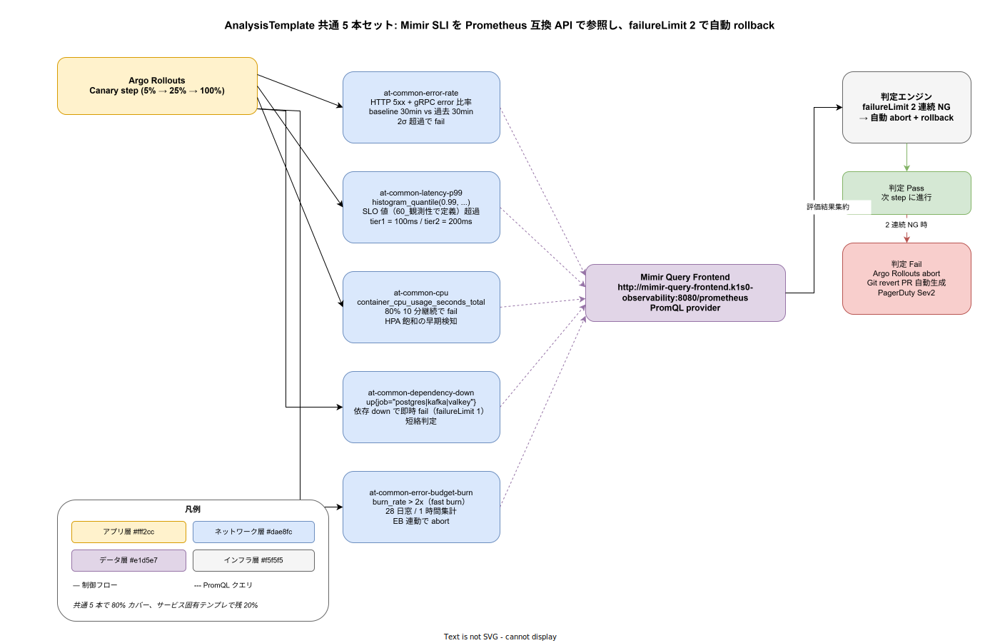

# 01. AnalysisTemplate 設計

本ファイルは k1s0 の Argo Rollouts AnalysisTemplate を実装段階確定版として固定する。共通 5 本セットの PromQL クエリ仕様、Mimir provider 接続、failureLimit / interval / count 設定、サービス固有テンプレの継承、エラーバジェット連動の `at-common-error-budget-burn` までを物理配置レベルで規定する。



## なぜ共通 5 本セットを `deploy/rollouts/analysis/` で一元管理するのか

各サービスが独自に AnalysisTemplate を書くと、PromQL クエリの記法揺れ・閾値設定の不統一・provider 接続文字列の重複が発生し、SRE が SLI 改訂時にすべてのサービスをスキャンしなければならない事態が生じる。本書では k1s0 全サービスが共通利用する 5 本のテンプレを `deploy/rollouts/analysis/` 配下に一元配置し、サービス固有テンプレは共通セットの `templateRef` で継承する構造を採用する。これにより SLO 改訂時の影響面が「共通テンプレを 1 箇所変更」に集約され、保守コストを線形に抑えられる。

20_ArgoRollouts_PD で IMP-REL-PD-022 として配置を予約した 5 本を、本ファイルでクエリ・閾値・適用範囲まで確定する。共通セットは「k1s0 全サービスで意味を持つ汎用 SLI」のみとし、ドメイン固有指標（Temporal ワークフロー完了率、ZEN Engine ルール評価判定確信度）はサービス固有テンプレに留める。

## 共通 5 本のクエリ仕様

### at-common-error-rate（HTTP 5xx + gRPC error 比率）

新リリース版の error rate が baseline 期間（Canary 開始直前 30 分）と比較して 2σ 超過した場合に fail とする。サービス共通の指標として「リリース直後の error 急増」を捉える。

```yaml
apiVersion: argoproj.io/v1alpha1
kind: ClusterAnalysisTemplate
metadata:
  name: at-common-error-rate
spec:
  args:
    - name: service-name
    - name: namespace
  metrics:
    - name: error-rate-vs-baseline
      interval: 1m
      count: 5
      failureLimit: 2
      provider:
        prometheus:
          address: http://mimir-query-frontend.k1s0-observability:8080/prometheus
          query: |
            (
              sum(rate(http_requests_total{service="{{args.service-name}}",namespace="{{args.namespace}}",code=~"5.."}[5m]))
              /
              sum(rate(http_requests_total{service="{{args.service-name}}",namespace="{{args.namespace}}"}[5m]))
            )
            >
            (
              avg_over_time(error_rate_baseline_30min{service="{{args.service-name}}"}[30m])
              + 2 * stddev_over_time(error_rate_baseline_30min{service="{{args.service-name}}"}[30m])
            )
      successCondition: result[0] == 0
      failureCondition: result[0] == 1
```

baseline は recording rule `error_rate_baseline_30min` を Mimir 側で事前計算しておく（30 分平均と σ）。Canary 進行中の都度計算は OOM リスクがあるため、recording rule で先行算出する設計とする。failureLimit 2 は「単発スパイクで rollback しない」意図で、2 連続 NG（2 分間連続）で fail を確定する。

### at-common-latency-p99（レイテンシ p99 SLO 連動）

レイテンシ p99 が SLO 値を超過した場合に fail とする。SLO 値は `60_観測性設計/40_SLI_SLO定義/` で定義済み（tier1 = 100ms、tier2 = 200ms、tier3 = 500ms）。

```yaml
metrics:
  - name: latency-p99-slo
    interval: 1m
    count: 5
    failureLimit: 2
    provider:
      prometheus:
        address: http://mimir-query-frontend.k1s0-observability:8080/prometheus
        query: |
          histogram_quantile(0.99,
            sum by (le) (rate(http_request_duration_seconds_bucket{service="{{args.service-name}}"}[5m]))
          )
    failureCondition: result[0] > {{args.slo-latency-seconds}}
```

SLO 値はサービス固有値として args 経由で渡す。SLO 改訂は `60_観測性設計/` の SLI 一覧と連動し、Scaffold CLI が catalog-info.yaml の SLO 定義から自動でテンプレ args を生成する。

### at-common-cpu（HPA 飽和の早期検知）

Pod の CPU 使用率が 80% を 10 分継続で fail とする。HPA scale-up が間に合わずスループット低下する前段で検知する目的で配置する。

```yaml
metrics:
  - name: cpu-utilization-sustained
    interval: 1m
    count: 10
    failureLimit: 8
    provider:
      prometheus:
        address: http://mimir-query-frontend.k1s0-observability:8080/prometheus
        query: |
          avg(rate(container_cpu_usage_seconds_total{namespace="{{args.namespace}}",container="{{args.service-name}}"}[2m])
              / on (pod) kube_pod_container_resource_limits{resource="cpu"})
    failureCondition: result[0] > 0.8
```

count 10 + failureLimit 8 は「10 分中 8 分超過で fail」を意味し、瞬間スパイクを許容しつつ持続的飽和を検知する。

### at-common-dependency-down（短絡判定）

依存コンポーネント（Postgres / Kafka / Valkey）の `up` が 0 になった瞬間に fail とする。failureLimit 1 で短絡判定し、依存断時は Canary 進行を即座に止める。

```yaml
metrics:
  - name: dependency-availability
    interval: 30s
    count: 3
    failureLimit: 1
    provider:
      prometheus:
        address: http://mimir-query-frontend.k1s0-observability:8080/prometheus
        query: |
          min(up{job=~"postgres|kafka|valkey",namespace=~"k1s0-data|k1s0-messaging"})
    failureCondition: result[0] == 0
```

依存リソースの down は新リリース版のせいではない可能性が高いが、Canary トラフィックを依存断状態に流すと観測ノイズが増えるため、いったん stop して状況確認後に手動で resume する運用とする。

### at-common-error-budget-burn（EB 連動 abort）

`60_観測性設計/50_ErrorBudget運用/` で定義した burn rate が 2x（fast burn）を超過した場合に fail とする。リリース由来でなくても、burn rate 超過時はリリースを止めてバジェット保護を優先する。

```yaml
metrics:
  - name: error-budget-burn-rate
    interval: 5m
    count: 3
    failureLimit: 2
    provider:
      prometheus:
        address: http://mimir-query-frontend.k1s0-observability:8080/prometheus
        query: |
          api:burn_rate_1h{service="{{args.service-name}}"}
    failureCondition: result[0] > 2.0
```

`api:burn_rate_1h` は IMP-OBS-EB-053 で定義した recording rule。burn rate 2x はバジェットを 14 日で枯渇するペースに相当する（28 日 / 2 = 14 日）。fail 時は Argo Rollouts が abort し、Git revert PR を自動生成して PagerDuty Sev2 を発火する。

## サービス固有テンプレの継承

サービス固有 AnalysisTemplate は共通セットを継承し、固有指標のみを差分追加する。Argo Rollouts は `spec.steps[].analysis.templates` で複数テンプレを合成可能なため、共通テンプレを `templateRef` で参照しつつ、サービス固有テンプレを並列で評価する。

```yaml
# deploy/charts/tier1-workflow/templates/analysis-template.yaml
apiVersion: argoproj.io/v1alpha1
kind: AnalysisTemplate
metadata:
  name: at-workflow-completion-rate
spec:
  metrics:
    - name: workflow-completion-rate
      interval: 5m
      count: 3
      failureLimit: 2
      provider:
        prometheus:
          address: http://mimir-query-frontend.k1s0-observability:8080/prometheus
          query: |
            sum(rate(temporal_workflow_completed_total[5m]))
            /
            sum(rate(temporal_workflow_started_total[5m]))
      failureCondition: result[0] < 0.95
```

サービス固有テンプレの追加・閾値変更は SRE 承認必須とし、PR レビューで共通テンプレとの責務重複（同じ指標を別記法で書いていないか）をチェックする。

## カバレッジ評価と監査

共通 5 本でカバーできる SLO 評価範囲は約 80%（リリース時の error / latency / capacity / dependency / budget の 5 軸）。残 20% はサービス固有テンプレが補完する。AnalysisTemplate のカバレッジは `tools/scorecard/at-coverage.sh` で月次計測し、Backstage TechInsights Scorecard に表示する。カバレッジ 70% 未満のサービスは `60_観測性設計/` の SLO 設計レビュー対象となる。

## Argo Rollouts との結合と SDK レイヤ

AnalysisTemplate は Argo Rollouts の `spec.strategy.canary.steps[].analysis` で参照される。本ファイルが提供する共通 5 本は Scaffold CLI が新規サービス生成時に自動で `rollout.yaml` に挿入し、開発者は固有テンプレのみを書けばよい構造とする。共通テンプレは ClusterAnalysisTemplate（クラスタスコープ）として配置し、AnalysisTemplate（namespace スコープ）は固有テンプレ用とする。

## 対応 IMP-REL ID

本ファイルで採番する実装 ID は以下とする。

- `IMP-REL-AT-040` : `at-common-error-rate` の baseline 2σ 超過判定（recording rule 連動）
- `IMP-REL-AT-041` : `at-common-latency-p99` の SLO 値超過判定（args 経由でサービス別 SLO）
- `IMP-REL-AT-042` : `at-common-cpu` の 80% 10 分継続判定（count 10 + failureLimit 8）
- `IMP-REL-AT-043` : `at-common-dependency-down` の短絡判定（failureLimit 1）
- `IMP-REL-AT-044` : `at-common-error-budget-burn` の burn rate 2x 超過判定（IMP-OBS-EB-053 連動）
- `IMP-REL-AT-045` : ClusterAnalysisTemplate（共通）と AnalysisTemplate（固有）のスコープ分離
- `IMP-REL-AT-046` : Mimir Prometheus 互換 API の provider 統一（`mimir-query-frontend.k1s0-observability:8080`）
- `IMP-REL-AT-047` : Scaffold CLI による共通テンプレ自動挿入と固有テンプレのみの開発者責務分離
- `IMP-REL-AT-048` : `tools/scorecard/at-coverage.sh` による月次カバレッジ計測（Backstage TechInsights 連動）
- `IMP-REL-AT-049` : サービス固有テンプレの SRE 承認必須化と責務重複チェック

## 対応 ADR / DS-SW-COMP / NFR

- ADR: [ADR-CICD-002](../../../02_構想設計/adr/ADR-CICD-002-argo-rollouts.md)（Argo Rollouts）/ [ADR-OBS-001](../../../02_構想設計/adr/ADR-OBS-001-grafana-lgtm.md)（Grafana LGTM）/ [ADR-REL-001](../../../02_構想設計/adr/ADR-REL-001-progressive-delivery-required.md)（PD 必須化）
- DS-SW-COMP: DS-SW-COMP-085（OTel Gateway / Mimir）/ DS-SW-COMP-135（配信系）
- NFR: NFR-A-CONT-001（SLA 99%）/ NFR-A-FT-001（自動復旧）/ NFR-I-EB-001（エラーバジェット）/ NFR-D-MTH-002（Canary）

## 関連章との境界

- [`00_方針/01_リリース原則.md`](../00_方針/01_リリース原則.md) の IMP-REL-POL-003（AnalysisTemplate SLI 連動）の物理配置を本ファイルで固定する
- [`../20_ArgoRollouts_PD/01_ArgoRollouts_PD設計.md`](../20_ArgoRollouts_PD/01_ArgoRollouts_PD設計.md) の IMP-REL-PD-022（共通セット 5 本配置）の詳細クエリ仕様を本ファイルで確定する
- [`../../60_観測性設計/40_SLI_SLO定義/`](../../60_観測性設計/) の SLI 値と本ファイルの args が連動する
- [`../../60_観測性設計/50_ErrorBudget運用/`](../../60_観測性設計/50_ErrorBudget運用/) の burn rate recording rule（IMP-OBS-EB-053）を本ファイルが参照する
- [`../../50_開発者体験設計/40_Scaffold/`](../../50_開発者体験設計/) の Scaffold CLI が共通テンプレ自動挿入を実装する
