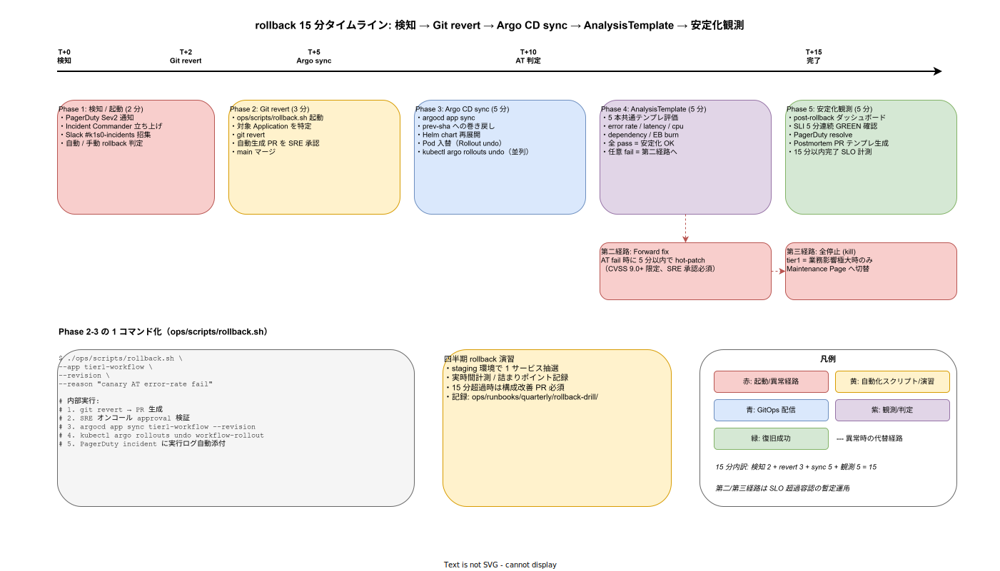

# 01. rollback runbook 設計

本ファイルは k1s0 の rollback 運用を実装段階確定版として固定する。IMP-REL-POL-005 の「15 分以内 rollback runbook と演習」を物理配置に落とし込み、5 段階タイムライン（検知 → Git revert → Argo CD sync → AnalysisTemplate → 安定化観測）、`ops/scripts/rollback.sh` の 1 コマンド化、第二 / 第三経路（forward fix / 全停止）、四半期演習までを規定する。



## なぜ rollback を「15 分」「演習込み」で規定するのか

rollback の自動化と「実時間 15 分以内に完了する」は別の問題である。Argo Rollouts の自動 abort は本ファイルがなくても動作するが、自動 abort 後の安定化観測 / Postmortem 起票 / Incident クローズまでを 15 分以内に押し込めるかは演習しないと分からない。本書はこの「演習込みの 15 分」を SLI 同等の指標として扱い、超過は Incident として扱う運用を規定する。

NFR-A-FT-001（自動復旧 15 分以内）と IMP-REL-POL-005 の「15 分以内 rollback runbook と演習」を物理タイムラインに落とし込み、各 Phase の所要時間・担当者・自動化スクリプトを固定する。手動操作の余地を最小化し、SRE オンコール 1 名でも実行可能な構成とする。

## 5 段階タイムライン（合計 15 分）

### Phase 1: 検知 / 起動（T+0 → T+2、2 分）

PagerDuty Sev2 通知を起点に、SRE オンコールが Incident Commander として立ち上がる。Slack `#k1s0-incidents` 招集と並行して、自動 rollback と手動 rollback の判定を行う。

- **自動 rollback 経路**: AnalysisTemplate failureLimit 超過で Argo Rollouts が自動 abort 済み → Phase 5 へ直接遷移
- **手動 rollback 経路**: 顧客通報 / 営業日中の事業判断による手動起動 → Phase 2 へ進行
- 判定後 30 秒以内に SRE オンコールが `#k1s0-incidents` に「rollback execute」を宣言（人間の意思決定を明示）

### Phase 2: Git revert（T+2 → T+5、3 分）

`ops/scripts/rollback.sh` を起動し、対象 Application の特定 → `git revert <merge-sha>` → 自動生成 PR → SRE 承認 → main マージまでを実行する。

```bash
./ops/scripts/rollback.sh \
    --app tier1-workflow \
    --revision <prev-sha> \
    --reason "canary AT error-rate fail"

# 内部実行:
# 1. git revert <merge-sha> → PR 生成
# 2. SRE オンコール approval 検証（GitHub Branch Protection）
# 3. argocd app sync tier1-workflow --revision <prev-sha>
# 4. kubectl argo rollouts undo workflow-rollout
# 5. PagerDuty incident に実行ログ自動添付
```

スクリプトは PagerDuty Incident ID と OIDC token を環境変数から受け取り、SRE オンコール本人の操作であることを GitHub OIDC で検証する。承認は Branch Protection の required reviewer で強制し、緊急時でも 4-eyes 原則を維持する（自分の PR を自分で承認することは構造的に不可能）。

### Phase 3: Argo CD sync（T+5 → T+10、5 分）

Argo CD が main の最新コミットを検知し、対象 Application を prev-sha へ巻き戻す。Helm chart 再展開 → Pod 入替（Rollout undo を並列実行）。

- `argocd app sync <app>` の所要時間目安: tier1 = 3 分 / tier2 = 2 分 / tier3 = 4 分
- Pod 入替は Argo Rollouts の `RolloutUndo` を並列実行することで Helm sync より早く完了
- HPA / PDB の制約で入替が滞る場合は `kubectl scale --replicas=N` で一時的に強制スケール

### Phase 4: AnalysisTemplate（T+10 → T+15、5 分）

`40_AnalysisTemplate/` で定義した共通 5 本テンプレを評価する。全 pass で安定化 OK、任意 fail で第二経路（forward fix）または第三経路（全停止）へ遷移する。

- 5 本（error-rate / latency-p99 / cpu / dependency / EB burn）を 1 分ごとに 5 回評価
- 全 pass 確認時間: 5 分（評価 5 回 × 1 分間隔）
- 1 本でも fail = Phase 5 のかわりに第二 / 第三経路へ遷移

### Phase 5: 安定化観測（T+15、Incident クローズ）

post-rollback ダッシュボード（Grafana の Incident view）で SLI が 5 分連続 GREEN を確認後、PagerDuty Incident を resolve する。Postmortem PR テンプレを自動生成し、24 時間以内に作成期限を設定する。

- post-rollback ダッシュボード: `60_観測性設計/` の Grafana provisioning で標準提供
- Postmortem テンプレ: `docs-postmortem` Skill 準拠の md を `docs/40_運用ライフサイクル/postmortems/YYYY-MM-DD-<incident-id>.md` で自動生成
- 15 分超過時は Incident メタデータに `rollback_duration_minutes` を記録し、四半期で集計

## 第二経路: forward fix

Phase 4 で AnalysisTemplate が fail した場合、CVSS 9.0+ かつ rollback で解決しない事案（例: データ層 schema 不整合）に限り、forward fix（hot-patch）で対処する。SRE リード + 事業責任者の両者承認が必須で、5 分以内に hot-patch PR をマージし Phase 3 を再実行する。SLO 超過は容認するが、事後 Postmortem で構造的修正を必須とする。

## 第三経路: 全停止（kill）

forward fix も成功しない場合、tier1 の業務影響極大時のみ全停止（Maintenance Page 切替）を実行する。Istio Ambient の VirtualService で全トラフィックを Maintenance Page Service に振り分け、ユーザーには「障害復旧中」を表示する。SRE リード + 事業責任者 + CTO の三者承認が必須で、解除も同様の三者承認を要する。

## 四半期 rollback 演習

15 分以内達成は演習なしには維持できない。`ops/runbooks/quarterly/rollback-drill/` 配下に演習記録を蓄積し、四半期に 1 回以下を実施する。

- staging 環境で 1 サービスを抽選（tier1 / tier2 / tier3 / infra / observability / security から rotation）
- 故意に SLI を劣化させ（chaos engineering）、AnalysisTemplate の fail を誘発
- 実時間計測（Phase 1〜5 各々）と詰まりポイント記録
- 15 分超過時は構成改善 PR を必須化（次四半期までに対応）
- 演習結果サマリは月次 SRE 定例で共有し、recurring な詰まりポイントを抽出

演習の chaos engineering は `tools/chaos/` 配下のスクリプト（pod kill / network delay / dependency failure）で実施する。本番への波及がないよう staging 環境の独立を保証し、演習中は本番 Argo CD への sync を block する。

## サービス別 rollback runbook の配置

各サービスの個別 rollback runbook は `ops/runbooks/incidents/rollback-<service>/` に配置する。本ファイルは共通骨格を規定し、サービス固有の詰まりポイント（schema migration / 外部依存切り替え / 状態リカバリ）は個別 runbook で記述する。Scaffold CLI が新規サービス生成時に individual runbook テンプレを自動配置する。

## Incident メタデータと SLO 計測

各 rollback の実行結果は Incident メタデータとして次の項目を必須記録する。

- `rollback_started_at`: Phase 1 開始時刻
- `rollback_completed_at`: Phase 5 完了時刻
- `rollback_duration_minutes`: 上記差分
- `rollback_path`: `auto` / `manual` / `forward_fix` / `kill`
- `rollback_phase_durations`: Phase 1-5 の各所要時間
- `rollback_blocker_phase`: 15 分超過時に詰まった Phase 番号

これらは `60_観測性設計/` の Incident pipeline で集計し、四半期 SRE 定例で「Phase ごとの所要時間分布」「15 分超過率」「forward fix / kill 発動率」を可視化する。

## 対応 IMP-REL ID

本ファイルで採番する実装 ID は以下とする。

- `IMP-REL-RB-050` : 5 段階タイムライン（検知 2 分 / Git revert 3 分 / Argo sync 5 分 / AT 5 分 / 観測 5 分）
- `IMP-REL-RB-051` : `ops/scripts/rollback.sh` の 1 コマンド化と GitHub OIDC 認証
- `IMP-REL-RB-052` : SRE 承認の Branch Protection 強制（4-eyes 原則の構造的保証）
- `IMP-REL-RB-053` : Phase 3 の Helm sync + Rollout undo 並列実行
- `IMP-REL-RB-054` : 第二経路（forward fix）の発動条件と二者承認
- `IMP-REL-RB-055` : 第三経路（全停止 / Maintenance Page）の三者承認
- `IMP-REL-RB-056` : 四半期演習（staging chaos + 実時間計測 + 詰まりポイント記録）
- `IMP-REL-RB-057` : `ops/runbooks/incidents/rollback-<service>/` のサービス別 runbook 配置
- `IMP-REL-RB-058` : Postmortem PR 自動生成（24 時間期限）
- `IMP-REL-RB-059` : Incident メタデータ（duration / path / phase / blocker）の必須記録と四半期可視化

## 対応 ADR / DS-SW-COMP / NFR

- ADR: [ADR-CICD-001](../../../02_構想設計/adr/ADR-CICD-001-argocd.md)（Argo CD）/ [ADR-CICD-002](../../../02_構想設計/adr/ADR-CICD-002-argo-rollouts.md)（Argo Rollouts）/ [ADR-OBS-001](../../../02_構想設計/adr/ADR-OBS-001-grafana-lgtm.md)（Grafana LGTM）/ [ADR-REL-001](../../../02_構想設計/adr/ADR-REL-001-progressive-delivery-required.md)（PD 必須化）
- DS-SW-COMP: DS-SW-COMP-135（配信系）/ DS-SW-COMP-141（多層防御統括）
- NFR: NFR-A-CONT-001（SLA 99%）/ NFR-A-FT-001（自動復旧 15 分）/ NFR-C-IR-001（Incident Response）/ NFR-C-IR-002（Circuit Breaker）

## 関連章との境界

- [`00_方針/01_リリース原則.md`](../00_方針/01_リリース原則.md) の IMP-REL-POL-005（15 分以内 rollback）の物理配置を本ファイルで固定する
- [`../20_ArgoRollouts_PD/01_ArgoRollouts_PD設計.md`](../20_ArgoRollouts_PD/01_ArgoRollouts_PD設計.md) の IMP-REL-PD-027（手動 rollback の 1 コマンド化）を本ファイルが拡張する
- [`../40_AnalysisTemplate/01_AnalysisTemplate設計.md`](../40_AnalysisTemplate/01_AnalysisTemplate設計.md) の共通 5 本テンプレが Phase 4 評価で参照される
- [`../../60_観測性設計/70_Runbook連携/`](../../60_観測性設計/70_Runbook連携/) の IMP-OBS-RB-* の Incident 対応 runbook と本ファイルが連動する
- [`../../50_開発者体験設計/40_Scaffold/`](../../50_開発者体験設計/) の Scaffold CLI が個別 runbook テンプレを生成する
