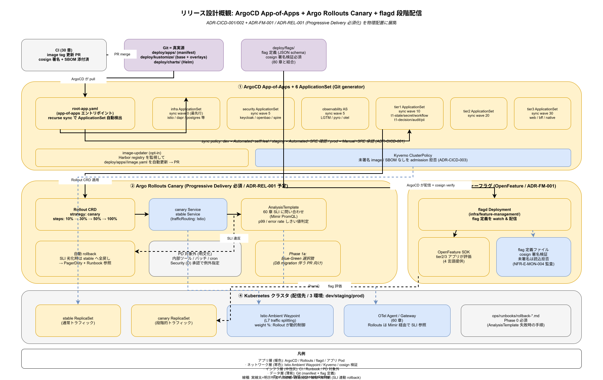

# 70. リリース設計

本章は k1s0 のリリース戦略（ADR-CICD-001 で選定した Argo CD + ADR-CICD-002 で選定した Argo Rollouts + ADR-FM-001 で選定した flagd）を実装段階確定版として固定する。GitOps による宣言的配信、カナリア / Blue-Green / Progressive Delivery、フィーチャーフラグによる段階的有効化、エラーバジェット連動の自動停止までを一貫したリリースパイプラインとして規定する。

## 本章の位置付け

10 年保守を目指す以上、リリースは「稀に行う大玉」ではなく「日常的に繰り返される小玉」でなければならない。したがって、失敗時のロールバック経路が最短で、かつ影響範囲を段階的に拡大できる仕組みが必須となる。本章は Argo Rollouts の AnalysisTemplate で `60_観測性設計/` の SLI を参照し、SLI 劣化時に自動ロールバックを行う構造を確定する。

Progressive Delivery（PD）は リリース時点 で必須化する（ADR-REL-001 として新規起票）。ただし例外範囲を明文化し、内部ツール・バッチは PD 対象外とする。フィーチャーフラグ（flagd）は flag 定義ファイルへの cosign 署名検証を必須とし、`80_サプライチェーン設計/` と結合する（構想設計 CICD 章と flagd ADR で既に枠は定まっている）。



## OSS リリース時点での確定範囲

- リリース時点: Argo CD App / ApplicationSet、Argo Rollouts（canary + AnalysisTemplate）、flagd、rollback runbook
- リリース時点: Blue-Green リリースの選択肢、マルチクラスタ配信
- リリース時点: Release Train（定期リリース）運用

## RACI

| 役割 | 責務 |
|---|---|
| SRE（主担当 / B） | Rollout 戦略、AnalysisTemplate、エラーバジェット連動 |
| Platform/Build（共担当 / A） | Argo CD App 構造、Helm chart、image-updater |
| Security（共担当 / D） | flag 署名検証、PD 対象外範囲の承認 |

## 節構成予定

```
70_リリース設計/
├── README.md
├── 00_方針/                # GitOps と PD の原則
├── 10_ArgoCD_App構造/
├── 20_ArgoRollouts_PD/
├── 30_flagd_フィーチャーフラグ/
├── 40_AnalysisTemplate/    # SLI 連動の自動判定
├── 50_rollback_runbook/
└── 90_対応IMP-REL索引/
```

## IMP ID 予約

本章で採番する実装 ID は `IMP-REL-*`（予約範囲: IMP-REL-001 〜 IMP-REL-099）。

## 対応 ADR / 概要設計 ID / NFR

- ADR: [ADR-CICD-001](../../02_構想設計/adr/ADR-CICD-001-argocd.md)（Argo CD）/ [ADR-CICD-002](../../02_構想設計/adr/ADR-CICD-002-argo-rollouts.md)（Argo Rollouts）/ [ADR-FM-001](../../02_構想設計/adr/ADR-FM-001-flagd-openfeature.md)（flagd / OpenFeature）/ 本章初版策定時に ADR-REL-001（Progressive Delivery 必須化）を起票予定
- DS-SW-COMP: DS-SW-COMP-135（配信系）
- NFR: NFR-A-CONT-001（SLA 99%）/ NFR-A-FT-001（自動復旧）/ NFR-D-MTH-002（Canary/Blue-Green）/ NFR-C-IR-002（Circuit Breaker）

## 関連章

- `30_CI_CD設計/` — CI の成果物を受け取る境界
- `60_観測性設計/` — SLI 連動の自動判定
- `80_サプライチェーン設計/` — flag 定義の署名検証
