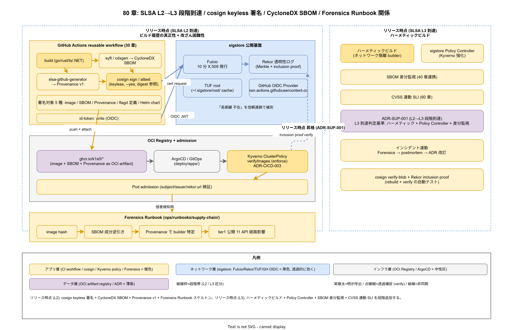

# 01. サプライチェーン原則

本ファイルは k1s0 のソフトウェアサプライチェーン設計を判断する際に常に参照する 7 軸の原則を定義する。cosign 署名の方式変更、SBOM 生成経路の追加、SLSA レベルの段階引き上げ、Kyverno の admission ポリシー改訂、Forensics Runbook の拡張など、サプライチェーン領域で発生する全ての設計判断は本原則との整合をレビューで確認する。



## 原則が必要な理由

サプライチェーン攻撃は 採用側組織にとって最も破壊的なインシデント類型であり、「攻撃経路に乗られた事実」自体が顧客信頼を毀損する。統制を欠いた運用は、次のような破綻として表面化する。

- ビルド環境が開発者の手元 PC や野良 Runner に分散し、「誰がビルドしたか」「どの source から作られたか」のプロビナンスが証明できない
- cosign の署名鍵を CI 環境変数として持ち回し、鍵流出時に全 image の信頼が失われる
- SBOM を image に添付していない状態で CVE が公開され、「この image に影響があるか」を人手で調べるのに 2 日かかる
- Kyverno で署名検証ポリシーを置いても「warn」止まりで admission を通してしまい、未署名 image が本番に到達する
- インシデント時に image hash から「tier1 公開 11 API のどの呼び出し経路に影響するか」が逆引きできず、影響範囲の告知が遅延する
- AGPL 分離のエビデンスを「監査時に作る」運用となり、平時に壊れていても検知できない
- SLSA レベルを実態以上に高く主張し、第三者監査や取引先向け DD（デューデリジェンス）で虚偽申告となる

本原則は、これらの破綻を「署名」「SBOM」「プロビナンス」「ポリシー」「Forensics」の各層で構造的に防止する 7 軸である。SLSA v1.1 の段階到達を基準線とし、cosign keyless / CycloneDX SBOM / Kyverno enforce / Forensics Runbook / AGPL 分離を一体の運用として束ねる。

## 原則 1: SLSA v1.1 の段階到達を固定する（IMP-SUP-POL-001）

**SLSA レベルは リリース時点で L2 / L3 を到達基準とする。リリース時点 での L3 強行を禁止する。**

SLSA v1.1 は Build トラックでビルド完全性を段階的に保証する枠組みである。リリース時点 で L3（ハーメティック・分離ビルド）まで強行すると運用負荷が跳ね上がり、初期の本番到達が遅れる。一方で L1 までで止まると「誰がビルドしたかの真正性」が保証されず、本番運用できない。L2 は「改ざん困難なビルドサービス + プロビナンス署名」であり、リリース時点 の妥当な着地点となる（ADR-SUP-001 として本章初版策定時に起票予定）。

- リリース時点（L2）: GitHub Actions hosted runner + cosign プロビナンス生成 + 改ざん検知
- リリース時点（L3）: ハーメティックビルド（ネットワーク遮断）+ 分離された builder + SLSA Provenance v1 フルフィールド
- L3 到達前の L3 主張を禁止（監査で虚偽申告となるため）
- SLSA レベルは catalog-info.yaml に `slsa.level: 2` として明示し、Backstage で一覧可能にする
- レベル変更（L2→L3）は四半期レビューで段階検証し、検証通過までは L2 を維持する

## 原則 2: cosign keyless 署名を必須とする（IMP-SUP-POL-002）

**全 container image / Helm chart / flag 定義 / SBOM は cosign keyless 署名を必須とし、長期鍵の持ち出しを禁止する。**

長期鍵を CI 環境変数として持ち回すと、流出時に鍵ローテーションと全 image の再署名が必要となり、実質的に運用できない。本原則は sigstore keyless（GitHub OIDC 経由で Fulcio が短命証明書を発行）に統一し、鍵を保管しない運用とする。

- 署名対象: container image / Helm chart / Kustomize bundle / flagd 定義 / SBOM
- 署名実行者: GitHub Actions の OIDC ID（リポジトリごとに subject が一意）
- 検証ルールは Kyverno で admission 強制し、警告レベルで留めない
- 長期鍵が必要な場合（オフライン署名等）は ADR で正当化し、OpenBao / HSM 経由に限定
- 検証時は Rekor（透明性ログ）の entry 存在も確認し、「署名はあるが Rekor にない」状態を拒否する

## 原則 3: CycloneDX SBOM を全イメージに添付する（IMP-SUP-POL-003）

**全 container image に CycloneDX 形式の SBOM を添付（attach）し、cosign で署名する。**

NFR-H-INT-002 で SBOM 添付を必須化している。SBOM なしの image は CVE 公開時に「影響があるか」を調査できず、影響範囲告知が破綻する。本原則は SBOM 生成を CI の最終段に組み込み、image push と同時に OCI artifact として attach する。

- SBOM 形式は CycloneDX JSON（SPDX は補助、CycloneDX を正とする）
- 生成ツールは syft を標準とし、言語別ロックファイル（Cargo.lock / go.sum / package-lock.json / *.csproj）から静的生成
- attach は cosign attest で SBOM を attestation として添付（image と分離しない）
- SBOM なしの image は Kyverno で admission 拒否
- SBOM は image と同じ OCI repository に保管し、image 削除時に連動削除される運用とする

## 原則 4: Kyverno で署名検証を admission 強制する（IMP-SUP-POL-004）

**cosign 署名・SLSA プロビナンス・SBOM 添付の検証は Kyverno admission policy で強制し、warning モードで留めることを禁止する。**

ADR-CICD-003 で Kyverno を採択した目的は、「警告ログを出すだけで通す」運用を排除し、ポリシー違反時に必ず admission で拒否することにある。warning モードはポリシー整備期の一時措置であり、リリース時点までに全て enforce モードへ昇格する。

- 検証対象: image 署名 / SBOM attestation / SLSA Provenance / flagd 定義署名
- Policy 違反時: admission 拒否＋Incident 記録（Incident Taxonomy 連動）
- 緊急時の例外（break-glass）は Kyverno の `exceptionList` で明示し、24 時間の time-bound を必須
- Policy 自体の変更は CODEOWNERS で Security リード必須承認
- Policy 検証は dev / staging で dry-run し、本番適用前に「どれだけ拒否が発生するか」を数値で把握

## 原則 5: Forensics Runbook で image hash から影響範囲を逆引きする（IMP-SUP-POL-005）

**Forensics Runbook は image hash を起点に「tier1 公開 11 API のどの呼び出し経路に影響するか」を逆引き可能とする。**

インシデント発生時、攻撃を受けた image hash から「どの API がどの時間帯に影響を受けたか」を 1 時間以内に回答できなければ、顧客告知・法的対応・再発防止の全てが遅延する。本原則は Forensics Runbook を リリース時点 の MUST とし、SBOM・プロビナンス・tier1 API の依存マップを横断するインデックスに依存する。

- インデックスは `ops/dr/forensics-index/` 配下の Parquet として日次更新
- 入力: image hash / 時刻
- 出力: 影響 tier1 API 一覧 / 期間内の呼び出し回数 / 影響サービスの Backstage エンティティ
- Runbook 演習は四半期ごとに 1 シナリオを抽選し、所要時間を計測（目標: 60 分以内）
- インデックス生成は CI で自動化し、image 作成時に同時生成（手動作成を禁止）

## 原則 6: SBOM 差分監視で新規依存を自動検知する（IMP-SUP-POL-006）

**SBOM の世代間差分を自動監視し、新規依存の追加・ライセンス変更・脆弱性既知化を週次で通知する（リリース時点 必須）。**

依存は一度入ると増える一方であり、「なぜこの依存が入ったか」の由来を 1 年後に追跡するのは困難となる。本原則は SBOM を版管理し、差分が発生した時点で依存追加の PR と紐付けて記録する。

- 差分検知ツール: Dependency-Track（OWASP） または類似 OSS を採用
- 新規依存追加時: PR レビュアーに Security チームを自動追加
- ライセンス検知: Apache-2.0 / MIT / BSD 以外の追加は Security 審査
- 既知 CVE マッチング: CVSS スコアに応じて `60_観測性設計/` の Incident Taxonomy にエスカレーション
- 新規依存追加は PR 本文に「なぜこの依存が必要か」「代替検討の結果」を必須記載する

## 原則 7: AGPL 分離エビデンスを常時保持する（IMP-SUP-POL-007）

**AGPL 分離（ADR-0003）のエビデンスを平時から自動収集・保管し、監査時の作成運用を禁止する。**

AGPL 分離は「プロセス境界」「公開プロトコル経由」「オプショナル依存」の 3 条件で成立する。監査時に「その時点の構成」を作って示す運用は、「平時に壊れていても気付かない」ため形骸化する。本原則はエビデンスを日次自動収集し、分離が崩れた時点で Incident として扱う。

- 収集対象: namespace 境界 / helm values / process tree / 依存リンク解析（ldd / cargo tree / go list）
- 保管先: `ops/dr/agpl-isolation-evidence/` 配下（日次 retention 90 日）
- 分離崩れ検知: Kyverno policy で tier1 namespace への LGTM コンポーネント配置を admission 拒否
- `60_観測性設計/` の AGPL 分離原則（IMP-OBS-POL-002）と一対一対応
- 監査時に提示するエビデンスは 90 日分の日次スナップショットから任意日付を抽出可能であること

## 図表

```
[サプライチェーン 7 原則の構造]
  1. SLSA L2/L3 段階  ──┐
                        ├─> 2. cosign keyless (長期鍵禁止)
                        ├─> 3. CycloneDX SBOM 添付
                        │
                        v
                  4. Kyverno admission 強制 (warn 不可)
                        │
                        v
  5. Forensics Runbook <── 6. SBOM 差分監視
  7. AGPL 分離エビデンス常時保持（ADR-0003）
```

詳細なサプライチェーン経路は [img/サプライチェーン7原則マップ.drawio](../img/80_SLSA段階到達_cosign_SBOM.drawio)（drawio 編集時に svg 出力）を参照。

## 対応 IMP-SUP ID

本ファイルで採番する原則レベル ID は以下とする。

- `IMP-SUP-POL-001` : SLSA v1.1 段階到達（リリース時点=L2 / 採用後の運用拡大時=L3）
- `IMP-SUP-POL-002` : cosign keyless 署名必須（長期鍵持ち出し禁止）
- `IMP-SUP-POL-003` : CycloneDX SBOM 全 image 添付
- `IMP-SUP-POL-004` : Kyverno による admission 強制（warn 禁止）
- `IMP-SUP-POL-005` : Forensics Runbook で image hash → tier1 API 逆引き
- `IMP-SUP-POL-006` : SBOM 差分監視と新規依存自動検知（リリース時点）
- `IMP-SUP-POL-007` : AGPL 分離エビデンスの常時保持

## 対応 ADR / DS-SW-COMP / NFR

- ADR: [ADR-CICD-003](../../../02_構想設計/adr/ADR-CICD-003-kyverno.md)（Kyverno） / [ADR-0003](../../../02_構想設計/adr/ADR-0003-agpl-isolation-architecture.md)（AGPL 分離 / サプライチェーン監査エビデンス） / ADR-SUP-001（SLSA L2→L3 段階到達、本章初版策定時に起票予定）
- DS-SW-COMP: DS-SW-COMP-135（配信系と結合）
- NFR: NFR-H-INT-001（Cosign 署名） / NFR-H-INT-002（SBOM 添付） / NFR-H-INT-003（SLSA Provenance） / NFR-H-KEY-001（鍵ライフサイクル） / NFR-E-SIR-003（フォレンジック）

## 関連章との境界

- [`30_CI_CD設計/`](../../30_CI_CD設計/) は署名・SBOM の生成タイミングを規定し、本章は署名方式・検証方式を規定する
- [`40_依存管理設計/`](../../40_依存管理設計/) は依存追加ポリシーを規定し、本章は SBOM 差分監視経由で相互に監視する
- [`60_観測性設計/`](../../60_観測性設計/) の CVSS 連動 SLI が SBOM 差分と接続する（IMP-SUP-POL-006）
- [`70_リリース設計/`](../../70_リリース設計/) の flagd 定義署名検証は本章の cosign 原則（IMP-SUP-POL-002）と統合される
- [`90_ガバナンス設計/`](../../90_ガバナンス設計/) は Kyverno Policy 全体のガバナンスを担い、本章は署名検証 Policy を提供する
