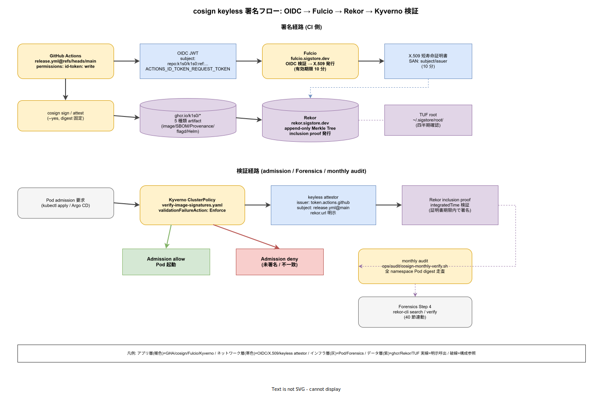

# 01. cosign keyless 署名

本ファイルは k1s0 モノレポにおける sigstore / cosign keyless 署名の物理配置と運用規約を確定する。80 章方針 IMP-SUP-POL-002（cosign keyless 必須）および IMP-SUP-POL-005（Kyverno enforce）で掲げた原則を、GitHub Actions reusable workflow・Fulcio 短寿命証明書・Rekor 透明性ログ・Kyverno verifyImages admission の 4 点でつなぐ具体実装として示す。ADR-CICD-003 で選定した Kyverno が検証の実行主体であり、ADR-SUP-001（起票予定、SLSA L2→L3 段階到達）と同期して リリース時点 の L2 到達基準線を満たす。



長期鍵を CI 環境変数として持ち回す従来運用は、流出時の全 image 再署名が事実上不可能で、鍵ローテーション運用が破綻する。一方で署名を完全に放棄すると、供給元の真正性が担保されず、admission で未署名 image を拒否できない。keyless 方式は「GitHub Actions の OIDC トークン → Fulcio が短寿命 X.509 を発行 → Rekor に署名エントリを記録」という 3 段構成で、長期秘密を一切保管せずに真正性と改ざん検知を両立する。

## 署名対象 5 種類

keyless 署名は「配信物である」かつ「admission または GitOps 経路に載る」全ての artifact に適用する。対象を広く取ると運用が破綻し、狭く取ると脆弱性の抜け穴が発生する。k1s0 では以下 5 種類を IMP-SUP-COS-010 として固定する。

- **Container image**: tier1 6 Pod（Go 3 + Rust 3）、tier2 ドメインサービス、tier3 BFF / Web / Native、platform CLI の全 image。`ghcr.io/k1s0/<image>:<tag>` の push 直後に署名
- **SBOM**: CycloneDX 形式の SBOM を image に OCI artifact として attach し、SBOM 自体にも個別の cosign 署名を付与（`cosign attest --predicate sbom.cdx.json --type cyclonedx`）
- **SLSA Provenance**: `slsa-github-generator` が生成する Provenance v1 を `--type slsaprovenance1` として署名
- **flagd 定義ファイル**: `infra/feature-management/flagd/*.flagd.json` を OCI artifact として push し cosign 署名。変更ごとに署名されるため、Runtime の flag 書換えを構造的に検知可能
- **Helm chart**: `deploy/charts/tier1/` 他の chart を OCI artifact として push し署名。ArgoCD の Helm source が検証対象

5 種類は署名経路が異なる（image は push 後、Provenance は builder 内、flagd / Helm は別 job）が、全て同じ Fulcio / Rekor に送られ、同じ Kyverno ポリシーで検証される。署名対象の追加は ADR-SUP-001 改訂で判断し、場当たりの追加を禁止する。

## keyless 原理と信頼連鎖

keyless は「長期鍵の不在」を信頼チェーンの再構築で補う。k1s0 が依存する 4 コンポーネントの信頼関係を以下に固定する（IMP-SUP-COS-011）。

1. **GitHub Actions OIDC**: workflow は `permissions: id-token: write` を宣言し、`$ACTIONS_ID_TOKEN_REQUEST_TOKEN` で JWT を取得。subject は `repo:k1s0/k1s0:ref:refs/heads/main` 形式で固定される
2. **Fulcio**: public Fulcio（`fulcio.sigstore.dev`）が OIDC JWT を検証し、10 分有効の X.509 証明書を発行。証明書には subject / issuer が SAN 拡張として埋め込まれる
3. **Rekor**: 署名 + 証明書 + artifact digest を Rekor（`rekor.sigstore.dev`）に POST。Merkle Tree に追加され、inclusion proof が返る
4. **local 検証**: 証明書有効期限は 10 分だが、Rekor エントリの `integratedTime` が証明書有効期限内であることを検証する（証明書失効後でも、有効期限内に署名されたことが Rekor 経由で証明される）

信頼連鎖の根は Sigstore の The Update Framework（TUF）root key であり、`cosign initialize` で取得して `~/.sigstore/root/` にキャッシュする。TUF root 更新は四半期で確認し、変更検知時は Platform/Build が一括更新する。

## CI 統合と reusable workflow 呼出

署名実行は 30 章 `_reusable-push.yml` の最終 step に組込む。1 言語 1 job 原則（IMP-CI-RWF-010）を維持するため、署名は Go / Rust / TS / .NET 共通の push reusable workflow 内で同一 step として実行する。

```yaml
# .github/workflows/_reusable-push.yml の最終 step 抜粋
- name: Sign image / SBOM / Provenance
  env:
    COSIGN_EXPERIMENTAL: "1"
  run: |
    cosign sign --yes ghcr.io/k1s0/${{ inputs.image }}@${{ steps.push.outputs.digest }}
    cosign attest --yes --predicate sbom.cdx.json --type cyclonedx \
      ghcr.io/k1s0/${{ inputs.image }}@${{ steps.push.outputs.digest }}
    cosign attest --yes --predicate provenance.json --type slsaprovenance1 \
      ghcr.io/k1s0/${{ inputs.image }}@${{ steps.push.outputs.digest }}
```

`--yes` は keyless モードで対話プロンプトを抑止するフラグで、CI 内必須。image は tag ではなく digest で参照する（tag は mutable、digest は immutable）ことを IMP-SUP-COS-012 として固定する。digest 参照を怠ると、tag 書換え攻撃で未署名 image に署名が貼り付けられる余地が生まれる。

署名失敗は `_reusable-push.yml` の exit code を non-zero にし、release workflow 全体を fail させる。部分的な「署名は後で」運用を禁止する。

## Kyverno 検証ポリシーと ADR-CICD-003 連動

検証は Kyverno の ClusterPolicy として `infra/security/kyverno/policies/verify-image-signatures.yaml` に定義する。admission 時に全 Pod 仕様の image フィールドを走査し、Fulcio 証明書 subject / issuer を検証する。policy は enforce モードで配置し、警告止まりを禁止する（80 章方針 IMP-SUP-POL-005）。

```yaml
# 抜粋（実ファイルは infra/security/kyverno/policies/verify-image-signatures.yaml）
spec:
  validationFailureAction: Enforce
  rules:
    - name: verify-k1s0-images
      match:
        any:
          - resources:
              kinds: [Pod]
      verifyImages:
        - imageReferences:
            - "ghcr.io/k1s0/*"
          attestors:
            - entries:
                - keyless:
                    issuer: "https://token.actions.githubusercontent.com"
                    subject: "https://github.com/k1s0/k1s0/.github/workflows/release.yml@refs/heads/main"
                    rekor:
                      url: "https://rekor.sigstore.dev"
```

subject は release workflow ref を固定し、PR branch からの build で署名された image が本番に到達しないようにする（IMP-SUP-COS-013）。`rekor.url` の明示で Rekor inclusion proof の必須化を構造的に担保する。ポリシー変更は Security（D）と Platform/Build（A）の共同承認、Kyverno audit log は OpenTelemetry Collector 経由で Mimir に送られ、60 章 SLI と同じ基盤で可視化される。

## Rekor 透明性ログと Forensics 連携

Rekor は append-only Merkle Tree であり、過去の署名履歴が改ざん不能に保存される。インシデント発生時、image hash から署名履歴を逆引きして、「誰が / いつ / どの commit から / どの workflow run で」ビルドしたかを完全に追跡できる。40 章 Forensics Runbook の Step 4（Rekor で改ざん有無確認）は本経路を前提とする（IMP-SUP-COS-014）。

- `rekor-cli search --artifact ghcr.io/k1s0/t1-decision@sha256:<digest>` で該当 image の署名エントリ一覧を取得
- エントリから `certificate.subjectAlternativeNames` / `integratedTime` / `logIndex` を抽出し、ビルド経路を再構築
- inclusion proof（`rekor-cli verify --log-index <idx>`）で Rekor ツリーへの包含を再検証
- 改ざん疑義時は Rekor public instance と k1s0 local Rekor（リリース時点）の 2 経路で cross-check

Rekor エントリは永続であり、Fulcio 証明書の有効期限 10 分は証明書自身の意味であって、Rekor 上の署名事実は恒久的に検証可能である。この非対称性が keyless 方式の中核である。

## AGPL 分離への影響

ADR-0003（AGPL 分離アーキテクチャ）の下、AGPL コード分離ラインは cosign / Rekor / Fulcio の採用可否を左右する。cosign 本体は Apache-2.0、Rekor / Fulcio も Apache-2.0 であり、AGPL 分離は不要である（IMP-SUP-COS-015）。SLSA 関連ツール（slsa-github-generator）は Apache-2.0、CycloneDX（syft）は MIT である。サプライチェーン層に AGPL 混入はなく、本章は ADR-0003 の分離境界の外側として運用できる。一方、Kyverno は Apache-2.0 だが、将来 sigstore-policy-controller（Apache-2.0）を併用した場合は license ヘッダ確認を リリース時点 の ADR 改訂で再検証する。

## リリース時点: 独自 Fulcio / Rekor オンプレ運用

リリース時点 は public Sigstore（`fulcio.sigstore.dev` / `rekor.sigstore.dev`）に依存する。採用側組織の要件（オフサイト依存の禁止、専用ログの分離）によっては、リリース時点 で `infra/security/sigstore/` 配下に Fulcio / Rekor をオンプレ展開する。展開判断は ADR-SUP-001 改訂で行い、以下の移行ステップを IMP-SUP-COS-016 として予約する。

- `infra/security/sigstore/fulcio/` に Fulcio Server を HA 3 replica で配置、CloudNativePG（ADR-DATA-001）を CA 証明書保存バックエンドとする
- `infra/security/sigstore/rekor/` に Rekor Server を HA 3 replica、Trillian（Merkle Tree backend）を CloudNativePG 上に配置
- 既存 Rekor 公開 ログとの dual-publish 期間（移行 3 か月）を設け、Kyverno verifyImages の `rekor.url` を段階的に private に切替
- TUF root key は OpenBao（ADR-SEC-002）の HSM-backed transit で封緘、ceremony は Security 2 名立会い

移行コスト試算は リリース時点 後半の ADR-SUP-001 改訂レビューで確定する。リリース時点 は public 依存のまま運用する。

## 署名の失効と inclusion proof 再検証

Fulcio 発行証明書は 10 分で有効期限切れとなる。これは keyless 方式の安全性を構造的に担保する重要特性であり、証明書自体は短命でも Rekor 上の署名記録が恒久的に残ることで、過去の署名真正性は永久検証可能である（IMP-SUP-COS-017）。

- **証明書有効期限**: 10 分（Fulcio 既定）。rotation や renewal は存在せず、次回ビルドで新証明書が発行
- **Rekor inclusion proof**: 署名 commit 時点の Rekor Merkle ツリーへの包含証明。tree head が進化しても過去 proof は有効
- **検証タイミング**: admission（Kyverno）/ Forensics / monthly audit の 3 点
- **失効対応**: 署名鍵流出はそもそも発生しない（長期鍵不在）が、誤署名が判明した場合は Rekor エントリを「invalid」として別 attestation で上書き、Kyverno policy で該当 digest を deny 追加

この設計により、「signing key が侵害された」という事故自体が構造的に発生しない。keyless 方式の最大の利点は「鍵を保管しない」ことであり、鍵流出事故対応 Runbook を書く必要がそもそもない。

## 署名検証の monthly audit

Kyverno admission だけでは「過去に deploy された既存 Pod の image 署名」は検証対象外である。月次で cluster 内全 Pod の image digest を列挙し、対応する Rekor エントリの存在を cross-check する（IMP-SUP-COS-018）。

- **実行スクリプト**: `ops/audit/cosign-monthly-verify.sh`
- **走査対象**: 全 namespace の全 Pod / Deployment / StatefulSet の container image
- **検証項目**: cosign verify + rekor-cli verify の 2 段、いずれか失敗で alert
- **出力**: `ops/audit/cosign-monthly-YYYYMM.md` に検証結果、失敗件数 + 対象 image 一覧
- **対応**: 検証失敗 image を抱える Pod は 48 時間以内に再 deploy（修正版 image で置換）

月次 audit の存在は、Kyverno policy のバイパス事故（手動 kubectl apply で admission を経由せず deploy された case）を検出する最終防衛線となる。

## 対応 IMP-SUP-COS ID

- IMP-SUP-COS-010: 署名対象 5 種類（image / SBOM / Provenance / flagd / Helm）固定
- IMP-SUP-COS-011: GitHub OIDC → Fulcio → Rekor の信頼連鎖 4 段
- IMP-SUP-COS-012: image 参照は digest 固定、tag 参照禁止
- IMP-SUP-COS-013: Kyverno verifyImages で subject に release.yml ref を固定
- IMP-SUP-COS-014: Rekor インデックス検索を Forensics Step 4 の基盤とする
- IMP-SUP-COS-015: sigstore ツール群の AGPL 分離不要判定
- IMP-SUP-COS-016: リリース時点 オンプレ Fulcio / Rekor 移行手順の予約
- IMP-SUP-COS-017: 証明書 10 分有効期限と Rekor 恒久記録の信頼モデル
- IMP-SUP-COS-018: 月次 cluster 全 Pod の署名 cross-check 監査

## 対応 ADR / DS-SW-COMP / NFR

- ADR-CICD-003（Kyverno）/ ADR-SUP-001（起票予定、SLSA L2→L3）/ [ADR-0003](../../../02_構想設計/adr/ADR-0003-agpl-isolation-architecture.md)（AGPL 分離）
- DS-SW-COMP-135（配信系）
- NFR-H-INT-001（Cosign 署名）/ NFR-H-KEY-001（鍵ライフサイクル）/ NFR-E-SIR-003（フォレンジック連携）
- 構想設計 `02_構想設計/04_CICDと配信/00_CICDパイプライン.md` の push 段を本節で物理化
