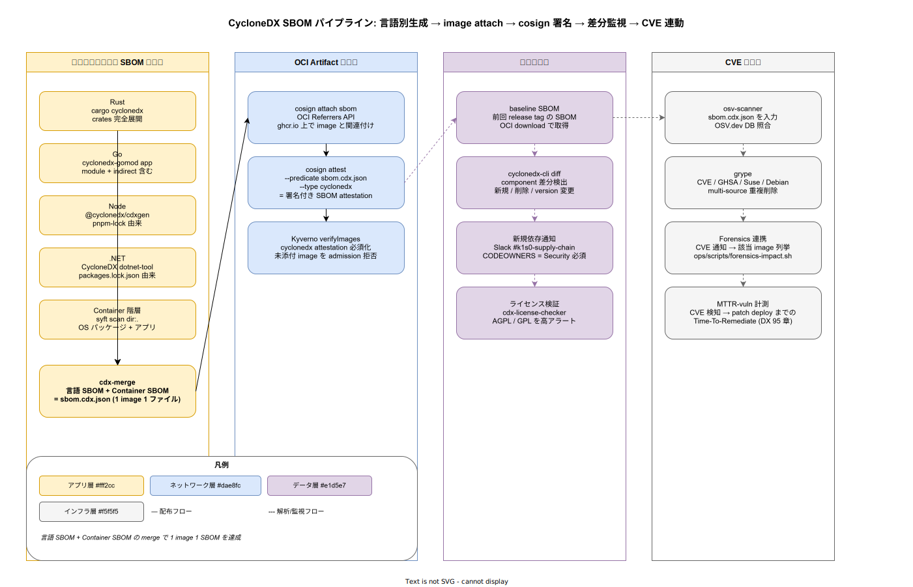

# 01. CycloneDX SBOM 設計

本ファイルは k1s0 の CycloneDX SBOM 生成・配布・差分監視・CVE 連動の物理配置と運用規約を確定する。80 章方針 IMP-SUP-POL-003（CycloneDX SBOM 全 image 添付）と IMP-SUP-POL-006（SBOM 差分監視）を実装段階に落とし込み、Rust / Go / Node / .NET の 4 言語別 SBOM 生成、syft によるコンテナ階層スキャン、cdx-merge による統合、cosign attest 経由の OCI Artifact 配布、cyclonedx-cli diff による差分監視、osv-scanner / grype による CVE 照合までを一貫運用する。



## なぜ「1 image 1 SBOM」を構造的に保証するのか

採用側組織で過去に頻発したのは「SBOM が一部 image にしか添付されておらず、CVE 通知時に該当 image を網羅検索できない」事故である。SBOM 添付率が 99% でも、未添付の 1% が tier1 公開 11 API のいずれかに含まれていれば Forensics は破綻する。本書では Kyverno verifyImages で SBOM attestation 必須化を admission レベルで強制し、未添付 image を本番に到達させない構造を確立する（IMP-SUP-POL-004 と一体運用）。

CycloneDX を SPDX より優先する理由は、依存関係グラフ（dependency tree）と purl（Package URL）の表現が osv-scanner / grype / Dependency-Track などのエコシステムで de-facto となっているため。OSS 配布側が CycloneDX を主形式にしている例が多く、k1s0 自体も配布側に立つことを考えると CycloneDX 統一が最少コストで最大互換性を得られる。

## 言語別 SBOM 生成の責務分離

4 言語ごとに SBOM 生成器を固定する。30 章 CI/CD `_reusable-build.yml` の言語別 job 内で SBOM 生成を実行し、build artifact として container build に引き渡す。

- **Rust**: `cargo cyclonedx --format json --output-cdx sbom-rust.cdx.json`。`Cargo.lock` を厳密に展開し、`[workspace.dependencies]` を含む全 crate を採取
- **Go**: `cyclonedx-gomod app -json -output sbom-go.cdx.json ./cmd/<service>`。`go.mod` の direct + indirect 全 module を採取
- **Node**: `cdxgen -o sbom-node.cdx.json --type js .`。pnpm-lock.yaml を信頼源として採取（npm audit はスキップ、cdxgen のみ）
- **.NET**: `dotnet CycloneDX --json --filename sbom-dotnet.cdx.json src/<project>.csproj`。`packages.lock.json` 由来で transitive を採取

各 SBOM は `metadata.tools` に生成器バージョンを含め、再現性を担保する。生成器のバージョン更新は Renovate（ADR-DEP-001）で月次で追従し、生成出力の差分は cdx-diff CI で検証する（IMP-SUP-SBM-020）。

## Container 階層スキャンと merge

言語 SBOM は「アプリ層の依存」を表現するが、container image 内には OS パッケージ（apt / apk / yum）も同梱される。これを `syft scan dir:/ -o cyclonedx-json=sbom-container.cdx.json` で採取し、`cdx-merge` で言語 SBOM と統合する（IMP-SUP-SBM-021）。

```bash
cyclonedx merge \
  --input-files sbom-rust.cdx.json sbom-go.cdx.json sbom-container.cdx.json \
  --output-file sbom.cdx.json \
  --hierarchical
```

`--hierarchical` で「アプリ → 依存 → OS パッケージ」の親子関係を保持し、Forensics 時に「どの層の依存が影響を受けたか」を機械判定可能にする。merge 失敗（component ID 衝突など）はビルドを fail させ、未統合 SBOM が image に attach されることを構造的に防ぐ。

## OCI Artifact 配布と cosign 署名

merge 済み SBOM は `cosign attach sbom` で image に OCI Referrers API 経由で関連付け、`cosign attest --type cyclonedx` で署名 attestation を発行する（IMP-SUP-SBM-022、10 節 IMP-SUP-COS-010 と整合）。

```bash
cosign attach sbom --sbom sbom.cdx.json \
  ghcr.io/k1s0/t1-decision@${DIGEST}
cosign attest --yes \
  --predicate sbom.cdx.json --type cyclonedx \
  ghcr.io/k1s0/t1-decision@${DIGEST}
```

attestation は in-toto v1 形式で Rekor に記録され、SBOM の改ざん検知が事後的に可能となる。Kyverno ポリシー `verify-sbom-attestation.yaml` は image admission 時に CycloneDX attestation の存在を必須化し、未添付 image を拒否する（IMP-SUP-SBM-023）。

```yaml
apiVersion: kyverno.io/v1
kind: ClusterPolicy
metadata:
  name: verify-sbom-attestation
spec:
  validationFailureAction: Enforce
  rules:
    - name: require-cyclonedx-attestation
      match: {any: [{resources: {kinds: [Pod]}}]}
      verifyImages:
        - imageReferences: ["ghcr.io/k1s0/*"]
          attestations:
            - type: cyclonedx
              attestors:
                - keyless:
                    issuer: https://token.actions.githubusercontent.com
                    subject: "https://github.com/k1s0/k1s0/.github/workflows/release.yml@refs/heads/main"
```

## 差分監視と新規依存通知

リリースごとに前回 release tag の SBOM を OCI download で取得し、`cyclonedx-cli diff` で component 差分を検出する（IMP-SUP-SBM-024）。新規依存 / 削除 / version 変更を分類し、新規依存は Slack `#k1s0-supply-chain` に通知して Security チームのレビューを必須化する。

```bash
cosign download attestation \
  ghcr.io/k1s0/t1-decision:v1.2.3 | \
  jq -r '.payload' | base64 -d | jq '.predicate' > sbom-baseline.cdx.json

cyclonedx-cli diff \
  sbom-baseline.cdx.json sbom.cdx.json \
  --output-format markdown > sbom-diff.md
```

新規依存通知の CODEOWNERS は Security チーム必須とし、PR レビュー必須の CI チェックを追加する。Renovate 経由で自動 PR 化された依存追加は `renovate-bot[bot]` を CODEOWNERS から除外し、人間 reviewer の承認を強制する（IMP-SUP-SBM-025）。

## ライセンス検証と AGPL 警告

CycloneDX の `licenses` フィールドを `cdx-license-checker` で走査し、AGPL / GPL / SSPL / Commons Clause 等の copyleft / SaaS 利用制限ライセンスを高アラートとして検出する（IMP-SUP-SBM-026）。原則 7（IMP-SUP-POL-007、AGPL 分離エビデンス）と連動し、AGPL 検出時は次の判定フローを必須化する。

- AGPL 由来コンポーネントが tier1 公開 API に含まれる: 即 Security レビュー、配布判断見直し
- AGPL 由来コンポーネントが LGTM スタック内: ADR-0003（AGPL 分離アーキテクチャ）の `observability-lgtm` namespace に閉じていることを cyclonedx-cli + kubectl で cross-check
- 不明ライセンス（`NOASSERTION`）: ライセンス特定までデプロイ block

## CVE 連動と Forensics 起点

リリース時の SBOM は CVE 通知時の起点データとして利用する。`osv-scanner --sbom sbom.cdx.json` と `grype sbom:sbom.cdx.json` を 2 重実行し、OSV.dev / GHSA / Suse / Debian など複数 CVE source から重複削除して脆弱性リストを生成する（IMP-SUP-SBM-027）。

CVE 通知（Trivy / GitHub Security Advisory）受信時は `ops/scripts/forensics-impact.sh` が起動し、本パイプラインで生成された全 SBOM から該当 CVE の影響 image を列挙する（40 節 IMP-SUP-FOR-041 と接続）。CVE 検知から patch deploy までの所要時間（MTTR-vuln）は 95 章 DX メトリクスの Time-To-Remediate として計測する。

## SBOM 保管期間と監査

リリース時の SBOM は OCI Registry（ghcr.io）に永続保管する。image GC で image 自体が削除されても SBOM は別 referrer として残し、過去リリースの脆弱性事後監査を可能にする。保管期間は最低 3 年、規制要件次第で 7 年まで延長する（IMP-SUP-SBM-028）。

監査用エクスポートは `ops/scripts/sbom-export-quarterly.sh` で四半期実行し、`ops/audit/sbom-snapshots/YYYY-Qn/` 配下に全 image の SBOM を tar 圧縮で保管する（オフライン監査向け、Object Lock = Compliance mode で WORM 化、IMP-SUP-SBM-029）。

## 対応 IMP-SUP ID

本ファイルで採番する実装 ID は以下とする。

- `IMP-SUP-SBM-020` : 4 言語 SBOM 生成器固定（cargo-cyclonedx / cyclonedx-gomod / cdxgen / dotnet-CycloneDX）
- `IMP-SUP-SBM-021` : syft コンテナ階層スキャンと cdx-merge による統合
- `IMP-SUP-SBM-022` : `cosign attach sbom` + `cosign attest --type cyclonedx` の 2 段配布
- `IMP-SUP-SBM-023` : Kyverno verifyImages による cyclonedx attestation 必須化
- `IMP-SUP-SBM-024` : `cyclonedx-cli diff` による前回 release との component 差分検出
- `IMP-SUP-SBM-025` : 新規依存通知 + Slack `#k1s0-supply-chain` + Security CODEOWNERS 必須
- `IMP-SUP-SBM-026` : AGPL / GPL / SSPL 検出時の判定フロー（tier1 / LGTM / 不明 3 分岐）
- `IMP-SUP-SBM-027` : osv-scanner + grype 2 重 CVE 照合と重複削除
- `IMP-SUP-SBM-028` : OCI Registry での 3 年永続保管（GC 後も SBOM 残存）
- `IMP-SUP-SBM-029` : 四半期 SBOM スナップショットの WORM 化監査保管

## 対応 ADR / DS-SW-COMP / NFR

- ADR: [ADR-CICD-003](../../../02_構想設計/adr/ADR-CICD-003-kyverno.md)（Kyverno）/ [ADR-DEP-001](../../../02_構想設計/adr/ADR-DEP-001-renovate-central.md)（Renovate）/ [ADR-0003](../../../02_構想設計/adr/ADR-0003-agpl-isolation-architecture.md)（AGPL 分離）/ [ADR-SUP-001](../../../02_構想設計/adr/ADR-SUP-001-slsa-staged-adoption.md)（SLSA L2→L3、起票予定）
- DS-SW-COMP: DS-SW-COMP-135（配信系）/ DS-SW-COMP-141（Observability + Security 統合監査）
- NFR: NFR-H-INT-002（SBOM 添付）/ NFR-C-MGMT-003（SBOM 100%）/ NFR-E-SIR-002（脆弱性検知）/ NFR-E-NW-003（AGPL 分離維持）

## 関連章との境界

- [`00_方針/01_サプライチェーン原則.md`](../00_方針/01_サプライチェーン原則.md) の IMP-SUP-POL-003（SBOM 全添付）/ POL-006（差分監視）/ POL-007（AGPL 分離）を本ファイルで物理化
- [`../10_cosign署名/01_cosign_keyless署名.md`](../10_cosign署名/01_cosign_keyless署名.md) の cosign attest と本ファイルの SBOM attestation が一体運用
- [`../40_Forensics_Runbook/01_image_hash逆引き_Forensics.md`](../40_Forensics_Runbook/01_image_hash逆引き_Forensics.md) の Step 1（SBOM 取り出し）が本ファイルの SBOM 配布経路を前提とする
- [`../../40_依存管理設計/`](../../40_依存管理設計/) の Renovate / SBOM 差分監視は本ファイルの diff 監視と統合
- [`../../95_DXメトリクス/`](../../95_DXメトリクス/) の Time-To-Remediate が本ファイルの CVE 検知時刻を起点とする
