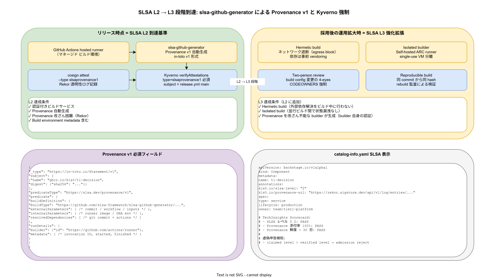

# 01. SLSA プロビナンス設計

本ファイルは k1s0 の SLSA v1.1 プロビナンス生成・配布・検証・段階到達運用の物理配置と運用規約を確定する。80 章方針 IMP-SUP-POL-001（SLSA v1.1 段階到達）を実装段階に落とし込み、リリース時点 L2、リリース時点 L3 の到達基準・slsa-github-generator による Provenance v1 自動生成・cosign attest による署名・Kyverno verifyAttestations による admission 強制・catalog-info.yaml への SLSA レベル明示までを一貫運用する。



## なぜ SLSA を「段階到達」で運用するのか

SLSA v1.1 は Build トラックでビルド完全性を L1（プロビナンス文書化）→ L2（ホスト型ビルド + 改ざん困難なプロビナンス）→ L3（ハーメティック / アイソレーテッドビルド）の 3 段階で規定する。リリース時点 で L3 を強行すると Hermetic build 化に伴うネットワーク遮断 / vendoring 整備 / single-use VM / Two-person review 等の運用負荷が一斉に立ち上がり、本番到達が遅延する。一方で L1 で止まると「ビルド環境の真正性」が保証されず、本番運用が脅威モデル上不適合となる。

本書では リリース時点 L2 を到達基準線とし、リリース時点 L3 を段階追加とする方針（ADR-SUP-001、起票予定）を物理化する。L2 は GitHub Actions hosted runner + slsa-github-generator + cosign attest + Kyverno verifyAttestations の 4 点で達成可能で、運用負荷が現実的範囲に収まる。L3 強行を禁止する規約は「主張する SLSA レベルが実態と乖離すると、第三者監査・取引先 DD で虚偽申告となる」リスクを構造的に防ぐ。

## L2 達成構成（リリース時点）

L2 は次の 4 構成要素で達成する。30 章 CI/CD `_reusable-build.yml` の build job 内で完結し、開発者は Provenance を意識せず使える設計とする。

### GitHub Actions hosted runner（IMP-SUP-SLSA-030）

ビルドは `ubuntu-22.04` hosted runner で実行し、self-hosted runner の混在を禁止する。hosted runner は GitHub が認証する隔離環境であり、SLSA L2 の「認証付きビルドサービス」要件を満たす。self-hosted を使うと「誰のマシンか」「OS パッチ状況」「並行ビルドの分離」が保証できず L1 まで降格する。CI 設定の `runs-on:` は CODEOWNERS で Platform/Build 必須レビューとし、`self-hosted` の混入を構造的に防ぐ。

### slsa-github-generator による Provenance 自動生成（IMP-SUP-SLSA-031）

`slsa-framework/slsa-github-generator` の reusable workflow を呼び出し、Provenance v1（in-toto v1 形式）を自動生成する。次は container image 用の `generator_container_slsa3.yml` 呼出例。

```yaml
provenance:
  needs: [build]
  permissions:
    actions: read
    id-token: write
    packages: write
  uses: slsa-framework/slsa-github-generator/.github/workflows/generator_container_slsa3.yml@v2.1.0
  with:
    image: ghcr.io/k1s0/${{ inputs.image }}
    digest: ${{ needs.build.outputs.digest }}
    registry-username: ${{ github.actor }}
  secrets:
    registry-password: ${{ secrets.GITHUB_TOKEN }}
```

`generator_container_slsa3.yml` は内部で SLSA L3 相当の Provenance を生成するが、k1s0 では L2 として申告する。これは「Provenance 生成器は L3 相当でも、ビルド本体が hosted runner で hermetic ではないため」であり、claimed level と verified level の整合を保つ。

### cosign attest による Provenance 署名（IMP-SUP-SLSA-032）

slsa-github-generator が生成した Provenance JSON を `cosign attest --type slsaprovenance1` で OCI Artifact として attach し、Rekor に記録する。これは 10 節 IMP-SUP-COS-010 の cosign 配布経路と完全に一体運用される。

```bash
cosign attest --yes \
  --predicate provenance.json --type slsaprovenance1 \
  ghcr.io/k1s0/t1-decision@${DIGEST}
```

Rekor 透明性ログに記録されることで、過去の Provenance を改ざん不能に保存できる。インシデント時は `rekor-cli search --sha <digest>` で過去のビルド履歴を完全に復元可能（IMP-SUP-COS-014 の Rekor 検索経路を流用）。

### Kyverno verifyAttestations による admission 強制（IMP-SUP-SLSA-033）

Kyverno ClusterPolicy で `verifyImages.attestations[].type=slsaprovenance1` を必須化し、Provenance が attach されていない image を admission で reject する。subject は `release.yml` の main ブランチに固定し、PR branch ビルドの image が本番に到達することを構造的に防ぐ。

```yaml
apiVersion: kyverno.io/v1
kind: ClusterPolicy
metadata:
  name: verify-slsa-provenance
spec:
  validationFailureAction: Enforce
  rules:
    - name: require-slsa-provenance-attestation
      match: {any: [{resources: {kinds: [Pod]}}]}
      verifyImages:
        - imageReferences: ["ghcr.io/k1s0/*"]
          attestations:
            - type: slsaprovenance1
              attestors:
                - keyless:
                    issuer: https://token.actions.githubusercontent.com
                    subject: "https://github.com/k1s0/k1s0/.github/workflows/release.yml@refs/heads/main"
              conditions:
                - all:
                    - key: "{{ predicate.buildDefinition.buildType }}"
                      operator: Equals
                      value: "https://github.com/slsa-framework/slsa-github-generator/container/v1"
```

`conditions` で buildType をピン留めすることで、別の Provenance 生成器（自作 / 改ざん版）で attestation を捏造する経路を遮断する。

## L3 拡張構成（リリース時点）

L3 は L2 構成に次の 4 要素を追加して達成する。リリース時点 確定後の運用拡大期に段階導入する。

### Hermetic build（IMP-SUP-SLSA-034）

ビルド中の外部依存解決を完全に禁止する。Rust は `cargo vendor`、Go は `go mod vendor`、Node は `pnpm install --frozen-lockfile --offline`、.NET は `nuget restore --packages-directory ./packages` で事前 vendoring する。CI step に `--no-network` 相当の egress block を導入し、build job ネットワーク policy で外部ホストへの DNS / TCP を遮断する。

### Isolated builder（IMP-SUP-SLSA-035）

並行ビルド間の状態漏洩を防ぐため、ARC（Actions Runner Controller）+ single-use VM 構成に移行する。ビルドごとに新しい VM を起動し、終了後に破棄する。GitHub Actions hosted runner は L2 では十分だが、L3 では「並行 ビルド間で sccache / Docker layer cache が共有される」点が isolation 要件に抵触する可能性があるため、ARC 移行で完全分離する。

### Two-person review（IMP-SUP-SLSA-036）

build config（`.github/workflows/`）の変更に CODEOWNERS で Platform/Build + Security の二者承認を強制する。build config 改ざんで Provenance 生成器を差し替える経路を 4-eyes で塞ぐ。`infra/github/branch-protection/` の terraform で `required_reviewers: 2` を強制設定する。

### Reproducible build（IMP-SUP-SLSA-037）

同 commit から同 hash の image が再現できることを定期的に検証する。週次 chron で `tools/repro/rebuild-and-compare.sh` を実行し、過去 7 日のビルドを再実行して digest が一致することを cross-check する。一致しないケースは「ビルド環境の非決定性」「依存先の改ざん」のいずれかとして調査を起動する。

## Provenance v1 必須フィールド

slsa-github-generator が生成する Provenance v1 は in-toto v1 Statement 形式で、最低以下のフィールドを含むことを契約として固定する（IMP-SUP-SLSA-038）。

- `subject[].digest`: image の sha256 digest（tag ではなく digest 必須）
- `predicate.buildDefinition.externalParameters`: trigger commit / workflow file / inputs
- `predicate.buildDefinition.resolvedDependencies`: git submodule + actions の固定 commit
- `predicate.runDetails.builder.id`: builder の URI（hosted runner = `https://github.com/actions/runner`）
- `predicate.runDetails.metadata`: invocation ID / startedOn / finishedOn

これらが欠落した Provenance は Kyverno conditions で reject する。Provenance 構造の検証は CI 内で `slsa-verifier verify-image --provenance-path provenance.json` を実行し、CI 内でも構造異常を捕捉する（IMP-SUP-SLSA-039）。

## catalog-info.yaml への SLSA レベル明示

各サービスの SLSA レベルは `catalog-info.yaml` の `metadata.annotations` に明示し、Backstage の TechInsights Scorecard で可視化する。claimed level と verified level（Kyverno 検証結果）が乖離した場合、Scorecard で FAIL として表示し、deployment は admission で reject する。これは 50 章 IMP-DEV-BSN-* の Backstage 連携と一体運用される。

```yaml
apiVersion: backstage.io/v1alpha1
kind: Component
metadata:
  name: t1-decision
  annotations:
    k1s0.io/slsa-level: "2"
    k1s0.io/provenance-url: "https://rekor.sigstore.dev/api/v1/log/entries/..."
spec:
  type: service
  lifecycle: production
  owner: team:tier1-platform
```

## 対応 IMP-SUP ID

本ファイルで採番する実装 ID は以下とする。

- `IMP-SUP-SLSA-030` : GitHub Actions hosted runner 必須化（self-hosted の混入防止）
- `IMP-SUP-SLSA-031` : slsa-github-generator による Provenance v1 自動生成
- `IMP-SUP-SLSA-032` : cosign attest --type slsaprovenance1 + Rekor 記録
- `IMP-SUP-SLSA-033` : Kyverno verifyAttestations による admission 強制（buildType pin）
- `IMP-SUP-SLSA-034` : リリース時点 L3 = Hermetic build（egress block + 事前 vendoring）
- `IMP-SUP-SLSA-035` : リリース時点 L3 = Isolated builder（ARC + single-use VM）
- `IMP-SUP-SLSA-036` : リリース時点 L3 = Two-person review（build config 4-eyes 強制）
- `IMP-SUP-SLSA-037` : リリース時点 L3 = Reproducible build（週次 rebuild + digest cross-check）
- `IMP-SUP-SLSA-038` : Provenance v1 必須フィールド契約（subject / externalParameters / resolvedDependencies / builder / metadata）
- `IMP-SUP-SLSA-039` : catalog-info.yaml への SLSA レベル明示と Scorecard 連動（claimed vs verified 乖離 reject）

## 対応 ADR / DS-SW-COMP / NFR

- ADR: [ADR-CICD-003](../../../02_構想設計/adr/ADR-CICD-003-kyverno.md)（Kyverno）/ [ADR-BS-001](../../../02_構想設計/adr/ADR-BS-001-backstage.md)（Backstage TechInsights）/ [ADR-SUP-001](../../../02_構想設計/adr/ADR-SUP-001-slsa-staged-adoption.md)（SLSA L2→L3、起票予定）
- DS-SW-COMP: DS-SW-COMP-135（配信系）/ DS-SW-COMP-141（多層防御統括）
- NFR: NFR-H-INT-003（SLSA Provenance）/ NFR-H-INT-001（cosign 署名）/ NFR-G-AC-002（CI/CD アクセス制御）

## 関連章との境界

- [`00_方針/01_サプライチェーン原則.md`](../00_方針/01_サプライチェーン原則.md) の IMP-SUP-POL-001（SLSA 段階到達）の物理配置を本ファイルで固定
- [`../10_cosign署名/01_cosign_keyless署名.md`](../10_cosign署名/01_cosign_keyless署名.md) の cosign attest 経路を本ファイルが流用
- [`../20_CycloneDX_SBOM/01_CycloneDX_SBOM設計.md`](../20_CycloneDX_SBOM/01_CycloneDX_SBOM設計.md) の SBOM 配布と本ファイルの Provenance 配布が並列で運用
- [`../40_Forensics_Runbook/01_image_hash逆引き_Forensics.md`](../40_Forensics_Runbook/01_image_hash逆引き_Forensics.md) の Step 4（Rekor 改ざん検証）が本ファイルの Provenance 履歴を利用
- [`../../50_開発者体験設計/40_Backstage/`](../../50_開発者体験設計/) の TechInsights Scorecard が本ファイルの SLSA 表示を可視化
