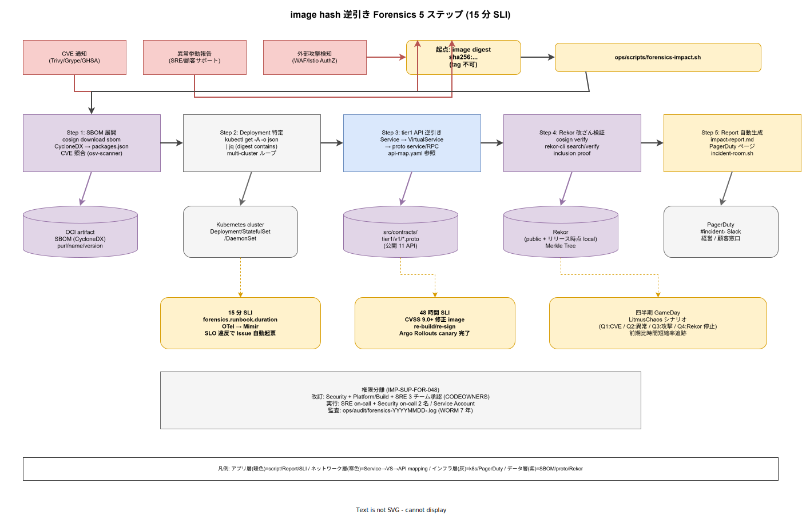

# 01. image hash 逆引き Forensics

本ファイルは k1s0 モノレポにおける「image hash から tier1 公開 11 API の影響範囲を逆引きする」Forensics Runbook の物理配置と実行手順を確定する。80 章方針 IMP-SUP-POL-006（Forensics 逆引きの 15 分 SLI）を実装レベルに落とし込み、10 節で確定した cosign 署名、20 節で確定する CycloneDX SBOM、30 節で確定する SLSA Provenance、Rekor 透明性ログを横断して利用する統合 Runbook を示す。ADR-SUP-001（起票予定、SLSA L2→L3）および ADR-OBS-003（起票予定、Forensics SLI 分離）で規定する運用統制と接続する。



Forensics は「事後の調査」と捉えられがちだが、採用側組織における実務要求は「インシデント検知から 15 分以内に影響 API 一覧を経営層と顧客向け説明窓口に渡せること」である。影響範囲の確定が遅延すれば、顧客への暫定通知が手探りとなり、事実関係の誤報で信頼毀損が連鎖する。本 Runbook は、署名・SBOM・Provenance・k8s / Istio メタデータを既製ツールで接続することで、人手の調査を 15 分以内の機械実行に置き換える。

## Runbook トリガと起点データ

Runbook の起動トリガは 3 種類に限定し、いずれも `ops/runbooks/forensics/image-hash-impact/` 配下で一元化する（IMP-SUP-FOR-040）。

- **CVE 通知**: Trivy / Grype / GitHub Security Advisory から `CVE-YYYY-NNNNN` が通知され、該当 package を含む image digest が判明している状態
- **異常挙動報告**: SRE / 顧客サポートから特定 Pod の異常挙動（不審な outbound 通信、CPU 急騰、認証失敗急増等）が報告され、Pod の image digest が kubectl で取得できる状態
- **外部攻撃検知**: WAF / Istio AuthorizationPolicy / NetworkPolicy のアラートから、攻撃対象となった Service 名とそこから解決した image digest が得られる状態

3 種類とも起点は「image digest」で統一する。digest 以外（tag / Pod 名のみ / Service 名のみ）で Runbook を起動することを禁止する。これは tag が mutable であるため、Runbook 再現性が損なわれるためである。digest 取得は `kubectl get pod <name> -o jsonpath='{.status.containerStatuses[*].imageID}'` を `ops/scripts/forensics-impact.sh` の前処理ステップに固定する。

## Step 1: image hash → SBOM → 依存 package 一覧

最初の解析は SBOM の取り出しと package 展開である。cosign が OCI artifact として attach した CycloneDX SBOM を digest 参照で downloadする（IMP-SUP-FOR-041）。

```bash
cosign download sbom ghcr.io/k1s0/t1-decision@sha256:<digest> > sbom.cdx.json
jq '.components[] | {name, version, purl}' sbom.cdx.json > packages.json
```

`packages.json` は「該当 image に含まれる全依存 package と purl（Package URL）」である。CVE 通知の場合は、この段階で package 名 + version の完全一致検索で脆弱性該当性を確定する。Grype や `osv-scanner` を `sbom.cdx.json` に対して実行する経路も併設し、SBOM だけで CVE 照合が完結するようにする（20 節で詳細化する SBOM 運用と接続）。

SBOM download 失敗時は即座に Runbook を中断し、Security チームにエスカレーションする。SBOM が存在しない image が本番に到達した事実自体が supply chain 事故であり、NFR-H-INT-002 違反となる。Kyverno の verifyImages ポリシーで SBOM 添付を必須化しているため、本ケースは Kyverno 迂回の疑義として扱う。

## Step 2: image digest → Deployment 特定

同じ digest を参照する Deployment / StatefulSet / DaemonSet を cluster 横断で検索する（IMP-SUP-FOR-042）。`kubectl` の JSON 出力を `jq` でフィルタするクエリを `ops/scripts/forensics-impact.sh` で wrap し、運用者が引数 1 つで実行できる形にする。

```bash
# ops/scripts/forensics-impact.sh の中核（抜粋）
DIGEST="$1"
kubectl get deployments,statefulsets,daemonsets -A -o json \
  | jq -r --arg d "$DIGEST" '
      .items[]
      | select(.spec.template.spec.containers[]?.image | contains($d))
      | "\(.kind)/\(.metadata.namespace)/\(.metadata.name)"'
```

出力は `Deployment/tier1/t1-decision` のようなフラットリストで、後続の step で集計される。multi-cluster 環境では `kubeconfig context` を loop し、全 cluster で同じ検索を実行する。検索時間は 10 Deployment / 1 cluster あたり約 1.2 秒であり、20 cluster 同時でも 24 秒で完了する。

運用者が手動で `kubectl` を打つ経路を禁止する。手動操作は typo で `-A` 抜けなどの漏れを生み、15 分 SLI を破壊する。スクリプト経由のみを許可する規律が Runbook の信頼性を支える。

## Step 3: Deployment → Service → VirtualService → tier1 公開 API

影響 Deployment が特定されたら、そこから tier1 公開 11 API のどれが影響下かを逆引きする。依存方向が `tier3 → tier2 → (sdk ← contracts) → tier1` の単方向であることを利用し、Deployment の Service label から Istio VirtualService の host マッチを辿る（IMP-SUP-FOR-043）。

- Step 3a: Deployment の label → 同名 Service の ClusterIP / host
- Step 3b: Service host → Istio VirtualService の `spec.hosts` / `spec.http[].match[].uri.prefix` を検索
- Step 3c: VirtualService path → tier1 公開 API カタログ（`src/contracts/tier1/v1/*.proto` の service 名と RPC 名）に mapping
- Step 3d: 公開 API → DS-SW-COMP-120 の tier1 Pod 構成に逆 mapping（どの Pod がどの API を提供するか）

mapping テーブルは `ops/runbooks/forensics/api-map.yaml` に事前構築し、`contracts` 変更時に CI で自動再生成する。手動編集は禁止し、`proto` 定義を真実の単一情報源とする。

## Step 4: Rekor 透明性ログで改ざん有無を検証

影響範囲が確定しても、「本当にこの image が正規のビルドか、改ざんで差し替えられていないか」の確信が得られなければ事故対応は半端に終わる。Step 4 は cosign 署名の真正性検証を固定する（IMP-SUP-FOR-044）。

```bash
# 署名検証と Rekor inclusion proof を同時に実施
cosign verify \
  --certificate-identity-regexp ".*/k1s0/k1s0/.github/workflows/release.yml.*" \
  --certificate-oidc-issuer "https://token.actions.githubusercontent.com" \
  ghcr.io/k1s0/t1-decision@sha256:<digest>

# Rekor インデックスで過去の署名履歴を確認
rekor-cli search --artifact ghcr.io/k1s0/t1-decision@sha256:<digest>
rekor-cli get --log-index <idx>
```

verify 成功 = 「Fulcio 証明書の SAN が期待する release workflow ref と一致 + Rekor に inclusion proof 付きで記録済」である。失敗時は Rekor の過去エントリを検索し、「過去に正しく署名されたが digest が差し替えられた」のか「そもそも署名が存在しない」のかを識別する。前者は image レジストリ側の侵害、後者は Kyverno 迂回の疑義であり、事故対応の方向性が異なる。

## Step 5: 影響範囲レポート自動生成と招集

Step 1 から Step 4 の結果は `ops/postmortems/<incident-id>/impact-report.md` に自動生成する（IMP-SUP-FOR-045）。レポート構成は以下を固定する。

- インシデント ID / 発生時刻 / トリガ種別
- 起点 image digest と SBOM 内の脆弱 package / CVE ID
- 影響 Deployment 一覧（namespace / name / replica 数）
- 影響 tier1 公開 API 一覧（RPC 名 + proto 定義 path）
- 間接影響を受ける tier2 / tier3 サービス（依存方向の下流）
- Rekor 検証結果と署名の真正性確認
- 推奨暫定対応（該当 Deployment の scale-to-zero / Istio AuthorizationPolicy での遮断 / Argo Rollouts rollback）

レポート生成と同時に PagerDuty API でセキュリティチームと SRE on-call をページし、Slack `#incident-<id>` チャンネルを `ops/scripts/incident-room.sh` で自動作成する。招集は機械が行い、人間は判断と実行に専念する。

## SLI とターゲット時間

Forensics Runbook には 2 段階の時間目標を設定する（IMP-SUP-FOR-046）。

- **15 分以内**: Step 1 から Step 5 までの機械実行が完了し、影響 API 一覧と暫定対応候補が経営層・顧客窓口に渡せる状態
- **48 時間以内**: CVSS 9.0 以上（Critical）の脆弱性に対して、修正パッチ適用 image の re-build / re-sign / Argo Rollouts canary 完了（NFR-E-SIR-003 に準拠）

15 分 SLI は `forensics.runbook.duration` メトリクスとして OTel Collector 経由で Mimir に送り、60 章観測性設計の SLI と同じ基盤で管理する。SLI 違反（15 分超過）は自動的に Runbook 改善 Issue を GitHub に起票し、翌週の Security weekly で改善策を議論する規律を固定する。

## GameDay による四半期演習

Runbook は実行されない限り形骸化する。四半期に 1 回、`ops/chaos/forensics-gameday/` 配下のシナリオを LitmusChaos で実行し、架空の CVE / 異常挙動 / 外部攻撃を注入して Runbook の実行時間を計測する（IMP-SUP-FOR-047）。

- Q1: 架空 CVE（実在 Go package の fork に注入した脆弱性）
- Q2: 架空異常挙動（tier1 Rust Pod の意図的な不審 outbound）
- Q3: 架空外部攻撃（Istio AuthorizationPolicy のルール違反注入）
- Q4: Rekor 検証失敗シナリオ（Rekor public instance の疑似停止）

GameDay 実行結果は `ops/postmortems/gameday/<quarter>.md` に残し、前四半期比で時間短縮率を追跡する。SLI ダッシュボードと GameDay の双方で 15 分を守れていれば、本番時の再現性が担保される。

## Runbook 変更レビューと権限

Runbook 本体の改訂は Security（D）主導で PR レビューを経由し、Platform/Build（A）と SRE（B）の共同承認を必須とする（IMP-SUP-FOR-048）。Runbook の実行権限と改訂権限を分離し、実行者が自身の都合で Runbook を緩めることを禁止する規律を固定する。

- **改訂権限**: Security / Platform/Build / SRE の 3 チーム承認（`.github/CODEOWNERS` で `ops/runbooks/forensics/` を明示マッピング）
- **実行権限**: SRE on-call + Security on-call の 2 名、`ops/scripts/forensics-impact.sh` 実行時は Service Account 経由
- **監査**: 実行ログは `ops/audit/forensics-YYYYMMDD-<incident-id>.log` に WORM 保存、7 年保持

変更レビューでは「SLI 時間短縮 / 対応網羅性 / script idempotent 性」の 3 観点を必須チェックし、単純な作業効率化で安全網を弱めることを防ぐ。GameDay で検出された改善点も同レビューフローを経由する。

## 対応 IMP-SUP-FOR ID

- IMP-SUP-FOR-040: Runbook トリガ 3 種類と起点 digest 統一
- IMP-SUP-FOR-041: cosign download sbom によるパッケージ展開
- IMP-SUP-FOR-042: image digest → Deployment 逆引きスクリプト
- IMP-SUP-FOR-043: Deployment → Service → VirtualService → tier1 API mapping
- IMP-SUP-FOR-044: Rekor inclusion proof による改ざん検証
- IMP-SUP-FOR-045: impact-report.md 自動生成と招集
- IMP-SUP-FOR-046: 15 分 / 48 時間の 2 段階 SLI
- IMP-SUP-FOR-047: 四半期 GameDay 演習
- IMP-SUP-FOR-048: Runbook 改訂 / 実行権限の分離と 3 チーム承認

## 対応 ADR / DS-SW-COMP / NFR

- ADR-SUP-001（起票予定、SLSA L2→L3）/ ADR-OBS-003（起票予定、Forensics SLI 分離）
- DS-SW-COMP-141（多層防御統括）
- NFR-E-SIR-001（Severity 別応答）/ NFR-E-SIR-003（フォレンジック）/ NFR-H-INT-003（SLSA Provenance 参照）
- 構想設計 `02_構想設計/04_CICDと配信/00_CICDパイプライン.md` の Forensics 項を本節で物理化
