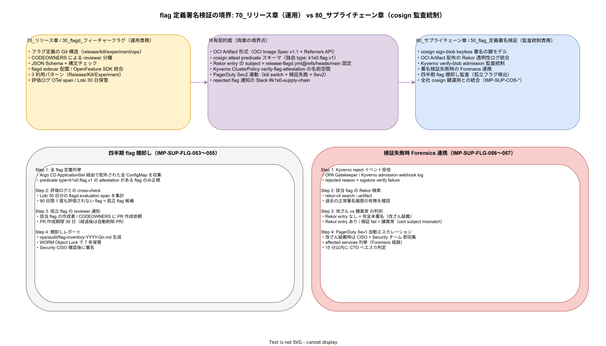

# 01. flag 定義署名検証

本ファイルは k1s0 における flagd フィーチャーフラグ定義（`*.flagd.json`）に対する cosign keyless 署名と Kyverno admission 検証の物理配置を確定する。70 章 30 節 IMP-REL-FFD-030〜039（flagd 運用）が「フラグ定義の正しさ」を担当するのに対し、本節は「フラグ定義の真正性 / 改ざん検知 / 監査証跡」を担当する。両章は OCI Artifact 形式と cosign attest predicate スキーマを共有契約面として接続し、それぞれ運用責務と監査統制責務を独立に進化させる。80 章方針 IMP-SUP-POL-002（cosign keyless 必須）と IMP-SUP-POL-005（Forensics 経路）を flagd 領域に展開した実装である。



## なぜ flag 定義の署名が必要か

採用側組織で過去に発生した障害は「flagd 定義 ConfigMap が手作業で kubectl edit され、release flag の rollout 進捗が逆戻りして 1 時間カナリア観測が無効化された」事例である。flagd は Argo CD 経由で配布される前提だが、cluster-admin 権限が広い環境では admission をすり抜けた直接編集が起こり得る。本節は flagd 定義を「OCI Artifact + cosign 署名 + Kyverno verify-blob admission」の 3 段で固定し、未署名フラグ定義の本番投入を構造的に拒否する。

加えて、flag 棚卸しの監査面でも署名は重要である。署名の存在 = 正規プロセスを通過した flag であり、署名なしフラグの cluster 内残存は「過去の手動運用の痕跡」を示す。四半期棚卸しで未署名フラグを必ず発見・撤去する規律が成立する。

## 鍵モデル: cosign sign-blob keyless

flagd 定義の署名は image 署名とは別系統の `cosign sign-blob` を使う。image でないため manifest の digest 取得経路が異なる。署名フローは IMP-SUP-FLG-050 として固定する。

```bash
# 1. flagd 定義を OCI Artifact として push（github.com/k1s0/k1s0 の release-flagd.yml workflow 内）
oras push ghcr.io/k1s0/flagd-definitions:${VERSION} \
  --artifact-type application/vnd.k1s0.flag.v1+json \
  release.flagd.json:application/json \
  kill.flagd.json:application/json \
  experiment.flagd.json:application/json \
  ops.flagd.json:application/json

# 2. cosign sign-blob keyless で各 flagd 定義に署名
cosign sign-blob --yes --bundle release.flagd.bundle \
  release.flagd.json
# → release.flagd.bundle に証明書 + 署名 + Rekor inclusion proof が同梱

# 3. attestation として OCI Artifact に attach（独自 predicate type）
cosign attest-blob --yes \
  --predicate release.flagd.json \
  --type "k1s0.flag.v1" \
  --bundle release.flagd.attest.bundle \
  ghcr.io/k1s0/flagd-definitions:${VERSION}
```

`--type k1s0.flag.v1` は本プロジェクト固有の predicate type で、Kyverno 側でも同じ type を必須化する。汎用 type（`custom` 等）を使うと他用途の attestation と混同する余地が生まれるため、専用 type を採番する。

## OCI Artifact 配布と Rekor 統合

flagd 定義は ghcr.io 上で OCI Artifact として配布する（IMP-SUP-FLG-051）。10 節 IMP-SUP-COS-010 の「署名対象 5 種類」のうち「flagd 定義ファイル」がこの経路に該当する。署名 bundle と attestation は Rekor の同じ `subject = release-flagd.yml@refs/heads/main` を持ち、Rekor 検索で flagd 定義の全変更履歴を時系列で再構築できる。

```bash
# Rekor 検索: 過去全ての flagd 定義署名履歴を取得
rekor-cli search \
  --pki-format=x509 \
  --public-key-file <(cosign download attestation \
    ghcr.io/k1s0/flagd-definitions:latest | \
    jq -r '.payload' | base64 -d | jq -r '.predicate.cert')
```

Rekor 上の `integratedTime` は証明書有効期限（10 分）内であることが検証され、署名後の改ざんがないことが Merkle Tree により保証される。flagd 定義の Forensics（誰がいつどの commit から署名したか）は Rekor を起点として完結する。

## Kyverno verify-blob admission 統制

Argo CD が flagd 定義 ConfigMap を sync する直前、Kyverno ClusterPolicy `verify-flag-attestation` が admission webhook で attestation の存在と subject pin を検証する（IMP-SUP-FLG-052）。

```yaml
apiVersion: kyverno.io/v1
kind: ClusterPolicy
metadata:
  name: verify-flag-attestation
spec:
  validationFailureAction: Enforce
  background: false
  rules:
    - name: require-flag-signature
      match:
        any:
          - resources:
              kinds: [ConfigMap]
              namespaces: [k1s0-flagd]
              names: ["release.flagd", "kill.flagd", "experiment.flagd", "ops.flagd"]
      verifyImages:
        - imageReferences:
            - "ghcr.io/k1s0/flagd-definitions:*"
          attestations:
            - type: "k1s0.flag.v1"
              attestors:
                - keyless:
                    issuer: https://token.actions.githubusercontent.com
                    subject: "https://github.com/k1s0/k1s0/.github/workflows/release-flagd.yml@refs/heads/main"
                    rekor:
                      url: https://rekor.sigstore.dev
```

`subject` を `release-flagd.yml@refs/heads/main` に固定することで、PR branch から作られた flagd 定義が本番に到達する経路を構造的に塞ぐ。`background: false` で過去の Pod に対する遡及検証を無効化し、admission コストを抑える（過去 Pod は月次 cross-check で別途検証する、IMP-SUP-COS-018 経由）。

## 四半期 flag 棚卸し（IMP-SUP-FLG-053〜055）

flag は「足し算は容易、引き算は困難」な性質を持つ。リリース flag が `true` 固定のまま放置されると死コードが増殖し、kill switch が放置されると次のインシデント時に「これは現在も使われているのか」の判定で時間を失う。本棚卸しは四半期に 1 回、3 ステップで全 flag の生存状況を機械的に検証する。

**Step 1: 全 flag 定義列挙（IMP-SUP-FLG-053）**: Argo CD ApplicationSet 経由で配布された全 ConfigMap を収集し、`predicate type=k1s0.flag.v1` の attestation を持つ flag のみを正規 flag として列挙する。attestation を持たない flag が存在した場合、それは admission ポリシーの抜け穴か手動編集の痕跡を示す高優先インシデントとして起票する。

**Step 2: 評価ログとの cross-check（IMP-SUP-FLG-054）**: Loki に 30 日保管された `flagd.evaluation` span を集計し、各 flag の評価回数を算出する。90 日間 1 度も評価されていない flag を「孤立 flag 候補」として抽出する。閾値 90 日は OpenFeature コミュニティの推奨値で、季節性のあるユースケース（決算期 flag 等）も拾える設定である。

**Step 3: 孤立 flag の reviewer 通知と削除 PR（IMP-SUP-FLG-055）**: 該当 flag の作成者と CODEOWNERS（70 章 30 節で定義された reviewer 分離に従う）に PR 作成依頼を Slack `#k1s0-supply-chain` で通知する。30 日経過後も削除 PR が作成されない場合、`ops/scripts/flag-cleanup.sh` が自動削除 PR を起票し、Security チーム reviewer の承認後にマージする。

棚卸しレポートは `ops/audit/flag-inventory-YYYY-Qn.md` として生成し、WORM Object Lock（Compliance mode）で 7 年保管する。レポートには（a）全 flag リスト、（b）評価回数、（c）削除候補、（d）削除実施履歴を含め、Security CISO の確認後に署名する。

## 検証失敗時 Forensics 連携（IMP-SUP-FLG-056〜057）

Kyverno admission で flag 検証失敗が発生した場合、それは「正規ビルド経路を通らない flag が cluster 投入されようとした」事象であり、攻撃か運用ミスかを 15 分以内に判別する必要がある。本フローは 40 節 Forensics Runbook と直結する。

**Step 1〜3: 改ざん vs 鍵異常 の判別（IMP-SUP-FLG-056）**: Kyverno admission webhook log で reject 理由を取得し、該当 flag の hash を `rekor-cli search --artifact <flag-hash>` で検索する。Rekor entry が見つからない場合は完全未署名（改ざん疑義）、Rekor entry が見つかるが検証失敗の場合は鍵異常（cert subject mismatch、PR branch から署名された等）として分類する。判別結果は `ops/postmortems/<incident-id>/flag-rejection.md` に自動生成する。

**Step 4: PagerDuty Sev1 自動エスカレーション（IMP-SUP-FLG-057）**: 改ざん疑義（Rekor entry なし）の場合は Sev1 として CISO + Security チーム + SRE オンコールを即招集する。鍵異常（Rekor entry あり）の場合は Sev2 として SRE オンコールに留め、24 時間以内に flagd 定義の正規再署名と再 push を行う。改ざん疑義時は 15 分以内に CTO へエスカレーション判定を行い、affected services（影響 tier1 公開 11 API）の列挙を Forensics Runbook 経由で完了する。

70 章 IMP-REL-FFD-039（kill switch 実行時の Sev2）と本節の Sev1/Sev2 は独立した経路を持ち、両者が同時発火した場合の最高優先度は Sev1（改ざん疑義）となる。両イベントの突き合わせは PagerDuty incident relation field で機械的に紐付ける。

## 70 章との境界

70 章 30 節（IMP-REL-FFD-030〜039）が責務を持つもの:

- フラグ定義の Git 構造（release/kill/experiment/ops）と CODEOWNERS 分離
- JSON Schema + 構文チェック（CI 時点）
- flagd sidecar 配置と OpenFeature SDK 統合
- 3 利用パターン（Release/Kill/Experiment）の SDK 呼出規約
- 評価ログ OTel span / Loki 30 日保管

本節（IMP-SUP-FLG-050〜057）が責務を持つもの:

- cosign sign-blob keyless 署名と OCI Artifact + Rekor 配布
- Kyverno verify-blob admission 統制（subject pin）
- 四半期 flag 棚卸し（孤立 flag 検出と自動削除 PR）
- 検証失敗時 Forensics 連携（Sev1/Sev2 振り分け）

両章の境界は OCI Artifact 形式と cosign attest predicate type（`k1s0.flag.v1`）で接合する。70 章は flag 定義の正しさ、80 章は flag 定義の真正性、と読むべき分離である。

## 対応 IMP-SUP ID

本ファイルで採番する実装 ID は以下とする。

- `IMP-SUP-FLG-050` : cosign sign-blob keyless 署名（flagd 定義ファイルへの bundle 化署名）
- `IMP-SUP-FLG-051` : OCI Artifact 配布と Rekor 統合（subject = release-flagd.yml ref 固定）
- `IMP-SUP-FLG-052` : Kyverno ClusterPolicy `verify-flag-attestation` による admission 統制
- `IMP-SUP-FLG-053` : 四半期棚卸し Step 1（全 flag 定義列挙、attestation 必須）
- `IMP-SUP-FLG-054` : 四半期棚卸し Step 2（Loki 評価ログ cross-check、90 日閾値）
- `IMP-SUP-FLG-055` : 四半期棚卸し Step 3（孤立 flag 通知 + 30 日後自動削除 PR）
- `IMP-SUP-FLG-056` : 検証失敗時 Forensics 判別（改ざん vs 鍵異常 の 2 分岐）
- `IMP-SUP-FLG-057` : PagerDuty Sev1/Sev2 自動エスカレーション（CISO + CTO 経路）

## 対応 ADR / DS-SW-COMP / NFR

- ADR: [ADR-CICD-003](../../../02_構想設計/adr/ADR-CICD-003-kyverno.md)（Kyverno）/ [ADR-FM-001](../../../02_構想設計/adr/ADR-FM-001-flagd-openfeature.md)（flagd）/ [ADR-SUP-001](../../../02_構想設計/adr/ADR-SUP-001-slsa-staged-adoption.md)（SLSA L2→L3、起票予定）
- DS-SW-COMP: DS-SW-COMP-141（多層防御統括 / Observability + Security 統合監査）/ DS-SW-COMP-135（配信系インフラ Harbor / Kyverno / cosign）/ DS-SW-COMP-085（OTel Gateway / Mimir、評価ログ Loki cross-check 経路）
- NFR: NFR-C-MGMT-002（リリース統制）/ NFR-E-SIR-002（脆弱性検知）/ NFR-E-CONF-001（構成変更追跡）

## 関連章との境界

- [`../../70_リリース設計/30_flagd_フィーチャーフラグ/01_flagd_フィーチャーフラグ設計.md`](../../70_リリース設計/30_flagd_フィーチャーフラグ/01_flagd_フィーチャーフラグ設計.md) の運用責務（IMP-REL-FFD-030〜039）と本節の監査統制責務を分離
- [`../00_方針/01_サプライチェーン原則.md`](../00_方針/01_サプライチェーン原則.md) の IMP-SUP-POL-002 / 005 を flagd 領域に展開
- [`../10_cosign署名/01_cosign_keyless署名.md`](../10_cosign署名/01_cosign_keyless署名.md) の IMP-SUP-COS-010 で挙げた flagd 定義の署名経路を本節で物理化
- [`../40_Forensics_Runbook/01_image_hash逆引き_Forensics.md`](../40_Forensics_Runbook/01_image_hash逆引き_Forensics.md) の検証失敗フローと FLG-056〜057 が連動
- [`../../60_観測性設計/`](../../60_観測性設計/) の Loki 30 日保管が FLG-054 の評価ログ cross-check に必須
