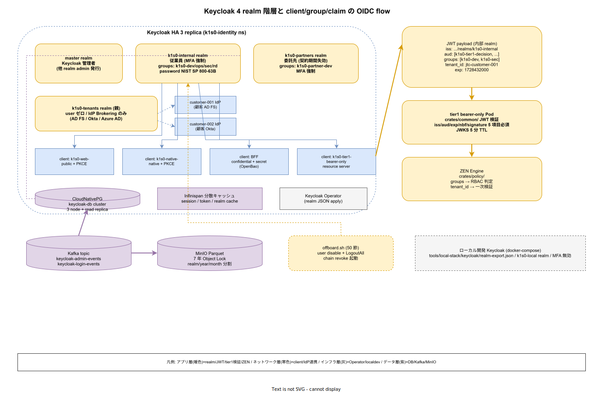

# 01. Keycloak realm 設計

本ファイルは k1s0 モノレポにおける Keycloak の realm 階層、client 定義、group claim と tenant_id 連動、MFA ポリシーを実装フェーズ確定版として示す。85 章方針 IMP-SEC-POL-001（Keycloak 単一 IdP 集約）および IMP-SEC-POL-003（group claim と tenant 連動）を物理配置レベルに落とし込み、ADR-SEC-001 で選定した Keycloak の運用形態を `infra/security/keycloak/` 配下に確定させる。人間 ID は Keycloak に一元化し、ワークロード ID（SPIRE / SPIFFE）は 20 節に、シークレット（OpenBao）は 30 節に、証明書（cert-manager）は 40 節に分離する。



Keycloak を採用する動機は「退職・委託終了時の 1 アカウント無効化で全経路を revoke できる構造」を JTC 運用の前提とする点にある。各システムが独自の認証を持てば、退職時の revoke 漏れが事故の種になる。本節は realm 分割の粒度、client の種別、group claim に載せる情報、MFA の強制範囲を固定し、後続 50 節の退職時 revoke 手順と連動する単一の真実の出所（Single Source of Truth）を構築する。

## 4 realm 構造と分離理由

k1s0 は 4 realm で構成する（IMP-SEC-KC-010）。1 realm に全 user を入れる簡素化案もあったが、JTC の契約関係（従業員 / 委託先 / 顧客テナント）を 1 realm に混ぜると user 属性と password policy が共通化されてしまい、顧客テナント用の弱いポリシーが従業員にも適用される構造リスクが生じる。realm 分割で policy を独立させる。

- **`master` realm**: Keycloak 管理者専用。一般 user はゼロ。Keycloak 自体の admin UI アクセスと、他 realm 管理者の user 発行にのみ使用
- **`k1s0-internal`**: 従業員（社員）向け。MFA 強制、password policy 最厳格、group claim に `k1s0-dev` / `k1s0-ops` / `k1s0-sec` / `k1s0-rd` の 4 種
- **`k1s0-partners`**: 委託先（業務委託 / パートナー企業の担当者）向け。契約期間で自動失効（expiration attribute）、MFA 強制、group claim は限定（`k1s0-partner-dev` のみ）
- **`k1s0-tenants`**: 顧客テナント向け（親 realm）。各 JTC 顧客が sub-realm として Identity Provider Brokering で連携。realm 自体に user は持たず、顧客 IdP（AD FS / Okta / Azure AD）から JWT を受け取るゲートウェイ realm として動作

`k1s0-tenants` の設計は「顧客の ID 基盤を直接参照せず、必ず k1s0-tenants を経由させる」運用規律を強制する。顧客の IdP が停止しても k1s0-tenants のブローカー機能が最後の砦となる。新規 JTC 顧客オンボーディング時は k1s0-tenants に IdP エントリを追加するだけで、他 realm の設定は一切変更しない（IMP-SEC-KC-011）。

## client 4 種類と認証フロー

client は tier / 用途で 4 種類に分離する（IMP-SEC-KC-012）。confidential / public / bearer-only の区別を厳密にし、public client で secret を保持しないことを構造で保証する。

- **tier3 Web（public client + PKCE）**: `src/tier3/web/` の SPA 向け。client secret を持たず、Authorization Code Flow + PKCE で token 取得。client id は `k1s0-web-<env>`
- **tier3 Native（native client + PKCE）**: `src/tier3/native/` の .NET MAUI 向け。custom URI scheme で redirect し、PKCE 必須。client id は `k1s0-native-<env>`
- **BFF（confidential client）**: `src/tier3/bff/` の Go BFF 向け。client secret を OpenBao（30 節）から取得。Authorization Code Flow + client secret、refresh token を BFF 側で保持し、tier3 Web から見えない
- **tier1 API（bearer-only resource server）**: `src/tier1/` の各 Pod。client secret を持たず、受信した JWT の `iss` / `aud` / `exp` / `signature` を検証するだけの resource server。client id は `k1s0-tier1-<pod>` で Pod ごとに発行

bearer-only の根拠は、tier1 が自ら token を要求することが設計上ないためである。tier2 / tier3 が token を持って呼び出す片方向呼出しに徹することで、token 管理責任を前段に集中できる。各 client 定義は `infra/security/keycloak/realms/*.json` に JSON として commit し、Keycloak Operator 経由で apply する（GitOps）。手動 UI 編集を禁止する規律を IMP-SEC-KC-013 として固定する。

## group claim と tenant_id の JWT マッピング

Keycloak は group メンバーシップと user attribute を JWT claim にマップできる。k1s0 では以下の固定マッピングを IMP-SEC-KC-014 として定義する。

```json
// JWT payload の抜粋（k1s0-internal realm の user）
{
  "iss": "https://keycloak.k1s0.local/realms/k1s0-internal",
  "sub": "a1b2c3d4-...",
  "aud": ["k1s0-tier1-decision", "k1s0-tier1-audit"],
  "exp": 1728432000,
  "groups": ["k1s0-dev", "k1s0-sec"],
  "tenant_id": "jtc-customer-001",
  "employee_type": "full-time"
}
```

`groups` claim は RBAC の一次情報源であり、tier1 Rust Pod の `crates/policy/` で ZEN Engine のルール評価に入力される。NFR-E-AC-003 が要求する tenant_id 検証は、同じ JWT の `tenant_id` claim を tier1 の全 Pod で一次検証することで実装する。tenant_id を JWT に埋込む設計により、リクエストパス / ヘッダ別経路での検証バイパスを構造的に防ぐ。

group 定義と user attribute の編集は Keycloak admin UI で手作業せず、`infra/security/keycloak/groups.yaml` と user-federation を Terraform Provider for Keycloak（`deploy/opentofu/keycloak/`）で宣言的に管理する。user 追加 / group 変更は PR レビューを経由し、`ops/audit/keycloak-changes-<date>.log` に WORM 保存する。

## MFA と password policy

MFA は realm / 役割別に強制レベルを変える（IMP-SEC-KC-015）。一律最強のポリシーは utility を下げて迂回行動を誘発するため、役割ベースで段階化する。

- **Sec 管理者（`k1s0-sec` group）**: TOTP + WebAuthn の 2 要素同時必須。password 失効 90 日、履歴 24 世代、辞書攻撃検出
- **Ops 管理者（`k1s0-ops` group）**: TOTP 必須、WebAuthn は Phase 1a 以降で推奨 → Phase 1b で必須
- **一般開発者（`k1s0-dev` / `k1s0-rd`）**: TOTP 推奨（未設定でもログイン可だが、初回ログイン時に UI で強制誘導）。Phase 1a から必須化
- **委託先（`k1s0-partners`）**: TOTP 必須、WebAuthn は顧客 PC の FIDO2 デバイス配布状況に応じて段階導入

password policy は NIST SP 800-63B Rev.4 に準拠（IMP-SEC-KC-016）。最小 14 文字、最大 128 文字、特殊文字強制は廃止、既知 breach password リスト（HIBP）との照合を必須化する。password 履歴は 24 世代、固定ローテーション期間は撤廃し、breach 検知時のみ強制更新する方針を採用する。

## SAML は顧客 SSO 連携限定

内部認証は OIDC に統一し、SAML は `k1s0-tenants` realm の Identity Provider Brokering で顧客の AD FS / Okta / Azure AD と連携する経路にのみ使用する（IMP-SEC-KC-017）。SAML を内部に持ち込むと XML 署名検証の複雑性が攻撃面を広げるため、境界を明確化する。

顧客 IdP との SAML 連携は realm 単位で個別設定し、`infra/security/keycloak/tenants/<customer-id>.json` に宣言的に保存する。顧客追加時の operation は PR 1 本に収まり、反映は Keycloak Operator の reconciliation で自動化される。

## HA 構成と Phase 段階

Keycloak は `k1s0-identity` namespace に HA 3 replica で展開する（IMP-SEC-KC-018）。Infinispan 分散キャッシュを有効化し、session / login token / realm cache を replica 間で共有する。DB は CloudNativePG（ADR-DATA-001）の `keycloak-db` cluster を使用し、read-replica を別ゾーンに配置する。

- **Phase 0**: 3 replica / CloudNativePG 3 node / TLS は Istio Ambient mTLS（ADR-0001）で自動終端
- **Phase 1a**: multi-region read-replica（東京 / 大阪）、realm 単位の分散書込を検証
- **Phase 1b**: active-active で RPO/RTO を更新、JTC 顧客のオンプレ k8s に Keycloak federation を展開

Keycloak のバージョン追従は Renovate（40 章連動）で検知し、quarterly release cycle を Platform/Build（A）と Security（D）の共同承認で更新する。major version 跨ぎは staging で 1 週間以上の soak test を経てから prod に到達させる規律を固定する。

## tier1 API との JWT 検証連動

tier1 公開 11 API は bearer-only resource server として、受信した JWT を自 Pod 内で検証する（IMP-SEC-KC-020）。検証ロジックは tier1 Rust の `crates/common/` に共通化し、Go ファサード層（`src/tier1/go/`）と自作 Rust 領域（`src/tier1/rust/`）で同一セマンティクスを保つ。

- **公開鍵取得**: Keycloak の JWKS エンドポイント（`/realms/<realm>/protocol/openid-connect/certs`）から取得、5 分 TTL でキャッシュ
- **検証項目**: `iss` / `aud` / `exp` / `nbf` / 署名の 5 項目を全て必須検証、1 つでも欠落すれば 401
- **group claim 参照**: 受信 JWT の `groups` を `crates/policy/` の ZEN Engine 入力として渡し、RBAC 判定
- **tenant_id 参照**: 受信 JWT の `tenant_id` を全 Pod で一次検証、ヘッダ経由の別経路 tenant 指定を禁止

この検証を tier1 で一元化することで、tier2 / tier3 の実装ごとに検証ロジックが散らばる事態を防ぐ。tier1 を通過した時点で JWT の真正性と tenant 整合が保証される契約を守る設計である。

## 退職時連動（50 節へのブリッジ）

Keycloak の user disable は退職時 revoke の起点である。disable 操作が発火するイベントを OpenBao / cert-manager / Istio JWTRule / SPIRE に伝播させる経路は 50 節で詳述するが、本節で Keycloak 側の責務を以下に固定する（IMP-SEC-KC-019）。

- disable は admin UI ではなく `ops/scripts/offboard.sh <username>` 経由で実行（原子性保証）
- disable 直後に Keycloak の全 session を `LogoutAll` API で強制終了
- disable イベントは Keycloak Admin Event Listener で Kafka に publish し、下流 consumer が chain revoke を発火
- user 削除（hard delete）は 90 日の grace period 後、監査証跡を WORM に移してから実行

## 監査ログとイベント永続化

Keycloak の admin event（user 作成 / disable / group 変更）と login event（成功 / 失敗）は 7 年保持を NFR-E-MON-001 で要求される。Keycloak 内部 DB に全保存すると CloudNativePG の容量が肥大化するため、Kafka 経由で長期 storage に外出しする設計を IMP-SEC-KC-021 として固定する。

- **Event Listener SPI**: Keycloak の `org.keycloak.events.EventListenerProviderFactory` を Kafka publisher として実装
- **Kafka topic**: `keycloak-admin-events` / `keycloak-login-events` の 2 topic
- **consumer**: MinIO に Parquet 形式で書込、partition key は `realm` / `year` / `month`
- **WORM 保護**: MinIO の Object Lock Compliance モードで 7 年保持
- **検索**: DuckDB + Parquet で ad-hoc クエリ、監査時の証跡提出に使用

Keycloak 内部 DB には 90 日分のみ保持し、それ以降は定期削除する。長期保存は Parquet 側に責務を移すことで、Keycloak のクエリ性能劣化を防ぐ。

## ローカル開発と docker-compose

開発者の手元で tier1 / tier2 を起動する際、本番 Keycloak には到達させない。`tools/local-stack/keycloak/` 配下に docker-compose ベースの開発用 Keycloak を配置し、内蔵の開発 realm（`k1s0-local`）を自動起動する（IMP-SEC-KC-022）。

- **起動**: `make local-keycloak-up` で docker-compose、5 秒で起動完了
- **realm 定義**: `tools/local-stack/keycloak/realm-export.json` を commit、本番と同構造で縮約
- **sample user**: `dev-user` / `dev-admin` の 2 名、固定 password（非機密）
- **tier1 接続**: `KEYCLOAK_URL=http://localhost:8080` を .env で設定、本番 URL の混入を禁止
- **MFA**: ローカルは無効化、開発 UX 優先

ローカル Keycloak の設定変更は `realm-export.json` の PR で行い、手動 UI 編集で隠れた差分が生まれることを防ぐ。開発 UX を妥協せず、かつ本番ポリシーとの整合を GitOps で保つ設計である。

## 対応 IMP-SEC-KC ID

- IMP-SEC-KC-010: 4 realm（master / internal / partners / tenants）構造固定
- IMP-SEC-KC-011: `k1s0-tenants` を親 realm とした JTC 顧客 IdP Brokering
- IMP-SEC-KC-012: client 4 種類（Web / Native / BFF / tier1 API）の粒度と認証フロー
- IMP-SEC-KC-013: realm / client 定義は JSON commit + Operator apply（UI 編集禁止）
- IMP-SEC-KC-014: JWT に groups と tenant_id を一次埋込、tier1 で必須検証
- IMP-SEC-KC-015: 役割別 MFA 段階化（Sec 強制 / 開発者推奨→必須）
- IMP-SEC-KC-016: NIST SP 800-63B 準拠、HIBP 照合、固定ローテーション撤廃
- IMP-SEC-KC-017: SAML は顧客 SSO 連携限定、内部は OIDC 統一
- IMP-SEC-KC-018: HA 3 replica + CloudNativePG、Phase 段階で multi-region 拡張
- IMP-SEC-KC-019: user disable の原子性と Kafka 経由 chain revoke 起動
- IMP-SEC-KC-020: tier1 bearer-only での JWT 検証 5 項目必須化
- IMP-SEC-KC-021: Kafka 経由の Keycloak event 外出しと Parquet 長期保持
- IMP-SEC-KC-022: ローカル開発用 Keycloak の docker-compose 配置

## 対応 ADR / DS-SW-COMP / NFR

- [ADR-SEC-001](../../../02_構想設計/adr/ADR-SEC-001-keycloak.md)（Keycloak）/ ADR-DATA-001（CloudNativePG）
- DS-SW-COMP-006（SECRET 運用形態）/ DS-SW-COMP-141（多層防御統括）
- NFR-E-AC-001（JWT 強制）/ NFR-E-AC-003（tenant_id 検証）/ NFR-E-AC-005（MFA）/ NFR-G-AC-001（最小権限）
- 要件定義 `03_要件定義/00_要件定義方針/` のステークホルダ定義と連動
