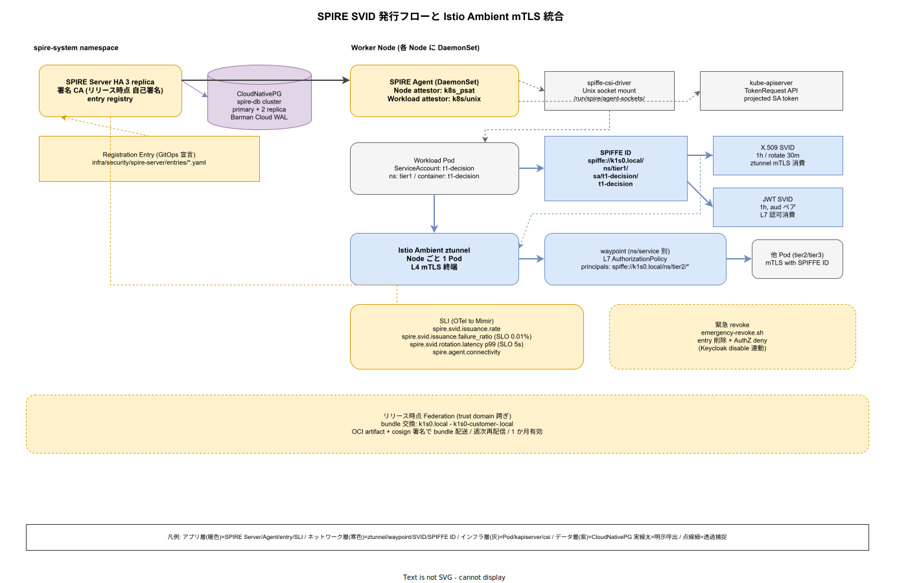

# 01. SPIRE SPIFFE 設計

本ファイルは k1s0 モノレポにおける SPIRE Server / Agent の物理配置、SPIFFE ID 命名規約、SVID 発行ポリシー、Istio Ambient mTLS との統合経路を実装段階確定版として示す。85 章方針 IMP-SEC-POL-002（ワークロード ID 分離）を物理レベルに落とし込み、ADR-SEC-003（SPIFFE/SPIRE 採択）および ADR-0001（Istio Ambient）の帰結を `infra/security/spire-server/` と `infra/security/spire-agent/` に確定させる。人間 ID（10 節 Keycloak）とは完全に分離され、ワークロード間の mTLS 証明書と L7 認可 JWT を自動発行する。



SPIRE を採用する動機は「コンテナエスケープされても横移動を封じ込められる構造」を k8s クラスタ内に常設することにある。長寿命の Service Account token や共有証明書を Pod に配布する運用は、1 Pod の侵害で他 Pod の権限まで拡散する。SVID は 1 時間の短寿命であり、発行元の attestation（k8s PSAT）を毎回再検証するため、侵害されても攻撃窓が時間単位で閉じる。本節はこの構造を リリース時点 から本番運用に乗せる配置を固定する。

## SPIRE Server 配置と HA

SPIRE Server は `infra/security/spire-server/` 配下に HA 3 replica で展開する（IMP-SEC-SP-020）。単一障害点となることを避け、かつ SVID 発行の latency を抑えるため、3 replica を別ゾーンに分散する。

- **namespace**: `spire-system`
- **replica 数**: 3（リリース時点 から本番）
- **DataStore**: CloudNativePG（ADR-DATA-001）の `spire-db` cluster
- **署名 CA**: 自己署名（リリース時点）→ リリース時点 で intermediate CA として外部 root CA から派生
- **TLS**: Istio Ambient ztunnel で終端される mTLS、Server→DB は CloudNativePG 側の TLS

Server の設定は `infra/security/spire-server/config/server.conf` に Helm values から rendering される。ログ / メトリクスは OTel Collector（60 章）に送り、60 章 SLI と同じ基盤で可視化する。Server 設定変更は Security（D）主導で PR レビューを経由し、`ops/audit/spire-server-changes-<date>.log` に WORM 保存する。

## SPIRE Agent と Node 認証

SPIRE Agent は全 Worker Node に DaemonSet で配置する（IMP-SEC-SP-021）。各 Pod からは Unix domain socket（`/run/spire/agent-sockets/spire-agent.sock`）経由で Workload API に接続し、SVID を受け取る。Node 認証（Agent が Server に対して「この Node は正規だ」と主張する経路）は k8s_psat（Projected Service Account Token）を使用する。

- **Node attestor**: k8s_psat（Projected Service Account Token、kube-apiserver の TokenRequest API 経由）
- **Workload attestor**: k8s / unix（Pod ラベル + UID / GID + namespace の多重検証）
- **socket mount**: CSI Driver（`spiffe-csi-driver`）で Pod に自動マウント、hostPath 直接マウントは禁止

Agent の設定は `infra/security/spire-agent/config/agent.conf`、Helm values は `deploy/charts/spire/values.yaml` に commit する。DaemonSet のロールアウトは Node 単位で slow rollout（PodDisruptionBudget で常に 1 Node 分ずつ更新）とし、cluster 全域の SVID 発行停止を防ぐ（IMP-SEC-SP-022）。

## SPIFFE ID 命名規約

SPIFFE ID は SVID に埋め込まれるワークロード識別子である。命名が散乱すると AuthorizationPolicy の記述が不可能になるため、k1s0 では以下の命名規約を IMP-SEC-SP-023 として固定する。

```text
spiffe://k1s0.local/ns/<namespace>/sa/<service-account>/<workload>

# 例
spiffe://k1s0.local/ns/tier1/sa/t1-decision/t1-decision
spiffe://k1s0.local/ns/tier2/sa/users-service/users-service
spiffe://k1s0.local/ns/tier3/sa/web-bff/web-bff-api
```

- **trust domain**: `k1s0.local`（リリース時点 単一）。リリース時点 で 採用側組織の顧客オンプレと federation する際に `k1s0-customer-<id>.local` を追加
- **namespace**: k8s namespace 名をそのまま反映
- **service-account**: k8s ServiceAccount 名
- **workload**: Pod の container 名（1 Pod 1 container 前提、2 container Pod は workload 名で区別）

Registration Entry は `infra/security/spire-server/entries/*.yaml` に GitOps で宣言的に管理し、手動 CLI 登録を禁止する（IMP-SEC-SP-024）。workload 追加 / 削除は PR レビューを経由し、`spire-server entry create` は GitOps reconciler（`spire-controller-manager`）のみに許可する。

## SVID 発行: X.509 と JWT

SVID は 2 種類を並行発行する（IMP-SEC-SP-025）。用途の分離で、mTLS と L7 認可の責務を混ぜない。

- **X.509 SVID**: Istio Ambient ztunnel / waypoint が mTLS 証明書として消費。有効期限 1 時間、更新間隔 30 分（残 50% 時点で rotation）
- **JWT SVID**: L7 認可で tier1 / tier2 アプリが API 間認証として消費。有効期限 1 時間、aud claim でターゲット workload を限定

1 時間の有効期限は「侵害されても 1 時間で自動失効」を構造的に担保する。長寿命 SVID の設定変更は ADR-SEC-003 改訂を要する。rotation の 30 分前倒しは、時計ドリフトやネットワーク断での SVID 切断を防ぐバッファである（IMP-SEC-SP-026）。

JWT SVID の aud は呼出し元 / 呼出し先の SPIFFE ID をペアで指定し、トランジット transit 攻撃（JWT の付け替え）を構造的に防ぐ。aud 検証は tier1 Rust Pod の `crates/policy/` で AuthorizationPolicy と組合わせて強制する。

## Istio Ambient mTLS 統合

Istio Ambient は ztunnel（Node レベル L4 proxy）と waypoint（namespace / service レベル L7 proxy）の 2 層構成で mTLS を提供する。SPIRE の X.509 SVID は ztunnel の client 証明書 / server 証明書として消費される（IMP-SEC-SP-027）。サイドカーモードと異なり Pod ごとの Envoy 注入が不要で、Pod 起動遅延と memory footprint が削減される。

- **ztunnel**: Node ごとに 1 Pod、SPIRE Agent の Workload API から SVID を取得し、Pod 間通信の mTLS 終端
- **waypoint**: namespace / service ごとに選択配置、L7 AuthorizationPolicy 適用時のみ経由
- **mesh 外通信**: `NetworkPolicy` で egress を明示許可した接続先のみ、NAT 経由で外部接続
- **SPIFFE ID 検証**: waypoint の AuthorizationPolicy で `principals: ["spiffe://k1s0.local/ns/tier2/*"]` 形式で許可

統合テストは `tests/integration/istio-ambient/` で実施し、SPIRE Server 停止時の SVID rotation 失敗ケースを含む（IMP-SEC-SP-028）。Server 停止から 45 分（rotation buffer + 猶予）でサービス影響が出始めるため、Server HA 3 replica と定期的な failover 演習で信頼性を担保する。

## Federation（リリース時点）

採用側組織の顧客オンプレに k1s0 のサブシステムを deploy するケース（リリース時点）では、顧客側 SPIRE Server と k1s0 中央 SPIRE Server の相互信頼を Federation で構築する（IMP-SEC-SP-029）。trust domain を跨いだ SVID 検証が可能になり、k1s0 中央から顧客側 workload に mTLS で到達できる。

- **bundle 交換**: 両 Server が自己の trust bundle（公開鍵 + 証明書チェーン）を相手に配信
- **配送経路**: OCI artifact として cosign 署名済 bundle を配送（ADR-SUP-001）
- **更新頻度**: 週次で自動再配信、bundle expiry は 1 か月

Federation は リリース時点 の重要決定であり、運用負荷が跳ねる。採用初期 は単一 trust domain で閉じる。

## 可観測性と SLI

SPIRE Server の発行レート / 失敗率 / rotation latency は OTel Collector 経由で Mimir に送り、SLI 化する（IMP-SEC-SP-030）。

- **`spire.svid.issuance.rate`**: 単位時間あたり SVID 発行数、上限は HPA トリガ
- **`spire.svid.issuance.failure_ratio`**: 発行失敗率、SLO は 0.01% 未満
- **`spire.svid.rotation.latency`**: rotation 要求〜完了の p99、SLO は 5 秒未満
- **`spire.agent.connectivity`**: 各 Agent の Server 接続状態、Agent 停止検知は 1 分以内

SLI 違反は PagerDuty に即時ページし、on-call が `ops/runbooks/spire-issuance-failure/` で初動対応する。

## 緊急 revoke 連動

ワークロード侵害疑義時は Registration Entry を即座に削除し、SVID 発行を停止する。`ops/scripts/emergency-revoke.sh <spiffe-id>` で Keycloak disable と連動させ、人間 ID とワークロード ID の双方を単一 script で revoke できる（IMP-SEC-SP-031）。詳細は 50 節で詳述するが、本節では「SPIRE 側の revoke は entry 削除が起点」であることを固定する。

Entry 削除後も既発行 SVID は残有効期限（最大 1 時間）まで使用可能である。即座切断が必要な場合は、Istio AuthorizationPolicy で該当 SPIFFE ID を全面 deny する経路を併設する（IMP-SEC-SP-032）。revoke の完全性は 50 節の GameDay で計測する。

## CloudNativePG DataStore の可用性

SPIRE Server の DataStore は CloudNativePG の `spire-db` cluster に依存する。DB 停止は SVID 発行停止を意味し、新規 Pod 起動と既存 Pod の rotation が両方失敗する。DataStore 可用性を SPIRE 自体の可用性要求から引き上げる（IMP-SEC-SP-033）。

- **replica 構成**: primary 1 + read replica 2（別ゾーン）、synchronous_standby 1 必須
- **backup**: Barman Cloud で MinIO に 1 時間間隔の WAL archive、PITR を 7 日遡及可
- **failover**: primary 障害時の switchover は 30 秒以内、SPIRE Server 側の再接続は 1 分以内
- **monitoring**: `cloudnativepg.cluster_status` を Mimir で監視、degraded 状態は即時 PagerDuty

SPIRE Server は接続 pool を保持し、DB 短時間停止（<30 秒）ではキャッシュ済 CA で rotation を継続できる。長時間停止時は rotation 失敗が積み上がり、45 分後にサービス影響となる閾値を Runbook に明記する。

## ztunnel の mTLS 終端と latency

ztunnel は Node ごとに 1 Pod で動作し、同 Node 上の全 Pod の L4 mTLS を終端する。追加の hop が生まれるため、latency 影響を リリース時点 段階で計測する（IMP-SEC-SP-034）。

- **baseline latency**: mTLS なし同 Node 内通信の p99
- **ztunnel 経由 latency**: 同 Node 経由の mTLS p99、上乗せ許容範囲 0.5ms
- **cross-Node**: 異 Node 通信は両 Node の ztunnel を経由、上乗せ 1ms 以内
- **waypoint 経由**: L7 AuthorizationPolicy 適用時のみ、p99 上乗せ 2ms 以内

tier1 公開 11 API の p99 SLO（NFR-B-\*）は mTLS オーバーヘッドを含めて達成する設計とし、waypoint の配置判断は「L7 認可が必要な Service のみ」に限定する規律を IMP-SEC-SP-035 として固定する。

## 対応 IMP-SEC-SP ID

- IMP-SEC-SP-020: SPIRE Server HA 3 replica + CloudNativePG
- IMP-SEC-SP-021: SPIRE Agent DaemonSet + k8s_psat Node 認証
- IMP-SEC-SP-022: Agent slow rollout 規律
- IMP-SEC-SP-023: SPIFFE ID 命名規約（trust domain + ns + sa + workload）
- IMP-SEC-SP-024: Registration Entry は GitOps 宣言のみ
- IMP-SEC-SP-025: X.509 / JWT SVID 並行発行と用途分離
- IMP-SEC-SP-026: SVID 有効期限 1 時間、rotation 30 分前倒し
- IMP-SEC-SP-027: Istio Ambient ztunnel / waypoint への SVID 供給
- IMP-SEC-SP-028: SPIRE Server 停止時の SVID rotation 失敗テスト
- IMP-SEC-SP-029: リリース時点 Federation による trust domain 跨ぎ
- IMP-SEC-SP-030: SVID 発行レート / 失敗率 / rotation latency の SLI 化
- IMP-SEC-SP-031: 緊急 revoke の SPIRE entry 削除経路
- IMP-SEC-SP-032: Istio AuthorizationPolicy での即時 deny 併設
- IMP-SEC-SP-033: CloudNativePG DataStore 可用性要求の SPIRE 連動
- IMP-SEC-SP-034: ztunnel / waypoint 経由 mTLS の latency 基準
- IMP-SEC-SP-035: waypoint は L7 認可が必要な Service のみ配置

## 対応 ADR / DS-SW-COMP / NFR

- [ADR-SEC-003](../../../02_構想設計/adr/ADR-SEC-003-spiffe-spire.md)（SPIFFE/SPIRE）/ [ADR-0001](../../../02_構想設計/adr/ADR-0001-istio-ambient-vs-sidecar.md)（Istio Ambient）/ ADR-DATA-001（CloudNativePG）
- DS-SW-COMP-124（サイドカー統合）/ DS-SW-COMP-141（多層防御統括）
- NFR-E-AC-004（Secret 最小権限）/ NFR-E-ENC-002（転送暗号化）/ NFR-E-MON-001（認証ログ）
