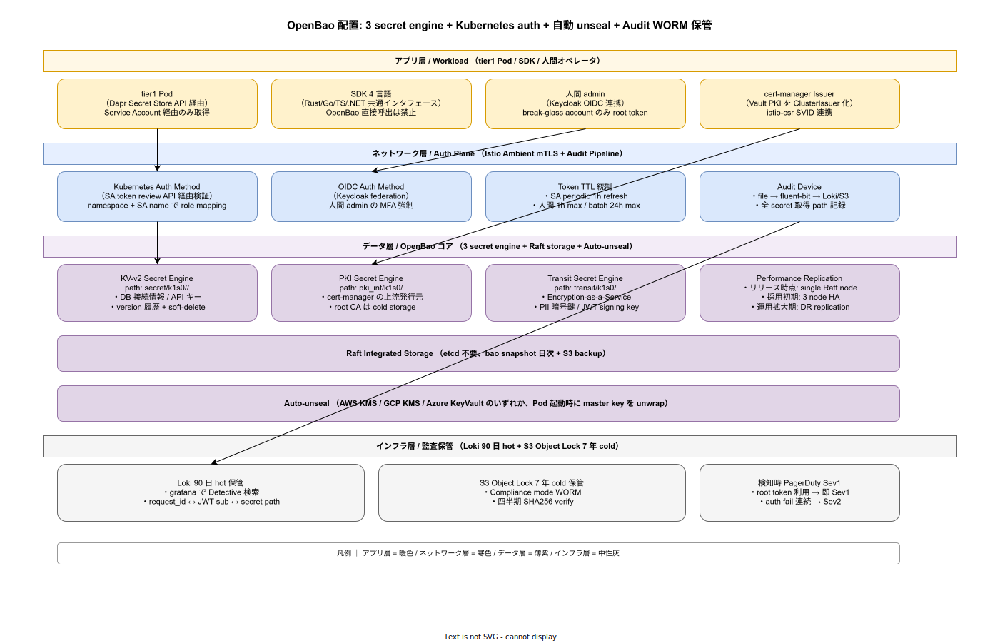

# 01. OpenBao 設計

本ファイルは k1s0 における OpenBao（Vault OSS fork）の物理配置と運用規約を確定する。85 章方針 IMP-SEC-POL-004（OpenBao Secret 集約）を実装段階に落とし込み、KV-v2 / PKI / Transit の 3 secret engine、Kubernetes auth method による Service Account ベース取得、Keycloak OIDC 連携の人間 admin 経路、Auto-unseal による Pod 再起動時の自動復旧、Audit device の Loki 90 日 hot + S3 Object Lock 7 年 cold の二段保管までを一貫運用する。



## なぜ OpenBao を選び、HashiCorp Vault からどう移行するか

ADR-SEC-002 で OpenBao を選定した理由は、HashiCorp Vault が 2023-08 に BUSL（Business Source License）へライセンス変更し、k1s0 のような OSS 配布プロジェクトでは AGPL/BUSL 併用判定の説明責任が増したためである。OpenBao は Linux Foundation（OpenSSF）配下で MPL-2.0 で fork された Vault 1.14 系互換の OSS で、API / config / CLI が Vault と完全互換であり、Vault → OpenBao の移行は実質的に namespace 一致と data migration のみで済む（IMP-SUP-POL-007 の AGPL/BUSL 分離原則と整合）。

採用側組織で過去に発生した障害は「Vault root token を CI 環境変数に常駐させ、CI 漏洩時に全 secret が一斉危殆化した」事例である。本書では root token を break-glass 用途に限定し、通常運用は Service Account 経由の Kubernetes auth method、人間 admin は Keycloak OIDC 連携の MFA 必須に固定する。root token 利用は audit device で 100% 検知し、PagerDuty Sev1 に直結する（IMP-SEC-OBO-049）。

## 物理配置と HA 段階

OpenBao は `infra/identity/openbao/` 配下に Helm chart を配置し、`identity-system` namespace に展開する（IMP-SEC-OBO-040）。Raft Integrated Storage（etcd 不要）を採用し、リリース時点では single Raft node、採用初期で 3 node HA（leader + 2 follower）、運用拡大期で multi-region DR replication へ段階拡張する。Helm values は `deploy/identity/openbao/values-{tier}.yaml` で環境別に分離し、Argo CD App 経由で配布する。

```yaml
# infra/identity/openbao/values-prod.yaml 抜粋
server:
  ha:
    enabled: true
    replicas: 3
    raft:
      enabled: true
      setNodeId: true
  auditStorage:
    enabled: true
    storageClass: longhorn-ssd
    size: 10Gi
  extraEnvironmentVars:
    BAO_SEAL_TYPE: awskms
    BAO_AWSKMS_SEAL_KEY_ID: alias/k1s0-openbao-unseal
```

Single node から HA への移行は `bao operator raft join` で在中サービスを停止せずに行える。Raft snapshot は日次で `bao operator raft snapshot save` を cron 実行し、S3 backup として `s3://k1s0-openbao-snapshots/` に Object Lock 30 日で保管する（IMP-SEC-OBO-041）。

## 3 secret engine の責務分離

OpenBao の secret engine は責務ごとに 3 つに分離し、cross-engine の依存を構造的に持たせない（IMP-SEC-OBO-042）。

**KV-v2 Secret Engine** (`secret/k1s0/<namespace>/<app>/`): DB 接続情報・外部 API キー・OAuth client secret 等の static secret を保管する。version 履歴と soft-delete を有効化し、誤上書き時の 30 日以内 rollback を可能にする。最大 10 version を保持し、それ以上は自動 GC する。secret 取得は SDK 経由（Dapr Secret Store API）のみ許可し、tier1/tier2/tier3 の application は OpenBao を直接呼び出さない構造を SDK インタフェースで保証する（IMP-SEC-OBO-043）。

**PKI Secret Engine** (`pki_int/k1s0/`): cert-manager の上流発行元として配置する。root CA は cold storage（S3 + AWS KMS 暗号化）で別管理し、intermediate CA のみ OpenBao 内で online 運用する。cert-manager の ClusterIssuer は OpenBao PKI engine を呼び出し、Vault PKI Issuer 経由で短寿命証明書（90 日）を発行する。詳細は 40 節 cert-manager 設計を参照（IMP-SEC-OBO-044）。

**Transit Secret Engine** (`transit/k1s0/`): Encryption-as-a-Service として PII 暗号鍵と JWT signing key を保管する。鍵自体は OpenBao 外に持ち出さず、application は `bao write transit/encrypt/<key>` API 経由で encryption / decryption を委譲する。これにより application は鍵を保管せず、key rotation も Transit engine 内で完結する（IMP-SEC-OBO-045）。

3 engine の cross-reference は禁止する。例えば、KV-v2 に保管した secret を Transit で暗号化することはせず、初めから Transit に置く（envelope encryption は OpenBao 自身の責務）。これにより engine ごとの監査ログが独立し、Forensics 時の事故域分離が成立する。

## Kubernetes Auth Method による SA 認証

application Pod からの secret 取得は Kubernetes Auth Method を介して Service Account token を検証する経路に固定する（IMP-SEC-OBO-046）。Pod 内の `/var/run/secrets/kubernetes.io/serviceaccount/token` を OpenBao に POST し、TokenReview API 経由で Kubernetes API Server が token を検証、subject の `system:serviceaccount:<namespace>:<sa-name>` を OpenBao の role mapping に照合して policy を発行する。

```bash
# Pod 内での login 例（実際は SDK が wrap）
bao write auth/kubernetes/login \
  role=tier1-decision \
  jwt=$(cat /var/run/secrets/kubernetes.io/serviceaccount/token)
# → token TTL 1h, periodic refresh enabled
```

role 設定は `infra/identity/openbao/policies/` 配下に Terraform で IaC 管理する。role 名は `<tier>-<service>` 形式で固定し、namespace + SA 名の組合せで policy を分離する。IaC 化により role 追加・削除は PR レビューを経由し、CODEOWNERS で Security チームの承認を必須化する（IMP-SEC-OBO-047）。

人間 admin の場合は OIDC Auth Method を介して Keycloak の OIDC token を OpenBao に提示する。MFA は Keycloak 側で強制し（85 章 10 節 Keycloak realm 設計と整合）、admin role の MFA-claim 検証で OpenBao 側でも MFA 完了を再確認する。break-glass account（root token 保持）は Quorum unseal で復号化される 5 分割鍵をオフラインに保管し、CISO + CTO の 2 名同時オペレーションでのみ利用可能とする。

## Auto-unseal と Raft snapshot

OpenBao 起動時の master key は AWS KMS（または GCP KMS / Azure KeyVault）で wrap し、Pod 起動時に IRSA / Workload Identity 経由で KMS から自動 unwrap する Auto-unseal を必須化する（IMP-SEC-OBO-048）。これにより Pod 再起動・rolling update・cluster restore 時の手動 unseal 操作が不要となり、Service Account 経由で 自動運用 kubernetes 環境が成立する。

Auto-unseal なしの場合、Pod 起動ごとに 5 名の unseal 鍵保持者がオペレーションを行う必要があり、SLO 99.9% を達成不可能となる。Auto-unseal の trade-off は KMS への依存（KMS が落ちると OpenBao も unseal できない）であるが、KMS は AWS / GCP / Azure いずれも 99.999% SLA であり、可用性の前提となる。

KMS 自体の鍵は CMK（Customer Managed Key）で管理し、年次 rotation と CloudTrail / Audit Log 監視を必須化する。KMS 鍵の物理保管は cold AWS account（root account 隔離）で行い、production account からは ARN 参照のみ可能な構造とする。

## Audit Device と監査ログ保管

Audit device は file device を有効化し、`/openbao/audit/audit.log` への JSON Lines 出力を fluent-bit で集約する。fluent-bit は 2 経路に分岐し、(a) Loki 90 日 hot 保管、(b) S3 Object Lock Compliance mode で 7 年 cold 保管 を並行実行する（IMP-SEC-OBO-049）。

監査ログは全 secret 取得・auth login・policy 変更・root token 利用を path レベルで記録する。HMAC によりログ自体の改ざん検知が可能で、四半期に 1 回 SHA256 verify を `ops/scripts/audit-verify-quarterly.sh` で自動実行する。verification 失敗は Sev1 として CISO に直接通知する。

監査ログの可視化は Grafana の Loki datasource で JSON フィルタによる Detective 検索を提供する。`request_id ↔ JWT sub ↔ secret path ↔ source IP` を 1 query で逆引き可能とし、退職時 revoke 後の漏れチェック（過去 30 日に該当 sub の secret 取得 history 全件確認）を 5 分以内で完了させる。これは 50 節退職 revoke Runbook の Step 5（漏れ検出）に直結する。

root token 利用は監査上の最重要イベントとして即 Sev1 PagerDuty 通知する。break-glass オペレーション中で予定された利用であっても通知は飛ばし、CISO が「予定済み」と認識して closed する運用にすることで、未承認利用と完全に区別する。auth fail の連続（3 分間 10 回以上）は Sev2 として SRE オンコールに通知する。

## 対応 IMP-SEC ID

本ファイルで採番する実装 ID は以下とする。

- `IMP-SEC-OBO-040` : `infra/identity/openbao/` Helm chart 配置と段階 HA（single → 3 node → DR）
- `IMP-SEC-OBO-041` : Raft Integrated Storage + 日次 snapshot + S3 Object Lock 30 日保管
- `IMP-SEC-OBO-042` : 3 secret engine（KV-v2 / PKI / Transit）の責務分離と cross-reference 禁止
- `IMP-SEC-OBO-043` : KV-v2 path 設計（`secret/k1s0/<ns>/<app>/`）と SDK 経由必須化
- `IMP-SEC-OBO-044` : PKI Secret Engine 配置と root CA cold storage 分離
- `IMP-SEC-OBO-045` : Transit Secret Engine による PII 鍵 / JWT signing key の Encryption-as-a-Service
- `IMP-SEC-OBO-046` : Kubernetes Auth Method（SA token review API 経由）
- `IMP-SEC-OBO-047` : role IaC 管理（Terraform）+ Security CODEOWNERS 必須
- `IMP-SEC-OBO-048` : Auto-unseal（AWS KMS / GCP KMS / Azure KeyVault）と KMS CMK 年次 rotation
- `IMP-SEC-OBO-049` : Audit Device 二段保管（Loki 90 日 + S3 7 年）+ root token 利用 Sev1 通知

## 対応 ADR / DS-SW-COMP / NFR

- ADR: [ADR-SEC-002](../../../02_構想設計/adr/ADR-SEC-002-openbao.md)（OpenBao 採用）/ [ADR-0003](../../../02_構想設計/adr/ADR-0003-agpl-isolation-architecture.md)（AGPL/BUSL 分離）/ [ADR-CICD-003](../../../02_構想設計/adr/ADR-CICD-003-kyverno.md)（Kyverno による policy 強制）
- DS-SW-COMP: DS-SW-COMP-006（Secret Store）/ DS-SW-COMP-141（多層防御統括 / Observability + Security 統合監査）
- NFR: NFR-E-AC-004（Secret 最小権限）/ NFR-E-MON-002（Secret 取得監査）/ NFR-H-KEY-001（鍵ライフサイクル）/ NFR-G-AC-001（最小権限）/ NFR-G-AC-002（特権昇格）/ NFR-E-ENC-001（保管暗号化）

## 関連章との境界

- [`../00_方針/01_Identity原則.md`](../00_方針/01_Identity原則.md) の IMP-SEC-POL-004（OpenBao 集約）を本ファイルで物理化
- [`../10_Keycloak_realm/01_Keycloak_realm設計.md`](../10_Keycloak_realm/01_Keycloak_realm設計.md) の OIDC realm が本ファイルの OIDC Auth Method の上流
- [`../40_cert-manager/01_cert-manager設計.md`](../40_cert-manager/01_cert-manager設計.md) の ClusterIssuer が本ファイルの PKI Secret Engine を呼び出す
- [`../50_退職時revoke手順/01_退職時revoke手順.md`](../50_退職時revoke手順/01_退職時revoke手順.md) の Step 5（漏れ検出）が本ファイルの Audit Device 経路を前提
- [`../../60_観測性設計/`](../../60_観測性設計/) の Loki 30 日保管に対し、本ファイルの監査ログは独自に 90 日 hot 保管（PII / 認証情報の保持期間が異なる）
- [`../../80_サプライチェーン設計/`](../../80_サプライチェーン設計/) の cosign keyless が長期鍵を持ち出さない運用と整合（IMP-SUP-POL-002 と本ファイルの Auto-unseal の鍵管理思想が一致）
