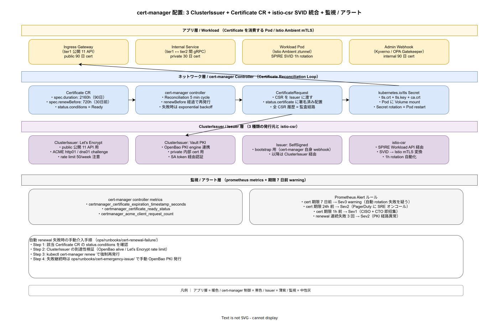

# 01. cert-manager 設計

本ファイルは k1s0 における cert-manager の物理配置と運用規約を確定する。85 章方針 IMP-SEC-POL-005（cert-manager 証明書自動更新）を実装段階に落とし込み、3 種類の ClusterIssuer（Let's Encrypt / Vault PKI = OpenBao 連携 / SelfSigned bootstrap）、Certificate CR の duration / renewBefore 設定、CertificateRequest による CSR 履歴の監査保管、istio-csr による SPIRE-SPIFFE SVID と Istio Ambient mTLS の統合、cert-manager controller metrics による期限切れ前 alert の 4 段階エスカレーションまでを一貫運用する。



## なぜ自動 renewal が「手動運用ゼロ」の必須条件か

採用側組織で過去に発生した障害は「Let's Encrypt 90 日 cert を手動更新運用にしていて、担当者の不在中に期限切れし tier1 公開 API が 4 時間ダウンした」事例である。手動運用は属人化し、SLA 99% を達成不可能にする。本書では cert-manager controller の Reconciliation Loop が 5 分ごとに全 Certificate CR を走査し、`spec.renewBefore` で指定された期限到達前タイミング（既定 30 日前）で自動再発行する構造を確立する（IMP-SEC-CRT-060）。

加えて、自動 renewal が連続 3 回失敗した場合は Sev2 として SRE オンコールに通知し、期限 24h 前の cert は Sev2、1h 前は Sev1 として CISO + CTO を即招集する 4 段階エスカレーションを Prometheus alert で構造化する。これにより人間が「期限を覚えておく」運用は完全に排除される。

## 3 ClusterIssuer の責務分離

cert-manager の Issuer は責務ごとに 3 種類に分離し、cert の用途と発行元を明確に対応させる（IMP-SEC-CRT-061）。

**ClusterIssuer: Let's Encrypt** (`infra/identity/cert-manager/cluster-issuers/letsencrypt-prod.yaml`): tier1 公開 11 API 用の public 証明書を発行する。ACME http01 / dns01 challenge を併用し、内部からアクセス困難な API は dns01（Route53 / CloudDNS） で chal を解決する。Let's Encrypt の rate limit（domain あたり 50 cert/week）に注意し、staging issuer での pre-flight 検証を CI に組み込む。public 用 cert の duration は 90 日（Let's Encrypt 仕様上の最大）、renewBefore は 30 日前に固定する。

**ClusterIssuer: Vault PKI** (`vault-pki-internal.yaml`): tier1 ↔ tier2 間 gRPC や internal admin API 用の private 証明書を発行する。OpenBao の PKI Secret Engine（`pki_int/k1s0/`）を上流発行元として、Service Account token 経由で OpenBao に認証する。private cert の duration は 30 日（短寿命でローテ頻度を上げる）、renewBefore は 10 日前に固定する。internal cert は public DNS には登録せず、cluster 内 ServiceMonitor / Pod 間通信のみで利用する（IMP-SEC-CRT-062）。

**Issuer: SelfSigned** (`selfsigned-bootstrap.yaml`): cert-manager 自身の admission webhook（cert-manager-webhook）の bootstrap cert として利用する。cert-manager Pod 起動時に他の Issuer がまだ利用不可能な chicken-and-egg 問題を解消する。bootstrap 後は ClusterIssuer 経由で再発行され、SelfSigned は cert-manager 自身の補助としてのみ残る。

3 Issuer の選択は Certificate CR の `spec.issuerRef` で明示し、cert ごとの責務を構造的に分離する。public / private / bootstrap の混同を防ぐため、Certificate の name prefix を `public-` / `private-` / `bootstrap-` で固定する CI lint（`tools/ci/cert-name-lint/`）を `ci-overall` に組み込む。

## Certificate CR の duration / renewBefore 設定

Certificate CR は `infra/identity/cert-manager/certificates/` 配下に配置し、Argo CD ApplicationSet 経由で各 environment に配布する。基本テンプレートは以下とする。

```yaml
apiVersion: cert-manager.io/v1
kind: Certificate
metadata:
  name: public-tier1-decision
  namespace: istio-system
spec:
  secretName: public-tier1-decision-tls
  issuerRef:
    name: letsencrypt-prod
    kind: ClusterIssuer
  duration: 2160h    # 90 日
  renewBefore: 720h  # 30 日前に renewal 開始
  privateKey:
    algorithm: ECDSA
    size: 256
    rotationPolicy: Always  # renewal 時に必ず key rotation
  dnsNames:
    - api.k1s0.example.com
  usages:
    - server auth
    - client auth
```

`privateKey.rotationPolicy: Always` は renewal 時に private key も必ず rotate する設定で、cert を真に「短寿命」化する重要オプションである。これを `Never` にすると key は永続再利用され、key 漏洩時に過去全ての通信が解読可能になる（IMP-SEC-CRT-063）。

Certificate CR の status.conditions = Ready が成立して初めて、`secretName` で指定した kubernetes.io/tls Secret が更新される。Pod は volume mount 経由で Secret を参照し、Istio や Ingress Gateway が cert を hot-reload する仕組みとなる。Pod restart は不要で、SIGHUP / inotify watch で cert を再読み込みする。

## CertificateRequest による CSR 履歴監査

cert-manager は Certificate CR から CertificateRequest CR を生成し、Issuer に CSR を渡す。CertificateRequest の status.certificate に署名済み cert が配置され、`spec.uid` で発行 ID が tracking される。全 CertificateRequest は 90 日間 cluster に保持し、誰がいつどの Certificate を再発行したかの監査経路として利用する（IMP-SEC-CRT-064）。

90 日経過後は CertificateRequest controller が GC するが、その前に audit log として S3 Object Lock で 7 年保管する。`ops/scripts/cert-request-archive-daily.sh` が日次で全 CertificateRequest を JSON Lines で export し、`s3://k1s0-cert-audit/YYYY/MM/DD/` 配下に Compliance mode で push する。これにより、過去 7 年間の cert 発行履歴が完全に追跡可能となる（NFR-H-INT-004 監査ログ完整性 と整合）。

## istio-csr による SPIRE SVID 統合

Istio Ambient mode の ztunnel は workload 間 mTLS を SPIRE-SPIFFE SVID（短寿命 X.509）で実現する。istio-csr は cert-manager の上に薄く配置され、SPIRE Workload API から SVID を取得して Istio CSR API（`istio-system/cert-manager-istio-csr` Service）として公開する（IMP-SEC-CRT-065）。

SVID は 1h rotation で自動更新され、Pod ごとに `spiffe://k1s0.example.com/ns/<ns>/sa/<sa>` 形式の URI SAN を持つ。Istio sidecar / ztunnel はこの SVID を `/var/run/secrets/workload-spiffe-uds/socket` 経由で取得し、L7 mTLS 確立時に対向 Pod の SPIFFE ID を verify する。これにより namespace + SA レベルでの workload identity が成立し、Pod がコンテナエスケープされた場合でも SVID が 1h で失効するため横移動が封じ込められる。

istio-csr 経路の cert は cert-manager の Certificate CR では管理せず、SPIRE 側の `ClusterSPIFFEID` CR で発行ポリシーを定義する。両者の境界は「cert-manager = ingress / 内部 HTTP/TLS cert」「SPIRE-SPIFFE = workload mTLS SVID」と明確に分離する（85 章 20 節 SPIRE 設計と整合、IMP-SEC-CRT-066）。

## 監視 / アラート 4 段階エスカレーション

cert-manager controller は Prometheus metrics を `:9402/metrics` で expose し、以下 3 系列を OTel Collector 経由で Mimir に送る（IMP-SEC-CRT-067）。

- `certmanager_certificate_expiration_timestamp_seconds`: 各 cert の期限 unix timestamp
- `certmanager_certificate_ready_status`: Ready 状態の boolean
- `certmanager_acme_client_request_count`: ACME challenge 試行回数（rate limit 監視用）

Prometheus Alert ルールは 4 段階で構成する（IMP-SEC-CRT-068）。

```yaml
groups:
  - name: cert-manager-expiration
    rules:
      - alert: CertExpiry7Days
        expr: (certmanager_certificate_expiration_timestamp_seconds - time()) / 86400 < 7
        for: 1h
        labels: {severity: warning, sev: "3"}
        annotations:
          summary: "Cert {{ $labels.name }} 期限 7 日前、自動 renewal 失敗を疑う"
          runbook_url: https://docs.k1s0.example.com/runbooks/cert-renewal-failure
      - alert: CertExpiry24Hours
        expr: (certmanager_certificate_expiration_timestamp_seconds - time()) / 3600 < 24
        for: 5m
        labels: {severity: critical, sev: "2"}
      - alert: CertExpiry1Hour
        expr: (certmanager_certificate_expiration_timestamp_seconds - time()) < 3600
        for: 1m
        labels: {severity: critical, sev: "1"}
      - alert: CertRenewalFailure
        expr: increase(certmanager_certificate_renewal_errors_total[1h]) >= 3
        for: 0m
        labels: {severity: critical, sev: "2"}
```

Sev1（期限 1h 前）は CISO + CTO の即招集を起動し、Sev2（24h 前 / renewal 連続失敗）は SRE オンコールに PagerDuty 通知、Sev3（7 日前）は Slack `#k1s0-platform` への warning 通知に留める。Sev3 段階で「自動 renewal が動いていない」根本原因を特定すれば、Sev2 / Sev1 への悪化を確実に防げる。

renewal 失敗時の手動介入手順は `ops/runbooks/cert-renewal-failure/` に Runbook として配置し、(1) Certificate CR の status.conditions 確認、(2) ClusterIssuer の到達性検証（OpenBao alive / Let's Encrypt rate limit）、(3) `kubectl cert-manager renew <cert>` で強制再発行、(4) 失敗継続時は `ops/runbooks/cert-emergency-issue/` で手動 OpenBao PKI 発行、の 4 ステップを 30 分以内で完了させる SLA を定める（IMP-SEC-CRT-069）。

## 対応 IMP-SEC ID

本ファイルで採番する実装 ID は以下とする。

- `IMP-SEC-CRT-060` : cert-manager controller Reconciliation Loop 5 min cycle と renewBefore 自動再発行
- `IMP-SEC-CRT-061` : 3 ClusterIssuer 責務分離（Let's Encrypt / Vault PKI / SelfSigned bootstrap）
- `IMP-SEC-CRT-062` : public 90 日 / private 30 日の duration 二段設定と OpenBao PKI engine 連携
- `IMP-SEC-CRT-063` : `privateKey.rotationPolicy: Always` による renewal 時 key rotate 必須化
- `IMP-SEC-CRT-064` : CertificateRequest 7 年 audit log 保管（S3 Object Lock Compliance mode）
- `IMP-SEC-CRT-065` : istio-csr による SPIRE SVID → Istio mTLS 統合と 1h rotation 自動化
- `IMP-SEC-CRT-066` : cert-manager と SPIRE-SPIFFE の境界（ingress cert vs workload mTLS SVID）
- `IMP-SEC-CRT-067` : controller metrics 3 系列（expiration / ready / acme_request）の OTel 収集
- `IMP-SEC-CRT-068` : Prometheus Alert 4 段階エスカレーション（7d Sev3 / 24h Sev2 / 1h Sev1 / renewal fail Sev2）
- `IMP-SEC-CRT-069` : renewal 失敗時 4 step Runbook（status 確認 / Issuer 到達性 / 強制 renew / 手動 emergency）

## 対応 ADR / DS-SW-COMP / NFR

- ADR: [ADR-SEC-002](../../../02_構想設計/adr/ADR-SEC-002-openbao.md)（OpenBao PKI engine 連携）/ [ADR-SEC-003](../../../02_構想設計/adr/ADR-SEC-003-spiffe-spire.md)（SPIRE-SPIFFE）/ [ADR-0001](../../../02_構想設計/adr/ADR-0001-istio-ambient-vs-sidecar.md)（Istio Ambient mTLS）
- DS-SW-COMP: DS-SW-COMP-006（Secret Store / OpenBao PKI を上流に持つ）/ DS-SW-COMP-141（多層防御統括）
- NFR: NFR-E-ENC-001（保管暗号化）/ NFR-E-ENC-002（転送暗号化）/ NFR-H-INT-004（監査ログ完整性）/ NFR-H-KEY-001（鍵ライフサイクル）/ NFR-A-FT-001（自動復旧 15 分以内、cert 期限切れ復旧経路）

## 関連章との境界

- [`../00_方針/01_Identity原則.md`](../00_方針/01_Identity原則.md) の IMP-SEC-POL-005（cert-manager 自動更新）と IMP-SEC-POL-006（Istio Ambient mTLS）を本ファイルで物理化
- [`../20_SPIRE_SPIFFE/01_SPIRE_SPIFFE設計.md`](../20_SPIRE_SPIFFE/01_SPIRE_SPIFFE設計.md) の SVID 発行と本ファイルの istio-csr が一体運用
- [`../30_OpenBao/01_OpenBao設計.md`](../30_OpenBao/01_OpenBao設計.md) の PKI Secret Engine が本ファイルの ClusterIssuer: Vault PKI の上流
- [`../50_退職時revoke手順/01_退職時revoke手順.md`](../50_退職時revoke手順/01_退職時revoke手順.md) の revoke 対象に本ファイルの cert（CRL update 経由）が含まれる
- [`../../60_観測性設計/`](../../60_観測性設計/) の OTel Collector → Mimir 経路で controller metrics を集約
