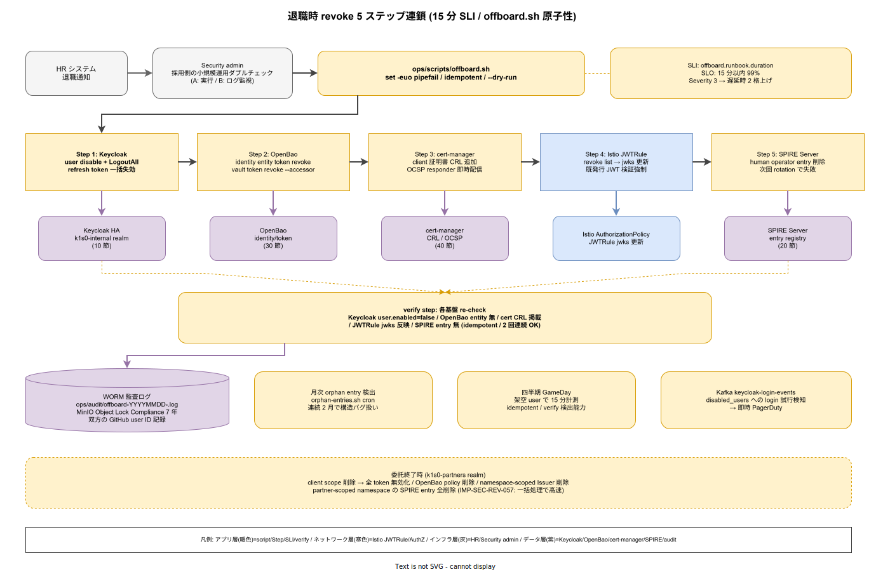

# 01. 退職時 revoke 手順

本ファイルは k1s0 モノレポにおける従業員退職・委託終了時の全経路 revoke 手順を実装フェーズ確定版として示す。85 章方針 IMP-SEC-POL-004（単一無効化で全経路 revoke）を物理レベルに落とし込み、10 節 Keycloak / 20 節 SPIRE / 30 節 OpenBao / 40 節 cert-manager の 4 基盤を連鎖させる Runbook を `ops/runbooks/offboarding/` と `ops/scripts/offboard.sh` に確定させる。退職時の revoke 漏れは平時の監査で検知できず、事故発生まで「漏れていることすら分からない」構造リスクであり、本節はこれを「1 アカウント disable で全経路 revoke 完了」の単一操作に集約する。



JTC の 10 年保守サイクルでは、従業員・委託先の入退場が年単位で発生する。各システムを手作業で個別 revoke する運用は、漏れが 1 件でも残れば即インシデントとなる。k1s0 は Keycloak の user disable を起点とし、下流の 4 基盤に chain revoke を伝播させる。起点を Keycloak に固定することで、HR システムとの連携点を 1 箇所に絞り、運用規律を守りやすくする。

## 起点と 15 分 SLI

Runbook の起点は HR から Keycloak admin への退職通知である（IMP-SEC-REV-050）。受領から完了までの時間目標を 15 分以内に設定する。NFR-C-IR-001（Severity 別応答）の HIGH に相当し、退職事故（元従業員による不正アクセス）の攻撃窓を時間単位で閉じる設計である。

- **Severity**: 退職自体は Severity 3（通常運用）だが、revoke 遅延が検知された場合は即座に Severity 2 に格上げ
- **SLI**: `offboard.runbook.duration` を OTel Collector で計測、SLO は 15 分以内 99%
- **通知経路**: HR システム → Keycloak admin（Security チーム）→ `ops/scripts/offboard.sh` 実行
- **委託先打切り**: `k1s0-partners` realm の client scope 削除 + user 一括 disable で個別 revoke より速い（IMP-SEC-REV-051）

起点を HR に固定することで、退職情報の二重登録（HR と IdP の片方だけ更新される事故）を防ぐ。HR システムから Keycloak への情報連携は SCIM 2.0 プロトコルで自動化する方針だが、Phase 0 では手動通知 + 確認で運用する。

## 5 ステップ連鎖 revoke

Keycloak user disable を起点に、以下 5 ステップを順次実行する（IMP-SEC-REV-052）。各ステップは idempotent であり、一部失敗時の再実行で整合が取れる設計とする。

1. **Keycloak session 強制終了**: `LogoutAll` API で該当 user の全セッションを無効化、refresh token も一括失効
2. **OpenBao token 失効**: 該当 user の OpenBao identity entity に紐付く token / role を全 revoke（`vault token revoke -accessor <accessor>`）
3. **cert-manager 発行証明書の CRL 追加**: 該当 user 用に発行された client 証明書を CRL（Certificate Revocation List）に追加、OCSP responder で即時配信
4. **Istio JWTRule で強制検証**: `k1s0-internal` realm の revoke list を Istio JWTRule の `jwks` 更新に反映、既発行 JWT の検証を強制
5. **SPIRE Server の human operator entry 削除**: 開発者個人に発行された workload entry（開発用 SVID）を削除、未 rotation の SVID が残存しても次回 rotation で失敗

順序は重要である。Keycloak disable を最初に行うことで新規 token 発行を停止し、続く 4 ステップは既存 token / 証明書 / SVID の無効化に集中する。逆順で実行すると、下流を revoke した直後に Keycloak から新規 token が発行されて revoke 漏れが発生する危険がある。

## `offboard.sh` の実装規律

5 ステップは単一 script `ops/scripts/offboard.sh <username>` で実行し、手動での個別コマンド実行を禁止する（IMP-SEC-REV-053）。script は以下の規律を満たす。

```bash
# ops/scripts/offboard.sh の構造（抜粋）
#!/usr/bin/env bash
set -euo pipefail

USERNAME="$1"
INCIDENT_ID="offboard-$(date +%Y%m%d)-${USERNAME}"
LOG="ops/audit/${INCIDENT_ID}.log"

step1_keycloak_disable "$USERNAME" 2>&1 | tee -a "$LOG"
step2_openbao_revoke "$USERNAME" 2>&1 | tee -a "$LOG"
step3_cert_manager_crl "$USERNAME" 2>&1 | tee -a "$LOG"
step4_istio_jwks_refresh "$USERNAME" 2>&1 | tee -a "$LOG"
step5_spire_entry_delete "$USERNAME" 2>&1 | tee -a "$LOG"

verify_revoke_complete "$USERNAME" 2>&1 | tee -a "$LOG"
```

- **idempotent**: 各ステップは「既に revoke 済」状態で exit 0 を返す
- **fail-fast**: `set -euo pipefail` で途中失敗を即座に検知、部分完了状態での終了を禁止
- **監査ログ**: `ops/audit/offboard-YYYYMMDD-<uid>.log` に WORM 保存（S3 Object Lock Compliance モード）
- **verify step**: 5 ステップ完了後に各基盤で「revoke 済であること」を re-check
- **dry-run**: `--dry-run` フラグで本番反映せず操作予定を出力

script 自体の変更は Security（D）主導で PR レビューを経由し、変更頻度を四半期 1 回以下に抑える。緊急改修が必要な場合も ADR-SEC-001 / 003 の改訂を併せて実施する。

## 監査と WORM 保存

revoke 実行ログは `ops/audit/offboard-YYYYMMDD-<uid>.log` に 7 年保存する（NFR-H-INT-004 連動、IMP-SEC-REV-054）。S3 Object Lock の Compliance モードで改ざん不能化し、削除は 7 年経過後のみ可能とする。ログには以下を含める。

- 実行時刻（開始 / 各ステップ / 終了）と所要秒数
- 対象 username と退職日 / 委託終了日
- 各ステップの API 応答 / 失敗時のエラー詳細
- verify step の検証結果（各基盤の user / entity / entry が revoke 済であるか）

監査ログは `infra/data/minio/buckets/audit-offboard/` に格納し、MinIO の Object Lock で保護する。アクセス経路は Security 読取のみ、書込みは `offboard.sh` の Service Account のみに限定する（NFR-E-MON-001 連動）。

## GameDay と四半期演習

Runbook は実行されない限り形骸化する。四半期に 1 回、架空ユーザを `k1s0-internal` realm に作成し、offboard.sh を実行して所要時間 SLI を計測する（IMP-SEC-REV-055）。演習では以下を検証する。

- 5 ステップの所要時間合計（目標 15 分以内）
- 各ステップの idempotent 性（2 回連続実行で同じ結果）
- verify step の検出能力（意図的に 1 ステップを skip し、検知されるか）
- 委託先打切り経路（realm client scope 削除）の所要時間

演習結果は `ops/postmortems/offboard-gameday/<quarter>.md` に記録し、SLI ダッシュボードと合わせて Security weekly でレビューする。演習で漏れが検出された場合は翌週までに offboard.sh の改修 PR を起票し、手作業での回避を禁止する。

## 月次レビュー: Orphan Entry 検出

退職処理が完全でも、過去の運用で漏れた「残存 entry」が存在しうる。月次で全基盤を走査し、Keycloak で disable されているが OpenBao / cert-manager / SPIRE に残存するエントリを検出する（IMP-SEC-REV-056）。

- **実行経路**: `ops/audit/orphan-entries.sh` を cron で月次実行
- **検出対象**: Keycloak disable user に紐付く OpenBao token / cert-manager 証明書（CRL 未記載）/ SPIRE entry
- **出力**: `ops/audit/orphan-YYYYMM.md` に検出数と該当一覧
- **対応**: 検出時は Security チームが手動 review し、承認後に `offboard.sh --cleanup <username>` で再 revoke

orphan 検出が連続 2 月発生した場合、offboard.sh の構造的バグとして扱い、根本原因調査を GitHub Issue で追跡する。監査外部者（例: ISMS 審査員）にも本レビュー結果を開示可能な形式で保存する。

## 委託終了時の差分

委託先（`k1s0-partners` realm）の打切りは、従業員退職より更に高速に処理できる（IMP-SEC-REV-057）。個別 user revoke ではなく、契約終了と同時に以下を実行する。

- `k1s0-partners` realm の該当 client scope を削除 → 当該委託先に発行した全 token を無効化
- 該当 client id に紐付く OpenBao policy を削除 → 関連 secret への access を遮断
- cert-manager の namespace-scoped Issuer を削除 → 該当 namespace への証明書発行停止
- SPIRE Registration Entry の partner-scoped namespace 全削除

契約ベースの一括処理のため、個別 user 単位より速く、かつ漏れが発生しにくい。委託先の user が複数存在する場合も、realm client scope 削除 1 操作で全て revoke される。

## 権限分離とダブルチェック

`offboard.sh` の実行は Security チームの 2 名体制で実施する（IMP-SEC-REV-058）。1 名が script 実行、もう 1 名が実行ログの即時レビューを行うダブルチェック体制を取ることで、誤対象での revoke（他人を誤って退職処理する）を防ぐ。

- **実行者 A**: `offboard.sh <username> --dry-run` で操作予定を確認、承認後に本実行
- **レビュア B**: 実行ログをリアルタイム監視、verify step の結果を cross-check
- **承認記録**: 双方の GitHub 認証済 user ID を `ops/audit/offboard-YYYYMMDD-<uid>.log` 先頭に記録
- **緊急時単独実行**: Sev1 インシデント時のみ、Security lead 承認で 1 名実行可、事後承認フローで補完

script 経路と人間承認の二重統制により、運用負荷を抑えつつ誤操作リスクを排除する。機械実行 + 人間承認のバランスは CI/CD の承認 gate と同じ思想である。

## 事後検知: 既退職者の異常アクセス監視

Revoke 完了後も、退職者の漏洩 credential が第三者経由で使用されるリスクは残る。Kafka に publish される Keycloak login event を継続監視し、disable 済 user への login 試行を 1 件でも検出した時点で Security に alert する（IMP-SEC-REV-059）。

- **検知基盤**: `keycloak-login-events` Kafka topic を consumer で stream 処理
- **rule**: `event.userId ∈ disabled_users AND event.type == LOGIN` で match
- **alert**: 即時 PagerDuty + Security Slack チャンネル
- **記録**: `ops/audit/disabled-user-login-attempts-<date>.log` に永続化

disable 済 user への login 試行は本来発生しないため、1 件でも発生すれば攻撃兆候と判断して調査を開始する。credential 流出疑義時の初動が迅速化される。

## 対応 IMP-SEC-REV ID

- IMP-SEC-REV-050: HR 起点と 15 分 SLI 設定
- IMP-SEC-REV-051: 委託先打切り時の client scope 削除経路
- IMP-SEC-REV-052: 5 ステップ連鎖 revoke 順序規律
- IMP-SEC-REV-053: `offboard.sh` 単一 script 経由の原子性
- IMP-SEC-REV-054: WORM 保存と 7 年監査ログ
- IMP-SEC-REV-055: 四半期 GameDay 演習と SLI 計測
- IMP-SEC-REV-056: 月次 orphan entry 検出
- IMP-SEC-REV-057: 委託終了時の一括 revoke 経路
- IMP-SEC-REV-058: 2 名体制ダブルチェックと緊急時単独実行フロー
- IMP-SEC-REV-059: 事後の disabled user login 試行検知

## 対応 ADR / DS-SW-COMP / NFR

- [ADR-SEC-001](../../../02_構想設計/adr/ADR-SEC-001-keycloak.md) / [ADR-SEC-002](../../../02_構想設計/adr/ADR-SEC-002-openbao.md) / [ADR-SEC-003](../../../02_構想設計/adr/ADR-SEC-003-spiffe-spire.md)
- DS-SW-COMP-141（多層防御統括）
- NFR-E-AC-001（JWT 強制）/ NFR-E-AC-004（Secret 最小権限）/ NFR-C-IR-001（Severity 別応答）/ NFR-E-MON-001（認証ログ）
- 要件定義 `03_要件定義/30_非機能要件/E_セキュリティ/` と連動
