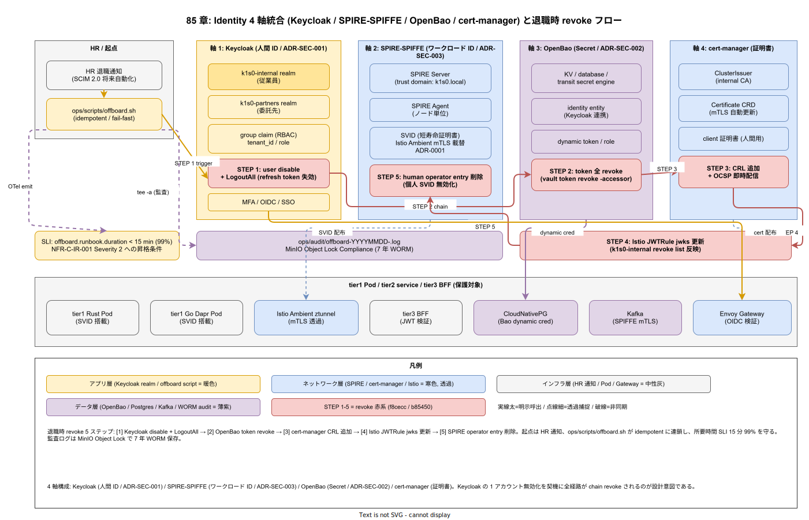

# 85. Identity 設計

本章は k1s0 の ID 基盤（ADR-SEC-001 で選定した Keycloak / ADR-SEC-003 で選定した SPIRE-SPIFFE / ADR-SEC-002 で選定した OpenBao / cert-manager）を実装フェーズ確定版として固定する。人間の ID（Keycloak）、ワークロード ID（SPIRE-SPIFFE）、シークレット（OpenBao）、証明書（cert-manager）を一体的に運用し、退職時の一括 revoke と mTLS の自動更新を JTC 運用の前提とする。

## 本章の位置付け

JTC の 10 年保守サイクルでは、従業員・委託先の入退場が年単位で発生する。退職時に各システムを個別に revoke する運用は、漏れが発生した瞬間にインシデントとなる。本章は Keycloak の group claim と OpenBao / cert-manager の発行ポリシーを連動させ、Keycloak の 1 アカウント無効化で全経路を revoke できる構造を確定する。

ワークロード間通信は SPIRE-SPIFFE による SVID（短寿命証明書）を ADR-0001 の Istio Ambient mTLS に載せる。これにより、仮に Pod がコンテナエスケープされても SVID の失効で横移動を封じ込められる。退職時 revoke 演習は `ops/runbooks/` に GameDay として定期化する。



## Phase 確定範囲

- Phase 0: Keycloak realm / client 設計、SPIRE 展開、OpenBao 導入、cert-manager 設定、退職時 revoke ランブック
- Phase 1a: SVID rotation 自動化、JIT アクセス（Just-In-Time）
- Phase 1b: Zero Trust 到達判定

## RACI

| 役割 | 責務 |
|---|---|
| Security（主担当 / D） | Keycloak realm、SPIRE / OpenBao / cert-manager 設計、revoke 運用 |
| DX（共担当 / C） | 開発者向け OIDC 連携、ローカル開発の認証 UX |
| SRE（共担当 / B） | ID 基盤の可用性 SLO、復旧手順 |

## 節構成予定

```
85_Identity設計/
├── README.md
├── 00_方針/                # 退職時一括 revoke の原則
├── 10_Keycloak_realm/      # 人間 ID
├── 20_SPIRE_SPIFFE/        # ワークロード ID
├── 30_OpenBao/             # シークレット
├── 40_cert-manager/        # 証明書
├── 50_退職時revoke手順/
└── 90_対応IMP-SEC索引/
```

## IMP ID 予約

本章で採番する実装 ID は `IMP-SEC-*`（予約範囲: IMP-SEC-001 〜 IMP-SEC-099）。

## 対応 ADR / 概要設計 ID / NFR

- ADR: [ADR-SEC-001](../../02_構想設計/adr/ADR-SEC-001-keycloak.md)（Keycloak）/ [ADR-SEC-002](../../02_構想設計/adr/ADR-SEC-002-openbao.md)（OpenBao）/ [ADR-SEC-003](../../02_構想設計/adr/ADR-SEC-003-spiffe-spire.md)（SPIFFE/SPIRE）/ [ADR-0001](../../02_構想設計/adr/ADR-0001-istio-ambient-vs-sidecar.md)（Istio Ambient）
- DS-SW-COMP: DS-SW-COMP-006（SECRET 運用形態）/ 124（サイドカー統合）/ 141（多層防御統括）
- NFR: NFR-E-AC-001（JWT 強制）/ NFR-E-AC-003（tenant_id 検証）/ NFR-E-AC-004（Secret 最小権限）/ NFR-E-AC-005（MFA）/ NFR-E-ENC-001（保管暗号化）/ NFR-E-ENC-002（転送暗号化）/ NFR-E-MON-002（Secret 取得監査）/ NFR-G-AC-001（最小権限）

## 関連章

- `80_サプライチェーン設計/` — cosign keyless と OIDC 連携
- `90_ガバナンス設計/` — Kyverno ポリシーで mTLS 強制
- `60_観測性設計/` — 認証系 SLI
