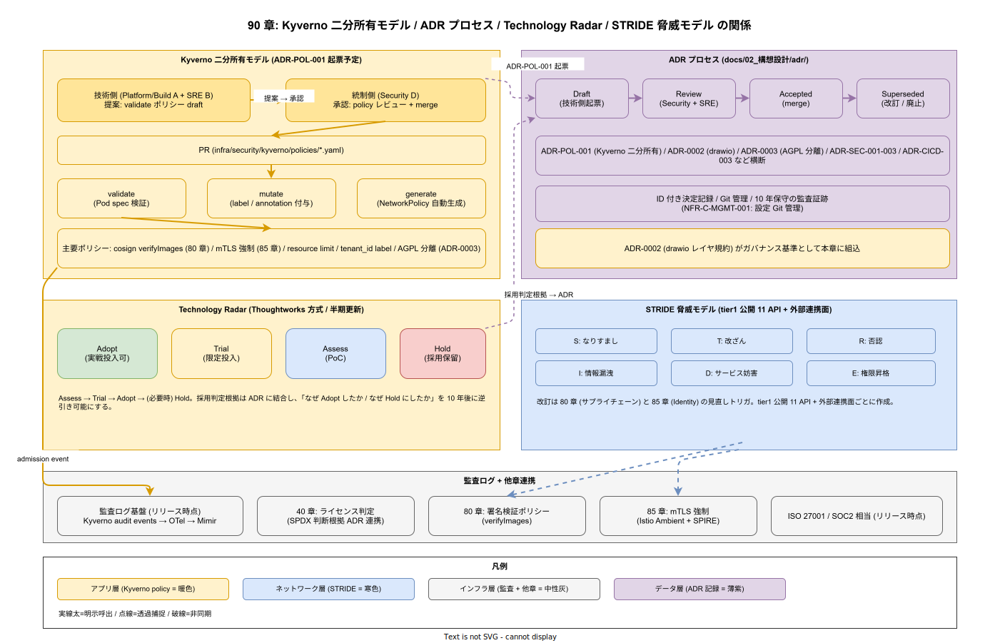

# 01. ガバナンス原則

本ファイルは k1s0 のガバナンス運用（Kyverno ポリシー / ADR プロセス / Technology Radar / 脅威モデル / 監査ログ / コンプライアンス）を実装する際に常に参照する 7 本の原則を定義する。稟議通過後の「意思決定の可監査性」を 10 年維持するため、誰が・いつ・どの根拠で採用したかを ID 付きで残す運用を構造レベルで規定する。



## 原則が必要な理由

JTC におけるガバナンスは、実装者（B / D）と承認者（D）が異なる前提で機能する。この前提を実装層で維持しないと、以下の破綻が常態化する。

- Kyverno の validate ポリシーを実装チームが自由に追加・削除し、統制部門が知らないまま「実質的な統制抜け」が発生する
- 採用した OSS の判断根拠が ADR に残らず、3 年後のバージョンアップ時に「なぜこれを選んだのか」が口伝でしか辿れなくなる
- Technology Radar が初版以降更新されず、Hold 指定の技術が知らない間に新規プロジェクトで採用される
- 脅威モデルが「一度作って棚に仕舞う」状態となり、API 追加時のセキュリティ評価が抜ける
- 監査ログが改竄可能な形式で保存され、インシデント調査時に信頼性が担保できない
- 緊急パッチの際にガバナンスを迂回する裏口運用が恒久化し、平常時の ADR プロセス自体が形骸化する

本原則は、これらの破綻を「Kyverno 二分所有 + ADR 必須 + 72 時間 追認ルール」という仕組みで構造的に防ぐ 7 本である。実装ペースと統制ペースの緊張関係を、プロセスではなく構造で支える。

## 原則 1: Kyverno は validate / mutate の二分所有モデルで運用する（IMP-POL-POL-001）

**Kyverno ポリシーは validate（拒否）と mutate/generate（補助）で所有権を分離する。validate は Security（D）承認必須、mutate/generate は Platform/SRE（B）主導とする。**

ADR-POL-001（本章初版策定時に起票予定）で本モデルを確定する。validate は「開発者の行為を拒否する」権限を持つため、統制側の承認なしに追加できない運用とする。mutate/generate は「開発者の負担を減らす補助」であるため、Platform/SRE が運用スピードで判断する。両者を混ぜると、統制側が補助ポリシーまで承認レビュー責任を負い、承認ボトルネックで開発が詰まる。

- `deploy/kyverno/validate/` : Security CODEOWNERS 必須、PR は Security レビュア承認必須
- `deploy/kyverno/mutate/` / `generate/` : Platform/SRE CODEOWNERS、通常レビューで merge 可
- validate ポリシーの監査モード（audit）での事前観測期間は最低 2 週間（NFR-C-MGMT-002）

## 原則 2: すべての技術決定は ADR 化する（IMP-POL-POL-002）

**OSS 採用、アーキテクチャ変更、ポリシー追加、廃止判断のすべてを ADR として `docs/02_構想設計/adr/` に記録する。ADR なしの merge を CODEOWNERS で拒否する。**

ADR がなければ、10 年保守サイクル中の後続担当者が「なぜこうなっているのか」を追えない。逆にコード変更と同時に ADR を要求すると PR が重くなりすぎるため、先行 ADR（意思決定の提案）と 事後 ADR（緊急パッチ後 72 時間以内の追認）を併存させる。ADR 間の関係性（Supersedes / Superseded-by / Related-to）は ADR 自体に明示リンクを記載し、技術決定の系譜を切らさない。

ADR のテンプレートは `docs/02_構想設計/adr/template.md` に固定し、必須項目は以下とする。

- Context（背景 / 現状の問題）
- Decision（決定事項）
- Consequences（帰結 / トレードオフ）
- Alternatives（検討した代替案）
- Status（Proposed / Accepted / Superseded / Deprecated）
- 対応 IMP-\* ID（本章原則 5 に従って双方向リンク）

## 原則 3: Technology Radar を半期ごとに更新する（IMP-POL-POL-003）

**Thoughtworks 方式の Technology Radar（Adopt / Trial / Assess / Hold）を `docs/02_構想設計/radar/` に配置し、半期ごとに更新する。Hold 指定技術の新規採用は ADR による例外承認必須とする。**

Radar 未運用状態では、個別プロジェクトの採用判断が組織記憶から切り離され、同じ失敗を別チームで繰り返す。半期更新のサイクルは JTC の人事異動サイクル（4 月 / 10 月）に合わせ、新規参画者が Radar を読めば「採用候補」「避けるべき技術」を 30 分で把握できる状態を維持する。

Radar 更新は Security / SRE / DX の三者合議とし、更新時には過去半期の ADR を逆引きして Adopt 昇格・Hold 降格を判断する。Radar の各エントリは該当 ADR への相互リンクを必須とする。

## 原則 4: tier1 公開 11 API と外部連携面ごとに STRIDE 脅威モデルを作成する（IMP-POL-POL-004）

**tier1 公開 11 API それぞれと、外部連携（SAP / SaaS / オンプレ SaaS 等）ごとに STRIDE（Spoofing / Tampering / Repudiation / Information Disclosure / Denial of Service / Elevation of Privilege）脅威モデルを作成し、`docs/05_実装/90_ガバナンス設計/40_脅威モデル_STRIDE/` に格納する。**

脅威モデルを「全体で一枚」作ると粒度が荒れて実装にリンクしない。API 単位・連携単位まで砕くことで、各実装節（`85_Identity設計/` / `80_サプライチェーン設計/` / `60_観測性設計/`）から双方向参照可能になる。API 追加時には脅威モデル追加を PR チェックリストで必須化する。

脅威モデルは改訂のたびに diff を ADR として起票し、統制部門の承認ログとして保全する（NFR-E-SIR-002 に対応）。各脅威エントリは以下を必須項目とする。

- 脅威カテゴリ（STRIDE 6 区分）
- 影響資産（tier1 API / データ / 認証情報）
- 悪用シナリオ（攻撃者視点の具体記述）
- 緩和策と対応 IMP-\* ID（`85_Identity設計/` / `80_サプライチェーン設計/` 等へのリンク）
- 残余リスクと受容状態

## 原則 5: 監査ログは WORM（append only）で保管する（IMP-POL-POL-005）

**Kubernetes audit log / 認証イベント / ポリシー違反検知 / ADR 変更履歴は、append only（WORM: Write Once Read Many）ストレージに保管する。編集・削除を技術的に不可能にする。**

監査ログが編集可能な場合、インシデント調査時に「事件の痕跡が消された疑い」を排除できない。S3 Object Lock（governance / compliance mode）または MinIO Versioning + Retention による改竄防止を採用し、最低保管期間を 7 年とする（ISO 27001 / SOC2 の監査証跡要件に合わせる）。

- Kubernetes audit log : OTel Collector → MinIO（WORM bucket）
- 認証イベント（Keycloak） : 同上
- Kyverno 違反 : 同上
- ADR 変更履歴 : Git commit の永続化 + 署名 commit の強制

## 原則 6: コンプライアンス対応は ISO 27001 / SOC2 相当の統制を実装する（IMP-POL-POL-006）

**認証取得は別プロジェクトとするが、ISO 27001 附属書 A / SOC2 Trust Services Criteria 相当の統制を実装層で満たす。統制項目と IMP-\* ID のマッピングを `99_索引/` に保管する。**

認証取得を目指さない場合でも、統制相当の実装は JTC の内部監査・取引先監査で要求される。後から統制を遡及実装するのは破綻的なコストとなるため、Phase 1c までに 80% 以上をカバーする設計で進める。優先対応は以下の統制領域とする。

- アクセス制御（ISO 27001 A.9 / SOC2 CC6）: `85_Identity設計/` で包括対応
- 暗号化（ISO 27001 A.10 / SOC2 CC6.1）: 保管・転送ともに `85_Identity設計/` の原則 5・6
- サプライヤー管理（ISO 27001 A.15）: `80_サプライチェーン設計/` の SBOM / 署名検証
- インシデント管理（ISO 27001 A.16 / SOC2 CC7）: `ops/runbooks/` と NFR-E-SIR-\*

統制カバレッジは Backstage Scorecards で可視化し、カバレッジ低下は DX メトリクスとして EM レポートに載せる（`95_DXメトリクス/` 連動）。NFR-H-COMP-\* の受け入れ基準を本原則で満たす。

## 原則 7: 緊急例外は 72 時間以内に事後 ADR 化する（IMP-POL-POL-007）

**セキュリティインシデント対応・事故復旧等の緊急パッチで ADR プロセスを迂回した場合、72 時間以内に `D-ADR-*`（Deferred ADR）接頭辞で事後起票し、統制部門の追認レビューを受ける。**

緊急時に ADR プロセスで止まる運用は現実的でない。一方、緊急ルートを恒久化すると平常時の ADR プロセスが形骸化する。72 時間という上限と `D-ADR-` という接頭辞で「緊急で通したが後で追認した」履歴を可視化する。

- 72 時間を超えた場合はインシデントとして扱う（NFR-E-SIR-001）
- `D-ADR-*` は半期の Radar 更新時に傾向分析する（恒常的に発生していれば平常 ADR プロセスの改善対象）
- 追認されなかった D-ADR は 1 週間以内に revert する

## 図表

```
[ガバナンス 7 原則の構造]
  Kyverno 二分所有 → 実装と統制の分離
  ADR 必須         → 10 年保守の可監査性
  Radar 半期       → 組織記憶
  STRIDE           → 脅威網羅
  WORM 監査        → 改竄耐性
  ISO/SOC2 相当    → 外部監査耐性
  72h 事後 ADR     → 緊急例外の可視化
```

ガバナンス 7 原則は時間軸で以下のように機能する。

- 平常時の意思決定 : ADR 起票 → CODEOWNERS レビュー → Kyverno validate 承認（原則 1 / 2）
- 半期サイクル : Technology Radar 更新 → Adopt/Hold 再判定 → 影響 ADR 見直し（原則 3）
- 年次サイクル : STRIDE 脅威モデル全件レビュー → ISO/SOC2 統制カバレッジ確認（原則 4 / 6）
- 常時稼働 : WORM 監査ログへの転送 → 改竄検知アラート（原則 5）
- 緊急時 : D-ADR での追認 → 72 時間以内の統制レビュー → 恒常化の検出（原則 7）

詳細な意思決定フロー図は [img/ガバナンス原則俯瞰.drawio](../img/90_Kyverno二分所有_ADR_Radar.drawio)（Phase 1a 完了時点で svg 作成）を参照。

## 対応 IMP-POL ID

本ファイルで採番する原則レベル ID は以下とする。

- `IMP-POL-POL-001` : Kyverno 二分所有モデル
- `IMP-POL-POL-002` : 全技術決定の ADR 化
- `IMP-POL-POL-003` : Technology Radar 半期更新
- `IMP-POL-POL-004` : tier1 11 API / 外部連携ごとの STRIDE
- `IMP-POL-POL-005` : 監査ログ WORM 保管
- `IMP-POL-POL-006` : ISO 27001 / SOC2 相当統制
- `IMP-POL-POL-007` : 緊急例外の 72 時間事後 ADR

## 対応 ADR / DS-SW-COMP / NFR

- ADR: [ADR-CICD-003](../../../02_構想設計/adr/ADR-CICD-003-kyverno.md)（Kyverno）/ [ADR-0002](../../../02_構想設計/adr/ADR-0002-diagram-layer-convention.md)（図解レイヤ規約）/ [ADR-0003](../../../02_構想設計/adr/ADR-0003-agpl-isolation-architecture.md)（AGPL 分離）/ ADR-POL-001（Kyverno 二分所有モデル、本章初版策定時に起票予定）
- DS-SW-COMP: 全体横断（特定 ID なし）
- NFR: NFR-E-SIR-001（Runbook）/ NFR-E-SIR-002（漏洩報告）/ NFR-H-COMP-\*（コンプライアンス）/ NFR-C-MGMT-001（設定 Git 管理）/ NFR-C-MGMT-002（Flag/Decision 管理）
