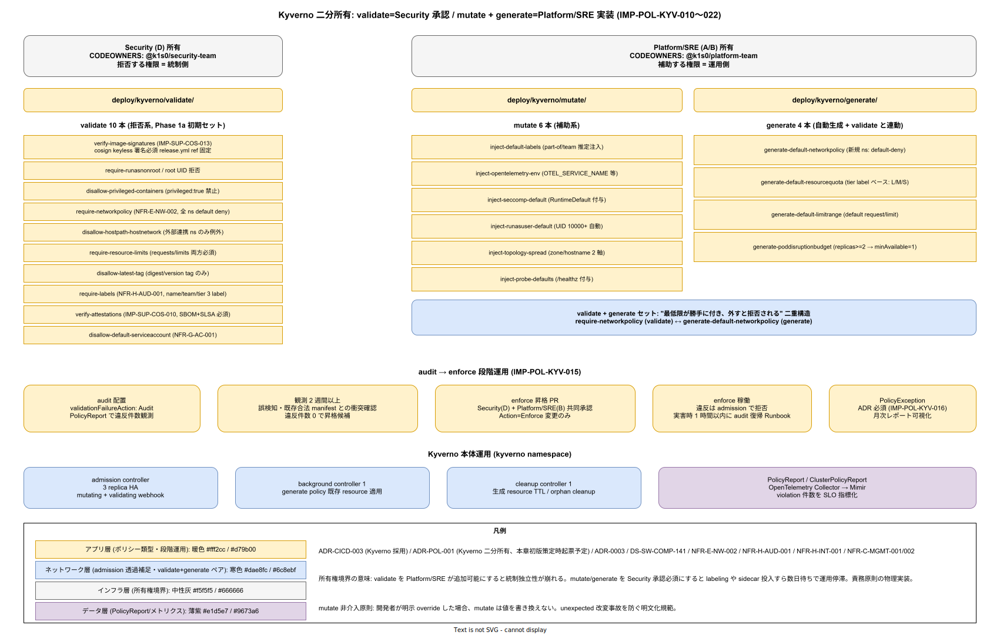

# 01. Kyverno Policy 二分所有設計

本ファイルは k1s0 における Kyverno ポリシーの物理配置と所有権分離を実装段階確定版として示す。90 章方針の IMP-POL-POL-001（Kyverno 二分所有モデル）を、validate / mutate / generate の 3 ポリシー類型と CODEOWNERS 分離、audit → enforce 段階運用で具体化する。ADR-CICD-003（Kyverno 採用）で選定した admission controller を、ADR-POL-001（Kyverno 二分所有モデル、本章初版策定時に起票予定）の運用形態で確定する。



Kubernetes の admission policy は「クラスタ全体の挙動を定義する」層であり、1 つの validate policy 追加が全 namespace の deploy を止める影響力を持つ。この権限を Platform/SRE と Security が混然一体で保有すると、どちらか一方の判断で全社デプロイがブロックされる事故、または統制抜けが両者のレビュー盲点に落ちる事故が発生する。本節は「validate は Security 所有 / mutate・generate は Platform/SRE 所有」の分離により、統制権限と運用スピードを構造レベルで両立する設計を確定する。

崩れると、Platform/SRE が validate を自由追加して開発者が merge できなくなる、あるいは Security が mutate まで承認対象とし承認ボトルネックで運用停滞する、の二者択一的破綻が発生する。80 章 cosign 検証 policy（IMP-SUP-COS-013）や 85 章 mTLS 強制 policy（NFR-E-ENC-001）の運用も本節の所有権境界に依存する。

## OSS リリース時点での確定範囲

- リリース時点: validate / mutate / generate 3 類型ディレクトリ分離、CODEOWNERS 分離、audit 観測モードで初期セット 10 本を deploy
- リリース時点: enforce モード昇格（観測 2 週間以上経た policy から順次）、policy exception の運用ルール確立
- リリース時点: policy lifecycle 管理の自動化（違反率が閾値下回った policy の自動 enforce 提案）

## 3 類型ディレクトリと所有権境界

Kyverno ポリシーは `deploy/kyverno/` 配下に 3 類型で分割配置する（IMP-POL-KYV-010）。

- `deploy/kyverno/validate/` : validate ClusterPolicy（拒否系）。Security CODEOWNERS 必須、PR は Security レビュア承認必須
- `deploy/kyverno/mutate/` : mutate ClusterPolicy（自動修正・補助）。Platform/SRE CODEOWNERS、通常レビューで merge 可
- `deploy/kyverno/generate/` : generate ClusterPolicy（自動生成・補助）。Platform/SRE CODEOWNERS、通常レビューで merge 可

CODEOWNERS は以下で固定する（IMP-POL-KYV-011）。validate の変更には Security（D）のレビュー + 承認が必須で、Platform/SRE 側の rubber-stamp 承認を防ぐ。mutate / generate は Platform/SRE（A / B）承認で進められ、Security は情報 CC（通知のみ）とする。

```
# .github/CODEOWNERS 抜粋
/deploy/kyverno/validate/  @k1s0/security-team
/deploy/kyverno/mutate/    @k1s0/platform-team
/deploy/kyverno/generate/  @k1s0/platform-team
```

この分離は「拒否する権限は統制側、補助する権限は運用側」という責務原則の物理実装である。validate を Platform/SRE が追加できると、SRE 判断で開発者行為を拒否でき統制の独立性が損なわれる。逆に mutate / generate を Security 承認必須にすると、labeling 補助や sidecar injection 設定の追加すら数日レビュー待ちとなり運用が停滞する。

## validate ポリシー: 拒否系の初期 10 本

validate ポリシーは リリース時点 で 10 本を初期セットとして deploy する（IMP-POL-KYV-012）。各 policy は 80 章 / 85 章 / 60 章の実装方針から演繹され、根拠 ADR と対応 IMP ID を policy の annotations に記録する。

- `verify-image-signatures.yaml` (IMP-SUP-COS-013 連動): ghcr.io/k1s0/* image の cosign keyless 署名必須、subject は release.yml ref 固定
- `require-runasnonroot.yaml`: SecurityContext で runAsNonRoot=true、root UID での起動を拒否
- `disallow-privileged-containers.yaml`: privileged: true を禁止
- `require-networkpolicy.yaml` (NFR-E-NW-002 連動): 全 namespace に NetworkPolicy 必須、デフォルト deny
- `disallow-hostpath-hostnetwork.yaml`: HostPath / HostNetwork 使用を拒否（外部連携 namespace のみ例外）
- `require-resource-limits.yaml`: requests / limits 両方必須、memory / cpu 双方対象
- `disallow-latest-tag.yaml`: image tag `latest` 禁止、digest or version tag のみ許可
- `require-labels.yaml` (NFR-H-AUD-001 連動): `app.kubernetes.io/name` / `team` / `tier` 3 label 必須
- `verify-attestations.yaml` (IMP-SUP-COS-010 連動): SBOM + SLSA Provenance attestation 必須
- `disallow-default-serviceaccount.yaml` (NFR-G-AC-001 連動): default ServiceAccount 使用禁止、Pod 専用 SA を強制

10 本のうち `verify-image-signatures` / `verify-attestations` / `require-networkpolicy` は 80 章 / 85 章と直接結合し、validate policy を外すと tier の防御線が崩れる構造依存関係にある。

## mutate ポリシー: 補助系と所有権

mutate ポリシーは「開発者が意識せずとも統制要件を満たす」ための補助で、Platform/SRE が運用速度で判断する（IMP-POL-KYV-013）。初期 6 本を リリース時点 で deploy する。

- `inject-default-labels.yaml`: `app.kubernetes.io/part-of` / `team` label が未設定の場合に git-ref から推定して注入
- `inject-opentelemetry-env.yaml`: OTEL_* 環境変数（OTEL_SERVICE_NAME / OTEL_EXPORTER_OTLP_ENDPOINT）を自動注入
- `inject-seccomp-default.yaml`: SecurityContext.seccompProfile = RuntimeDefault を追加
- `inject-runasuser-default.yaml`: runAsUser 未指定 Pod に 10000 以上の UID を設定
- `inject-topology-spread.yaml`: topologySpreadConstraints の zone / hostname の 2 軸を自動付与
- `inject-probe-defaults.yaml`: liveness / readiness probe 未設定時にデフォルト（/healthz）を追加

mutate は「開発者の書き忘れを救う」補助であり、validate のような拒否権限を持たない。開発者が明示的に設定を override した場合、mutate は介入しない。この区別を明文化することで、mutate 由来の unexpected 改変事故（開発者が設定したつもりの値が勝手に書き換えられる）を防ぐ。

## generate ポリシー: 自動生成

generate ポリシーは「namespace 作成時に NetworkPolicy / ResourceQuota / LimitRange を自動生成する」類の補助で、リリース時点 で 4 本を deploy する（IMP-POL-KYV-014）。

- `generate-default-networkpolicy.yaml`: 新規 namespace 作成時に default-deny NetworkPolicy を自動生成
- `generate-default-resourcequota.yaml`: namespace の tier label に応じた ResourceQuota（tier1=large / tier2=medium / tier3=small）を自動生成
- `generate-default-limitrange.yaml`: Pod / Container の default request / limit を自動生成
- `generate-poddisruptionbudget.yaml`: Deployment の replicas >= 2 の場合に minAvailable=1 の PDB を自動生成

generate は validate と連動する。`require-networkpolicy` validate policy（前述）は NetworkPolicy の存在を要求し、`generate-default-networkpolicy` generate policy は最低限の NetworkPolicy を自動生成する。validate 単独だと開発者が NetworkPolicy を手書きする必要があり、generate 単独だと違反 namespace の検出ができない。両者のセットで初めて「最低限の統制が勝手に付き、外すと拒否される」状態が成立する。

## audit → enforce の段階昇格

新規 validate policy は必ず `validationFailureAction: Audit` で配置し、最低 2 週間の観測期間を経てから `Enforce` に昇格する（IMP-POL-KYV-015）。2 週間は既存の合法的 manifest が違反と誤検知されるケースを発見するための最小期間で、Kyverno の PolicyReport リソースで違反件数 / 対象 resource を可視化する。

- 観測期間中の判定基準: 意図しない manifest で違反件数が 0 件に収束したら enforce 昇格候補
- enforce 昇格 PR: Security（D）+ Platform/SRE（B）の共同承認、`validationFailureAction: Enforce` への変更のみ
- 例外運用: PolicyException リソースで特定 namespace / resource を除外、例外追加には ADR 必須（IMP-POL-KYV-016）
- rollback: enforce 後に実害が発生した場合、1 時間以内に audit に戻す Runbook を `ops/runbooks/incidents/kyverno/` に配置

この段階昇格は NFR-C-MGMT-002（Flag/Decision Git 管理）の承認履歴要件を満たす。Policy の audit → enforce 移行は Git commit + PR レビューで残り、10 年後の後任者も「なぜ enforce されているか」を追跡できる。

## Kyverno 自身の運用

Kyverno 本体は `kyverno` namespace に admission controller 3 replica + background controller 1 replica + cleanup controller 1 replica で配置する（IMP-POL-KYV-017）。Helm chart は `deploy/charts/kyverno/` に pin した version を置き、Renovate が major / minor 更新を週次で検知する。

- admission controller: mutating / validating webhook の処理、3 replica HA
- background controller: generate policy の既存 resource への適用
- cleanup controller: 生成済み resource の TTL / orphan cleanup
- Monitoring: PolicyReport / ClusterPolicyReport を OpenTelemetry Collector で Mimir に送信、violation 件数を SLO 指標化
- バックアップ: policy 定義は Git が source of truth、cluster state は etcd snapshot に同期

Kyverno のバージョン追従は 40 章 Renovate で管理し、major 昇格は staging で 2 週間の soak test を経る。major 間の CRD 破壊変更には注意を払い、ADR-CICD-003 改訂で運用方針変更を記録する。

## 受け入れ基準

- `deploy/kyverno/` 配下が validate / mutate / generate の 3 ディレクトリに分離され、CODEOWNERS で所有権が明示
- validate 10 本 / mutate 6 本 / generate 4 本の初期セットが リリース時点点で deploy 済
- 全 validate policy が audit 観測 2 週間を経てから enforce 昇格
- PolicyException 追加には ADR が必須、例外件数が月次レポートで可視化
- 80 章 cosign / 85 章 mTLS / NFR-E-NW-002 NetworkPolicy と Kyverno policy が構造結合している

## RACI

| 役割 | 責務 |
|---|---|
| Security（主担当 / D） | validate ポリシーの策定・承認、PolicyException 判定、enforce 昇格承認 |
| Platform/SRE（共担当 / A・B） | mutate / generate ポリシーの策定・運用、Kyverno 本体の HA 運用 |
| DX（I） | 開発者への policy 違反通知 UX、Backstage Scorecards 連動 |

## 対応 IMP-POL-KYV ID

| ID | 主題 | 適用段階 |
|---|---|---|
| IMP-POL-KYV-010 | `deploy/kyverno/` を validate / mutate / generate の 3 類型で分離 | 採用初期 |
| IMP-POL-KYV-011 | CODEOWNERS で所有権分離（validate=Security、mutate/generate=Platform/SRE） | 採用初期 |
| IMP-POL-KYV-012 | validate 10 本の初期セット、80 章 / 85 章 / 60 章と構造結合 | 採用初期 |
| IMP-POL-KYV-013 | mutate 6 本で補助系、開発者の書き忘れ救済 | 採用初期 |
| IMP-POL-KYV-014 | generate 4 本で namespace 作成時の最低限統制自動付与 | 採用初期 |
| IMP-POL-KYV-015 | audit 観測 2 週間 → enforce 昇格の段階運用 | 採用初期 |
| IMP-POL-KYV-016 | PolicyException による例外適用、ADR 必須 | 採用初期 |
| IMP-POL-KYV-017 | Kyverno 本体の HA 3 replica 構成と Renovate バージョン追従 | 採用初期 |
| IMP-POL-KYV-018 | PolicyReport の OTel 連携、violation 件数の SLO 指標化 | 1a / 1b |
| IMP-POL-KYV-019 | enforce rollback Runbook（1 時間以内に audit 復帰） | 採用初期 |
| IMP-POL-KYV-020 | validate / generate セットによる「付かず拒否」二重構造 | 採用初期 |
| IMP-POL-KYV-021 | major 昇格の staging soak 2 週間、ADR-CICD-003 改訂での方針記録 | 採用初期 |
| IMP-POL-KYV-022 | 違反率低下 policy の自動 enforce 提案（リリース時点） | 採用後の運用拡大時 |

## 対応 ADR / DS-SW-COMP / NFR

- [ADR-CICD-003](../../../02_構想設計/adr/ADR-CICD-003-kyverno.md)（Kyverno 採用）/ ADR-POL-001（Kyverno 二分所有モデル、本章初版策定時に起票予定）/ [ADR-0003](../../../02_構想設計/adr/ADR-0003-agpl-isolation-architecture.md)（AGPL 分離）
- DS-SW-COMP-141（多層防御統括）
- NFR-C-MGMT-001（設定 Git 管理）/ NFR-C-MGMT-002（Flag/Decision 管理）/ NFR-E-NW-002（NetworkPolicy テナント隔離）/ NFR-H-AUD-001（監査ログ完整性）/ NFR-H-INT-001（cosign 署名）

## 関連章

- `20_ADR_プロセス/` — policy 追加時の ADR 起票フロー
- `40_脅威モデル_STRIDE/` — 脅威緩和策としての validate policy マッピング
- `../80_サプライチェーン設計/10_cosign署名/` — verify-image-signatures policy 仕様
- `../85_Identity設計/` — NetworkPolicy / mTLS policy 連動
