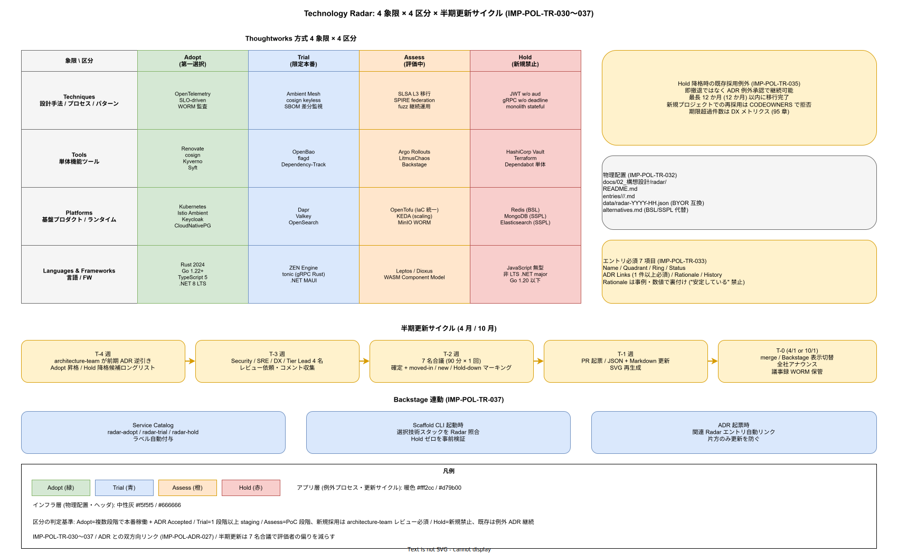

# 01. Technology Radar 運用設計

本ファイルは k1s0 における Technology Radar の物理配置・4 区分判定基準・半期更新プロセス・Hold 例外承認の運用を実装フェーズ確定版として確定する。90 章方針の IMP-POL-POL-003（Technology Radar 半期更新）を、`docs/02_構想設計/radar/` のディレクトリ構造、Thoughtworks 方式の 4 象限 × 4 区分、ADR との双方向リンク、Backstage プラグインでの可視化で具体化する。

Radar 未運用状態の JTC では、個別プロジェクトの採用判断が組織記憶から切り離される。Aチームが 3 年前に捨てた OSS を B チームが再採用し、同じ失敗を繰り返す。Radar は「このプロジェクトで現在推奨 / 試用 / 評価 / 禁止している技術」を 1 枚のスナップショットに凝縮し、新規参画者が 30 分で組織の技術観を把握できる状態を維持する装置である。

崩れると、初版作って放置した死んだ Radar だけが残り、Hold 指定技術が新規プロジェクトで採用される、過去の Adopt が実態に合わず空文化する、といった事故が常態化する。半期更新サイクル、判定基準の明文化、ADR との結合が本節の構造的防衛線となる。

## Phase 確定範囲

- Phase 1a: 初版 Radar 作成、4 象限 × 4 区分で 40-60 エントリ、ADR 相互リンク確立
- Phase 1b: Backstage プラグイン統合、半期更新サイクル定着、Hold 降格 / Adopt 昇格の運用経験蓄積
- Phase 1c: チーム別 Radar（tier1 専用 / tier3 専用）との合成、外部公開版（OSS マーケティング用途）

## 4 象限と 4 区分

Thoughtworks 方式を踏襲し、4 象限（技術カテゴリ）× 4 区分（採用段階）の 16 セルで Radar を構成する（IMP-POL-TR-030）。象限は以下で固定する。

- **Techniques**: 設計手法・プロセス・アーキテクチャパターン（例: OpenTelemetry / SLO-driven / Ambient Mesh / WORM 監査）
- **Tools**: 単体で機能する開発 / 運用ツール（例: Renovate / cosign / Kyverno / Syft / OpenBao）
- **Platforms**: 基盤プロダクト / ランタイム（例: Kubernetes / Istio Ambient / Dapr / CloudNativePG / Keycloak）
- **Languages & Frameworks**: 言語 / フレームワーク（例: Rust 2024 / Go 1.22+ / TypeScript 5 / .NET 8 LTS / ZEN Engine）

4 区分の判定基準を以下で固定する（IMP-POL-TR-031）。判定は「k1s0 プロジェクト内での採用段階」であり、業界一般の評価とは独立する。

- **Adopt**: k1s0 の新規実装で第一選択。複数 Phase で本番稼働実績、ADR で Accepted 状態。例: Kubernetes / Istio Ambient / Keycloak
- **Trial**: 限定範囲で本番採用、学習コストを支払ってでも拡大を推奨。1 Phase 以上の staging 運用経験。例: ZEN Engine / flagd / OpenBao
- **Assess**: 評価中、PoC 段階。新規プロジェクトでは採用前に Architecture team レビュー必須。例: Argo Rollouts / SPIRE federation / 新興 observability ツール
- **Hold**: 新規採用禁止。既存採用は ADR 例外承認で継続可。例: Redis（BSL 転換）/ Elasticsearch（SSPL）/ HashiCorp Terraform（BSL）/ JWT without aud / gRPC without deadline

Hold は「過去に検討したが採用しない」「かつて採用したが撤退する」技術を明示する区分で、禁止理由を ADR に記録することを必須とする。

## 物理配置とデータ形式

Radar は `docs/02_構想設計/radar/` に配置し、データと表示を分離する（IMP-POL-TR-032）。

- `docs/02_構想設計/radar/README.md` : 現行 Radar の概要と最新更新日
- `docs/02_構想設計/radar/entries/<quadrant>/<ring>/<entry>.md` : 各エントリの詳細（採用経緯 / ADR リンク / 評価結果）
- `docs/02_構想設計/radar/data/radar-YYYY-HH.json` : 半期スナップショット（Thoughtworks BYOR 互換 JSON 形式）
- `docs/02_構想設計/radar/alternatives.md` : BSL / SSPL 転換 OSS の代替マッピング（40 章 IMP-DEP-LIC-035 連動）

スナップショットを半期ごとに JSON で固定する理由は、時系列の差分を機械的に追跡可能にするためである。`radar-2026-H1.json` / `radar-2026-H2.json` を並べれば、どの技術が Adopt 昇格し、どの技術が Hold に落ちたかが diff で見える。JSON は Thoughtworks 公開の BYOR（Build Your Own Radar）互換形式とし、SVG 描画も同ツールチェーンで自動化する。

## 各エントリの必須項目

Radar エントリの Markdown は以下 7 項目を必須とする（IMP-POL-TR-033）。

- **Name**: 技術名（一意）
- **Quadrant**: Techniques / Tools / Platforms / Languages & Frameworks のいずれか
- **Ring**: Adopt / Trial / Assess / Hold のいずれか
- **Status**: `new`（今期追加）/ `moved-in`（今期区分変更）/ `no-change`（前期と同じ）
- **ADR Links**: 関連 ADR の ID（必須、1 件以上）
- **Rationale**: 当該区分に配置した根拠（3-5 文）
- **History**: 過去区分の推移（例: Assess 2025-H1 → Trial 2025-H2 → Adopt 2026-H1）

Rationale には採用根拠を事例・数値・出典で裏付ける。「安定しているから」ではなく「tier1 Rust で 6 か月の staging 稼働、p99 20ms、0 incident」のような定量記述を要求する。この密度が維持されれば、Radar は単なるラベル羅列ではなく「判断の辞書」として機能する。

## 半期更新サイクル

Radar は年 2 回（4 月 / 10 月）更新する（IMP-POL-TR-034）。JTC の人事異動サイクル（4 月入社 / 10 月期中入社）に合わせ、新規参画者が半期ごとにフレッシュな Radar を読める状態を維持する。

更新プロセスは以下を固定する。

- T-4 週: architecture-team が前期 ADR を逆引き、Adopt 昇格 / Hold 降格候補のロングリストを作成
- T-3 週: Security / SRE / DX / Tier Lead に候補レビュー依頼、コメント収集
- T-2 週: 合議会議（90 分 × 1 回）で候補を確定、変更エントリを `moved-in` / `new` / `Hold-down` でマーキング
- T-1 週: PR 起票、Radar JSON + エントリ Markdown を更新、SVG 再生成
- T-0（4/1 or 10/1）: merge、Backstage プラグインの表示切替、全社アナウンス

更新会議には Security / SRE / DX の 3 役に加え、各 tier の Lead（tier1 Rust / tier1 Go / tier2 / tier3 の 4 名）が参加する。7 名の合議で「評価者の偏り」を減らす。会議録は `docs/02_構想設計/radar/history/YYYY-HH-minutes.md` に WORM 保管する。

## Hold 降格時の既存採用例外

Hold 降格された技術の既存採用（k1s0 内で稼働中のシステム）は、即撤退ではなく ADR 例外承認で継続可能とする（IMP-POL-TR-035）。理由は「稼働中システムの即時置換はリスク過大」で、例: Redis が Hold 降格しても即日 Valkey 移行は現実的でない。

- 例外 ADR: `ADR-<領域>-XXX: Hold 降格後の <技術> 継続採用例外` として起票
- 期限: 最長 2 Phase（通常 12 か月）、期限内に移行計画と代替採用 ADR を作成
- 新規プロジェクトでの再採用: 禁止、違反は CODEOWNERS で検出
- Renovate 連動: Hold 降格技術の major 更新 PR は自動拒否し、移行 PR を優先

この設計により「Hold は努力目標ではなく期限付き移行命令」となる。期限超過は 95 章 DX メトリクスに「Hold 超過採用件数」として計上し、EM レポートで可視化する（IMP-POL-TR-036）。

## Backstage 連動と開発者 UX

Backstage プラグイン `backstage-plugin-tech-radar` で `docs/02_構想設計/radar/data/radar-latest.json` を読み込み、開発者ポータル上で可視化する（IMP-POL-TR-037）。Scaffold CLI（20 章）が新規サービス生成時に採用技術を Radar に照合し、Hold 技術を検出したら警告を出す UX を提供する。

- Backstage Service Catalog の各エンティティに `radar-adopt` / `radar-trial` / `radar-hold` ラベルを自動付与
- Scaffold CLI 起動時: 選択中の技術スタック（Rust / Go / Postgres 等）を Radar 照合、Hold がゼロであることを事前検証
- ADR 起票時: 関連 Radar エントリを自動リンク、片方のみ更新を防ぐ

この連動により「Radar を見る」習慣が開発作業フローに組込まれ、ページを開かなくても UX 側から Radar が効く。

## 外部公開版の検討（Phase 1c）

JTC の OSS マーケティングとして、Radar の公開版（機密情報除去済）を `docs/02_構想設計/radar/public/` で維持する選択肢を Phase 1c で検討する。公開判断は事業責任者 + architecture-team + Legal の 3 者合議とし、採用判断 ADR を起票する。公開する場合は 6 か月遅延版（最新版は非公開）とし、競合優位性を保つ。

## 受け入れ基準

- 初版 Radar が 4 象限 × 4 区分で 40-60 エントリ、全エントリに ADR リンクと Rationale が記述
- 半期更新サイクル（4 月 / 10 月）が定着、最低 2 回の更新を経て運用経験蓄積
- Hold 降格技術の例外 ADR プロセスが稼働、期限超過件数が DX メトリクスに計上
- Backstage プラグインで Radar が可視化、Scaffold CLI が Hold 警告を発動
- BSL / SSPL 転換 OSS の代替マッピングが `alternatives.md` に維持

## RACI

| 役割 | 責務 |
|---|---|
| Architecture team（主担当 / A） | Radar 編集、半期更新プロセス運営、合議会議進行 |
| Security（共担当 / D） | Hold 判定（セキュリティ観点）、BSL / SSPL 監視、AGPL 連動 |
| SRE（共担当 / B） | Adopt 昇格判定（本番稼働実績の提示）、運用観点レビュー |
| DX（共担当 / C） | Backstage 連動、Scaffold CLI 統合、開発者 UX |
| Tier Lead（I） | 各 tier の採用技術観点、合議会議参加 |

## 対応 IMP-POL-TR ID

| ID | 主題 | Phase |
|---|---|---|
| IMP-POL-TR-030 | 4 象限（Techniques / Tools / Platforms / Languages & Frameworks）固定 | 1a |
| IMP-POL-TR-031 | 4 区分（Adopt / Trial / Assess / Hold）の判定基準 | 1a |
| IMP-POL-TR-032 | `docs/02_構想設計/radar/` 配下のディレクトリ構造と JSON スナップショット | 1a |
| IMP-POL-TR-033 | エントリ必須 7 項目と Rationale の定量密度要求 | 1a |
| IMP-POL-TR-034 | 半期更新サイクル（4 月 / 10 月）と 7 名合議 | 1a / 1b |
| IMP-POL-TR-035 | Hold 降格時の既存採用 ADR 例外、最長 2 Phase | 1b |
| IMP-POL-TR-036 | Hold 超過採用件数を DX メトリクスに計上 | 1b |
| IMP-POL-TR-037 | Backstage プラグイン連動 + Scaffold CLI Hold 警告 | 1b / 1c |

## 対応 ADR / DS-SW-COMP / NFR

- [ADR-0001](../../../02_構想設計/adr/ADR-0001-istio-ambient-vs-sidecar.md)（Istio Ambient 選定）/ [ADR-0003](../../../02_構想設計/adr/ADR-0003-agpl-isolation-architecture.md)（AGPL 分離）/ ADR-POL-001（Kyverno 二分所有モデル、本章初版策定時に起票予定）
- DS-SW-COMP: 全体横断（特定 ID なし）
- NFR-C-MGMT-001（設定 Git 管理）/ NFR-C-MGMT-002（Flag/Decision Git 管理）/ NFR-C-ENV-002（運用ドキュメント鮮度）/ NFR-C-MNT-002（OSS バージョン追従）

## 関連章

- `20_ADR_プロセス/` — ADR と Radar の双方向リンク
- `10_Kyverno_Policy/` — Hold 技術の policy enforce 連動
- `../40_依存管理設計/30_ライセンス判定/` — BSL / SSPL 代替マッピング
- `../50_開発者体験設計/` — Backstage 連動 / Scaffold CLI 警告
