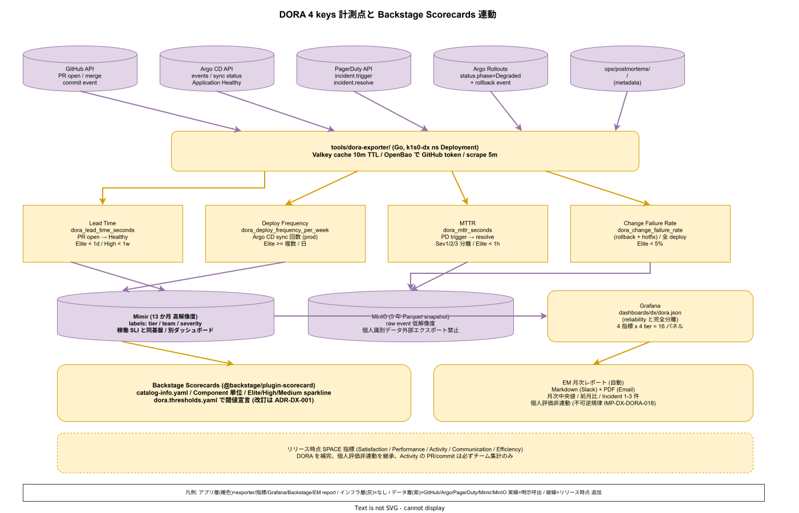

# 01. DORA 4 keys 計測

本ファイルは k1s0 モノレポにおける DORA 4 keys（Lead Time for Changes / Deploy Frequency / MTTR / Change Failure Rate）の計測基盤と Backstage Scorecards への接続、EM 向けレポート運用を実装段階確定版として示す。95 章方針 IMP-DX-POL-001（稼働 SLI との分離）および ADR-DX-001（起票予定、DX メトリクス分離原則）を物理レベルに落とし込み、GitHub API / Argo CD API / Prometheus（Mimir）から独自 exporter を経由して Backstage Scorecards に到達する経路を確定させる。`03_要件定義/50_開発者体験/03_DevEx指標.md` の DORA Four Keys 要件をこの節で満たす。

DORA 4 keys は 10 年以上の業界研究で「開発組織の健全性と事業成果の相関」が検証されている 4 指標である。しかし計測方法が揺らぐと、組織間比較もチーム内推移も無意味な数字となる。k1s0 は 4 指標それぞれのデータソースと集計式を本節で厳密に固定し、解釈の揺らぎを排除する。稼働 SLI（60 章）とはダッシュボードもディレクトリも分離し、可用性 SLO と Lead Time を混ぜない運用規律を守る。

## Lead Time for Changes: PR open → deploy 完了

Lead Time は「コード変更が PR として open されてから、本番環境に deploy が完了するまで」の時間を計測する（IMP-DX-DORA-010）。Elite = 1 日未満、High = 1 週間未満、Medium = 1 か月未満、Low = それ以上、の 4 象限で評価する（DORA State of DevOps 2024 基準）。

- **データソース**: GitHub API（PR open / merge / commit）+ Argo CD API（sync 完了時刻）
- **集計式**: `deploy完了時刻 - PR open 時刻` を PR 単位で算出、中央値 / p50 / p95 を週次で集計
- **起点 commit**: PR の最初の commit ではなく PR open イベント（コードレビュー時間を含む）
- **終点 deploy**: Argo CD Application の `status.sync.status=Synced` かつ `status.health.status=Healthy` に遷移した時刻
- **tier 別集計**: tier1 / tier2 / tier3 別に独立集計、単一数値に潰さない

「コミット起点でなく PR open 起点」とする根拠は、コードレビュー時間自体が Lead Time の重要構成要素であり、レビュー遅延をメトリクスで可視化するためである。起点を commit にすると「PR を作らずブランチ上で寝かせる」行動を誘発し、実態と乖離する。

## Deploy Frequency: Argo CD sync 回数

Deploy Frequency は「本番環境への deploy が単位時間あたり何回発生したか」を計測する（IMP-DX-DORA-011）。Elite = 複数回 / 日、High = 週次、Medium = 月次、Low = 四半期以上、の 4 象限で評価する。

- **データソース**: Argo CD `events` API（`Sync` イベント）
- **集計式**: 週次 deploy 回数の合計、tier 別に分離
- **filter**: `prod` 環境の Application のみ、`dev` / `staging` の sync は除外
- **rollback 計上**: rollback による sync は deploy としてカウント（失敗した deploy も頻度に含む）
- **config-only sync**: マニフェスト変更のみの sync（新 image なし）は Deploy Frequency から除外

tier 別分離は「tier1 は慎重に deploy、tier3 は高頻度に deploy」という 採用側組織の運用の設計意図を反映する。全 tier を合算すると tier3 の高頻度 deploy で tier1 の注意深さが隠蔽されるため、必ず tier 別グラフで表示する。

## MTTR: Incident 開始 → 解消

MTTR（Mean Time To Restore）は「Incident ID 付きの障害が発生してから解消されるまで」の時間を計測する（IMP-DX-DORA-012）。Elite = 1 時間未満、High = 1 日未満、Medium = 1 週間未満、Low = 1 か月以上、の 4 象限で評価する。

- **データソース**: `ops/postmortems/<incident-id>/` のメタデータ + PagerDuty API
- **集計式**: `Incident resolve 時刻 - Incident trigger 時刻` を Incident 単位で算出、中央値
- **起点**: PagerDuty の `incident.trigger` イベント
- **終点**: PagerDuty の `incident.resolve` イベント（postmortem commit 時刻ではない）
- **Severity 別分離**: Sev1 / Sev2 / Sev3 を独立集計、NFR-C-IR-001 の応答時間 SLO と連動
- **除外**: 計画停止（メンテナンス）と sub-minor（自動復旧済 / 影響なし）は除外

postmortem commit 時刻を終点にしない根拠は、ユーザ影響が消えた時点が実質的な MTTR であり、事後文書作成時間を混ぜるべきでないからである。一方で Sev1 の postmortem 化は NFR-C-IR-001 で義務化し、データ整合性は確保する。

## Change Failure Rate: rollback 回数 / deploy 回数

Change Failure Rate は「deploy のうち障害に至った割合」を計測する（IMP-DX-DORA-013）。Elite = 5% 未満、High = 10% 未満、Medium = 15% 未満、Low = それ以上、の 4 象限で評価する。

- **データソース**: Argo Rollouts `status.phase=Degraded` + Argo CD rollback event + Incident 紐付け
- **集計式**: `(rollback 実行回数 + hotfix deploy 回数) / 全 deploy 回数` を週次で算出
- **rollback 定義**: Argo Rollouts の AnalysisRun が failed → automated rollback した case
- **hotfix 定義**: prod branch に直接 push され、通常 PR フローをバイパスした deploy
- **tier 別分離**: Deploy Frequency と同じく tier1 / tier2 / tier3 別に集計

hotfix を失敗に含める根拠は、「障害後の手動修正 deploy」も失敗の派生だからである。hotfix を成功として扱うと、障害発生と迅速対応で Change Failure Rate が改善したように見える反直感的な挙動が起きる。

## 計測基盤: tools/dora-exporter/

4 指標のデータソースを統合する独自 exporter を `tools/dora-exporter/` 配下に Go で実装する（IMP-DX-DORA-014）。Prometheus exposition format で metrics を expose し、Mimir にスクレイプされる。

- **言語**: Go（tier1-go-dev チームが所有、レビュー負担を分散）
- **配置**: `tools/dora-exporter/`、go.mod 独立
- **実行形態**: Kubernetes Deployment、`k1s0-dx` namespace
- **scrape 頻度**: 5 分間隔、GitHub / Argo CD API rate limit を考慮
- **metrics 命名**: `dora_lead_time_seconds`、`dora_deploy_frequency_per_week`、`dora_mttr_seconds`、`dora_change_failure_rate`
- **label**: `tier` / `team` / `severity`（MTTR 用）

exporter のソースコード規約は CLAUDE.md の「1 行上コメント必須」「500 行以内」に準拠する。GitHub API の token は OpenBao（30 節）から取得し、環境変数 hard-code を禁止する。rate limit 対策として GitHub API レスポンスは Redis（Valkey）に 10 分 TTL でキャッシュする。

## Grafana dashboard: 稼働 SLI と分離

dashboard は `dashboards/dx/dora.json` に commit し、稼働 SLI の `dashboards/reliability/` と完全に分離する（IMP-DX-DORA-015）。同一ダッシュボード表示を禁止する規律を ADR-DX-001 で固定する。

- **パネル構成**: 4 指標 × 4 tier = 16 パネル、週次推移と 4 象限配置
- **時系列幅**: 過去 13 週（四半期 + 1 週バッファ）をデフォルト表示
- **ドリルダウン**: 指標クリックで該当 PR / Incident にリンク
- **比較軸**: 自チーム vs 組織平均 の 2 系列を重ね表示
- **閾値線**: Elite / High / Medium の 3 水準を horizontal line で表示

dashboard アクセスは全開発者に開放し、EM / 経営層向けの view は別 folder（`dashboards/dx/em/`）に分離する。開発者が自チームの数値を日常的に参照できる UX が DX メトリクスの前提となる。

## Backstage Scorecards 統合

各 Component（tier1 Pod / tier2 サービス / tier3 アプリ）は Backstage の `catalog-info.yaml` で Scorecard を持つ（IMP-DX-DORA-016）。ADR-BS-001 の Backstage 導入方針と同期し、Component ページを開いた瞬間に DORA 4 keys が表示される。

- **Scorecard plugin**: `@backstage/plugin-scorecard`
- **閾値定義**: `tools/dora-exporter/dora.thresholds.yaml` に Elite / High / Medium の閾値を宣言的に保存
- **Component 粒度**: Pod 単位 / サービス単位で個別 Scorecard、tier 単位の集計は別画面
- **履歴**: 過去 4 四半期の推移を sparkline 表示

閾値変更は ADR-DX-001 改訂を伴う。安易な閾値緩和で指標を偽装することを禁止する規律を文書化する。

## EM レポートと個人評価非連動

月次で EM に自動レポートを送付する（IMP-DX-DORA-017）。レポート送付経路は GitHub Actions + Slack / Email で完全自動化し、人手編集の余地を排除する。

- **送付頻度**: 月次 1 日朝（JST 9:00）
- **送付先**: 各 tier EM / 組織 VP of Engineering
- **内容**: 4 指標の月次中央値、前月比、4 象限評価、特筆すべき Incident 1-3 件
- **形式**: Markdown（Slack）+ PDF（Email）の 2 系統

重要な設計規律として、DORA 4 keys を個人評価に連動させることを絶対に禁止する（IMP-DX-DORA-018）。DORA State of DevOps Report および SPACE 論文原典が一貫して警告する通り、個人評価への連動はメトリクスの gaming（数値偽装行動）を誘発し、チーム協調を破壊する。95 章方針ファイルにも同規律を明記し、ADR-DX-001 で不可逆な規範として確定する。

## リリース時点: SPACE 指標追加

リリース時点（チーム拡大時）に SPACE 指標（Satisfaction / Performance / Activity / Communication / Efficiency）を追加する（IMP-DX-DORA-019）。SPACE は DORA を補完する多面的指標であり、Developer Experience の定性側面を捉える。

- **Satisfaction**: 四半期 eNPS サーベイ、匿名
- **Performance**: tier 別 code review latency と CI 成功率
- **Activity**: PR 数 / commit 数（個人評価非連動、チーム単位のみ）
- **Communication**: cross-tier PR レビュー参加率
- **Efficiency**: interrupted time ratio（Calendar API 連携、リリース時点）

SPACE も個人評価非連動の原則を継承する。Activity の PR 数を個人 KPI にすると低品質 PR 量産を誘発するため、必ずチーム集計のみとする。

## データ保持と利用範囲

DORA 指標の raw データ（PR 履歴 / deploy 履歴 / Incident 履歴）は 5 年保持とし、Backstage Scorecards と EM レポート経由でのみ利用する（IMP-DX-DORA-020）。5 年は DORA State of DevOps Report の trend 分析が意味を持つ期間であり、組織文化変革の効果測定に必要な最短期間である。

- **保存先**: Mimir（metrics）+ MinIO（raw event snapshot、Parquet）
- **保持期間**: Mimir は 13 か月（高解像度）、MinIO は 5 年（低解像度 snapshot）
- **アクセス権**: 全開発者 read（自チーム / 組織平均）、EM read（全チーム集計）、経営層 read（集計のみ）
- **エクスポート禁止**: 個人識別可能な raw データの外部エクスポートは禁止、集計後の数値のみ外部提出可

データ利用範囲を明示することで、DORA を「個人を監視する装置」ではなく「開発組織の健全性を測る温度計」として位置付ける。利用範囲は ADR-DX-001 に正式記載し、違反時の対応を Security / DX の共同管理とする。

## 対応 IMP-DX-DORA ID

- IMP-DX-DORA-010: Lead Time 定義（PR open → Argo CD Healthy）
- IMP-DX-DORA-011: Deploy Frequency 定義（Argo CD sync 回数、tier 別）
- IMP-DX-DORA-012: MTTR 定義（PagerDuty trigger → resolve、Severity 別）
- IMP-DX-DORA-013: Change Failure Rate 定義（rollback + hotfix / 全 deploy）
- IMP-DX-DORA-014: `tools/dora-exporter/` Go 実装
- IMP-DX-DORA-015: Grafana dashboard の稼働 SLI 完全分離
- IMP-DX-DORA-016: Backstage Scorecards 統合と閾値宣言
- IMP-DX-DORA-017: EM 月次自動レポート
- IMP-DX-DORA-018: DORA の個人評価非連動規律（絶対不可逆）
- IMP-DX-DORA-019: リリース時点 SPACE 指標追加
- IMP-DX-DORA-020: raw データ 5 年保持と個人識別可能データのエクスポート禁止

## 対応 ADR / DS-SW-COMP / NFR

- [ADR-BS-001](../../../02_構想設計/adr/ADR-BS-001-backstage.md)（Backstage）/ ADR-DX-001（起票予定、DX メトリクス分離原則）
- DS-SW-COMP-132（platform）
- NFR-C-NOP-004（運用監視）/ 要件定義 `03_要件定義/50_開発者体験/03_DevEx指標.md` 全項
