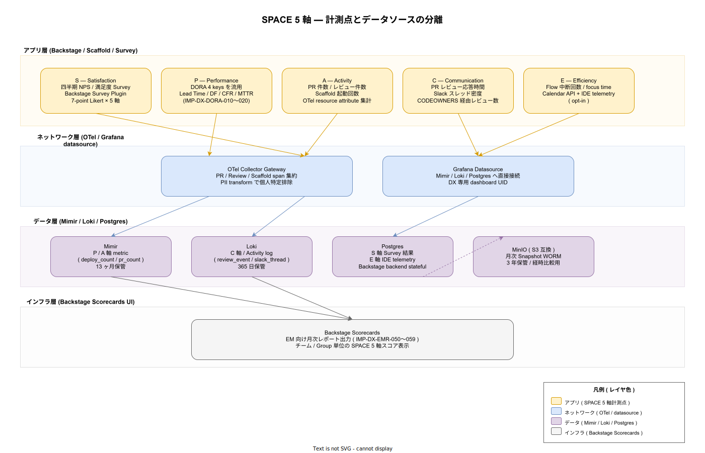

# 95. DX メトリクス / 20. SPACE / 01. SPACE 設計

本書は SPACE フレームワーク（Satisfaction / Performance / Activity / Communication / Efficiency）を k1s0 の DX メトリクス第二層として定義する。リリース時点で計測基盤を確定し、採用初期にダッシュボード化、運用拡大期に EM 評価へ正式統合する三段ロケット設計とする。DORA 4 keys（10 章）が「フローの結果」を示すのに対し、SPACE は「個人とチームの内側の状態」を示す指標群で、この補完関係が明確でないと改善判断が短期施策に偏る。

## 1. 背景と目的

DORA 4 keys だけを追うと、Lead Time を短縮するために PR レビューを省略する、Deploy Frequency を上げるために小さな変更を細切れにする、といった**メトリクス合わせの局所最適**が起こりやすい。SPACE はこれを構造的に防ぐために 5 軸を併走させ、片側の改善が他軸を悪化させる相関を可視化する。

ただし SPACE 5 軸を全て本格運用するには相応のデータ基盤と組織的合意が必要となるため、k1s0 では以下の段階的導入を採る:

- **リリース時点**: 計測基盤（OTel span / Loki / Mimir / Postgres / MinIO archive）の物理配置確定、Survey 配信パイプライン
- **採用初期**: Backstage Scorecards に SPACE 5 軸を表示、四半期 NPS Survey 配信開始
- **運用拡大期**: EM 評価プロセスへの正式組み込み、Efficiency 軸（IDE telemetry）の opt-in 計測

リリース時点で計測基盤を確定する理由は、後付けで PR メタデータや Activity ログを再収集するのが困難なため。Loki 365 日保管・Mimir 13 ヶ月保管・MinIO 3 年 WORM 保管によって、運用拡大期に過去 1 年以上の経時比較が可能となる。

## 2. 全体構造（5 軸 × 4 レイヤ）

5 軸は以下の責務分担で配置する。アプリ層が計測点、ネットワーク層が集約、データ層が保管、インフラ層が EM への可視化を担う。

5 軸の定義と計測法、データソースは以下のとおり:

- **S - Satisfaction（満足度）**: 四半期 NPS と 7 段階 Likert × 5 軸の Survey。Backstage Survey Plugin 経由で配信し、結果は Postgres に保管する。匿名化は Backstage 側で実施し、個人特定可能な状態でのデータ持ち出しを禁止する（NFR-G-CLS-001）。
- **P - Performance（成果）**: DORA 4 keys を流用する。リリース時点で確定済の `IMP-DX-DORA-010〜020` をそのまま参照し、SPACE 用に再計測しない。Mimir 13 ヶ月保管。
- **A - Activity（活動量）**: PR 件数 / レビュー件数 / Scaffold 起動回数。GitHub Webhook 経由で OTel span に変換し、Mimir へ counter として記録する。**個人ランキング化は禁止**（NFR-C-NOP-001 の趣旨に反するため）し、チーム単位の合計のみ可視化する。
- **C - Communication（協働）**: PR レビュー応答時間、Slack スレッド密度、CODEOWNERS 経由レビュー数。Loki にログ集約し、365 日保管で経時比較を可能にする。
- **E - Efficiency（効率性）**: Flow 中断回数 / Focus time。Calendar API + IDE telemetry。**opt-in 必須**で、組織的計測ではなく**個人が自分の生産性を内省するため**の指標として位置付ける。データは Postgres に保管し、本人以外は集計値のみアクセス可能。

レイヤ責務分離の詳細は ADR-0002（diagram layer convention）に準拠している。

## 3. 計測点と IMP 採番

| ID | 計測対象 | データソース | 段階 |
|---|---|---|---|
| IMP-DX-SPC-021 | Survey Plugin 配信パイプライン（四半期 NPS） | Postgres | 採用初期 |
| IMP-DX-SPC-022 | Activity span（PR / Review / Scaffold 起動）の OTel 変換 | Mimir | リリース時点 |
| IMP-DX-SPC-023 | Communication ログ集約（PR review event / Slack thread） | Loki 365 日 | 採用初期 |
| IMP-DX-SPC-024 | Efficiency opt-in 計測経路（Calendar / IDE telemetry） | Postgres | 運用拡大期 |
| IMP-DX-SPC-025 | 個人特定排除のための PII transform 経路 | OTel Collector Gateway | リリース時点 |
| IMP-DX-SPC-026 | 月次 MinIO Snapshot WORM 保管（経時比較用） | MinIO 3 年 | 採用初期 |
| IMP-DX-SPC-027 | Backstage Scorecards SPACE 5 軸ペイン | Scorecards UI | 採用初期 |
| IMP-DX-SPC-028 | チーム単位集計のみ可視化（個人ランキング化禁止） | Scorecards 設定 | リリース時点 |
| IMP-DX-SPC-029 | EM 評価プロセス組込時の対象軸明示（P / A のみ評価可、S / C / E は参考値） | EM 運用ガイド | 運用拡大期 |

リリース時点で確定する 4 件（022 / 025 / 028 + 計測基盤の論理配置）は、後付け再収集が困難な物理配置部分。採用初期と運用拡大期は採用側組織の習熟度に応じて段階的に有効化する。

## 4. データ層保管と保持期間

SPACE 5 軸データの保管設計は、軸ごとの再計測可能性で異なる:

- **A 軸 metric（Mimir）**: 13 ヶ月。Mimir のデフォルト保持期間内であり、四半期 × 4 + 1 ヶ月で前年同期比較が可能。
- **C 軸 log（Loki）**: 365 日。PR / Slack イベントは時系列でかつ冪等再生不可なため Loki に長期保管する。Mimir に集計後 metric として再格納も並行する。
- **S / E 軸 stateful data（Postgres）**: Backstage backend の Postgres に保管。個人特定可能な情報を扱うため、cert-manager 経由 mTLS と OpenBao Secret 管理（IMP-SEC-OBO-043 の path-based ACL）を組み合わせる。
- **月次 Snapshot（MinIO 3 年 WORM）**: Postgres / Mimir / Loki から月次集計を S3 Object Lock Compliance mode で 3 年保管。経時比較とレギュレーション対応の両立を意図する。

## 5. 設計判断の根拠

- **5 軸を一度に本格運用しない判断**: ADR-DX-001（DX メトリクス分離原則）の系として、計測体制の準備が整わないまま指標を増やすと「計測しているが見ていない」状態が生じる。リリース時点 → 採用初期 → 運用拡大期の三段で段階的に有効化する。
- **個人ランキング化の禁止**: NFR-C-NOP-001（採用側の小規模運用）の趣旨に基づき、個人比較は心理的安全性を損ない、チームの全体最適を阻害する。Activity / Communication 軸はチーム単位集計のみとする。
- **Efficiency 軸の opt-in 必須化**: IDE telemetry は監視の色彩が強く、組織的強制計測は労務リスクを伴う。本人内省ツールとして提供する立場を明文化する。
- **Performance 軸を DORA で代替**: SPACE の P 軸を独自定義すると DORA 4 keys と二重計測になる。DORA をそのまま流用し、SPACE は P を含めた 5 軸でバランスを示す枠組みとして使う。

## 6. トレーサビリティ

- 上流要件: `03_要件定義/50_開発者体験/03_DevEx指標.md`（DORA Four Keys + SPACE 拡張）/ NFR-C-NOP-001（採用側の小規模運用）/ NFR-C-NOP-002（可視性）/ NFR-G-CLS-001（PII 取扱）
- 関連 ADR: ADR-DX-001（DX メトリクス分離原則、新規起票予定）/ ADR-BS-001（Backstage Scorecards）/ ADR-OBS-001（Grafana LGTM = SPACE データ層）
- 関連 DS-SW-COMP: DS-SW-COMP-085（OTel Collector Gateway = SPACE Activity span 集約）/ DS-SW-COMP-132（platform = SPACE 計測対象）/ DS-SW-COMP-141（多層防御統括 = PII transform / WORM 監査）
- 下流: `30_Scaffold利用率/`（A 軸の Scaffold 起動回数の物理計測点を提供）/ `40_time_to_first_commit/`（A 軸 onboarding 計測との接続）/ `50_EMレポート/`（5 軸統合配信先）

## 7. 制約と今後の課題

- リリース時点で確定するのは計測基盤のみで、Survey 配信パイプライン（SPC-021）と Scorecards 表示（SPC-027）は採用初期に持ち越す。OSS リリース直後に SPACE フル運用を期待する利用者には事前周知が必要。
- Efficiency 軸の opt-in 計測は、IDE 拡張の対応範囲（VS Code / IntelliJ / その他）が採用側組織のツール標準に依存するため、リリース時点で対応 IDE を Open Source 標準セットに限定する。
- SPACE 5 軸の重み付けは固定せず、採用側組織が EM プロセスに組み込む際の調整余地として残す。SPC-029 はあくまで k1s0 推奨（P / A のみ評価対象）で、強制ではない。

## 関連ファイル

- 章 README: [`../README.md`](../README.md)
- DORA 4 keys: [`../10_DORA_4keys/01_DORA_4keys計測.md`](../10_DORA_4keys/01_DORA_4keys計測.md)
- Scaffold 利用率: [`../30_Scaffold利用率/01_Scaffold利用率計測.md`](../30_Scaffold利用率/01_Scaffold利用率計測.md)
- time-to-first-commit: [`../40_time_to_first_commit/01_time_to_first_commit計測.md`](../40_time_to_first_commit/01_time_to_first_commit計測.md)
- EM レポート: [`../50_EMレポート/01_EM月次レポート設計.md`](../50_EMレポート/01_EM月次レポート設計.md)
- 章索引: [`../90_対応IMP-DX索引/01_対応IMP-DX索引.md`](../90_対応IMP-DX索引/01_対応IMP-DX索引.md)
