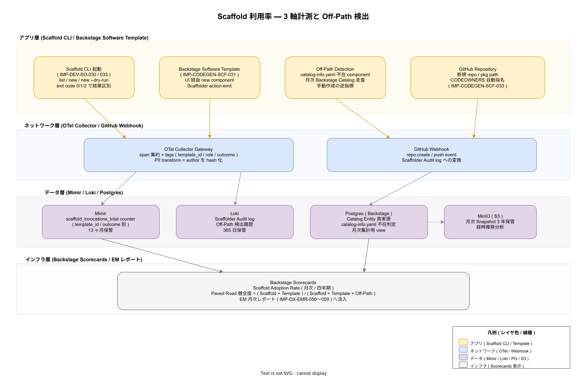

# 95. DX メトリクス / 30. Scaffold 利用率 / 01. Scaffold 利用率計測

本書は Scaffold（CLI / Backstage Software Template）の利用率を Paved Road 健全度の主要指標として計測する設計を確定する。Scaffold 経由率が下がれば「自作率の上昇 = Paved Road からの離脱」を示し、Platform/DX チームへ Paved Road 再整備のシグナルを返す逆指標として機能する。一方で Scaffold が成熟する前から強制的に高い数値を求めると Scaffold が現実に追いつかない歪みを生むため、目標値ではなく**観測指標**として位置付ける。

## 1. 背景と目的

ADR-DEV-001（Paved Road 思想）と IMP-DEV-POL-002（Scaffold 経由必須）を実体として担保するには、「Scaffold が実際に使われているか」を計測しなければならない。新規 component 作成のうち Scaffold 経由率を計測することで、以下の 3 つを区別できる:

- **Scaffold 経由 ↑**: Paved Road が機能している、または Off-Path 経路がブロックされている健全状態
- **Scaffold 経由 ↓ + 全体新規 ↑**: Scaffold が実態と乖離している、または存在を知られていない
- **Scaffold 経由 ↓ + 全体新規 ↓**: 開発が停滞している（Scaffold 問題ではなく組織的問題）

この区別を可能にするため、Scaffold 起動回数（直接計測）と Off-Path 検出（逆指標）の両方を計測する。

## 2. 全体構造（3 軸計測 + Off-Path 検出）

計測対象は CLI 起動 / Backstage Software Template UI 起動 / GitHub repo 作成 の 3 軸。これらの差分から Off-Path（Scaffold を経由せずに作成された component）を検出する。



3 軸の計測点と責務分担は以下のとおり:

- **CLI 起動**: `IMP-DEV-SO-030`（Scaffold 必須経路）の物理計測。`new` / `new --dry-run` / `list` を区別し、exit code 0/1/2 で結果を分類。OTel span として OTel Collector Gateway へ送出する。
- **Backstage Software Template UI 起動**: `IMP-CODEGEN-SCF-031`（Backstage Software Template 互換）の物理計測。Scaffolder action emit を OTel span 化し、CLI と同一の `template_id` タグで集計可能にする。
- **GitHub Webhook（repo:create / push）**: Webhook 経由で全 repo / pkg 作成イベントを受け取り、Backstage Catalog に対して catalog-info.yaml の有無を判定する。catalog-info.yaml 不在の component を **Off-Path** として記録する。

Paved Road 健全度は以下の式で算出する:

```text
Paved Road 健全度 = (Scaffold + Template) / (Scaffold + Template + Off-Path)
```

リリース時点での目標値は設けず、月次推移を観測する。採用初期に基準値を確定し、運用拡大期に閾値を含む SLI 化を検討する。

## 3. 計測点と IMP 採番

| ID | 計測対象 | 段階 |
|---|---|---|
| IMP-DX-SCAF-030 | Scaffold CLI 起動の OTel span 化（template_id / outcome / role タグ） | リリース時点 |
| IMP-DX-SCAF-031 | Backstage Software Template UI 起動の Scaffolder action emit OTel 連動 | リリース時点 |
| IMP-DX-SCAF-032 | GitHub Webhook（repo:create / push）経由の Off-Path 検出 | リリース時点 |
| IMP-DX-SCAF-033 | 月次 Backstage Catalog 走査による catalog-info.yaml 不在 component 集計 | リリース時点 |
| IMP-DX-SCAF-034 | Paved Road 健全度の式定義と Mimir recording rule 化 | 採用初期 |
| IMP-DX-SCAF-035 | Backstage Scorecards への Adoption Rate 表示 | 採用初期 |
| IMP-DX-SCAF-036 | EM 月次レポートへの自動配信（IMP-DX-EMR-050〜059 連動） | 採用初期 |
| IMP-DX-SCAF-037 | Scaffold 利用率閾値による Paved Road 再整備トリガ（Sev3 Slack 通知） | 運用拡大期 |
| IMP-DX-SCAF-038 | template_id 別の Adoption Rate 分解（不人気テンプレートの early sign） | 採用初期 |
| IMP-DX-SCAF-039 | author を hash 化する PII transform 経路（個人ランキング化禁止の物理担保） | リリース時点 |

リリース時点で確定する 5 件（030 / 031 / 032 / 033 / 039）は、後付け再収集が困難な物理計測点。採用初期と運用拡大期は Scorecards 表示・閾値運用・テンプレート別分解を順次有効化する。

## 4. Off-Path 検出の論理

Off-Path（Scaffold を経由せずに作成された component）は以下の論理で検出する:

1. GitHub Webhook で `repo:create` / `push` イベントを受信
2. Backstage Catalog に対して当該 repo / pkg path を query
3. catalog-info.yaml が**不在**であれば Off-Path 候補として Loki に記録
4. 月次集計で前月新規分のうち catalog-info.yaml 存在率を算出

Off-Path 候補には以下の 2 種類があり、運用上区別する:

- **意図的な Off-Path**: 試験的 PoC / 一時 fork / 個人検証 repo。catalog-info.yaml の代わりに `.k1s0-no-catalog` ファイルを置くことで Off-Path 集計から除外できる（IMP-DX-SCAF-033 で実装）。
- **非意図的な Off-Path**: catalog-info.yaml を忘れた / Scaffold の存在を知らなかった / Scaffold が現実に対応していない。これが**真の逆指標**となる。

非意図的 Off-Path が増加する場合は Paved Road 再整備のシグナルとして Sev3 Slack 通知を出し、Platform/DX チームが原因を四半期 retrospective で議論する。

## 5. データ層保管

- **Mimir 13 ヶ月**: `scaffold_invocations_total{template_id, outcome, role}` counter として記録。template_id 別 Adoption Rate を recording rule で導出する。
- **Loki 365 日**: Scaffolder Audit log と Off-Path 検出履歴。原始ログを保持することで、後から template_id の付け替えや outcome の再分類が可能となる。
- **Postgres（Backstage backend）**: catalog-info.yaml 不在判定の真実源として Catalog Entity table を参照する。月次集計用 view を別建てする。
- **MinIO 3 年 WORM Snapshot**: 月次集計値を S3 Object Lock Compliance mode で 3 年保管。Paved Road 改善施策の効果を経時比較するためのアーカイブ。

## 6. 設計判断の根拠

- **Scaffold 利用率を目標値ではなく観測指標として位置付ける判断**: Scaffold が現実に対応する前から「経由率 90% 以上」のような目標を課すと、現実離れした Scaffold への強制適用や、計測逃れのための偽装ラベル付与を招く。**観測値に基づいて Scaffold を改善するループ**を優先する。
- **個人ランキング化の禁止（IMP-DX-SCAF-039）**: SPACE 設計の IMP-DX-SPC-028 と同根の判断。author を hash 化することで、個人比較を物理的に不可能にする。
- **意図的 Off-Path の除外メカニズム**: `.k1s0-no-catalog` ファイル方式は、PoC や一時的検証用途を Off-Path 集計から除外しつつ、明示的な意思表示を残す。これにより「忘れていた」と「意図的に Off-Path にした」を区別できる。
- **3 軸計測の理由**: CLI と UI の片方だけでは「もう一方の経由率が上がっただけ」と区別できない。両方を計測し、Off-Path も加えた合計で Paved Road 健全度を算出する。

## 7. トレーサビリティ

- 上流要件: NFR-C-NOP-001（採用側の小規模運用）/ NFR-C-NOP-002（可視性）/ `03_要件定義/50_開発者体験/03_DevEx指標.md`
- 関連 ADR: ADR-DX-001（DX メトリクス分離原則）/ ADR-DEV-001（Paved Road 思想）/ ADR-BS-001（Backstage Scorecards）
- 関連 IMP（実装側）: IMP-DEV-POL-002（Scaffold 必須経由）/ IMP-DEV-SO-030〜037（Scaffold 運用 8 ID）/ IMP-CODEGEN-SCF-030〜037（Scaffold CLI engine）/ IMP-DEV-BSN-040〜048（Backstage 連携）
- 関連 DS-SW-COMP: DS-SW-COMP-085（OTel Collector Gateway）/ DS-SW-COMP-132（platform）/ DS-SW-COMP-135（Scaffold / Backstage 配信系インフラ）
- 下流: `50_EMレポート/`（Adoption Rate を月次レポートに統合）

## 8. 制約と今後の課題

- リリース時点では Adoption Rate の Scorecards 表示と閾値運用を伴わないため、計測値が出るだけで「いま Paved Road が健全かどうか」を即時に判断する手段がない。採用初期に Scorecards 表示（SCAF-035）を有効化するまでは、月次集計を手動レビューする運用となる。
- Scaffold CLI が cone mode（sparse-checkout）で利用される場合、role 別の起動を区別する `role` タグの自動付与は Dev Container 環境変数経由で行う。`.devcontainer/profiles/` の設定が前提となる。
- Off-Path 検出は GitHub の webhook 信頼性に依存する。Webhook 欠損時は Backstage Catalog 月次走査（SCAF-033）で補完する二重化を採る。

## 関連ファイル

- 章 README: [`../README.md`](../README.md)
- DORA 4 keys: [`../10_DORA_4keys/01_DORA_4keys計測.md`](../10_DORA_4keys/01_DORA_4keys計測.md)
- SPACE: [`../20_SPACE/01_SPACE設計.md`](../20_SPACE/01_SPACE設計.md)
- time-to-first-commit: [`../40_time_to_first_commit/01_time_to_first_commit計測.md`](../40_time_to_first_commit/01_time_to_first_commit計測.md)
- EM レポート: [`../50_EMレポート/01_EM月次レポート設計.md`](../50_EMレポート/01_EM月次レポート設計.md)
- 章索引: [`../90_対応IMP-DX索引/01_対応IMP-DX索引.md`](../90_対応IMP-DX索引/01_対応IMP-DX索引.md)
