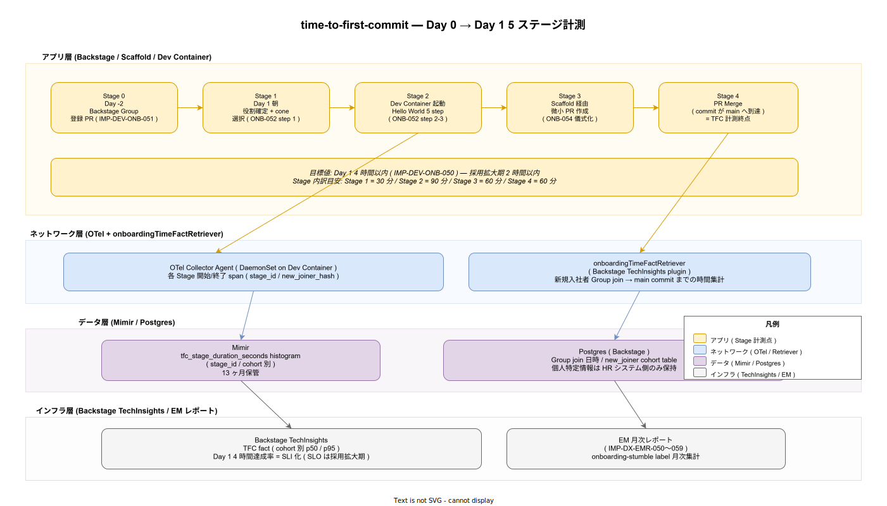

# 95. DX メトリクス / 40. time-to-first-commit / 01. time-to-first-commit 計測

本書は新規入社者の Day 0（受け入れ前）から Day 1 中の最初の main commit 到達までを計測する time-to-first-commit（以下 TFC）SLI の実装設計を確定する。`IMP-DEV-ONB-050`（Day 1 4 時間以内 / 採用拡大期 2 時間以内）の物理計測点として位置付け、Onboarding 動線（50 章 IMP-DEV-ONB-050〜059）の効果を数値で可視化する。

## 1. 背景と目的

「新規入社者が初日に main commit に到達する」ことを SLI 化する目的は、Paved Road / Dev Container / Scaffold / Backstage の整備が**実体として機能しているか**を、組織が継続的に確認することにある。良く整備された Paved Road は Day 1 4 時間以内に新規入社者を main commit まで到達させ、整備が劣化すると数値が悪化する。

TFC が悪化する典型パターンは:

- Dev Container イメージのサイズ肥大化で初回 build が長時間化する
- Scaffold が現実に対応せず手動修正が必要になる
- Backstage Group 登録の事前 PR が忘れられて Day 1 に手戻りする
- Hello World 5 step（IMP-DEV-ONB-053）のいずれかが壊れている

TFC は単一値ではなく**ステージ別**に計測することで、どの段階が劣化したかを切り分け可能にする。Day 1 4 時間達成率を SLI とし、運用拡大期に SLO 化（達成率 90% 以上等）を検討する。

## 2. 全体構造（5 ステージ計測）

TFC は Day -2（Backstage Group 登録 PR）から Day 1 PR Merge までの 5 ステージで計測する。各ステージ間の所要時間を OTel span として記録し、Mimir histogram に集約する。

5 ステージの定義と計測点は以下のとおり:

- **Stage 0（Day -2 / Backstage Group 登録 PR）**: HR / IT / メンターの責務分担に基づく事前準備（IMP-DEV-ONB-051）。Backstage Catalog の Group entity に新規入社者が join される PR がマージされた時点を Stage 0 完了とする。
- **Stage 1（Day 1 朝 / 役割確定 + cone 選択）**: 役割（10 役 Dev Container のいずれか）を確定し、対応する sparse-checkout cone を選択する（IMP-DEV-ONB-052 step 1）。目安 30 分。
- **Stage 2（Dev Container 起動 + Hello World 5 step）**: Dev Container を起動し、Hello World 5 step（IMP-DEV-ONB-053）を完走する。目安 90 分。
- **Stage 3（Scaffold 経由 / 微小 PR 作成）**: Scaffold CLI または Backstage Software Template 経由で微小 PR（typo 修正 / catalog-info 修正 / docs 修正のいずれか）を作成する（IMP-DEV-ONB-054 儀式化）。目安 60 分。
- **Stage 4（PR Merge）**: PR が main に merge され commit が到達した時点を TFC 計測終点とする。目安 60 分。

ステージ別目安の合計 240 分 = Day 1 4 時間目標値（IMP-DEV-ONB-050）と整合する。採用拡大期の 2 時間以内目標は、Dev Container の事前 pull キャッシュ・Hello World の自動セットアップ強化・PR レビュー応答短縮の 3 軸で達成する。

## 3. 計測点と IMP 採番

| ID | 計測対象 | 段階 |
|---|---|---|
| IMP-DX-TFC-040 | Stage 0〜4 各境界の OTel span 出力 | リリース時点 |
| IMP-DX-TFC-041 | onboardingTimeFactRetriever の Backstage TechInsights 統合 | リリース時点 |
| IMP-DX-TFC-042 | new_joiner_hash による個人特定排除（HR システム連携） | リリース時点 |
| IMP-DX-TFC-043 | Mimir tfc_stage_duration_seconds histogram（cohort 別 p50 / p95） | リリース時点 |
| IMP-DX-TFC-044 | Day 1 4 時間達成率 SLI 化（達成率 = Stage 4 完了 / Stage 0 完了） | 採用初期 |
| IMP-DX-TFC-045 | onboarding-stumble label 月次集計（IMP-DEV-ONB-059 連動） | 採用初期 |
| IMP-DX-TFC-046 | cohort 別経時推移分析（月次入社グループの比較） | 採用初期 |
| IMP-DX-TFC-047 | Stage 別劣化検出と Slack Sev3 通知（採用拡大期に閾値運用） | 運用拡大期 |
| IMP-DX-TFC-048 | 採用拡大期 2 時間以内目標の達成測定と差分分析 | 運用拡大期 |
| IMP-DX-TFC-049 | EM 月次レポート連携（IMP-DX-EMR-050〜059） | 採用初期 |

リリース時点で確定する 4 件（040 / 041 / 042 / 043）は計測基盤の物理配置で、後付け不可。SLI 化（044）と運用は採用初期以降。

## 4. 個人特定排除の物理担保

TFC は個人別データを扱うため、PII transform を物理層で強制する。具体的には:

- HR システム連携で得られる新規入社者識別子は、Backstage 側で `new_joiner_hash`（SHA-256）に即時変換する
- OTel span の attributes には `new_joiner_hash` のみを含め、生 ID は含めない
- Postgres には HR 連携時刻と `new_joiner_hash` のマッピング table を保持するが、個人特定情報（氏名 / メール）は HR システム側のみで保持する
- 開発期間中の個人別 TFC は HR とメンターのみが照会可能（Backstage RBAC）。チーム集計値は EM 全員が閲覧可能

これにより「新規入社者個人を晒すための数値」ではなく「Paved Road を診断するための数値」として運用できる。NFR-G-CLS-001 / NFR-G-AC-001 の趣旨に沿う設計。

## 5. cohort 別計測の論理

TFC は新規入社者ごとにバラつきがあるため、単月 1 件のデータでは判断できない。cohort（月次入社グループ）単位で集計し、以下の指標を出す:

- **cohort 別 p50 / p95**: その月入社者の TFC 中央値と 95 パーセンタイル
- **Day 1 4 時間達成率**: cohort 内で目標達成した割合
- **Stage 別 p50 内訳**: どのステージが時間を消費したか（劣化検出）
- **cohort 経時推移**: 過去 12 cohort と比較した相対位置

cohort サイズが小さい組織（月 1〜2 名）では統計的有意性が低いため、四半期 cohort で集計する運用に切り替える設定オプションを Backstage TechInsights 側で持つ。

## 6. 設計判断の根拠

- **Stage 別計測の必要性**: 単一の TFC 値では「どの工程で時間がかかったか」が見えず、Paved Road 改善の優先順位がつけられない。Stage 0〜4 を分離することで、Dev Container 起動が遅いのか / Scaffold が壊れているのか / PR レビューが遅いのかを切り分ける。
- **cohort 別集計の理由**: 個人別ランキング化を排除しつつ、月次推移を可視化するための単位として cohort を採用する。SPACE / Scaffold 利用率と同じ「個人比較禁止」原則を引き継ぐ。
- **HR システム連携の最小化**: TFC 計測のためだけに HR データを Backstage 側へ大量に取り込むと PII リスクが上がる。`new_joiner_hash` のみ受け取り、生データは HR 側に残す。
- **Day 1 4 時間目標の根拠**: NFR-C-NOP-001 の「採用側の小規模運用」を支える Onboarding 動線で、初日のうちに自走可能な状態に到達することを目標値として置く。採用拡大期 2 時間目標は、組織が Paved Road を継続改善した結果として到達する将来目標。

## 7. トレーサビリティ

- 上流要件: NFR-C-NOP-001（採用側の小規模運用）/ NFR-C-NOP-002（可視性）/ NFR-G-CLS-001（PII 取扱）/ `03_要件定義/50_開発者体験/03_DevEx指標.md`（time-to-first-commit）
- 関連 ADR: ADR-DX-001（DX メトリクス分離原則）/ ADR-DEV-001（Paved Road 思想）/ ADR-BS-001（Backstage TechInsights）
- 関連 IMP（実装側）: IMP-DEV-POL-004（time-to-first-commit SLI）/ IMP-DEV-ONB-050〜059（Onboarding 動線 10 ID）/ IMP-DEV-DC-010〜017（10 役 Dev Container）/ IMP-DEV-BSN-047（TechInsights 4 ファクト）
- 関連 DS-SW-COMP: DS-SW-COMP-085（OTel Collector）/ DS-SW-COMP-132（platform）/ DS-SW-COMP-135（Backstage 配信系）
- 下流: `50_EMレポート/`（cohort 別 TFC を月次レポートに統合）

## 8. 制約と今後の課題

- リリース時点で計測基盤は確定するが、SLI 化（TFC-044）は採用初期持ち越し。最初の数 cohort はベースライン取得のみで、目標達成率による評価は行わない。
- HR システムとの連携は採用側組織の HR スタックに依存するため、k1s0 はあくまで `new_joiner_hash` を受け取る IF を提供するに留める。具体的なコネクタは採用側組織が実装する。
- Stage 0 の Backstage Group 登録 PR が事前にマージされていない場合は計測開始点が決まらないため、Day 1 朝にメンターが手動で計測開始マーカーを Backstage で押す fallback 経路を用意する。

## 関連ファイル

- 章 README: [`../README.md`](../README.md)
- DORA 4 keys: [`../10_DORA_4keys/01_DORA_4keys計測.md`](../10_DORA_4keys/01_DORA_4keys計測.md)
- SPACE: [`../20_SPACE/01_SPACE設計.md`](../20_SPACE/01_SPACE設計.md)
- Scaffold 利用率: [`../30_Scaffold利用率/01_Scaffold利用率計測.md`](../30_Scaffold利用率/01_Scaffold利用率計測.md)
- EM レポート: [`../50_EMレポート/01_EM月次レポート設計.md`](../50_EMレポート/01_EM月次レポート設計.md)
- 章索引: [`../90_対応IMP-DX索引/01_対応IMP-DX索引.md`](../90_対応IMP-DX索引/01_対応IMP-DX索引.md)
