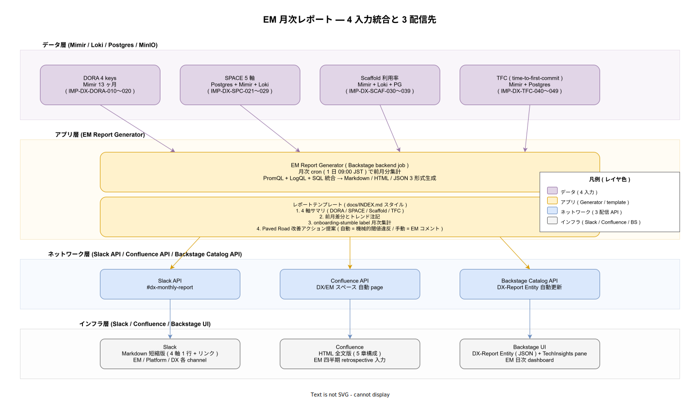

# 95. DX メトリクス / 50. EM レポート / 01. EM 月次レポート設計

本書は DORA 4 keys / SPACE / Scaffold 利用率 / TFC の 4 入力を統合し、エンジニアリングマネージャ（EM）向け月次レポートとして自動生成・配信する仕組みを確定する。`IMP-DX-POL-007`（四半期レビュー）の物理実装であり、計測値が**読まれて意思決定に使われる**ことを担保する最後のピースとなる。計測しているが誰も見ない状態を防ぐための章として位置付ける。

## 1. 背景と目的

DX メトリクスは計測しただけでは効果を生まない。EM が月次で目を通し、四半期 retrospective で議論し、Paved Road や Onboarding 改善のアクションに繋がる経路を物理化する必要がある。本書はその経路を「自動配信される月次レポート」として固定する。

レポート設計の中核原則:

- **読み手別に内容を変える**: Slack には短縮版（4 軸 1 行）、Confluence には全文版（5 章構成）、Backstage には機械可読版（JSON）。読み手の入り口に応じた密度で配信する。
- **アクション提案を併記**: 数値だけでなく、「機械的閾値違反」のフラグと「EM コメント欄」を提供して、次のアクションが明示されるレポートにする。
- **個人別データを含めない**: 全配信先で個人特定排除を守る（NFR-G-CLS-001）。Slack ・ Confluence の本文には cohort / team / Group 単位の集計値のみを掲載する。

## 2. 全体構造（4 入力 → 1 Generator → 3 配信先）

レポート生成は Backstage backend job として月次 cron（毎月 1 日 09:00 JST）で実行する。前月分の 4 軸データを統合し、Markdown / HTML / JSON の 3 形式を生成して 3 配信先へ並列配信する。

4 入力の責務分担:

- **DORA 4 keys (`IMP-DX-DORA-010〜020`)**: Mimir 13 ヶ月から PromQL で前月集計。Lead Time / Deploy Frequency / Change Failure Rate / MTTR の中央値・分位値を取り出す。
- **SPACE 5 軸 (`IMP-DX-SPC-021〜029`)**: Postgres + Mimir + Loki から SQL / PromQL / LogQL で集計。S 軸 Survey は Postgres、P 軸は Mimir（DORA 流用）、A / C 軸は Mimir / Loki、E 軸は opt-in 集計値のみ。
- **Scaffold 利用率 (`IMP-DX-SCAF-030〜039`)**: Mimir + Loki + Postgres から template_id 別の Adoption Rate と Off-Path 検出件数を集計。
- **TFC (`IMP-DX-TFC-040〜049`)**: Mimir + Postgres から cohort 別の p50 / p95 / Day 1 4 時間達成率を集計。

3 配信先の責務分担:

- **Slack（短縮版 Markdown）**: `#dx-monthly-report` に 4 軸 1 行サマリ + Confluence リンク。EM / Platform / DX 各 channel に配信。
- **Confluence（全文版 HTML）**: DX/EM スペースに自動 page 化。5 章構成（4 軸サマリ / 前月差分 / onboarding-stumble / アクション提案 / 注記）。EM 四半期 retrospective の入力として使う。
- **Backstage Catalog（DX-Report Entity JSON）**: `kind: DX-Report` の Entity として自動更新。TechInsights pane と組み合わせて EM 日次 dashboard として閲覧可能。

## 3. レポート構成（5 章）

Confluence 版の本文は以下の 5 章構成に固定する:

1. **4 軸サマリ**: DORA / SPACE / Scaffold / TFC を各 1 段落 + 1 表で要約。前月値・前々月値・トレンド矢印を必ず併記する。
2. **前月差分とトレンド注記**: 統計的有意な差分のみ抽出（cohort サイズに応じた閾値）。改善 / 悪化を矢印で示し、有意でない変動はノイズとして注記する。
3. **onboarding-stumble label 月次集計（IMP-DEV-ONB-059 連動）**: 新規入社者が動線で詰まった時に貼られる label を月次集計し、Paved Road の劣化箇所を特定する。
4. **Paved Road 改善アクション提案**: 機械的閾値違反による自動提案（例: Scaffold Adoption Rate < 過去 3 ヶ月平均の 80% → Paved Road 再整備提案）と、EM が手動で書き込めるコメント欄。
5. **注記**: 計測の不確実性・データ欠損・PII transform の効力範囲などの注記。読み手が数値の限界を理解するための短い説明。

## 4. 計測点と IMP 採番

| ID | 計測対象 | 段階 |
|---|---|---|
| IMP-DX-EMR-050 | EM Report Generator の Backstage backend job 実装 | 採用初期 |
| IMP-DX-EMR-051 | 4 入力統合の PromQL + LogQL + SQL クエリ単一真実源化 | 採用初期 |
| IMP-DX-EMR-052 | Markdown / HTML / JSON 3 形式生成テンプレート | 採用初期 |
| IMP-DX-EMR-053 | Slack 配信パイプライン（短縮版 + 4 軸 1 行 + リンク） | 採用初期 |
| IMP-DX-EMR-054 | Confluence 配信パイプライン（全文 5 章構成 HTML） | 採用初期 |
| IMP-DX-EMR-055 | Backstage Catalog DX-Report Entity 自動更新 | 採用初期 |
| IMP-DX-EMR-056 | 機械的閾値違反検出と自動アクション提案ロジック | 運用拡大期 |
| IMP-DX-EMR-057 | onboarding-stumble label 月次集計と章立て統合 | 採用初期 |
| IMP-DX-EMR-058 | 統計的有意性判定（cohort サイズ別閾値表） | 運用拡大期 |
| IMP-DX-EMR-059 | 個人特定排除の物理担保（hash 化済データのみ流入を CI で検証） | リリース時点 |

リリース時点で確定するのは `IMP-DX-EMR-059`（個人特定排除の物理担保）のみ。残りは採用初期から段階的に有効化する。**計測基盤先行 / 配信は採用初期** という配分は、計測値の質が安定する前に配信を始めると EM が誤った判断を下すリスクを避けるための意図的な順序付け。

## 5. 統計的有意性の扱い

cohort サイズが小さい組織（月 1〜2 名）では、TFC や SPACE Survey の単月変動はノイズに近い。レポートは以下の方針で扱う:

- 単月差分は表示するが、有意性判定（IMP-DX-EMR-058）で「ノイズ範囲」と注記された差分は赤/緑の警告色を付けない
- 過去 3 ヶ月移動平均との差分も併記し、トレンドが見えやすい設計とする
- 採用拡大期に cohort サイズが安定した段階で、有意性判定の閾値表を更新する

## 6. アクション提案の自動化と人間の関与

レポートに「Paved Road 再整備提案」を機械的に書く際、自動化と人間の判断のバランスを次のように設計する:

- **自動提案（IMP-DX-EMR-056）**: 閾値違反のみに限定。例: Scaffold Adoption Rate が過去 3 ヶ月平均の 80% を下回る、Day 1 4 時間達成率が前月から 20% 低下する、など。「機械的に検出可能 + 過剰反応にならない」閾値で限定する。
- **手動コメント欄**: EM が該当月の事情（採用増加 / 大規模リファクタ進行中 / etc.）を書き込む欄を Confluence 側で必ず用意する。機械が知らない文脈は人間が補う。
- **自動提案を強制しない**: レポートに自動提案が出ても、EM が「採用するか / 見送るか」を判断する。採用された場合のみ次月の retrospective で議題化する。

## 7. 設計判断の根拠

- **3 配信先（Slack / Confluence / Backstage）の意図**: Slack は短い気付き、Confluence は深い議論、Backstage は機械可読の常時参照、と読み手の動線に応じた密度を変える。同じ内容を 1 つの場所に置くと、読みづらさで誰も見ない。
- **EM Report Generator を Backstage backend job にする理由**: 既存の Backstage backend は TechInsights / Catalog / Survey と統合された Postgres / Plugin 基盤を持つ。独立したスタックを建てず、Backstage backend job として実装することで運用負荷を最小化する。
- **個人特定排除の CI 検証（IMP-DX-EMR-059）**: レポートに混入する可能性のあるデータを CI で検査し、hash 化されていない個人 ID を検出した場合はパイプラインを fail させる。これは PII 漏洩の最後のセーフティネット。
- **計測基盤先行 / 配信は採用初期の理由**: 計測値が安定する前に EM へ配信すると、ノイズに基づく誤った判断を促す。リリース時点では計測のみ確定し、採用初期に質が安定してから配信を有効化する。

## 8. トレーサビリティ

- 上流要件: NFR-C-NOP-001（採用側の小規模運用）/ NFR-C-NOP-002（可視性）/ NFR-G-CLS-001（PII 取扱）/ `03_要件定義/50_開発者体験/03_DevEx指標.md`
- 関連 ADR: ADR-DX-001（DX メトリクス分離原則）/ ADR-BS-001（Backstage Scorecards / TechInsights）/ ADR-OBS-001（Grafana LGTM = データ層基盤）
- 関連 IMP（実装側）: IMP-DX-POL-007（四半期レビュー）/ IMP-DX-DORA-010〜020 / IMP-DX-SPC-021〜029 / IMP-DX-SCAF-030〜039 / IMP-DX-TFC-040〜049 / IMP-DEV-ONB-059（onboarding-stumble label）
- 関連 DS-SW-COMP: DS-SW-COMP-085（OTel Collector）/ DS-SW-COMP-132（platform）/ DS-SW-COMP-135（Backstage 配信系）
- 上流: 4 節すべて（DORA / SPACE / Scaffold / TFC）

## 9. 制約と今後の課題

- リリース時点で `IMP-DX-EMR-059`（CI による hash 化検証）以外は全て採用初期持ち越し。OSS リリース直後の利用者には EM レポート機能は未稼働で、計測値を直接 Grafana / Backstage で確認する運用となる。
- Slack / Confluence の API トークンは OpenBao（IMP-SEC-OBO-043 path-based ACL）経由で取得する。配信先トークンの権限スコープは「読み書き」ではなく「書き込みのみ」に限定する。
- アクション提案の自動化（IMP-DX-EMR-056）は閾値設計に依存する。最初の半年〜1 年は閾値を保守的に設定（誤検知よりも見逃しを許容）し、データが蓄積した段階で見直す。

## 関連ファイル

- 章 README: [`../README.md`](../README.md)
- DORA 4 keys: [`../10_DORA_4keys/01_DORA_4keys計測.md`](../10_DORA_4keys/01_DORA_4keys計測.md)
- SPACE: [`../20_SPACE/01_SPACE設計.md`](../20_SPACE/01_SPACE設計.md)
- Scaffold 利用率: [`../30_Scaffold利用率/01_Scaffold利用率計測.md`](../30_Scaffold利用率/01_Scaffold利用率計測.md)
- time-to-first-commit: [`../40_time_to_first_commit/01_time_to_first_commit計測.md`](../40_time_to_first_commit/01_time_to_first_commit計測.md)
- 章索引: [`../90_対応IMP-DX索引/01_対応IMP-DX索引.md`](../90_対応IMP-DX索引/01_対応IMP-DX索引.md)
