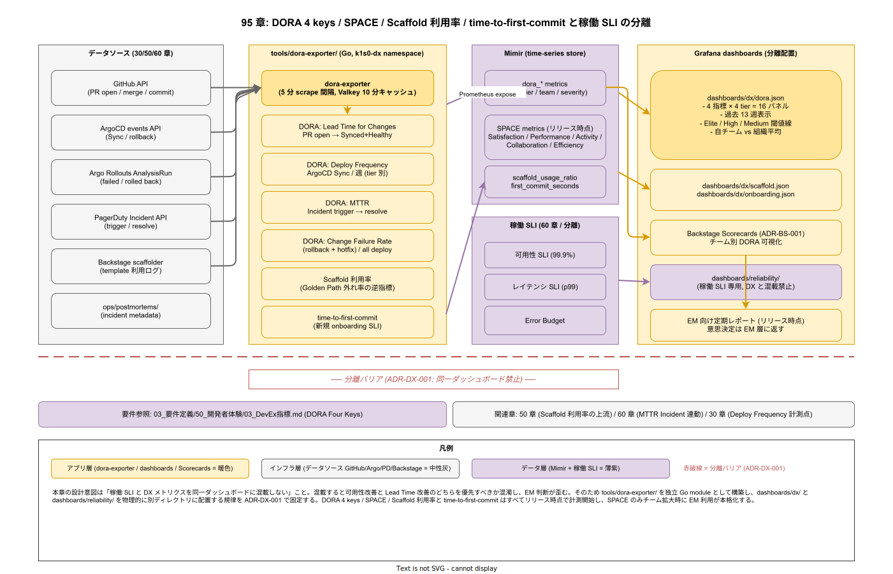

# 95. DX メトリクス

本章は k1s0 の開発者生産性メトリクス（DORA 4 keys / SPACE / Scaffold 利用率 / time-to-first-commit）を実装段階確定版として固定する。稼働側の SLI（`60_観測性設計/`）とは分離し、「開発チームの健全性」を数値で可視化する独立した運用を規定する（ADR-DX-001 として新規起票）。`03_要件定義/50_開発者体験/03_DevEx指標.md` の DORA Four Keys 要件を物理配置レベルで満たす。

## 本章の位置付け

DX メトリクスは観測性設計から独立させる。可用性 SLO とリードタイムを同じダッシュボードに並べると、どちらの改善を優先すべきかが混濁するためである。本章は「開発の流れ」を計測することに徹し、意思決定はエンジニアリングマネージャ層に返す。

DORA 4 keys（Lead Time / Deploy Frequency / MTTR / Change Failure Rate）は業界標準の比較軸であり、採用側の小規模運用でも計測可能。SPACE はチーム拡大時に追加する。Scaffold 利用率は「Golden Path を外れた自作率」の反対指標として扱い、高すぎれば Paved Road の再整備を示唆する。計測基盤は ADR-BS-001 の Backstage スコアカードを第一手段とし、不足分を `04_概要設計/70_開発者体験方式設計/` の DORA 実装と接続する。



## OSS リリース時点での確定範囲

- リリース時点: DORA 4 keys の計測基盤（IMP-DX-DORA-010〜020）/ SPACE 計測基盤の物理配置（IMP-DX-SPC-022 / 025 / 028）/ Scaffold 利用率の 3 軸計測点（IMP-DX-SCAF-030〜033 / 039）/ TFC 5 ステージ計測基盤（IMP-DX-TFC-040〜043）/ EM レポートの個人特定排除 CI 検証（IMP-DX-EMR-059）
- 採用初期: SPACE Scorecards 表示、Scaffold Adoption Rate Scorecards、TFC SLI 化、EM 月次レポート 3 配信パイプライン
- 運用拡大期: Efficiency 軸 opt-in 計測、Scaffold 利用率閾値運用、TFC 採用拡大期 2 時間目標、EM レポート機械的閾値違反検出

## RACI

| 役割 | 責務 |
|---|---|
| Platform/Build（主担当 / A） | DORA 4 keys の CI / CD 側計測、データ基盤 |
| SRE（共担当 / B） | MTTR 計測の Incident 連動 |
| DX（共担当 / C） | Scaffold 利用率、time-to-first-commit、EM 向けレポート |

## 節構成予定

```
95_DXメトリクス/
├── README.md
├── 00_方針/                # 稼働 SLI との分離原則
├── 10_DORA_4keys/
├── 20_SPACE/
├── 30_Scaffold利用率/
├── 40_time_to_first_commit/
├── 50_EMレポート/
└── 90_対応IMP-DX索引/
```

## IMP ID 予約

本章で採番する実装 ID は `IMP-DX-*`（予約範囲: IMP-DX-001 〜 IMP-DX-099）。

## 対応 ADR / 概要設計 ID / NFR

- ADR: [ADR-BS-001](../../02_構想設計/adr/ADR-BS-001-backstage.md)（Backstage）/ 本章初版策定時に ADR-DX-001（DX メトリクス分離原則）を起票予定
- DS-SW-COMP: DS-SW-COMP-132（platform）
- NFR: `03_要件定義/50_開発者体験/` 章全般（DORA Four Keys）/ NFR-C-NOP-004（運用監視）

## 関連章

- `50_開発者体験設計/` — Scaffold 利用率の上流
- `60_観測性設計/` — MTTR の Incident 連動
- `30_CI_CD設計/` — Deploy Frequency / Lead Time の計測点
