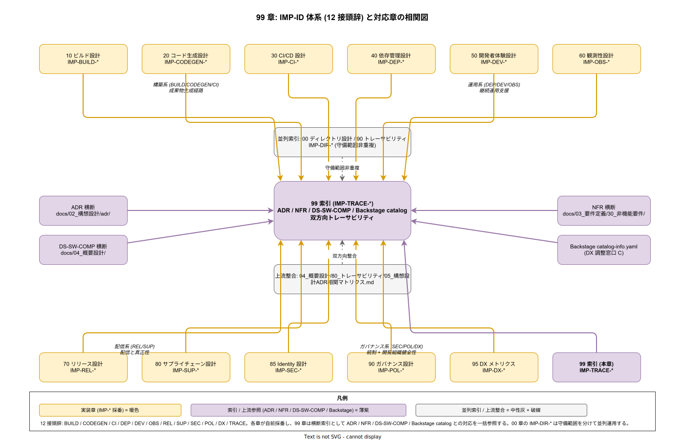

# 99. 索引 / 00. 方針 / 01. 索引運用原則

本ファイルは k1s0 実装ドキュメント全 12 章の横断索引（IMP-\* ID 台帳 / ADR 対応 / DS-SW-COMP 対応 / NFR 対応 / Backstage catalog 対応 / 改訂履歴）を維持する際に常に参照する 7 本の原則を定義する。12 章が独立に ID を採番する前提で、接頭辞衝突・番号重複・対応リンク欠落を構造レベルで防ぐ。



## 原則が必要な理由

実装ドキュメントは 12 章に分散し、各章が独立に IMP-\* ID を採番する。横断索引が適切に維持されないと、以下の破綻が常態化する。

- 接頭辞が章間で重複し、`IMP-XXX-001` が複数存在する状態になる（例: `IMP-OPS` / `IMP-OBS` の混同）
- 同一接頭辞内で番号が重複し、採番の権威ソースが不在化する
- ADR 変更時にどの IMP-\* に影響するかが追えず、改訂影響範囲の特定に数時間かかる
- NFR の受け入れ基準を満たす IMP-\* 群を逆引きできず、監査対応で全章を横断検索する必要が生じる
- Backstage catalog-info.yaml のコンポーネント ID と IMP-\* が対応せず、Backstage 経由の実装追跡が機能しない
- 改訂履歴が各章に分散し、「いつ何が変わったか」の時系列把握が不可能になる
- `00_ディレクトリ設計/90_トレーサビリティ/` の IMP-DIR 索引と本章の IMP-\* 索引が相互に参照せず、守備範囲が重複または欠落する

本原則は、これらの破綻を「12 接頭辞固定 + 予約帯固定 + 原子性 + 本章を採番最終更新先に固定」という仕組みで構造的に防ぐ 7 本である。

## 原則 1: 12 接頭辞体系を固定し衝突を禁止する（IMP-TRACE-POL-001）

**IMP-\* ID の接頭辞は BUILD / CODEGEN / CI / DEP / DEV / OBS / REL / SUP / SEC / POL / DX / TRACE の 12 種類に固定する。新規接頭辞の追加は本章の改訂を伴う ADR 必須とする。**

接頭辞の自由追加を許すと、似た意味の接頭辞が増殖する（`OPS` / `OBS` / `MON` のような混同パターン）。12 接頭辞は実装章 12 個に 1:1 で対応し、章の追加・削除と同期する。各接頭辞は章番号と以下の対応で固定する。

- `BUILD`（10 章 ビルド設計）/ `CODEGEN`（20 章 コード生成設計）/ `CI`（30 章 CI/CD 設計）
- `DEP`（40 章 依存管理設計）/ `DEV`（50 章 開発者体験設計）/ `OBS`（60 章 観測性設計）
- `REL`（70 章 リリース設計）/ `SUP`（80 章 サプライチェーン設計）/ `SEC`（85 章 Identity 設計）
- `POL`（90 章 ガバナンス設計）/ `DX`（95 章 DX メトリクス）/ `TRACE`（99 章 索引）
- 加えて `DIR`（00 章 ディレクトリ設計）が並列存在するが、`00_ディレクトリ設計/90_トレーサビリティ/` で自律管理する

## 原則 2: 接頭辞ごとに予約帯 001-099 を固定する（IMP-TRACE-POL-002）

**各接頭辞の予約番号帯は 001 〜 099 の 99 枠に固定する。100 番台への拡張は本章の改訂を伴う ADR 必須とする。**

予約帯を固定することで、「その ID が誰の責任範囲か」を番号だけで即判定できる。99 枠の設計容量は リリース時点 完了時点で 50% 未満の消費が目安であり、超過した場合は章の細分化または ADR による枠拡張で対応する。

サブ接頭辞（例: `IMP-DIR-ROOT-001` / `IMP-SEC-POL-001`）を使う章については、サブ接頭辞ごとに 001 〜 099 の独立枠とする。サブ接頭辞の種類は各章の `00_方針/` で定義し、本章の索引に集約する。

## 原則 3: 各 IMP-\* は 1 判断 = 1 ID の原子性を守る（IMP-TRACE-POL-003）

**1 つの IMP-\* ID は 1 つの設計判断を表す。複数の判断を束ねた ID（例: 「認証とログを一気に決める ID」）を禁止する。**

原子性が崩れると、ADR / NFR との対応が多対多になり、変更影響範囲の特定が指数的に難しくなる。1 判断 = 1 ID を守れば、対応は多対多でも各関係が単一判断を指すため追跡可能な状態を維持できる。

判断を束ねたくなる場合は、親 ID と子 ID に分割する（例: `IMP-SEC-POL-004`（OpenBao Secret 集約）が親原則で、`IMP-SEC-OBO-040`（Raft Integrated Storage 配置） `IMP-SEC-OBO-041`（Auto-unseal AWS KMS）など OBO サブ接頭辞 10 ID が子の具体実装）。親子関係は本章の索引に明示する。原子性の判定基準は以下に固定する。

- 単独で Superseded にできる粒度であること
- 単一の ADR で変更影響範囲を説明できる粒度であること
- NFR の受け入れ基準と 1 対 1 または 1 対 N で結びつく粒度であること

## 原則 4: 採番時は本章 `99_索引/00_IMP-ID一覧/` を最終更新先とする（IMP-TRACE-POL-004）

**新規 IMP-\* ID を採番する PR は、該当章のドキュメントに加えて本章の `99_索引/00_IMP-ID一覧/<prefix>.md` を同 PR で更新する。索引未更新での merge を CODEOWNERS で拒否する。**

索引を「後から整備する」運用は破綻する。必ず同 PR で索引を更新することで、索引の遅延を構造的に防ぐ。CODEOWNERS 設定により本章のファイル変更が該当章のレビュアに自動アサインされ、採番の権威が分散しない。

`00_IMP-ID一覧/<prefix>.md` の記載項目は以下に固定する。

- ID / タイトル（1 行）
- 採番日 / 採番 PR 番号
- 対応 ADR / DS-SW-COMP / NFR
- 子 ID（存在する場合）
- Status（Draft / Accepted / Superseded / Deprecated）

## 原則 5: ADR / DS-SW-COMP / NFR との対応は双方向リンク必須とする（IMP-TRACE-POL-005）

**IMP-\* ID と ADR / DS-SW-COMP / NFR の対応は、両方向にリンクを張る。片方向のみのリンクを禁止する。**

片方向リンクは「IMP 側から ADR は見える、ADR 側から IMP は見えない」状態を生み、ADR 改訂時の影響範囲特定が手作業になる。双方向リンクを必須とすることで、どちら側から辿っても同じ対応集合が得られる。

- IMP-\* → ADR : 各章 ID 定義箇所に ADR リンクを記載
- ADR → IMP-\* : ADR の Consequences セクションに IMP-\* リンクを記載
- 対応表は本章の `10_ADR対応表/` / `20_DS-SW-COMP対応表/` / `30_NFR対応表/` に集約
- リンク整合性は CI でチェック（孤立リンク検出スクリプトを `tools/ci/trace-check/` に配置）
- DS-SW-COMP は `04_概要設計/` 配下に自律管理されるため、本章では読み取り専用の対応表として扱う
- NFR は `03_要件定義/30_非機能要件/` の A 〜 H 章をカバーする網羅性を CI チェックで検証

## 原則 6: Backstage catalog-info.yaml と ID 対応を リリース時点 で確立する（IMP-TRACE-POL-006）

**Backstage のカタログ（`catalog-info.yaml`）のコンポーネント ID と IMP-\* ID の対応を リリース時点 までに確立し、本章の `40_Backstage_catalog対応/` に保管する。**

Backstage はサービス運用の第一表示面であり（ADR-BS-001）、IMP-\* ID と catalog の対応がなければ「Backstage で見えるサービス」と「設計ドキュメントの IMP-\* ID」が分断される。リリース時点 までに対応表を初版完成させ、以降は新規サービス追加時に PR チェックリストで対応追加を必須化する。

catalog-info.yaml 側には annotations として `k1s0.io/imp-ids: IMP-SEC-POL-001,IMP-OBS-SLI-003` のように複数 ID を列挙できる形式を採用する。Scaffold（`platform/scaffold/`）の雛形にも本 annotation のプレースホルダを組み込む。

## 原則 7: 改訂履歴は本章に集約し分散を禁止する（IMP-TRACE-POL-007）

**IMP-\* ID の採番・変更・廃止の履歴は本章の `90_改訂履歴/` に時系列で集約する。各章への分散記録を禁止する。**

改訂履歴が各章に分散すると、横断的な傾向分析（「今期はどの章が最も多く改訂されたか」等）が不可能になる。本章に集約することで、四半期レビュー・半期 Technology Radar 更新・年次監査での参照が 1 ファイルで完結する。本章ファイル自体は Git の commit 履歴で変更追跡可能であるため、別途変更履歴を表形式で複製する必要はない（原則 5 の双方向リンクと Git 履歴で代替する）。

改訂履歴の記載項目は以下に固定する。

- 改訂日 / 改訂 PR 番号
- 対象 IMP-\* ID
- 変更種別（Add / Modify / Supersede / Deprecate）
- 変更理由（ADR リンク）
- 影響範囲（該当する他 IMP-\* / ADR / NFR）

## 図表

```
[索引 7 原則の構造]
  原則 1-2 : 体系固定（12 接頭辞 × 99 枠）
  原則 3   : 原子性（1 判断 = 1 ID）
  原則 4   : 採番権威（本章を最終更新先に）
  原則 5   : 双方向リンク（IMP ↔ ADR/NFR/DS-SW-COMP）
  原則 6   : Backstage 連動
  原則 7   : 改訂履歴集約
```

各接頭辞と章の対応を改めて固定する。

- `IMP-BUILD` ↔ 10 章 / `IMP-CODEGEN` ↔ 20 章 / `IMP-CI` ↔ 30 章
- `IMP-DEP` ↔ 40 章 / `IMP-DEV` ↔ 50 章 / `IMP-OBS` ↔ 60 章
- `IMP-REL` ↔ 70 章 / `IMP-SUP` ↔ 80 章 / `IMP-SEC` ↔ 85 章
- `IMP-POL` ↔ 90 章 / `IMP-DX` ↔ 95 章 / `IMP-TRACE` ↔ 99 章
- 並列: `IMP-DIR` ↔ 00 章（`00_ディレクトリ設計/90_トレーサビリティ/` で自律管理）

詳細な索引リレーション図は [img/索引原則俯瞰.drawio](../img/99_IMP-ID体系_12接頭辞.drawio)（リリース時点点で svg 作成）を参照。

## 対応 IMP-TRACE ID

本ファイルで採番する原則レベル ID は以下とする。

- `IMP-TRACE-POL-001` : 12 接頭辞体系の固定
- `IMP-TRACE-POL-002` : 接頭辞ごとの予約帯 001-099 固定
- `IMP-TRACE-POL-003` : 1 判断 = 1 ID の原子性
- `IMP-TRACE-POL-004` : 本章を採番最終更新先に固定
- `IMP-TRACE-POL-005` : ADR / DS-SW-COMP / NFR との双方向リンク
- `IMP-TRACE-POL-006` : Backstage catalog-info.yaml と ID 対応
- `IMP-TRACE-POL-007` : 改訂履歴の本章集約

## 対応 ADR / DS-SW-COMP / NFR

- ADR: 全 ADR 横断（特定 ID なし。索引として全 ADR を参照）
- DS-SW-COMP: 全概要設計 ID 横断（`04_概要設計/80_トレーサビリティ/05_構想設計ADR相関マトリクス.md` と双方向整合）
- NFR: 全 NFR 横断（特定 ID なし）
- 並列索引: `00_ディレクトリ設計/90_トレーサビリティ/` の IMP-DIR-\* 索引と守備範囲を分離（本章は 12 章分、そちらはディレクトリ設計単独）
