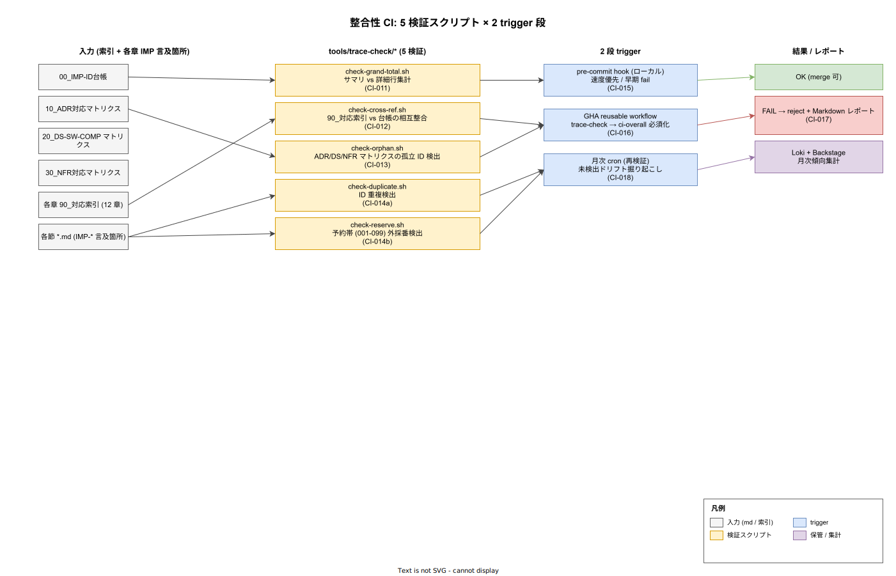

# 01. 整合性 CI 設計

本ファイルは k1s0 の `05_実装/` 12 章および各章 90_対応索引で採番される IMP-\* ID と、99_索引の 4 マトリクス（台帳 / ADR / DS-SW-COMP / NFR）の整合性を、**手動運用に頼らず CI で構造的に保証する** 仕組みを定義する。索引は 12 接頭辞 × 99 枠 × ADR / NFR / DS-SW-COMP 多面参照の組合せで急速に複雑化するため、レビュー時の目視ではドリフトを早期検出できない。本節は 5 種類の検証スクリプトと 2 段の trigger（pre-commit + GitHub Actions）+ 月次 cron を物理配置レベルで凍結する（IMP-TRACE-CI-010〜019）。

## 整合性 CI が必要な理由

99_索引 最終整合性レビュー（2026-04-26）で、台帳サマリと詳細行の集計値ずれ、章別 90_索引と台帳の集計矛盾、参照網に残った予約のみの ID（`IMP-SEC-KEY-001/002`）の 4 種の破綻が同時発見された。これらは個別には軽微なずれだが、`05_実装/` 全体で 553 件超の IMP-\* ID が ADR / DS-SW-COMP / NFR の三方向参照網に編まれている現状では、目視レビューによる検出は数十分単位の労力を要し、PR ごとに継続するのは現実的でない。

具体的に防ぐべき破綻は以下である。

- サマリ行と詳細行の合計値ずれ（例: SEC 行の実装 ID 集計が 58 と表記されつつ実数 59）
- 章別 90_対応索引の総数と台帳サマリの不一致（例: SEC 「合計 56 ID」/「合計 66 ID」の自己矛盾）
- 採番済として記録されているが物理的に節ファイルで採番されていない「予約のみ ID」の参照混入
- ADR / DS-SW-COMP / NFR マトリクスから孤立した IMP-\* ID（参照されない死蔵）
- 接頭辞ごと 001-099 の予約帯外への採番（IMP-TRACE-POL-002 違反）
- サブ接頭辞内での ID 重複（`IMP-SEC-OBO-040` を 2 度採番するなど）

本章はこれらを 5 検証スクリプト × 2 trigger + 月次 cron で検出する仕組みを物理化する。

## 整合性 CI の全体像

検証パイプラインは「入力 → 5 検証スクリプト → 2 段 trigger → 結果」の単方向フローで構成する。検証スクリプトは `tools/trace-check/` 配下に集約し、すべて pre-commit hook と GHA reusable workflow `trace-check` の両方から同一バイナリで呼び出す（実装の二重化を禁じる）。

この図が示す重要な構造は次の 3 点である。第一に、5 検証スクリプトは責務が完全に独立しており、1 種類の検証が 1 種類の破綻に対応する（IMP-TRACE-POL-003 の 1 判断 = 1 ID 原子性を検証層にも適用）。第二に、pre-commit hook は速度優先で「高速 3 検証（grand-total / cross-ref / duplicate）」のみ実行し、重い検証（orphan / reserve）は GHA 側に寄せる。第三に、月次 cron は PR 単位では検出できないドリフト（古い ID への参照が残ったまま新規 PR 全部を通る等）を掘り起こす最終防衛線として機能する。

## IMP-TRACE-CI-010: 5 検証スクリプトの責務分離と物理配置

`tools/trace-check/` 配下に 5 スクリプトを配置し、それぞれが単一の検証責務を持つ。実装言語は Bash + ripgrep + jq + yq に限定し、追加の言語ランタイム依存を持たせない。理由は、整合性 CI 自身がランタイム依存トラブルで failed になると索引運用全体が停止するため、依存最小化を優先する。

| スクリプト | ID | 責務 | 検出対象 |
|---|---|---|---|
| `check-grand-total.sh` | CI-011 | 台帳サマリ vs 詳細行集計 | サマリの「採番済合計」「実装 ID」「予約残」が詳細表の集計と一致するか |
| `check-cross-ref.sh` | CI-012 | 90_対応索引 vs 台帳の相互整合 | 各章 90_対応索引の合計値が台帳サマリ行と一致するか / 詳細 ID が双方に存在するか |
| `check-orphan.sh` | CI-013 | ADR / DS-SW-COMP / NFR マトリクスの孤立 ID 検出 | 台帳に採番済として登録されているが ADR / DS-SW-COMP / NFR マトリクスから 1 度も参照されない ID |
| `check-duplicate.sh` | CI-014a | ID 重複検出 | 同一 IMP-\* ID が 2 回以上採番されている / 99_索引内で 2 通りの定義文が混在している |
| `check-reserve.sh` | CI-014b | 予約帯 (001-099) 外採番検出 | サブ接頭辞別の予約範囲を超えた採番 / IMP-TRACE-POL-002 違反 |

スクリプトは単一実行可能で、CI と pre-commit から同じコマンドラインで呼ぶ（オプションのみ trigger 別に切替）。

## IMP-TRACE-CI-011: 台帳 grand total 検算（`check-grand-total.sh`）

台帳サマリ表の各列（POL / 実装 ID / 採番済合計 / 予約残）と、各接頭辞節内の詳細表の行数を突き合わせる。たとえば SEC 行の「実装 ID = 59」は、SEC 節内の詳細表が「KC 13 + SP 16 + OBO 10 + CRT 10 + REV 10 = 59」と一致しなければ FAIL。さらに全接頭辞合計（POL 84 + 実装 470 = 554）が台帳冒頭の文章と一致するかも検算する。

検算ロジックは台帳の Markdown を AST レベルで解析するのではなく、ripgrep + 正規表現で「| IMP-XXX-...-NNN |」行を数える素朴な実装に留める。理由は、Markdown のセル境界を厳密にパースしようとすると依存が肥大化するため、台帳側で「1 行 1 ID」の規約を強制する側に寄せる。

## IMP-TRACE-CI-012: 90_対応索引と台帳の相互整合（`check-cross-ref.sh`）

各章の `90_対応IMP-XXX索引/01_対応IMP-XXX索引.md` が宣言する合計値（例: 95章 DX の「全 57 件 = POL 7 + 実装 50」）と、99_索引の台帳サマリ行を突き合わせる。両者が一致しない場合は FAIL し、どちらが正かを CI ログに記録する（修正は人間が判断）。

加えて、90_対応索引の詳細表に登場する各 ID が 99_索引の台帳詳細表にも存在することを検証する。片方にしかない ID は「90_索引には書かれているが台帳に未登録」または「台帳にあるが章索引から漏れている」として FAIL。これにより、章ごとの採番作業と全体台帳の更新が同 PR で完結することを CI で強制する（IMP-TRACE-POL-004 索引更新先の物理化）。

## IMP-TRACE-CI-013: ADR / DS-SW-COMP / NFR マトリクスの孤立 ID 検出（`check-orphan.sh`）

台帳に採番済として登録されているすべての IMP-\* ID について、`10_ADR対応マトリクス.md` / `20_DS-SW-COMP-IMP対応マトリクス.md` / `30_NFR-IMP対応マトリクス.md` の少なくとも 1 つで参照されているかを確認する。3 マトリクス全てで参照ゼロの ID は **孤立 ID** と判定し、warning を出力する。

孤立 ID は即時 FAIL とせず warning に留める理由は、新規採番直後に対応マトリクスの更新が遅れるケースを許容するためである。ただし孤立 ID が 30 日以上残った場合は月次 cron（CI-018）で Sev3 通知を発火し、強制的に解消を促す。POL ID は方針記述として原理的に多くのマトリクスに薄く広がるため、孤立判定の対象から除外する。

## IMP-TRACE-CI-014: ID 重複・予約帯外採番検出（`check-duplicate.sh` + `check-reserve.sh`）

`check-duplicate.sh` は台帳および各章 90_索引で同一 IMP-\* ID が 2 度以上現れるケースを検出する。重複は単純な誤コピペでも発生するが、より深刻なケースとして「採番者 A が `IMP-CI-RWF-018` を coverage 段階導入として確定している間に、別 PR で採番者 B が同じ ID を別の意味で書き加えた」というレースが起きる。CI で即時 FAIL することで merge 順序を強制し、ID 衝突を防ぐ。

`check-reserve.sh` は IMP-TRACE-POL-002（接頭辞 001-099 の予約帯）を検証する。`IMP-CI-HAR-100` のような帯外採番は即 FAIL。サブ接頭辞別の予約範囲（例: SP は 020-039 / OBO は 040-049 / REV は 050-059）も `tools/trace-check/reserve-ranges.yaml` で宣言し、範囲外のサブ接頭辞間衝突（OBO-050 を採番すると REV-050 と衝突）も検出する。

## IMP-TRACE-CI-015: pre-commit hook ローカル検証

`tools/git-hooks/pre-commit-trace-check` を `pre-commit` フレームワーク（[pre-commit.com](https://pre-commit.com/)）の hook として登録する。実行対象は `check-grand-total.sh` / `check-cross-ref.sh` / `check-duplicate.sh` の 3 種に限定し、合計実行時間を 2 秒以内に抑える。重い `check-orphan.sh` / `check-reserve.sh` は GHA 側に寄せる（pre-commit が遅いと bypass されるリスクが高まるため、速度優先）。

pre-commit 実行は開発者ローカルでのみ意味を持ち、bypass されることもあるため、最終的な保証は GHA 側で行う。pre-commit はあくまで「PR 作成前に気付ける早期警報」として扱う。

## IMP-TRACE-CI-016: GHA reusable workflow `trace-check` の `ci-overall` 必須化

`.github/workflows/_reusable-trace-check.yml` を reusable workflow として配置し、`ci-overall` 集約 job の必須依存に組み込む。これにより、整合性 CI が FAIL した PR は `ci-overall` も FAIL となり、IMP-CI-BP-070（必須 status check は ci-overall 1 本のみ）の系として merge protection が自動的に効く。

`trace-check` workflow は path-filter（IMP-CI-PF-030）で「`docs/05_実装/**/*.md` または `tools/trace-check/**` の変更時のみ実行」とし、無関係な PR で空回りしない設計とする。実行時間目標は 30 秒以内（5 検証スクリプト全てを並列実行）。

## IMP-TRACE-CI-017: 検証失敗時のレポート構造とエスカレーション

検証 FAIL 時は、CI ログに加えて `trace-check-report.md` を artifact としてアップロードする。レポートは「破綻種別 / 該当 ID / 期待値 / 実際値 / 修正候補ファイル」の 5 列構造で、人間が直接 PR コメントに貼り付けて修正計画を共有できる粒度に揃える。

加えて、3 PR 連続で同種の破綻が出た場合は GitHub Issue を自動起票し、Platform/Build チーム CODEOWNERS に assign する。これは「採番ルール自体に欠陥がある可能性」を制度的に拾うための仕掛けで、放置されている孤立 ID や重複が ID 体系の改善を促す入口となる。

## IMP-TRACE-CI-018: 月次 cron による未検出ドリフトの再検証

GHA `schedule: cron('0 0 1 * *')` で月次に全 5 検証を `--strict` モードで実行する。`--strict` モードは PR 単位では warning に留めていた孤立 ID・古い予約参照を 30 日以上残存しているケースに限り Sev3 通知（Slack `#dx-platform`）に格上げする。

未検出ドリフトの典型は「ID は採番されたが対応マトリクスに反映されないまま放置」「予約帯記述が更新されたが詳細行が追従していない」など、PR 単位では検出しても warning に留めるため見落とされやすい問題である。月次 cron は最終防衛線として、これらを定期的に掘り起こす。

## IMP-TRACE-CI-019: 検証スクリプトの言語・依存と Renovate 連動

`tools/trace-check/` の依存は Bash + ripgrep + jq + yq のみとし、追加言語ランタイム（Python / Node / Go 等）の混入を禁じる。これらの依存は Renovate 中央運用（IMP-DEP-REN-010〜019）で digest pin され、CI runner image に同梱される（`tools/devcontainer/profiles/full/` で local 開発環境にも同期）。

整合性 CI 自身が依存トラブルで failed になることを防ぐため、`tools/trace-check/` の dry-run（実際の検証は行わず依存呼び出しのみ）を nightly で実行し、依存欠落の早期検出を行う。これは IMP-CI-RWF-019（CI 失敗時の可読性）の系として、整合性 CI の落ち方を「依存系」と「検証ロジック系」に分離可能にする。

## 対応 IMP-TRACE ID

本ファイルで採番する実装 ID は以下とする。

- `IMP-TRACE-CI-010`: 5 検証スクリプトの責務分離と `tools/trace-check/` 物理配置
- `IMP-TRACE-CI-011`: `check-grand-total.sh` 台帳 grand total 検算
- `IMP-TRACE-CI-012`: `check-cross-ref.sh` 90_対応索引と台帳の相互整合
- `IMP-TRACE-CI-013`: `check-orphan.sh` ADR / DS-SW-COMP / NFR マトリクス孤立 ID 検出
- `IMP-TRACE-CI-014`: `check-duplicate.sh` + `check-reserve.sh` ID 重複と予約帯外採番検出
- `IMP-TRACE-CI-015`: pre-commit hook ローカル検証（高速 3 検証）
- `IMP-TRACE-CI-016`: GHA reusable workflow `trace-check` の `ci-overall` 必須化
- `IMP-TRACE-CI-017`: 検証失敗時の Markdown レポートと 3 PR 連続失敗 Issue 起票
- `IMP-TRACE-CI-018`: 月次 cron による `--strict` モード再検証
- `IMP-TRACE-CI-019`: 検証スクリプトの依存最小化（Bash + ripgrep + jq + yq）と nightly 依存検証

## 対応 ADR / DS-SW-COMP / NFR

- ADR: なし（本節は IMP-TRACE-POL-001〜007 の実装側であり、既存 ADR への直接対応はない。新規 ADR 起票も不要 = 索引運用原則 7 件で方針確定済み）
- DS-SW-COMP: DS-SW-COMP-132（platform / 開発者基盤の一部として `tools/trace-check/` を配置）/ DS-SW-COMP-085（OTel Collector 経由で trace-check 実行イベントを Loki に転送、CI-018 の月次傾向集計用）
- NFR: NFR-C-MGMT-001（変更管理）/ NFR-C-NOP-002（可視性 = trace-check レポートで索引整合状態を恒常的に可視化）/ NFR-G-CLS-001（PII 取扱はないが、検証ログに開発者 GitHub login が含まれるため Loki 90 日でローテ）

## 関連章

- `30_CI_CD設計/` — `_reusable-trace-check.yml` を reusable workflow として配置（IMP-CI-RWF-010 系列）/ `ci-overall` 必須化（IMP-CI-BP-070）
- `40_依存管理設計/` — `tools/trace-check/` 依存の Renovate 中央運用（IMP-DEP-REN-010〜019）
- `50_開発者体験設計/` — pre-commit hook を Dev Container に同梱（IMP-DEV-DC-012）
- `60_観測性設計/` — 月次 cron 結果の Loki 転送・Backstage 表示（IMP-OBS-LGTM-024）
- `00_方針/01_索引運用原則.md` — 本節が物理化する 7 原則（特に POL-002 予約帯 / POL-003 原子性 / POL-004 索引最終更新先）
- `60_catalog-info検証/` — 並列の検証節（catalog-info.yaml スキーマ検証）
