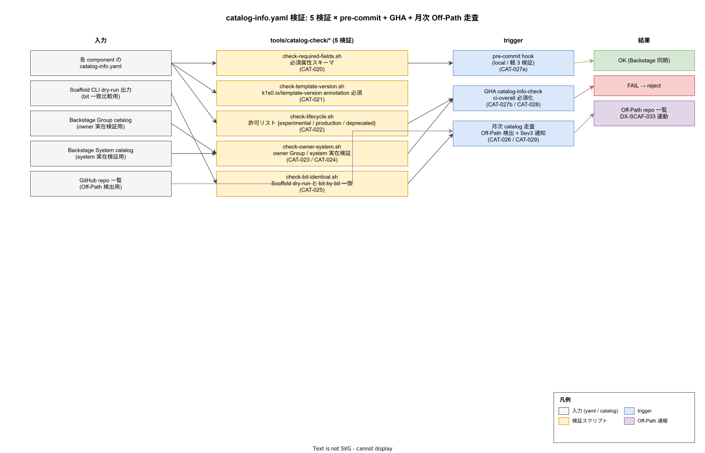

# 01. catalog-info.yaml 検証設計

本ファイルは k1s0 の全 component / API / Group / System に同梱される `catalog-info.yaml` のスキーマ検証と Off-Path 検出を、Backstage 同期前の CI 段で構造的に保証する仕組みを定義する。`catalog-info.yaml` は Backstage カタログの真実源（IMP-DEV-BSN-048）であり、ここに不備があると Catalog Errors / TechInsights / Scorecards が連鎖して破綻する。本節は 5 種類の検証スクリプトと 3 段の trigger（pre-commit + GitHub Actions + 月次 catalog 走査）を物理配置レベルで凍結する（IMP-TRACE-CAT-020〜029）。

## 検証が必要な理由

`catalog-info.yaml` は Scaffold CLI（IMP-CODEGEN-SCF-033）で自動生成される設計だが、生成後の手動編集を禁じる物理的強制は弱い。実運用では以下の破綻パターンが頻出する。

- `spec.owner` に存在しない Group 名（タイポや退職者所属の旧 Group）を記述したまま PR が merge され、Backstage 上で「owner 不明」となり on-call エスカレーションが空転する
- `spec.lifecycle` に許可リスト外の値（`alpha` / `beta` / `staging` 等）が混入し、Scorecards 集計から落ちる
- `metadata.annotations.k1s0.io/template-version` が削除され、テンプレート更新影響範囲（IMP-DEV-SO-037）から漏れる
- Scaffold CLI 出力後に手動編集が入り、Scaffold 利用率（IMP-DX-SCAF-030〜039）の Adoption Rate が誤集計される
- `catalog-info.yaml` 自体を持たない component（Off-Path）が新規作成され、Scaffold 経由必須化（IMP-DEV-SO-030）が崩れる

これらは Backstage 側の Catalog Errors として事後検出可能だが、検出時には既に master に merge 済みであり、修正に PR を再度起票する手間が発生する。本節は CI 段（merge 前）で全件検証することで、Backstage 同期失敗を構造的にゼロに抑える。

## 検証パイプラインの全体像

検証は「入力 → 5 検証スクリプト → 3 段 trigger（pre-commit + GHA + 月次 cron）→ 結果」の単方向フローで構成する。検証スクリプトは `tools/catalog-check/` 配下に集約し、整合性 CI（IMP-TRACE-CI-010）と同様に pre-commit hook と GHA reusable workflow `catalog-info-check` の両方から同一バイナリで呼ぶ。

この図が示す重要な構造は次の 3 点である。第一に、5 検証は責務が独立しており、各々が catalog-info.yaml の異なる崩壊軸（必須属性 / annotation / lifecycle / owner-system 実在 / Scaffold 出力 bit 一致）に対応する。第二に、Backstage Group / System catalog は GitHub provider 5 分 polling（IMP-DEV-BSN-043）で同期されたものを参照するため、検証は「Backstage 同期完了済の状態」を前提に組む。第三に、月次 catalog 走査（CAT-026 / CAT-029）は IMP-DX-SCAF-033（月次 Backstage Catalog 走査による catalog-info.yaml 不在 component 集計）と物理的に同一スクリプトを共有し、二重実装を避ける。

## IMP-TRACE-CAT-020: catalog-info.yaml 必須属性スキーマ（`check-required-fields.sh`）

`catalog-info.yaml` の必須属性を以下に固定し、JSON Schema として `tools/catalog-check/schema/catalog-info.schema.json` に格納する。`ajv` または `yq` + 手書きチェックで全件検証する。

- `apiVersion: backstage.io/v1alpha1`（固定値、Backstage 互換性のため変更時は ADR 起票必須）
- `kind: Component | API | Group | System`（許可リスト固定 = IMP-DEV-BSN-040）
- `metadata.name`（kebab-case 強制 / `^[a-z0-9-]+$` 正規表現）
- `metadata.namespace`（`default` 以外を禁止、Backstage マルチテナント運用は採用拡大期に再検討）
- `metadata.annotations`（後続 CAT-021 で詳細検証）
- `spec.owner`（後続 CAT-023 で実在検証）
- `spec.system`（後続 CAT-024 で実在検証）
- `spec.lifecycle`（後続 CAT-022 で許可リスト検証）

スキーマ違反は即時 FAIL とし、欠落属性をレポートに列挙する。スキーマ自体は IMP-DEV-BSN-042（catalog-info.yaml 必須 5 属性）を CI 強制化する物理実装である。

## IMP-TRACE-CAT-021: `k1s0.io/template-version` annotation 必須化

`metadata.annotations.k1s0.io/template-version` を必須注入とする。値は SemVer 形式（`v1.2.3`）に限定し、Scaffold CLI が出力する template metadata と一致することを検証する。

このアノテーションが欠落すると、テンプレート更新影響範囲を機械的に特定できなくなり（IMP-DEV-SO-037 が破綻）、Scaffold 改善を行っても既存 component への自動 PR を発火できない。検証は `tools/catalog-check/check-template-version.sh` で実施し、Scaffold CLI 経由で生成された全 catalog-info.yaml に annotation が必ず存在することを保証する。

例外として、初期手動作成された `examples/` 配下のレガシー catalog-info.yaml には `k1s0.io/template-version: legacy-pre-scaffold` という固定値を許容するが、この例外は採用拡大期で全件 Scaffold 経由に書き換える計画を ADR-DEV-001 のサブ ADR として起票する。

## IMP-TRACE-CAT-022: `spec.lifecycle` 許可リスト検証（`check-lifecycle.sh`）

`spec.lifecycle` の値を `experimental` / `production` / `deprecated` の 3 値に限定する。Backstage 自体は任意の文字列を受け付けるため、CI で許可リストを強制する。

- `experimental`: Scaffold 直後 / リリース時点 examples 配下 / 評価段階の component
- `production`: tier1 / tier2 / tier3 の本番稼働 component（DORA 計測対象）
- `deprecated`: 廃止予定 component（Renovate 自動 PR から除外、TR 連携で半期 Hold 判定）

許可リスト外の値が混入すると、Scorecards / DX レポートの集計から該当 component が落ち、生産性指標（IMP-DX-DORA-010〜020）にバイアスが入る。CI で即時 FAIL とし、開発者に明示的な選択を強制する。

## IMP-TRACE-CAT-023: `spec.owner` Group 実在検証（`check-owner-system.sh` / 前段）

`spec.owner` に指定された Group 名が、Backstage Group catalog に実在するかを検証する。Backstage GitHub provider（IMP-DEV-BSN-043）が 5 分 polling で取得した最新の Group 一覧を `tools/catalog-check/cache/groups.json` に snapshot し、検証時に参照する。

実在しない Group が指定されている場合は FAIL。Catalog Errors として事後検出される従来の経路と異なり、CI 段で検出することで「on-call escalation が空転する」事故を merge 前に止める。退職に伴う Group 構成変化（IMP-SEC-REV-050〜059）と同期した Group 削除があると、過去の正常な catalog-info.yaml が突然 FAIL するため、Group 廃止時は当該 component の owner 移管を同 PR で行う運用を CODEOWNERS で強制する。

## IMP-TRACE-CAT-024: `spec.system` 実在検証（`check-owner-system.sh` / 後段）

`spec.system` に指定された System 名が、Backstage System catalog に実在するかを検証する。System の追加は IMP-DEV-BSN-040 の entity 5 種別固定で ADR 起票必須としており、ad-hoc な System 命名を防ぐ。

System 不在の場合の典型は「Scaffold CLI で `--system=new-system` を指定したが、System の catalog-info.yaml を別 PR で作成し忘れた」ケース。CI で FAIL することで、System 作成と component 追加が同 PR または順序付き PR として merge されるよう強制する。

## IMP-TRACE-CAT-025: Scaffold CLI 出力との bit-by-bit 一致検証（`check-bit-identical.sh`）

`catalog-info.yaml` を Scaffold CLI dry-run（`scaffold new --dry-run --diff-against=<file>`）で再生成し、生成結果と現ファイルが bit 一致することを検証する。一致しない場合は手動編集が混入したとして FAIL。

ただし、現実には「初期生成後に owner 移管 / lifecycle 遷移 / template-version 自動更新」など正当な編集が発生する。これらを許容するため、Scaffold CLI 側に `--editable-fields` のメタデータを `template.yaml` に宣言し（IMP-CODEGEN-SCF-031）、編集可能フィールド以外の差分のみ FAIL とする。編集可能フィールドは以下に固定する。

- `spec.owner`（owner 移管）
- `spec.lifecycle`（experimental → production → deprecated 遷移）
- `metadata.annotations.k1s0.io/template-version`（テンプレート更新自動 PR）
- `metadata.tags`（補助的タグ追加）

それ以外（`metadata.name` / `spec.system` / `spec.type` 等）の差分は FAIL し、変更したい場合は新規 component として Scaffold で再生成する運用に誘導する。これにより IMP-DX-SCAF-030〜033 の Adoption Rate 計測が正確に維持される。

## IMP-TRACE-CAT-026: catalog 走査による Off-Path 検出（IMP-DX-SCAF-033 連動）

GitHub repo 一覧（`gh repo list <org>`）に対して `catalog-info.yaml` の存在チェックを月次で実施し、不在 repo を Off-Path として記録する。検証スクリプト `tools/catalog-check/scan-offpath.sh` は IMP-DX-SCAF-033（月次 Backstage Catalog 走査）と同一バイナリを共有し、二重実装を避ける。

意図的な Off-Path（archived repo / external mirror / sandbox）は `.k1s0-no-catalog` ファイルを repo ルートに置くことで除外可能とし（IMP-DX-SCAF 仕様と一貫）、`tools/catalog-check/offpath-allowlist.yaml` で recheck 対象から外す。

## IMP-TRACE-CAT-027: pre-commit hook + GHA reusable workflow

pre-commit hook（`tools/git-hooks/pre-commit-catalog-check`）で軽量 3 検証（CAT-020 / CAT-021 / CAT-022）をローカル実行する。これらは外部依存（Backstage catalog）が不要で 1 秒以内に完了するため、commit 段階で fast feedback を返せる。

GHA reusable workflow `_reusable-catalog-info-check.yml`（CAT-027b）は全 5 検証を実行し、Backstage Group / System catalog snapshot に依存する CAT-023 / CAT-024 / CAT-025 もカバーする。実行時間目標は 60 秒以内（catalog snapshot の取得が支配的）。

## IMP-TRACE-CAT-028: `ci-overall` 必須化

`_reusable-catalog-info-check.yml` を `ci-overall` 集約 job の必須依存に組み込む（IMP-CI-BP-070 系列）。これにより `catalog-info.yaml` 検証が FAIL した PR は merge protection で自動 reject される。path-filter（IMP-CI-PF-030）で `**/catalog-info.yaml` または `tools/catalog-check/**` の変更時のみ実行し、無関係 PR では空回りしない。

## IMP-TRACE-CAT-029: 月次 catalog 走査と Off-Path Sev3 通知

GHA `schedule: cron('0 1 1 * *')`（毎月 1 日 01:00 UTC）で全 catalog 走査を実行し、Off-Path repo 一覧を Slack `#dx-platform` に Sev3 通知する。Off-Path が前月比で増加している場合は EM 月次レポート（IMP-DX-EMR-053 / 054）にも自動転載され、Paved Road 健全度（IMP-DX-SCAF-034）の劣化シグナルとして扱う。

通知粒度は repo 単位ではなく集約値（合計件数 / 増減 / Top 5 増加 owner）に留める。個別の Off-Path repo 一覧は Backstage の Catalog ページで確認可能とし、Slack に羅列することで通知疲弊（alert fatigue）を起こさないよう配慮する。

## 対応 IMP-TRACE ID

本ファイルで採番する実装 ID は以下とする。

- `IMP-TRACE-CAT-020`: 必須属性スキーマ（apiVersion / kind / metadata / spec の 5 構造）
- `IMP-TRACE-CAT-021`: `k1s0.io/template-version` annotation 必須化と SemVer 形式強制
- `IMP-TRACE-CAT-022`: `spec.lifecycle` 許可リスト（experimental / production / deprecated）強制
- `IMP-TRACE-CAT-023`: `spec.owner` Group 実在検証（Backstage Group catalog snapshot 参照）
- `IMP-TRACE-CAT-024`: `spec.system` System 実在検証
- `IMP-TRACE-CAT-025`: Scaffold CLI dry-run との bit-by-bit 一致検証（編集可能フィールド除く）
- `IMP-TRACE-CAT-026`: GitHub repo 走査による Off-Path 検出（IMP-DX-SCAF-033 と同一バイナリ）
- `IMP-TRACE-CAT-027`: pre-commit hook（軽 3 検証）+ GHA reusable workflow（全 5 検証）
- `IMP-TRACE-CAT-028`: GHA workflow の `ci-overall` 必須化と path-filter 制御
- `IMP-TRACE-CAT-029`: 月次 cron による Off-Path Sev3 通知と EM 月次レポート連動

## 対応 ADR / DS-SW-COMP / NFR

- ADR: ADR-BS-001（Backstage / catalog-info.yaml が Backstage カタログの真実源）/ ADR-DEV-001（Paved Road / Scaffold 経由必須化を物理保証）
- DS-SW-COMP: DS-SW-COMP-132（platform / `tools/catalog-check/` 配置）/ DS-SW-COMP-135（Backstage / Scorecards 表示基盤）
- NFR: NFR-C-MGMT-001（変更管理 / catalog 整合性の常時可視化）/ NFR-C-NOP-002（可視性 / Off-Path 集計の常時可観測化）/ NFR-G-CLS-001（PII 取扱はないが、owner 名は組織情報のため Loki 90 日でローテ）

## 関連章

- `30_CI_CD設計/` — `_reusable-catalog-info-check.yml` の reusable workflow 配置 / `ci-overall` 必須化（IMP-CI-RWF-010 / IMP-CI-BP-070）
- `50_開発者体験設計/` — IMP-DEV-BSN-040〜048（Backstage 連携）/ IMP-DEV-SO-030〜037（Scaffold CLI 運用）/ IMP-DEV-DC-012（pre-commit Dev Container 同梱）
- `20_コード生成設計/` — IMP-CODEGEN-SCF-031（Backstage Software Template 互換 `template.yaml`）
- `95_DXメトリクス/` — IMP-DX-SCAF-033（月次 catalog 走査と同一バイナリ共有）/ IMP-DX-EMR-053/054（Off-Path 通知の EM レポート転載）
- `50_整合性CI/` — 並列の検証節（索引整合性 CI）
- `00_方針/01_索引運用原則.md` — IMP-TRACE-POL-006（Backstage catalog 対応 リリース時点 確立）の物理化
