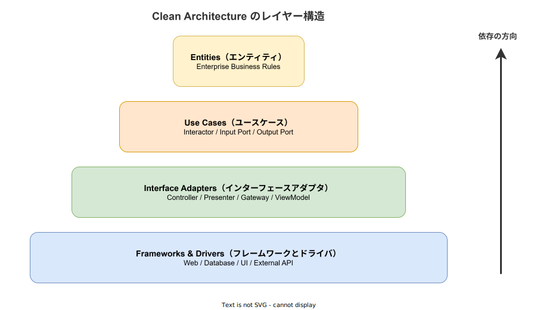
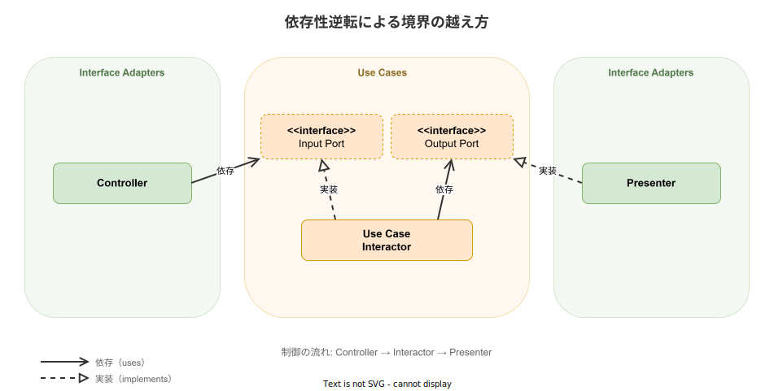

# Clean Architecture: 基本

- 対象読者: ソフトウェア設計の基礎知識を持つ開発者
- 学習目標: Clean Architecture の原則とレイヤー構造を理解し、設計判断に適用できるようになる
- 所要時間: 約 30 分
- 対象バージョン: —（設計原則のため特定バージョンなし）
- 最終更新日: 2026-04-12

## 1. このドキュメントで学べること

- Clean Architecture が解決する課題を説明できる
- 4 つのレイヤーの役割と責務を区別できる
- 依存性の規則（Dependency Rule）を理解し説明できる
- 依存性逆転の原則（DIP）を使った境界の設計方法を理解できる

## 2. 前提知識

- オブジェクト指向プログラミングの基礎（インターフェース、ポリモーフィズム）
- SOLID 原則の基本的な理解（特に依存性逆転の原則）

## 3. 概要

Clean Architecture は Robert C. Martin（通称 Uncle Bob）が 2012 年のブログ記事で提唱し、2017 年の著書「Clean Architecture: A Craftsman's Guide to Software Structure and Design」で体系化したソフトウェア設計原則である。

従来の多くのアプリケーションでは、ビジネスロジックがフレームワークやデータベースに強く依存する。この状態ではフレームワークの変更やデータベースの移行が困難になり、テストにも外部サービスが必要となる。Clean Architecture はビジネスロジックを外部の技術的関心事から分離し、変更に強く、テスト容易なシステムを実現する。

## 4. 用語の整理

| 用語 | 説明 |
|------|------|
| Entity（エンティティ） | 企業全体のビジネスルールをカプセル化したオブジェクト |
| Use Case（ユースケース） | アプリケーション固有のビジネスルール。1 つの操作を表す |
| Interface Adapter（インターフェースアダプタ） | 外部と内部のデータ形式を変換する層 |
| Dependency Rule（依存性の規則） | 依存は常に外側から内側に向かうという規則 |
| Port（ポート） | レイヤー境界に定義するインターフェース（抽象） |
| Adapter（アダプタ） | ポートの具体的な実装 |
| DIP（依存性逆転の原則） | 上位モジュールは下位モジュールに依存せず、両者が抽象に依存する原則 |

## 5. 仕組み・アーキテクチャ

Clean Architecture は同心円状の 4 層で構成される。内側ほど抽象度が高く安定しており、外側ほど具体的で変更されやすい。



各レイヤーの責務は以下のとおりである。

| レイヤー | 責務 | 含まれる要素 |
|----------|------|-------------|
| Entities | 企業全体のビジネスルール | Entity、Value Object、Aggregate |
| Use Cases | アプリケーション固有のビジネスルール | Interactor、Input/Output Port |
| Interface Adapters | データ形式の変換 | Controller、Presenter、Gateway |
| Frameworks & Drivers | 外部技術との接続 | Web、DB、UI、External API |

**Dependency Rule（依存性の規則）** がこのアーキテクチャの中核である。ソースコードの依存は常に外側から内側に向かう。内側のレイヤーは外側のレイヤーの存在を一切知らない。

レイヤー境界を越える際には、依存性逆転の原則（DIP）を用いる。内側のレイヤーにインターフェース（Port）を定義し、外側のレイヤーがその実装（Adapter）を提供する。



Controller は Use Cases 層の Input Port に依存し、Presenter は Output Port を実装する。すべての依存が内側を向くため、外側の技術を差し替えてもビジネスロジックに影響しない。

## 6. 環境構築

Clean Architecture は設計原則であり、特定のツールのインストールは不要である。あらゆる言語・フレームワークで適用できる。実践にあたっては以下のディレクトリ構成を参考にするとよい。

```text
src/
├── domain/          # Entities レイヤー
├── usecase/         # Use Cases レイヤー
├── adapter/         # Interface Adapters レイヤー
└── infrastructure/  # Frameworks & Drivers レイヤー
```

## 7. 基本の使い方

以下は Rust で Clean Architecture の基本構造を示す最小構成の例である。

```rust
// Clean Architecture の基本構造を示す最小構成の例

// ユーザーを表すドメインエンティティ（Entities レイヤー）
struct User {
    // ユーザーの一意識別子
    id: u64,
    // ユーザーの名前
    name: String,
}

// ユーザー永続化の出力ポート（Use Cases レイヤー）
trait UserRepository {
    // ID を指定してユーザーを検索する
    fn find_by_id(&self, id: u64) -> Option<User>;
}

// ユーザー取得ユースケース（Use Cases レイヤー）
fn get_user_name(repo: &impl UserRepository, id: u64) -> Option<String> {
    // リポジトリからユーザーを取得し、名前のみを返す
    repo.find_by_id(id).map(|user| user.name.clone())
}
```

### 解説

- `User` は Entities レイヤーに属し、他のレイヤーに依存しない
- `UserRepository` トレイトは Use Cases レイヤーに定義された Output Port（抽象）である
- `get_user_name` はユースケースであり、具体的な永続化方法を知らない
- `UserRepository` の実装（例: `PostgresUserRepository`）は Infrastructure レイヤーに配置される
- 依存の方向は Infrastructure → Use Cases → Entities と、常に内側を向く

## 8. ステップアップ

### 8.1 Input Port と Output Port の使い分け

Input Port はユースケースの呼び出しインターフェースであり、Controller から呼ばれる。Output Port はユースケースが外部に処理を委譲するインターフェースであり、Repository や Presenter が実装する。この 2 種類のポートにより、ユースケースは入力側も出力側も抽象に依存する。

### 8.2 テスト戦略

各レイヤーが抽象に依存するため、Port のモック実装でユニットテストが容易になる。Entities はそのままテスト可能であり、Use Cases は Port のモックを注入して検証する。Infrastructure の結合テストのみ実際の外部サービスが必要となる。

## 9. よくある落とし穴

- **レイヤーの形骸化**: ディレクトリだけ分けて依存方向を守らない。コンパイル時に依存方向を検証する仕組みを入れるべきである
- **過剰な抽象化**: 小規模アプリケーションに全レイヤーを適用し、コード量だけが増える。プロジェクト規模に応じて簡略化してよい
- **Entity の貧血化**: Entity がデータの入れ物になり、ビジネスロジックが Use Cases に漏れる。Entity にドメインロジックを持たせる
- **依存方向の違反**: Use Cases から具体的なフレームワーククラスを直接参照する。必ず Port を経由する
- **DTO の乱立**: レイヤー間の変換オブジェクトが増えすぎる。必要最小限に留める

## 10. ベストプラクティス

- 依存方向を機械的に検証する（Rust の場合、クレート分割で Cargo が強制する）
- Entity にビジネスルールの検証ロジックを持たせる
- Use Case は 1 クラス（または関数）= 1 操作の粒度で設計する
- Port の命名は技術用語でなくドメイン用語を使う（例: `UserRepository` ではなく `UserStore`）
- 小規模なプロジェクトでは Entities + Use Cases を 1 層にまとめてもよい

## 11. 演習問題

1. 「商品を注文する」ユースケースについて、必要な Entity、Input Port、Output Port を列挙せよ
2. 上記のユースケースで依存性の規則が守られていることを、依存の方向で説明せよ
3. データベースを PostgreSQL から DynamoDB に移行する場合、どのレイヤーの変更が必要か答えよ

## 12. さらに学ぶには

- Robert C. Martin「Clean Architecture」（2017）: 本アーキテクチャの原典
- Hexagonal Architecture（Alistair Cockburn, 2005）: Ports & Adapters パターンの原型
- Onion Architecture（Jeffrey Palermo, 2008）: 同心円モデルの先駆け

## 13. 参考資料

- Robert C. Martin, "Clean Architecture: A Craftsman's Guide to Software Structure and Design", Prentice Hall, 2017
- Robert C. Martin, "The Clean Architecture", The Clean Code Blog, 2012
- Alistair Cockburn, "Hexagonal Architecture", 2005
- Jeffrey Palermo, "The Onion Architecture", 2008
