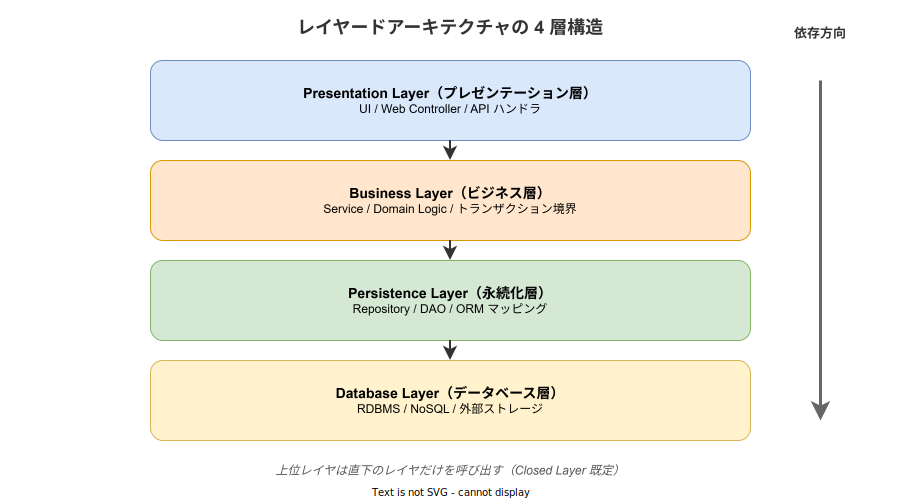
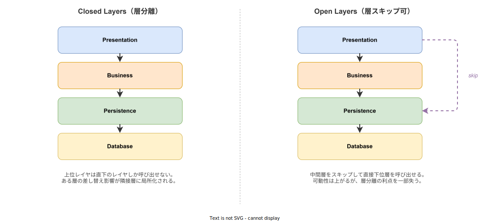

# レイヤードアーキテクチャ: 基本

- 対象読者: ソフトウェア設計の基礎知識を持つ開発者
- 学習目標: レイヤードアーキテクチャの構造・原則・限界を理解し、適用判断ができるようになる
- 所要時間: 約 30 分
- 対象バージョン: —（設計パターンのため特定バージョンなし）
- 最終更新日: 2026-04-28

## 1. このドキュメントで学べること

- レイヤードアーキテクチャが解決する課題と典型的なレイヤ構成を説明できる
- Closed Layer と Open Layer の使い分けを判断できる
- Sinkhole Anti-Pattern の発生原因と回避策を理解できる
- Clean Architecture / Hexagonal Architecture との依存方向の違いを区別できる

## 2. 前提知識

- オブジェクト指向プログラミングの基礎
- 関心の分離（Separation of Concerns）の概念
- パッケージ・モジュール境界という単位での「依存方向」の意識

## 3. 概要

レイヤードアーキテクチャ（Layered Architecture、N-Tier Architecture とも呼ばれる）は、ソフトウェアを役割が異なる水平方向のレイヤに分割し、上位レイヤから下位レイヤへの一方向の依存だけを許す設計パターンである。1996 年に Frank Buschmann らが POSA（Pattern-Oriented Software Architecture）Vol.1 でパターンとして整理し、以降あらゆる業務システムで既定の構造として採用されてきた。

このパターンの動機は、UI・業務ロジック・データ永続化・外部システム接続という**変更の理由が異なる関心事**を同じコードに混在させると、片方の変更が他方を壊し、テストにも全体構成が必要になる、という問題を解くことにある。レイヤを分けて依存方向を一方向に固定することで、各レイヤを独立に置き換え・テスト可能な状態を作り出す。

## 4. 用語の整理

| 用語 | 説明 |
|------|------|
| Presentation Layer（プレゼンテーション層） | UI／API エンドポイントなど、利用者と直接接する層 |
| Business Layer（ビジネス層） | 業務ルール・ワークフローを記述する層 |
| Persistence Layer（永続化層） | 業務オブジェクトをストレージに読み書きする層 |
| Database Layer（データベース層） | RDBMS／NoSQL／外部ストレージ本体 |
| Closed Layer（閉じた層） | 上位レイヤが直下の隣接層しか呼び出せない構成 |
| Open Layer（開いた層） | 中間層を飛び越して下位層を直接呼び出せる構成 |
| Layers of Isolation | 各層を独立に変更可能な状態に保つ設計指針 |
| Sinkhole Anti-Pattern | リクエストが各層を素通りするだけになり、層を分けた意味が失われる劣化形 |

## 5. 仕組み・アーキテクチャ

レイヤードアーキテクチャは典型的に 4 層、簡略化された場合は 3 層で構成される。各層は直下の層を呼び出すだけで、逆向きの依存を持たない。



| レイヤ | 責務 | 含まれる要素 |
|--------|------|-------------|
| Presentation | 表示・入力受付 | Web Controller / View / API ハンドラ |
| Business | 業務ルール | Service / Domain Logic / トランザクション境界 |
| Persistence | 永続化のアクセス抽象 | Repository / DAO / ORM マッピング |
| Database | データ保存本体 | RDBMS / NoSQL / ファイル |

レイヤ間の関係は **Closed Layer**（隣接層のみ呼び出し可）と **Open Layer**（中間層をスキップ可）の 2 種類があり、設計者が層単位で選択する。



Closed Layer は **Layers of Isolation** の原則を支える。たとえば Persistence 層の実装を JPA から R2DBC へ差し替えても Business 層に変更が及ばない、というのが Closed Layer の保証である。Open Layer は中間層が単なる委譲だけで価値を生まない場合に適用し、無意味な経由を省く目的で選ぶ。Open を選ぶたびに「層を畳む（廃止する）」選択肢と比較する習慣を持つと、構成が腐らない。

## 6. 環境構築

レイヤードアーキテクチャは設計パターンであり、特定のツールのインストールは不要である。実装にあたっては各層をパッケージ／モジュールで物理的に分離し、依存方向をビルドツールで強制することが重要である。一例として次のようなディレクトリ構成を取る。

```text
src/
├── presentation/   # Presentation 層
├── business/       # Business 層
├── persistence/    # Persistence 層
└── database/       # Database 層（マイグレーション・接続設定）
```

Rust であれば各層をクレートに分割し `Cargo.toml` の `[dependencies]` で依存方向を Cargo に強制させる。Java／Kotlin であれば Gradle subproject、TypeScript であれば monorepo の package 境界が同じ役割を果たす。

## 7. 基本の使い方

以下は Rust でレイヤードアーキテクチャの依存方向を示す最小構成の例である。

```rust
// レイヤードアーキテクチャの依存方向を示す最小構成の例

// 業務エンティティ（Business 層に配置する）
struct User {
    // ユーザーの一意識別子
    id: u64,
    // ユーザーの名前
    name: String,
}

// Persistence 層に配置するデータアクセス関数
fn fetch_user_row(id: u64) -> Option<(u64, String)> {
    // 実際の実装ではここから Database 層（SQL 実行）を呼び出す想定
    Some((id, format!("user-{}", id)))
}

// Business 層に配置するサービス関数
fn get_user(id: u64) -> Option<User> {
    // 直下の Persistence 層のみを呼び出す（Closed Layer）
    let (uid, name) = fetch_user_row(id)?;
    // 取得した行を業務エンティティへ組み立てて返す
    Some(User { id: uid, name })
}

// Presentation 層に配置するハンドラ関数
fn handle_get_user(id: u64) -> String {
    // 直下の Business 層のみを呼び出す
    match get_user(id) {
        // 取得できた場合は表示用文字列を返す
        Some(user) => format!("id={}, name={}", user.id, user.name),
        // 取得できない場合のメッセージを返す
        None => "not found".to_string(),
    }
}
```

### 解説

- 依存は Presentation → Business → Persistence → Database の一方向のみ
- 各関数は直下の層の関数しか呼ばないため、Closed Layer の構成になっている
- Database 層を差し替えるときは Persistence 層の `fetch_user_row` だけを書き換えれば済み、上位層は無変更で動く
- 逆向きの依存（Persistence から Business を import する等）が発生したらそれは設計上のバグであり、ビルド境界で禁止する

## 8. ステップアップ

### 8.1 Closed Layer と Open Layer の選択

Closed Layer は層分離の利点（Layers of Isolation）を最大化するが、中間層が単なる委譲だけになる場合は冗長になる。Open Layer はそうした「素通り層」を許す代わりに、層を飛び越す呼び出しが増えると変更影響が広がる。原則 Closed をデフォルトとし、価値を生まない層を見つけた時点で Open に切り替えるか、層を畳む判断を行う。

### 8.2 Sinkhole Anti-Pattern の回避

リクエストの大部分が層を素通りするだけの状態を **Sinkhole Anti-Pattern** と呼ぶ。Mark Richards はこれを「20-80 ルール」（80% を超えると兆候）として注意喚起しており、Sinkhole 比率が高い場合は中間層を Open Layer に変える、もしくは層を統合することで対処する。設計レビューでは「この層は何を加工しているか」を各層に問う。

### 8.3 Clean / Hexagonal との関係

Clean Architecture と Hexagonal Architecture は、レイヤードアーキテクチャの「上位が下位に依存する」構造を反転させ、ドメインを中心に据えて外側から内側へ依存させる発展形である。レイヤードでは Database が安定の中心、Clean / Hexagonal では Domain が安定の中心となる。両者を「対立する選択肢」ではなく「依存方向の決め方の違い」として捉えると、移行や混在の判断がしやすい。

## 9. よくある落とし穴

- **層の形骸化**: ディレクトリだけ分けて Business 層から直接 SQL を発行している。ビルド境界で依存方向を強制すること
- **データ構造の貫通**: ORM のエンティティを Presentation までそのまま返してしまい、DB スキーマ変更が API 仕様変更に直結する。層境界で DTO に変換する
- **Sinkhole 化**: Business 層が Persistence の戻り値をそのまま返すだけになっている。8.2 の手順で層自体の妥当性を見直す
- **横断的関心事の重複**: ロギング・認可を各層で重複実装する。ミドルウェア／Interceptor で一箇所に寄せる
- **層をスケール単位と誤認**: 「ビジネス層だけスケールアウトしたい」と層境界をプロセス境界と混同する。スケール単位はサービスやモジュールの分割で別途設計する

## 10. ベストプラクティス

- 層境界をビルドツールで機械的に検証する（Rust ならクレート分割、Java なら ArchUnit など）
- 層境界では DTO に詰め替え、内部表現をそのまま渡さない
- 既定は Closed Layer とし、Open Layer に切り替えるときは必ず理由を ADR に残す
- 横断的関心事はミドルウェア／Interceptor に外出しし、各層を業務処理に集中させる
- 「この層を別実装に差し替えるテストを書けるか」を Closed Layer 維持の判定に使う

## 11. 演習問題

1. ある CRUD アプリで Business 層に「Persistence 層の戻り値をそのまま返す」だけのメソッドが 9 割を占めている。Sinkhole 比率の評価と、取りうる是正策を 2 つ挙げよ
2. データベースを PostgreSQL から DynamoDB に移行する場合、Closed Layer が守られていれば変更が必要となる層はどれか答えよ
3. レイヤードアーキテクチャと Clean Architecture を「依存方向」「変更が安定の中心」の 2 軸で比較表にまとめよ

## 12. さらに学ぶには

- Clean Architecture（依存方向を反転させた発展形）: [`./clean-architecture_basics.md`](./clean-architecture_basics.md)
- Vertical Slice Architecture（水平レイヤを縦切りに置き換える対立観点）: [`./vertical-slice-architecture_basics.md`](./vertical-slice-architecture_basics.md)
- Hexagonal Architecture（Alistair Cockburn, 2005）: 依存方向逆転の原型
- Mark Richards「Software Architecture Patterns」（O'Reilly, 2015）: レイヤードを含む 5 パターンの比較

## 13. 参考資料

- Frank Buschmann et al., "Pattern-Oriented Software Architecture, Volume 1: A System of Patterns", Wiley, 1996
- Mark Richards, "Software Architecture Patterns", O'Reilly, 2015
- Eric Evans, "Domain-Driven Design", Addison-Wesley, 2003（4 層モデルの議論）
- Alistair Cockburn, "Hexagonal Architecture", 2005
