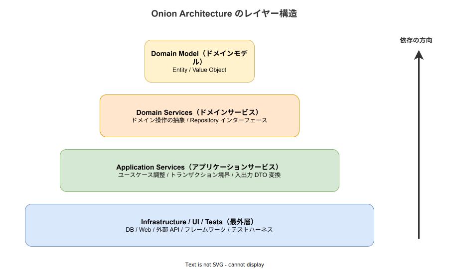
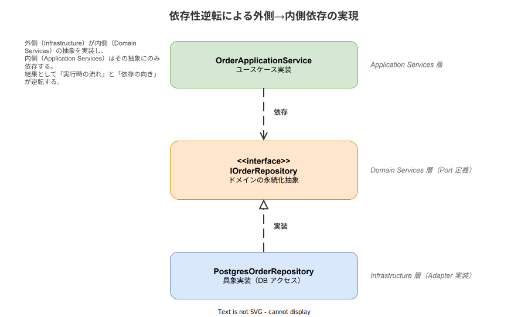

# Onion Architecture: 基本

- 対象読者: ソフトウェア設計の基礎知識を持つ開発者
- 学習目標: Onion Architecture の動機・レイヤ構造・依存性の規則を理解し、N 層アーキテクチャ／Clean Architecture との違いを説明して設計判断に適用できるようになる
- 所要時間: 約 30 分
- 対象バージョン: —（設計原則のため特定バージョンなし）
- 最終更新日: 2026-04-28

## 1. このドキュメントで学べること

- Onion Architecture が解決する課題（特に従来の N 層アーキテクチャの問題点）を説明できる
- 4 つの同心円レイヤ（Domain Model / Domain Services / Application Services / Infrastructure）の責務を区別できる
- 依存性の規則（依存は外側から内側に向かう）を依存性逆転の原則（DIP）と組み合わせて説明できる
- Onion Architecture と Clean Architecture / Hexagonal Architecture の関係を整理できる

## 2. 前提知識

- オブジェクト指向プログラミングの基礎（インターフェース、ポリモーフィズム）
- SOLID 原則のうち特に依存性逆転の原則（DIP）
- 従来の 3 層／N 層アーキテクチャ（UI - Business Logic - Data Access）の経験
- 関連 Knowledge: [clean-architecture_basics.md](clean-architecture_basics.md)

## 3. 概要

Onion Architecture は Jeffrey Palermo が 2008 年に一連のブログ記事で提唱したアプリケーション設計パターンである。Robert C. Martin の Clean Architecture（2012）の先駆けに位置し、同心円状のレイヤ構造と「依存は外側から内側のみに向かう」という規則を共通の特徴として持つ。

Onion Architecture が直接的に問題視するのは、従来の N 層アーキテクチャ（UI → Business Logic → Data Access の上下スタック）におけるビジネスロジックのデータアクセス層への依存である。この依存関係はビジネスルールを特定の RDB やフレームワークに縛り付け、テスト時にも DB を必要とし、永続化技術の差し替えに耐えない。

Onion はこの上下構造を「裏返し」、データアクセス・UI・外部 API・テストハーネスといった**揮発しやすい技術的関心事を最外層に追い出す**。中心にはドメインモデルを置き、ドメインに対する操作（多くは Repository 等のインターフェース）はドメインに隣接する内側で抽象として宣言する。具象実装は最外層に置かれ、依存性逆転の原則を使ってビルド時の依存関係を内向きに揃える。

## 4. 用語の整理

| 用語 | 説明 |
|------|------|
| Domain Model（ドメインモデル） | 業務概念そのものを表現する中心オブジェクト。Entity と Value Object から成る |
| Domain Services（ドメインサービス） | 単一の Entity に収まらないドメイン操作と、外部依存（永続化等）の抽象（インターフェース）を置く層 |
| Application Services（アプリケーションサービス） | ユースケースを調整する層。トランザクション境界と入出力 DTO 変換を担う |
| Infrastructure（インフラストラクチャ） | 最外層。DB アクセス・Web フレームワーク・外部 API クライアント・テストハーネスの具象実装を置く |
| Dependency Rule（依存性の規則） | ソースコードの依存方向は常に外側から内側に向かい、内側は外側を一切知らないという規則 |
| Anti-corruption Layer（腐敗防止層） | 外部システムのモデルが内側ドメインに流入しないように設置する変換層 |

「Domain Services」は Eric Evans のドメイン駆動設計（DDD）由来の語であり、Palermo は DDD の語彙体系を Onion の各層名に流用している。

## 5. 仕組み・アーキテクチャ

Onion Architecture は中心から外側に向けて 4 層で構成される。中心ほど安定（変更されにくく、抽象度が高い）であり、外側ほど揮発（実装技術に縛られ、変更されやすい）する。



| レイヤ | 責務 | 含まれる要素 |
|--------|------|-------------|
| Domain Model | 業務概念の表現とドメイン不変条件 | Entity, Value Object, Aggregate |
| Domain Services | ドメイン操作の抽象、外部依存のインターフェース | Repository インターフェース, Domain Service |
| Application Services | ユースケース調整、トランザクション境界 | Use Case, Application Service, DTO |
| Infrastructure | 具象実装と外界との接続 | DB Adapter, Web Controller, 外部 API クライアント, テストハーネス |

中核となる規則は **Dependency Rule（依存性の規則）** である。ビルド時のソースコード依存は常に外側から内側に向かう。内側のレイヤは外側のレイヤの存在を一切知らない。

実行時には外側の Infrastructure が内側のロジックを呼び出すため、ビルド時依存と実行時呼び出しの方向が逆転する。これを成立させるのが**依存性逆転の原則（DIP）**である。Domain Services 層に永続化のインターフェース（Port）を宣言し、Infrastructure 層がその実装（Adapter）を提供する。



`OrderApplicationService` は `IOrderRepository` という抽象にのみ依存し、`PostgresOrderRepository` という具象を直接知らない。この結果、永続化技術を差し替えてもユースケースとドメインに影響しない。

## 6. 環境構築

Onion Architecture は設計原則であり、特定のツールのインストールは不要である。プロジェクトで採用する場合のディレクトリ構成例は次のとおり。

```text
src/
├── domain/             # Domain Model 層（Entity / Value Object）
├── domain_services/    # Domain Services 層（Repository インターフェース等）
├── application/        # Application Services 層（Use Case）
└── infrastructure/     # Infrastructure 層（DB / Web / 外部 API 実装）
```

Rust の場合はモジュール分割よりもクレート分割が望ましい。Cargo の依存関係は循環を許さないため、依存方向違反をビルド時に強制できる。`infrastructure` クレートが `application` と `domain_services` と `domain` に依存し、`application` が `domain_services` と `domain` に依存し、`domain_services` が `domain` に依存する、という一方向のグラフを Cargo.toml で表現する。

## 7. 基本の使い方

以下は Rust で Onion Architecture の依存方向を最小構成で示した例である。Cargo の制約を借りるならクレート分割が望ましいが、ここでは説明のためモジュール分割で示す。

```rust
// Onion Architecture の依存方向を 4 層構成で示す最小例

// ドメインモデル層（最内層、外側を一切参照しない）
mod domain {
    // 注文を表すドメインエンティティ
    pub struct Order {
        // 注文の一意識別子
        pub id: u64,
        // 注文金額
        pub amount: u64,
    }
}

// ドメインサービス層（永続化の抽象を Port として宣言する）
mod domain_services {
    // 内側の domain のみに依存する
    use crate::domain::Order;
    // 注文永続化の抽象（Port）。具象実装は Infrastructure 層に置く
    pub trait OrderRepository {
        // 注文を ID で取得する
        fn find_by_id(&self, id: u64) -> Option<Order>;
    }
}

// アプリケーションサービス層（ユースケースを調整する）
mod application {
    // 内側の domain_services と domain にのみ依存する
    use crate::domain_services::OrderRepository;
    // 注文金額を取得するユースケース
    pub fn get_order_amount(repo: &impl OrderRepository, id: u64) -> Option<u64> {
        // 抽象 Port にのみ依存し、具象 DB 実装は知らない
        repo.find_by_id(id).map(|order| order.amount)
    }
}

// インフラストラクチャ層（最外層、内側の抽象を実装する）
mod infrastructure {
    // 内側の domain_services の Port と domain の Entity に依存する
    use crate::domain::Order;
    use crate::domain_services::OrderRepository;
    // PostgreSQL 向けの具象 Adapter
    pub struct PostgresOrderRepository;
    // 抽象 Port を実装する（依存性逆転）
    impl OrderRepository for PostgresOrderRepository {
        // 実環境では SQL を発行するが、ここでは固定値で代替する
        fn find_by_id(&self, _id: u64) -> Option<Order> {
            Some(Order { id: 1, amount: 1000 })
        }
    }
}
```

### 解説

- `domain` モジュールは他のどのモジュールも参照しない。最も安定した中心である
- `domain_services` は `domain` のみを参照し、外部依存（DB）を抽象としてのみ宣言する
- `application` は `domain_services` の抽象に依存し、具象 DB 実装を知らない
- `infrastructure` のみが具象 DB に紐付き、内側の抽象を実装する
- ビルド時の依存グラフは `infrastructure → application → domain_services → domain` の一方向で、外側から内側のみに向かう

## 8. ステップアップ

### 8.1 N 層アーキテクチャからの移行

従来の N 層では `Business Logic` レイヤが `Data Access` レイヤの API（具象クラス）を直接呼び出すため、ビジネスロジックが ORM やドライバの型を引き連れていた。Onion へ移行するには、まず Data Access に対応するインターフェースを Domain Services 側に切り出し、既存の DAO 実装をその実装に書き換える。Business Logic 側は具象参照を抽象参照に置き換え、DI コンテナや明示的な依存注入で具象を渡す。これだけでビルド時依存方向が反転し、テストでは DB 不要のモックで Business Logic を検証できる。

### 8.2 Clean Architecture / Hexagonal Architecture との関係

| 観点 | Onion (Palermo, 2008) | Hexagonal (Cockburn, 2005) | Clean (Martin, 2012) |
|------|-----------------------|----------------------------|----------------------|
| 中核の図 | 同心円 | 六角形と Port/Adapter | 同心円 |
| レイヤ命名 | DDD 由来（Domain / Application） | Inside / Outside と Ports/Adapters | Entities / Use Cases / Interface Adapters / Frameworks |
| 主眼 | ドメインを中心にした層構造 | アプリと外部の境界の対称性 | 依存性の規則の体系化 |
| Repository の場所 | Domain Services 層に Port を置く | Inside の Port として宣言 | Use Cases 層の Output Port として宣言 |

3 つは「依存はビジネスロジックに向かう」という同じ原則の言い換えであり、表面的な図と語彙が異なる。Clean Architecture は Onion / Hexagonal を統合・整理した後発の体系として読むのが一貫性がある。

## 9. よくある落とし穴

- **貧血ドメインモデル（Anemic Domain Model）**: Domain Model が getter/setter のみのデータ容器となり、ビジネスルールが Application Services に流出する。不変条件と振る舞いを Entity / Value Object 自身に持たせる
- **抽象の過剰**: 小規模アプリで全層を分離し、ファイル数だけが増える。プロジェクト規模が小さい場合は Domain Model + Domain Services を 1 層に統合してもよい
- **Port を技術用語で命名する**: `IOrderDAO` のように DB 実装の語彙を内側に持ち込むと抽象が漏れる。`IOrderRepository` のようにドメイン語彙で命名する
- **依存方向の違反**: Domain や Application から具体的な ORM 型・フレームワーク型を参照してしまう。クレート／プロジェクト分割でビルド時に強制するのが確実である
- **Repository に SQL を持ち込む**: Repository インターフェース自体が SQL に近い API（条件式オブジェクト等）を要求すると、内側が外側の都合に侵食される。Specification パターンや明示的なドメインクエリ型で隔離する
- **テスト容易性の名目だけ抽象化する**: 1 つの実装しか持たないトレイトを増やしてもテスト容易性は上がらず、間接化のコストだけ残る。動機はテストではなく依存方向の制御に置く

## 10. ベストプラクティス

- 依存方向はディレクトリ規約ではなくビルド構成で強制する（Rust ならクレート分割、Java/Kotlin なら ArchUnit 等）
- Domain Services 層に置く Port はドメイン用語で命名し、戻り値型もドメイン型に限定する
- Application Services は「1 ユースケース 1 エントリ関数（またはクラス）」の粒度に保ち、複数ユースケースを 1 クラスに詰めない
- 外部システムのモデルが侵入する境界には Anti-corruption Layer を置き、Infrastructure 内で変換する
- DI（依存注入）は Composition Root（`main` 直下や起動コード）で 1 か所に集約する
- 小規模プロジェクトでは Domain Model と Domain Services を統合し、3 層構成（Domain / Application / Infrastructure）から始めてよい

## 11. 演習問題

1. 「在庫を引き当てる」ユースケースについて、Domain Model・Domain Services の Port・Application Services のエントリ関数・Infrastructure の Adapter を、それぞれの責務を一文ずつで列挙せよ
2. 上記の構成で「PostgreSQL から DynamoDB へ移行する」場合、書き換えが必要な層を答え、その理由を依存性の規則から説明せよ
3. 「ユーザー登録時に外部 API でメール検証する」要件を Onion Architecture に落とし込む際、メール検証クライアントは Port／Adapter のどちらの形でどの層に配置すべきか答え、根拠を述べよ

## 12. さらに学ぶには

- Jeffrey Palermo, "The Onion Architecture: Part 1〜4"（2008〜2013）: 本アーキテクチャの原典シリーズ
- 関連 Knowledge: [clean-architecture_basics.md](clean-architecture_basics.md), [vertical-slice-architecture_basics.md](vertical-slice-architecture_basics.md)
- Eric Evans, "Domain-Driven Design"（2003）: Domain Services / Repository / Aggregate の語彙的源流
- Alistair Cockburn, "Hexagonal Architecture"（2005）: Ports & Adapters パターンの原型

## 13. 参考資料

- Jeffrey Palermo, "The Onion Architecture: Part 1", 2008
- Jeffrey Palermo, "The Onion Architecture: Part 2", 2008
- Jeffrey Palermo, "The Onion Architecture: Part 3", 2008
- Jeffrey Palermo, "The Onion Architecture: Part 4", 2013
- Robert C. Martin, "The Clean Architecture", The Clean Code Blog, 2012
- Alistair Cockburn, "Hexagonal Architecture", 2005
- Eric Evans, "Domain-Driven Design: Tackling Complexity in the Heart of Software", Addison-Wesley, 2003
