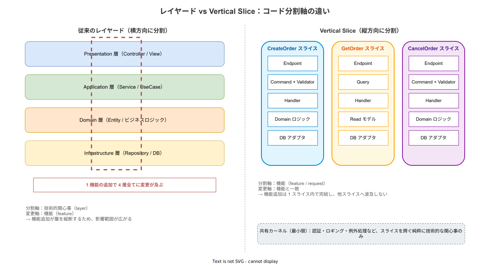
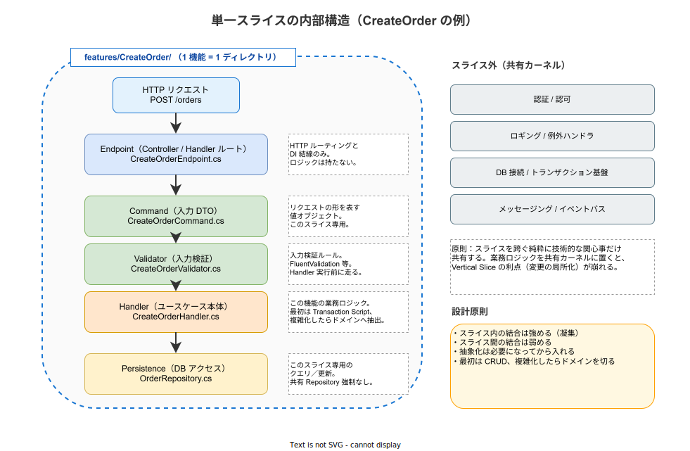

# Vertical Slice Architecture: 基本

- 対象読者: レイヤードアーキテクチャや Clean Architecture を一度は実装した経験のある開発者
- 学習目標: Vertical Slice Architecture（以下 VSA）が解こうとしている問題を説明でき、レイヤードや Clean Architecture との分割軸の違いを理解し、採用判断の基準を持てるようになる
- 所要時間: 約 30 分
- 対象バージョン: —（設計原則のため特定バージョンなし）
- 最終更新日: 2026-04-27

## 1. このドキュメントで学べること

- VSA が「変化の軸」に沿った分割であるという発想を説明できる
- レイヤードや Clean Architecture との対比で VSA の利点と制約を区別できる
- 単一スライスを構成する典型的な要素（Endpoint・Command/Query・Handler 等）を列挙できる
- VSA を採用してよいチーム・採用すべきでないチームの判断基準を持てる

## 2. 前提知識

- レイヤードアーキテクチャ（Presentation / Application / Domain / Infrastructure 等）の基本構造
- CQRS（Command Query Responsibility Segregation）の概要：状態変更（Command）と参照（Query）を別経路で扱う考え方
- 依存性逆転の原則（DIP）の基本（→ [clean-architecture_basics.md](clean-architecture_basics.md)）

## 3. 概要

VSA は Jimmy Bogard が 2018 年のブログ記事「Vertical Slice Architecture」で体系化したアーキテクチャスタイルである。中心となる主張は「アーキテクチャは独立したリクエストを軸に組み立てるべきであり、フロントエンドからバックエンドまでの関心事を 1 つのリクエスト単位にカプセル化する」というものである。

レイヤードアーキテクチャは技術的関心事（プレゼンテーション・ビジネスロジック・永続化）を水平に分割する。だが現実のソフトウェアの変更要求は機能単位で発生する。「注文を取り消せるようにする」という 1 つの要求を実装するために、レイヤードでは Controller・Service・Repository・Entity の 4 ファイルを横断して触る必要がある。VSA はこの「変化の軸」と「分割の軸」の不一致を解消するため、コードを **機能（feature / request）単位** に縦に切り分ける。

VSA はレイヤードや Clean Architecture を否定するものではなく、層を跨ぐ厳格なルール（Controller は必ず Service を呼び、Service は必ず Repository を呼ぶ等）が、過度に汎用化された抽象を生んで小さな機能の実装コストを押し上げる、という観察への代替案として位置付けられる。

## 4. 用語の整理

| 用語 | 説明 |
|------|------|
| Slice（スライス） | 1 つの機能（リクエスト）に必要な全関心事をまとめた縦の単位。例: `CreateOrder`、`GetOrder` |
| Feature Folder | スライスを 1 ディレクトリに格納する物理配置パターン |
| Command / Query | CQRS における入力 DTO。状態を変える要求が Command、参照のみが Query |
| Handler | Command または Query を受け取り、機能本体のロジックを実行するクラスまたは関数 |
| Transaction Script | ロジックを上から順に手続き的に書くパターン。VSA では出発点として推奨される |
| Shared Kernel | スライスを跨いで共有する最小限の技術的基盤（認証・ロギング・DB 接続など） |
| Axis of Change | 変化の軸。VSA はコードの分割軸をこれに合わせる |

## 5. 仕組み・アーキテクチャ

### 5.1 レイヤードとの対比

レイヤードでは技術関心事を水平に分割するため、1 機能の追加が 4 層全てに変更を波及させる。VSA は機能単位で縦に分割するため、機能追加は当該スライス内で完結する。



「分割軸」と「変更軸」を一致させるという発想がこの図の核心である。レイヤードでは分割軸（layer）と変更軸（feature）が直交しているため、変更が常に層を縦断する。VSA では両者が一致するため、変更が縦の 1 本に閉じる。

### 5.2 単一スライスの内部構造

各スライスは典型的に Endpoint・Command/Query・Validator・Handler・Persistence の 5 要素から構成される。これらは別ファイルに分けても、1 ファイルに同居させてもよい。重要なのは「1 機能 = 1 ディレクトリに必要なものが揃っている」ことである。



スライスの外側には Shared Kernel として、認証・ロギング・DB 接続といった「純粋に技術的でスライスを跨ぐ関心事」だけを置く。業務ロジックを Shared Kernel に押し込むと、変更がスライスを越えて波及するため、VSA の利点が崩れる。

### 5.3 ドメインモデルの位置づけ

VSA はドメインモデルを禁止しない。出発点は単純な Transaction Script（Handler に手続きを直接書く）であり、複数スライスで重複するロジックや不変条件が見えてきた時点で、初めて Entity・Value Object・ドメインサービス等を切り出す。「最初から完璧な抽象を用意しない」という戦略は、後述するように熟練度を要求する。

## 6. 想定する適用条件

VSA は設計原則であり、特定のツール・言語・ランタイムに依存しない。ただし以下の前提が満たされていない場合、VSA は逆効果になりやすい。

- チームがリファクタリングのタイミングを判断できる（Bogard 自身が前提として明言）
- コードスメル（重複・凝集低下・神クラス）の検出経験がある
- レビュー文化があり、スライス間の不要な依存を抑止できる
- ドメインの中核ロジックがまだ流動的で、抽象を先に固定したくない

逆に、業務ロジックが複雑かつ安定しており、ドメインモデルを共有資産として育てたい場合は、Clean Architecture や DDD の戦術パターンの方が適合する。

## 7. 基本の使い方

以下は Rust で VSA の最小構成を示す。Axum 等の Web フレームワークを想定し、`features/create_order/` 配下に必要なものを全て置く。

```rust
// features/create_order/mod.rs
// CreateOrder スライスの全要素を 1 モジュールに同居させる最小例
// 入力 DTO・Validator・Handler・永続化呼び出しを 1 ファイルにまとめる

// 入力コマンド：このスライス専用の DTO
pub struct CreateOrderCommand {
    // 注文するユーザー ID
    pub user_id: u64,
    // 注文する商品 ID
    pub product_id: u64,
    // 注文数量
    pub quantity: u32,
}

// 入力検証：Handler 実行前に走るルール
pub fn validate(cmd: &CreateOrderCommand) -> Result<(), String> {
    // 数量は 1 以上である必要がある
    if cmd.quantity == 0 {
        return Err("quantity must be >= 1".to_string());
    }
    // 検証成功
    Ok(())
}

// 永続化ポート：このスライスが必要とする操作だけを定義する
pub trait OrderStore {
    // 注文を 1 件保存し、採番された ID を返す
    fn insert(&self, user_id: u64, product_id: u64, quantity: u32) -> u64;
}

// Handler：このスライスのユースケース本体
pub fn handle(store: &impl OrderStore, cmd: CreateOrderCommand) -> Result<u64, String> {
    // 入力検証を先に通す
    validate(&cmd)?;
    // 永続化を呼び、生成された ID を返す
    Ok(store.insert(cmd.user_id, cmd.product_id, cmd.quantity))
}
```text
### 解説

- `OrderStore` トレイトは `CreateOrder` スライス専用の抽象であり、他スライスと共有しない（必要になったら抽出する）
- `validate` はこのスライスの業務ルールに閉じる。共通のバリデーション基盤に逃がさない
- 別スライス `GetOrder` を追加する場合は `features/get_order/` を作り、独自の Query・Handler・Read モデルを持つ
- ルーティングや DI 結線は Endpoint 層（ここでは省略）に置き、ロジックは Handler に閉じる

## 8. ステップアップ

### 8.1 CQRS との自然な接続

VSA はリクエスト単位で分割するため、HTTP の GET（参照）と POST/PUT/DELETE（変更）の境界がそのまま Query / Command の境界になる。読み取りと書き込みでデータモデルを分離でき、読み取り側だけ独立にスケールさせる発展経路（CQRS の本来の形）にも進みやすい。

### 8.2 Shared Kernel の境界

「共有しない」ではなく「最小限に共有する」が原則である。認証・ロギング・トランザクション基盤・例外ハンドラ等の **業務に依存しない** 横断関心事は共有してよい。一方、複数スライスで似た業務ロジックが現れた場合は、即座に共通化せず、3 箇所目で意図が一致したら抽出する（Rule of Three）と判断ミスを減らせる。

### 8.3 段階的なドメインモデル抽出

最初の Handler は Transaction Script で書き、テストで動作を固定する。同じ不変条件が複数スライスに現れたら Value Object に、状態を持つ振る舞いが現れたら Entity に抽出する。Clean Architecture が「最初から境界を引く」のに対し、VSA は「必要になってから境界を引く」。

## 9. よくある落とし穴

- **Shared Kernel への業務ロジック流出**：「共通化すれば DRY」と考えてスライス間で業務ルールを共有すると、変更が複数スライスに波及し、VSA の利点が崩れる
- **MediatR 必須という誤解**：VSA はパターンであってライブラリではない。.NET の MediatR は実装の一つに過ぎず、Rust や Go では関数呼び出しで十分なケースが多い
- **重複 = 悪 という誤解**：「コードが似ている」と「同じ理由で変わる」は別物。Bogard 自身が `minimise` と言っており、`zero` ではない
- **大規模ドメインへの過信**：業務ロジックが複雑で安定しているドメインで Transaction Script を貫くと、後からの整理が困難になる
- **テスト戦略の不一致**：スライス単位のインテグレーションテストが基本になる。レイヤード時代のユニットテスト中心の方針をそのまま持ち込むと、テストが薄くなりがち

## 10. ベストプラクティス

- ディレクトリは機能名で切る（`features/<機能名>/`）。技術名（`controllers/`, `services/`）で切らない
- スライス内では Transaction Script から始め、必要になってから抽象化する
- スライス間で共有してよいのは「業務に依存しない技術基盤」だけと決め、レビューで強制する
- スライス単位でインテグレーションテストを書き、リファクタリングの安全網にする
- 機能が肥大化したら 1 ファイル → 1 ディレクトリ → サブモジュール、と段階的に分割する

## 11. 演習問題

1. 「在庫を補充する」という機能を VSA で実装する場合、`features/replenish_stock/` 配下にどんな要素を置くか列挙せよ
2. 上記スライスと既存の `features/create_order/` で同じ「在庫不足」の判定ロジックが現れた。即座に共通化すべきか、留保すべきかを根拠とともに答えよ
3. 業務ロジックが安定し、複数スライスで Entity の不変条件が一致してきた場合、VSA から Clean Architecture へ部分的に移行する手順を考えよ

## 12. さらに学ぶには

- Jimmy Bogard, "Vertical Slice Architecture", 2018: 本パターンの原典
- 関連 Knowledge: [clean-architecture_basics.md](clean-architecture_basics.md)（対比して読むと「分割軸」の違いが鮮明になる）
- 関連 Knowledge: [microservice-architecture_basics.md](../infra/microservice-architecture_basics.md)（サービス境界とスライス境界の対比）

## 13. 参考資料

- Jimmy Bogard, "Vertical Slice Architecture", jimmybogard.com, 2018
- Oskar Dudycz, "My thoughts on Vertical Slices, CQRS, Semantic Diffusion and other fancy words", architecture-weekly.com
- Milan Jovanović, "Vertical Slice Architecture", milanjovanovic.tech
