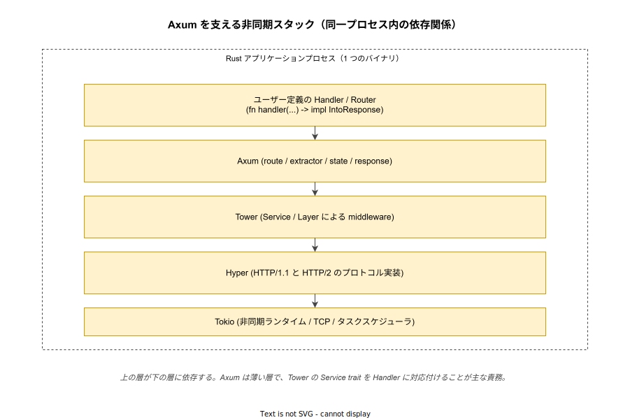
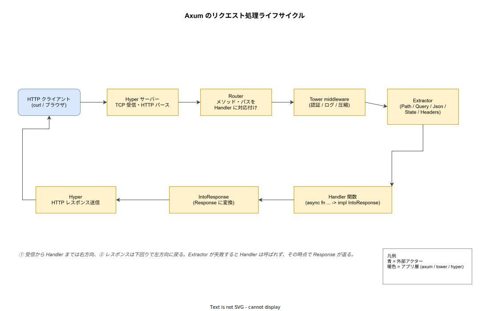

# Axum: 概要

- 対象読者: Rust の所有権・`async/await`・`Result` の基礎を理解しており、Web フレームワークでの API 実装は未経験の開発者
- 学習目標: Axum の設計思想（Tower との関係、Extractor、IntoResponse）を説明でき、ルーティング・状態共有・JSON レスポンスを含む最小サーバーを書ける
- 所要時間: 約 40 分
- 対象バージョン: Axum 0.8 系（Tokio 1.x / Hyper 1.x / Tower 0.5 と組み合わせる）
- 最終更新日: 2026-04-28

## 1. このドキュメントで学べること

- Axum がなぜ「薄い」と呼ばれ、Tokio エコシステムの中でどの責務を担うのかを説明できる
- `Router` と Handler 関数によるルーティングの仕組みを理解できる
- Extractor（`Path` / `Query` / `Json` / `State` 等）を使って、リクエストから型安全に値を取り出せる
- `IntoResponse` の役割と、エラー型を HTTP レスポンスに変換する流儀を理解できる
- Tower の `Layer` を使ってミドルウェア（ログ・認証など）を追加できる

## 2. 前提知識

- Rust の所有権・借用・ライフタイムの基礎（参照: [rust_ownership.md](../language/rust_ownership.md)）
- `async/await` と Future の概念（Rust では実行にランタイムが必須である点を含む）
- HTTP の基本（メソッド・ステータスコード・ヘッダ・JSON ボディ）
- `cargo` による依存追加と実行手順

## 3. 概要

Axum は Tokio チームが公式に開発・保守する Web アプリケーションフレームワークである。HTTP プロトコル実装は Hyper が担い、非同期実行は Tokio が担い、ミドルウェアの抽象は Tower が担う。Axum 自身は「**HTTP リクエストを Rust の関数呼び出しに翻訳する**」ことに特化した薄い層であり、独自のサーバーや非同期ランタイムを内蔵しない。

このアーキテクチャは「フレームワーク独自のエコシステムに閉じ込められない」という利点を生む。たとえば Axum で書いたミドルウェアは Tower の `Service` trait に従うため、Tonic（gRPC）など同じく Tower 上に乗る他のサーバーでも再利用できる。一方、薄いがゆえに「ルーティング・抽出・レスポンス変換」という Web フレームワーク固有の責務は Axum が独自の型で表現しており、その中心が **Extractor** と **IntoResponse** という 2 つの仕組みである。

Extractor は「リクエストから何を取り出すか」を Handler 関数の引数の型で宣言する仕組みである。`Path<u32>` を受け取れば URL パスからの整数抽出になり、`Json<User>` を受け取れば JSON ボディのデシリアライズになる。IntoResponse は逆方向で、Handler の戻り値を HTTP レスポンスに変換する trait である。両者により、Handler の本体は HTTP の細部を意識せずビジネスロジックのみを書ける状態になる。

## 4. 用語の整理

| 用語 | 説明 |
|------|------|
| Handler | リクエストに対する処理を表す関数。`async fn` として書き、Extractor を引数に取り、`IntoResponse` を実装する値を返す |
| Router | パスとメソッドの組み合わせを Handler に対応付けるルーティングテーブル。`Router::new().route("/users", get(handler))` の形で組み立てる |
| Extractor | リクエストから型安全に値を取り出す抽象。`FromRequest` / `FromRequestParts` trait を実装した型を Handler の引数に置くと自動で抽出される |
| IntoResponse | 任意の型を `Response<Body>` に変換する trait。`String` / `Json<T>` / `(StatusCode, T)` などが実装している |
| State | アプリ全体で共有する状態（DB プール等）を Handler に注入する仕組み。`Router::with_state` と `State<T>` Extractor の組合せで使う |
| Tower Service | `Request` を受け取り `Response` を返す非同期関数の抽象。Axum の Router は最終的にこの trait を実装する |
| Tower Layer | `Service` を別の `Service` に包む変換器。ミドルウェア（ログ・認証・タイムアウト等）はすべて Layer で表現する |

## 5. 仕組み・アーキテクチャ

### 5.1 依存スタック

Axum はそれ単体では動かず、Tokio・Hyper・Tower という 3 つの依存に支えられている。下図はバイナリ 1 本の中で、これらがどの順序で積み上がっているかを示す。



ユーザーが書くのは最上層の Handler と Router の組み立てだけで、その下では Tower が `Service` trait による抽象を提供し、Hyper が HTTP のバイト列処理を、Tokio が TCP ソケットとタスクスケジューリングを担う。

### 5.2 リクエストの流れ

1 本のリクエストが入ってからレスポンスが返るまで、内部では次のような責務分担で処理される。



要点は次の 3 つである。第一に、Router が「メソッドとパス」だけで分岐し、ボディの解釈はしない。第二に、Extractor は Handler を呼び出す**前**に走り、失敗時はその場で 400 系のレスポンスが組み立てられる（Handler は呼ばれない）。第三に、Handler の戻り値は `IntoResponse` を介して `Response<Body>` に正規化される。

## 6. 環境構築

### 6.1 必要なもの

- Rust 1.75 以降（`rustup show` で確認）
- Cargo（rustup に同梱）
- ネットワーク到達可能な環境（`crates.io` から依存をダウンロードする）

### 6.2 セットアップ手順

```bash
# 新規バイナリプロジェクトを作成する
cargo new axum-hello && cd axum-hello

# Axum と Tokio 本体、JSON 用の Serde を追加する
cargo add axum
cargo add tokio --features full
cargo add serde --features derive
cargo add serde_json
```

### 6.3 動作確認

`cargo run` でビルドが通り、`http://127.0.0.1:3000/` へリクエストすると `Hello, axum!` が返れば最小構成の動作確認が完了する。

## 7. 基本の使い方

```rust
// Axum の最小構成サンプル — ルーティング 2 件と JSON レスポンスを含む
// ファイル: src/main.rs

// 必要な型をまとめてインポートする
use axum::{
    // パスパラメータを取り出す Extractor
    extract::Path,
    // ステータスコード列挙型
    http::StatusCode,
    // 戻り値を HTTP レスポンスに変換する trait と Json ラッパ
    response::{IntoResponse, Json},
    // ルーター本体と GET メソッド指定子
    routing::get,
    Router,
};
// JSON シリアライズ用に Serde の派生を取り込む
use serde::Serialize;

// レスポンスボディとして使う構造体（JSON 化する）
#[derive(Serialize)]
struct Greeting {
    // 挨拶文
    message: String,
    // 受け取った名前
    name: String,
}

// ルートパス用の Handler — 文字列をそのまま返す
async fn root() -> &'static str {
    // &'static str は IntoResponse を実装しているのでそのまま返せる
    "Hello, axum!"
}

// /hello/:name 用の Handler — Path Extractor で名前を受け取る
async fn hello(Path(name): Path<String>) -> impl IntoResponse {
    // 受け取った名前を含む構造体を組み立てる
    let body = Greeting {
        message: "Hello".to_string(),
        name,
    };
    // (StatusCode, Json<T>) のタプルは IntoResponse 実装を持つ
    (StatusCode::OK, Json(body))
}

// Tokio のマルチスレッドランタイムで main を駆動する
#[tokio::main]
async fn main() {
    // ルーティングテーブルを宣言的に組み立てる
    let app = Router::new()
        // GET / を root Handler に対応付ける
        .route("/", get(root))
        // GET /hello/:name を hello Handler に対応付ける
        .route("/hello/:name", get(hello));

    // 0.0.0.0:3000 で TCP リスナを開く
    let listener = tokio::net::TcpListener::bind("0.0.0.0:3000")
        .await
        .expect("ポート 3000 を確保できなかった");

    // axum::serve でリスナと Router を結びつけて受信ループに入る
    axum::serve(listener, app)
        .await
        .expect("HTTP サーバーが異常終了した");
}
```

### 解説

- **`#[tokio::main]`**: 同期の `main` を非同期エントリポイントに変換するマクロ。Axum は Tokio に依存するため、別ランタイムでは動かない
- **`Router::new().route(...)`**: ルーティングの宣言。同じパスに対して `.route(path, get(...).post(...))` のようにメソッドを連結できる
- **`Path<String>`**: URL パスの `:name` 部分を文字列として受け取る。`Path<u64>` のように整数型にすればパース失敗時に自動で 400 になる
- **戻り値の `impl IntoResponse`**: 「`IntoResponse` を実装する何らかの型」を意味する。タプル `(StatusCode, Json<T>)` はステータスとボディを同時に指定する常套手段である
- **`axum::serve(listener, app)`**: Hyper のサーバー駆動を Axum 経由で起動する関数。`listener` は `tokio::net::TcpListener` 由来である必要がある

## 8. ステップアップ

### 8.1 共有状態（State）の注入

DB 接続プールや設定値など、Handler 間で共有したい値は `with_state` で Router に登録し、`State<T>` Extractor で取り出す。

```rust
// 共有状態を注入する例 — カウンタを全 Handler で共有する
use axum::{extract::State, routing::get, Router};
// スレッド安全な参照カウントと、原子的整数を使う
use std::sync::{atomic::{AtomicU64, Ordering}, Arc};

// アプリ全体で共有する状態の型
#[derive(Clone)]
struct AppState {
    // リクエスト数を加算するカウンタ
    counter: Arc<AtomicU64>,
}

// 共有状態をインクリメントして現在値を返す Handler
async fn count(State(state): State<AppState>) -> String {
    // 1 を加算した上で更新後の値を取得する
    let n = state.counter.fetch_add(1, Ordering::Relaxed) + 1;
    // 文字列として返す（&str / String は IntoResponse 実装を持つ）
    format!("count = {n}")
}

// State を使う Router を組み立てる関数
fn build_app() -> Router {
    // 初期状態を生成する
    let state = AppState { counter: Arc::new(AtomicU64::new(0)) };
    // .with_state で Router に状態を結び付ける
    Router::new().route("/count", get(count)).with_state(state)
}
```

### 8.2 Tower Layer によるミドルウェア

ログ・タイムアウト・圧縮などの横断関心事は Tower の `Layer` で挿入する。下記は `tower-http` のトレースレイヤを足す例である（`cargo add tower-http --features trace` で追加する）。

```rust
// ミドルウェア追加の例 — リクエストごとにトレースを発行する
use axum::{routing::get, Router};
// HTTP 用のトレースレイヤ
use tower_http::trace::TraceLayer;

// 既存のルーターにレイヤを重ねて返す関数
fn with_tracing(app: Router) -> Router {
    // .layer はレスポンス側に最も近い順に外側を包む
    app.layer(TraceLayer::new_for_http())
}
```

### 8.3 エラー型を `IntoResponse` で表現する

Handler が `Result<T, AppError>` を返せるようにするには、エラー型側に `IntoResponse` を実装する。これによりビジネスロジックは `?` で素直に書ける。

```rust
// エラー型の IntoResponse 実装例
use axum::{http::StatusCode, response::{IntoResponse, Response}};

// アプリ独自のエラー型
enum AppError {
    // 入力検証で弾かれた
    BadRequest(String),
    // 内部処理で失敗した
    Internal,
}

// Response への変換を定義する
impl IntoResponse for AppError {
    fn into_response(self) -> Response {
        // バリアントごとに (StatusCode, message) を組み立てて IntoResponse に委譲する
        match self {
            AppError::BadRequest(msg) => (StatusCode::BAD_REQUEST, msg).into_response(),
            AppError::Internal => (StatusCode::INTERNAL_SERVER_ERROR, "internal").into_response(),
        }
    }
}
```

## 9. よくある落とし穴

- **Handler シグネチャのコンパイルエラーが読みにくい**: 引数のいずれかが Extractor を実装しないと「`Handler` が実装されていません」という遠回しなエラーになる。Extractor の trait（`FromRequest` / `FromRequestParts`）が実装されているか確認する。
- **Extractor の順序**: ボディを消費する Extractor（`Json<T>` / `Bytes` 等）は Handler 引数の**最後**に置く。ボディは 1 度しか読めないため、`FromRequestParts`（ヘッダ等）を先に並べ、最後に `FromRequest`（ボディ）を置くのが規約。
- **`Path<(A, B)>` の扱い**: 複数のパスパラメータはタプルで受け取る。`Path<A>, Path<B>` と並べると 2 度抽出することになり実行時エラーとなる。
- **`with_state` の付け忘れ**: `State<T>` を引数に取る Handler を登録した Router で `with_state` を呼ばないと、コンパイルが通らない（型パラメータが未充足のまま `serve` に渡せない）。
- **バージョン非互換**: Axum 0.7 → 0.8 で `:param` から `{param}` 構文への変更や Hyper API の刷新があるため、サンプルコードを写経する際は対応バージョンを確認する。

## 10. ベストプラクティス

- 横断関心事は **Tower Layer** に寄せ、Handler 内には書かない。Layer は順序付きで合成可能、Handler 内のロジックは再利用しにくい。
- エラー型は **アプリ全体で 1 つ**に集約し、`IntoResponse` を実装する。Handler は `Result<T, AppError>` を返す型で揃え、`?` で短く書く。
- Router は **機能単位でファイル分割**し、ルートで `.merge` / `.nest` する。1 ファイルで全ルートを書くと変更影響範囲が読みにくくなる。
- 統合テストは `axum::Router` を直接 `tower::ServiceExt::oneshot` でドライブする。実 TCP を立てなくても HTTP レベルのテストが書ける。
- 共有状態は `Arc<T>` で包むか、安価に `Clone` できる型にする。`with_state(T)` は内部で `Clone` を要求する。

## 11. 演習問題

1. `/users/:id` で整数 ID を受け取り、ID が偶数なら `200 OK` で `{ "id": <n> }` を、奇数なら `404 Not Found` を返す Handler を書け。`Result<Json<...>, StatusCode>` 形式を使うこと。
2. POST `/echo` で JSON ボディを受け取り、そのまま JSON で返す Handler を書け。`Json<serde_json::Value>` を使えば任意の JSON を素通しできる。
3. リクエスト総数を `AtomicU64` で数え、`/metrics` で現在値を返すサーバーを書け。状態は `with_state` 経由で渡し、すべての Handler でカウンタが加算されるよう Tower Layer も書いてみよ。

## 12. さらに学ぶには

- Axum 公式ドキュメント: <https://docs.rs/axum/latest/axum/>
- Axum サンプル集（公式リポジトリ `examples/`）: <https://github.com/tokio-rs/axum/tree/main/examples>
- Tower の `Service` / `Layer` 概念: <https://docs.rs/tower/latest/tower/>
- 関連 Knowledge: [rust_basics.md](../language/rust_basics.md) / [rust_ownership.md](../language/rust_ownership.md) / [api_basics.md](../protocol/api_basics.md)

## 13. 参考資料

- Axum リポジトリ: <https://github.com/tokio-rs/axum>
- Hyper（HTTP 実装）: <https://hyper.rs/>
- Tokio（非同期ランタイム）: <https://tokio.rs/>
- tower-http（HTTP 用ミドルウェア集）: <https://docs.rs/tower-http/latest/tower_http/>
