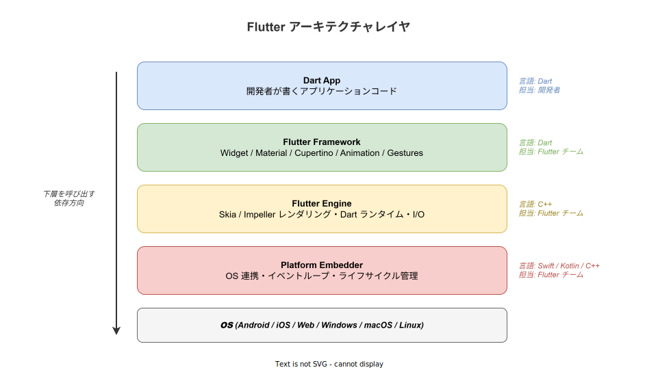
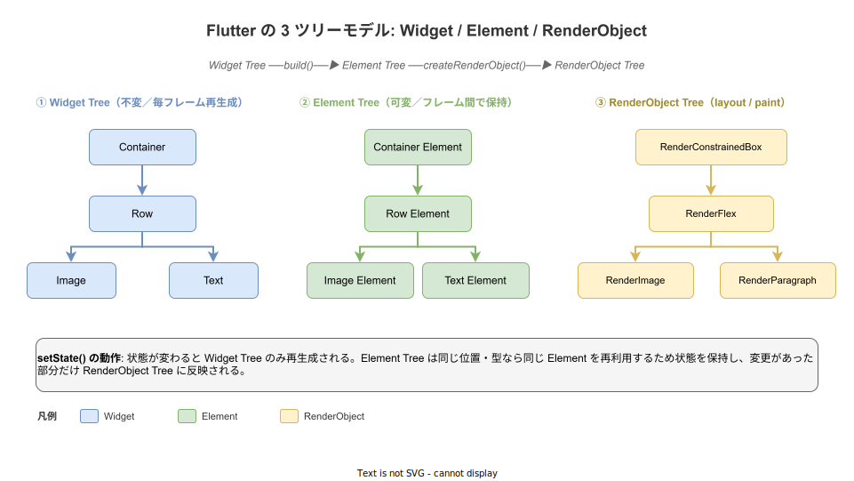

# Flutter: 概要

- 対象読者: 何らかのプログラミング言語で UI 開発の経験がある開発者
- 学習目標: Flutter の設計思想と基本概念（Widget・3 ツリーモデル・宣言的 UI）を理解し、StatefulWidget を使ったカウンターアプリを書けるようになる
- 所要時間: 約 45 分
- 対象バージョン: Flutter 3.41.x / Dart 3.11.x
- 最終更新日: 2026-04-28

## 1. このドキュメントで学べること

- Flutter が「なぜ」存在するか（マルチプラットフォーム UI 構築の課題）を説明できる
- アーキテクチャの 4 レイヤ（Dart App / Framework / Engine / Embedder）の役割を区別できる
- Widget / Element / RenderObject の 3 ツリーモデルが何を解決しているかを理解できる
- StatelessWidget と StatefulWidget の使い分けができる
- `setState()` を使ったカウンターアプリを書ける

## 2. 前提知識

- 何らかのプログラミング言語でのオブジェクト指向の基本（クラス・継承・コンストラクタ）
- HTML / 任意の UI ツールキットでの「コンポーネント」の概念に触れた経験
- コマンドライン操作（パス設定、シェル実行）の基礎

Dart 言語の知識は必須ではない。文法は Java / TypeScript / Kotlin / Swift のいずれかを書ける開発者であれば、本ドキュメントの範囲では困らない。

## 3. 概要

Flutter は Google が 2017 年に公開した、単一の Dart コードベースから iOS・Android・Web・Windows・macOS・Linux のネイティブアプリを構築するための UI ツールキットである。Web の React Native や Xamarin が「OS 提供のネイティブ Widget をラップする」設計を採るのに対し、Flutter は **OS のネイティブ Widget を使わず、独自エンジンで全画素を自前描画する** という設計を選んでいる。これにより、プラットフォーム間の見た目・挙動の差異を最小化し、60 fps を維持しやすい。

UI 構築のパラダイムは「宣言的 UI」である。開発者は「現在の状態が X の時、UI がどのような構造であるべきか」を `build()` 関数で宣言し、状態が変わると Flutter が自動で UI を再構築する。命令的な DOM 操作（「このボタンの色を赤に変える」）を書く必要はない。これは数式 `UI = f(state)` で表される考え方である。

## 4. 用語の整理

| 用語 | 説明 |
|------|------|
| Widget | UI の最小単位。`build()` から返される不変（immutable）なデータクラスで、UI の「設計図」に相当する |
| StatelessWidget | 内部状態を持たない Widget。Props（コンストラクタ引数）が同じなら常に同じ UI を返す |
| StatefulWidget | 内部状態を持つ Widget。`State` クラスとペアで使い、`setState()` で状態変更を通知する |
| Element | Widget をフレーム間で実体化した「インスタンス」。可変で、Widget Tree と RenderObject Tree の橋渡しを担う |
| RenderObject | 実際のレイアウト計算と描画を担当するオブジェクト。Element に対応して生成される |
| build() | Widget が自身の子 Widget ツリーを返すメソッド。状態が変わるたびに呼び出される |
| setState() | StatefulWidget の `State` で状態を更新するメソッド。呼び出すと `build()` が再実行される |
| BuildContext | Widget ツリー内での自身の位置情報。祖先 Widget の参照や Theme の取得に使う |
| Hot Reload | 動作中のアプリにコード変更を即座に反映する機能。状態を保ったまま UI のみ更新する |

## 5. 仕組み・アーキテクチャ

Flutter は 4 つのレイヤで構成される。開発者が触るのは最上層の Dart App のみで、下層 3 レイヤは Flutter チームが提供する。下層ほど低レベルな関心事（OS 連携、画素描画）を担当し、上のレイヤは下のレイヤを呼び出すが逆方向の依存はない。



UI のレンダリングは「3 ツリーモデル」と呼ばれる仕組みで実現される。`build()` が返すのは Widget Tree（不変の設計図）だが、Flutter は内部で対応する Element Tree（可変のインスタンス）と RenderObject Tree（描画担当）を構築・維持する。Element Tree がフレーム間で保持されるため、Widget が毎フレーム作り直されても状態を失わずに済む。



このモデルの肝は、Widget は使い捨てだが Element は使い回されるという非対称性にある。`setState()` が呼ばれると、その Element に紐づく `State` が保持されたまま新しい Widget が生成され、差分検出を経て変更箇所だけ RenderObject に反映される。

## 6. 環境構築

### 6.1 必要なもの

- Flutter SDK 3.41 以上
- Dart SDK 3.11 以上（Flutter SDK に同梱）
- 任意のエディタ（VS Code または IntelliJ IDEA / Android Studio に Flutter プラグインを導入）
- iOS ビルドの場合は macOS + Xcode、Android ビルドの場合は Android Studio + Android SDK

### 6.2 セットアップ手順

```bash
# Flutter SDK を取得（公式の推奨手順は OS 別に異なる、ここでは git clone 例）
git clone https://github.com/flutter/flutter.git -b stable

# PATH を通す（一時的）
export PATH="$PATH:`pwd`/flutter/bin"

# 環境チェック（不足している依存を案内してくれる）
flutter doctor
```

### 6.3 動作確認

```bash
# 雛形プロジェクトを作成する
flutter create my_first_app

# プロジェクトディレクトリへ移動する
cd my_first_app

# 接続中のデバイス（または起動中のエミュレータ）でアプリを実行する
flutter run
```

ホットリロード対応の状態でカウンターアプリが起動すれば成功である。

## 7. 基本の使い方

```dart
// Flutter の最小構成: カウンターアプリ
// lib/main.dart に配置すれば flutter run で動作する

// Material Design ウィジェットを提供するパッケージを取り込む
import 'package:flutter/material.dart';

// アプリのエントリポイント — runApp にルート Widget を渡す
void main() {
  runApp(const MyApp());
}

// MyApp は状態を持たないため StatelessWidget を継承する
class MyApp extends StatelessWidget {
  const MyApp({super.key});

  // build() は UI の構造を返す純粋関数として書く
  @override
  Widget build(BuildContext context) {
    return MaterialApp(
      title: 'Counter Demo',
      home: const CounterPage(),
    );
  }
}

// カウンター画面は内部状態（数値）を持つため StatefulWidget を継承する
class CounterPage extends StatefulWidget {
  const CounterPage({super.key});

  // StatefulWidget は createState() で対応する State を生成する
  @override
  State<CounterPage> createState() => _CounterPageState();
}

// 実際の状態と UI ロジックは State クラス側に書く
class _CounterPageState extends State<CounterPage> {
  // _counter が現在のカウント値（プライベート変数）
  int _counter = 0;

  // ボタン押下時に呼ぶハンドラ — setState で UI 再構築をトリガーする
  void _increment() {
    setState(() {
      _counter++;
    });
  }

  // 状態に応じて UI を組み立てる
  @override
  Widget build(BuildContext context) {
    return Scaffold(
      appBar: AppBar(title: const Text('Counter')),
      body: Center(
        // 縦方向に複数の子 Widget を並べるレイアウト
        child: Column(
          mainAxisAlignment: MainAxisAlignment.center,
          children: [
            const Text('カウント:'),
            // _counter の値を文字列に変換して表示する
            Text('$_counter', style: Theme.of(context).textTheme.headlineLarge),
          ],
        ),
      ),
      // 右下に浮かぶ追加ボタン — 押すと _increment が実行される
      floatingActionButton: FloatingActionButton(
        onPressed: _increment,
        child: const Icon(Icons.add),
      ),
    );
  }
}
```

### 解説

- **Widget の継承**: `StatelessWidget` または `StatefulWidget` を継承し、`build(BuildContext context)` を実装するのが基本形である
- **`const` コンストラクタ**: Widget をできるだけ `const` で構築すると、Flutter はインスタンスを再利用し、再ビルド時の比較を高速化できる
- **`setState()` のスコープ**: 状態変更は必ず `setState(() { ... })` の中で行う。直接 `_counter++` だけ書いても UI は更新されない（Flutter に通知が飛ばないため）
- **`Theme.of(context)`**: `BuildContext` を経由して祖先の `Theme` を取得する。InheritedWidget の典型的な使い方である

## 8. ステップアップ

### 8.1 非同期処理と mounted チェック

API 呼び出し後に `setState()` を呼ぶ場合、その時点で Widget が破棄されている可能性がある。`mounted` プロパティで確認してから更新する。

```dart
Future<void> _loadUser() async {
  final user = await fetchUser();
  // ウィジェットが既に破棄されていたら setState を呼ばない
  if (!mounted) return;
  setState(() {
    _user = user;
  });
}
```

### 8.2 ChangeNotifier による状態のリフトアップ

複数の画面が同じ状態を参照する場合、StatefulWidget の `setState` では限界がある。Flutter 公式が推奨する第一歩は `ChangeNotifier` + `ListenableBuilder` の組み合わせである。

```dart
// 状態保持クラス — リスナーに変更を通知する
class CounterModel extends ChangeNotifier {
  int _value = 0;
  int get value => _value;

  void increment() {
    _value++;
    notifyListeners();
  }
}

// UI 側 — モデルが変わったときだけ builder が再実行される
ListenableBuilder(
  listenable: model,
  builder: (context, _) => Text('${model.value}'),
);
```

より大規模なアプリでは Riverpod / Bloc / Provider などの状態管理ライブラリを採用するのが一般的である。

## 9. よくある落とし穴

- **`setState` を `build()` 内で呼ぶ**: ビルド中に再ビルドを要求するため例外になる。イベントハンドラや非同期コールバック内で呼ぶ
- **`State` のフィールドを `final` にしない**: `State` は可変だが、`StatefulWidget` 自身のフィールドは `final` 必須（Widget は immutable）
- **`BuildContext` を `async` 越しに使う**: `await` を跨ぐと `context` が無効化される可能性がある。`mounted` チェック必須
- **大きな Widget をすべて `setState` で再描画**: Widget を細かく分割し、状態を持つ範囲を最小化することで再ビルドコストを抑える
- **`const` 不足によるリビルド爆発**: 子 Widget が変わらない場合は `const` を付与すると、Flutter がインスタンス比較で再ビルドをスキップできる

## 10. ベストプラクティス

- 1 つの Widget は 1 つの責任に絞り、`build()` が長くなったら子 Widget に分割する
- 状態はそれを必要とする最も近い共通祖先に置く（State のリフトアップ）
- 不変な部分は積極的に `const` を付与し、再ビルドコストを下げる
- `print` ではなく `debugPrint` / `logger` 系パッケージを使い、リリースビルドで自動抑制する
- ホットリロードで反映できる範囲を意識する（`main()` の変更は再起動が必要）

## 11. 演習問題

1. 「+1」ボタンと「-1」ボタンの両方を持つカウンターを作成せよ。0 未満にはならないようガードを入れること
2. 文字列の `List<String>` を保持し、`TextField` で入力した文字列を末尾に追加して `ListView` で表示する Todo アプリを作成せよ
3. `ChangeNotifier` を使って、親 Widget から子孫 Widget へ `setState` を介さずにカウント値を共有するアプリを作成せよ

## 12. さらに学ぶには

- Flutter 公式チュートリアル: <https://docs.flutter.dev/get-started/codelab>
- Dart 言語ツアー: <https://dart.dev/language>
- 関連 Knowledge: （作成予定）`flutter_state-management.md`, `flutter_widget-tree.md`

## 13. 参考資料

- Flutter 公式ドキュメント: <https://docs.flutter.dev/>
- Flutter Architectural Overview: <https://docs.flutter.dev/resources/architectural-overview>
- Dart 公式: <https://dart.dev/>
- Flutter & Dart 2026 Roadmap: <https://blog.flutter.dev/flutter-darts-2026-roadmap-89378f17ebbd>
