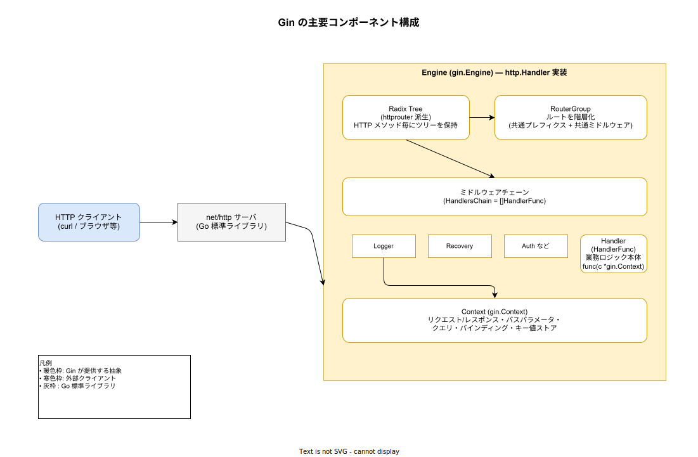
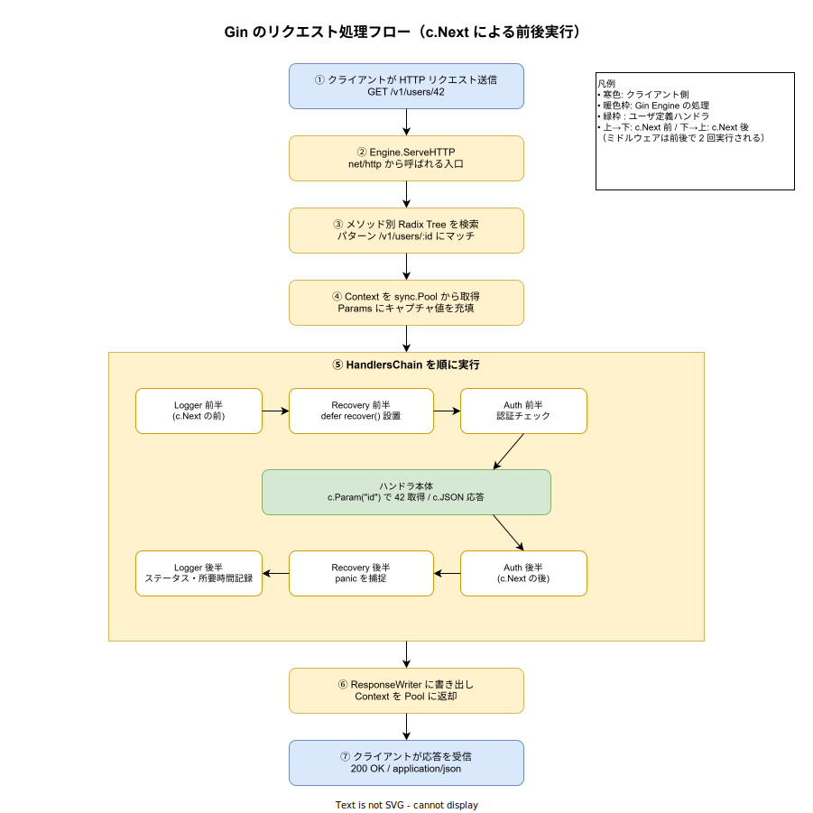

# Gin: 概要

- 対象読者: Go の基本構文を理解しているが、Web フレームワークは未経験〜初学者の開発者
- 学習目標: Gin の設計思想と中核概念（Engine / RouterGroup / Context / ミドルウェア）を理解し、ルーティング・パスパラメータ・JSON バインディングを使った最小の HTTP サーバを書けるようになる
- 所要時間: 約 40 分
- 対象バージョン: Gin v1.12.0（2026-02-28 リリース。Go 1.25 以上が必須）
- 最終更新日: 2026-04-28

## 1. このドキュメントで学べること

- Gin が「なぜ」存在するのか（標準 `net/http` だけでは何が不便か）を説明できる
- Engine / RouterGroup / Context / HandlerFunc の役割を区別できる
- パスパラメータ・クエリパラメータ・JSON バインディング・ミドルウェアの基本を書ける
- Radix Tree によるルーティングと `c.Next` の前後実行モデルを説明できる

## 2. 前提知識

- Go の基本構文（関数、構造体、メソッド、インタフェース）と `go mod` の使い方
- HTTP の基本（メソッド、パス、ステータスコード、リクエスト/レスポンスボディ）
- 標準ライブラリ `net/http` の `http.HandlerFunc` を最低限読んだことがあるとなお良い

## 3. 概要

Gin は Go 製の HTTP Web フレームワークである。標準ライブラリ `net/http` の `http.Handler` インタフェースを実装した薄いラッパーで、ルーティング・ミドルウェア・JSON シリアライズ・バリデーションといった「Web API を書く時に毎回必要になる定型処理」を提供する。

`net/http` だけでも HTTP サーバは書けるが、(1) パスパラメータの抽出、(2) ミドルウェアの合成（認証・ログ・パニック復帰）、(3) JSON のデコードとバリデーション、(4) ルートのグループ化（API バージョニング等）は自前で組む必要がある。Gin はこれらを最小の API 表面で標準化し、なおかつ高速な Radix Tree ルーターを採用することで、表現力と性能を両立している。設計思想は「`net/http` の互換性を壊さず、定型を簡潔にする」点にある。

## 4. 用語の整理

| 用語 | 説明 |
|------|------|
| Engine | アプリ全体の入口。`http.Handler` を実装し、ルートツリー・ミドルウェア・設定を保持する |
| RouterGroup | 共通のパス接頭辞・共通ミドルウェアを束ねる単位。Engine 自身も RouterGroup の一種 |
| HandlerFunc | `func(c *gin.Context)` 型のリクエスト処理関数。ハンドラとミドルウェアの両方がこの型 |
| Context | リクエスト・レスポンス・パスパラメータ・キー値ストア・エラー集約を 1 つにまとめた構造体 |
| ミドルウェア | ハンドラの前後に挟む共通処理。`router.Use(...)` で連結する |
| Radix Tree | 共通接頭辞を共有する木構造。HTTP メソッド毎に持ち、O(パス長) でルート検索する |

## 5. 仕組み・アーキテクチャ

Gin の中核は Engine である。Engine はメソッド毎に Radix Tree を持ち、登録したルートを共通接頭辞で圧縮して保存する。リクエストが来るとツリーを引いてハンドラ列（HandlersChain）を確定し、Pool から取り出した Context にバインドして実行する。



ハンドラとミドルウェアは同じ `HandlerFunc` 型で、Engine から見ると単なるスライス `HandlersChain` である。各ミドルウェアは `c.Next()` を呼ぶ位置で「前処理」と「後処理」を分離できる。`c.Next()` の手前までが要求方向の処理、戻った後が応答方向の処理になる。



## 6. 環境構築

### 6.1 必要なもの

- Go 1.25 以上（Gin v1.12.0 の最低要求）
- 任意のテキストエディタ（gopls 対応の VS Code 等を推奨）

### 6.2 セットアップ手順

```bash
# プロジェクトディレクトリを作成して移動する
mkdir gin-quickstart && cd gin-quickstart

# Go モジュールを初期化する
go mod init gin-quickstart

# Gin を依存に追加する
go get -u github.com/gin-gonic/gin
```

### 6.3 動作確認

7 章のコードを `main.go` として保存し、`go run main.go` を実行する。デフォルトで `0.0.0.0:8080` にバインドされ、別ターミナルで `curl http://localhost:8080/ping` を叩くと `{"message":"pong"}` が返れば成功である。

## 7. 基本の使い方

```go
// Gin の最小サーバ — ping/pong を返す
package main

import (
	// HTTP ステータスコードの定数を使うため標準ライブラリを取り込む
	"net/http"

	// Gin 本体を取り込む
	"github.com/gin-gonic/gin"
)

// エントリポイント
func main() {
	// Logger と Recovery ミドルウェアが既に組み込まれた Engine を生成する
	r := gin.Default()

	// GET /ping を登録する。ハンドラは *gin.Context を 1 引数で受け取る
	r.GET("/ping", func(c *gin.Context) {
		// gin.H は map[string]any のエイリアスで、JSON レスポンスの記述を短く保つ
		c.JSON(http.StatusOK, gin.H{"message": "pong"})
	})

	// 0.0.0.0:8080 で待ち受ける。エラー時は内部で log.Fatal される
	r.Run()
}
```

### 解説

- `gin.Default()` は `gin.New()` に Logger と Recovery を `Use` 済みの Engine を返す。最小用途ではこちらを使う
- `r.GET(path, handlers...)` の `handlers` は可変長で、最後がハンドラ本体・前段がそのルート専用ミドルウェアという慣習
- `c.JSON` はステータスコード設定・`Content-Type: application/json` の付与・エンコードまで 1 行で行う

## 8. ステップアップ

### 8.1 パスパラメータとクエリパラメータ

```go
// /user/:name でパスパラメータを取り出す
r.GET("/user/:name", func(c *gin.Context) {
	// :name にマッチした部分を文字列で取得する
	name := c.Param("name")
	// 平文で応答する
	c.String(http.StatusOK, "Hello %s", name)
})

// /welcome?firstname=...&lastname=... でクエリ文字列を読む
r.GET("/welcome", func(c *gin.Context) {
	// firstname が無い場合は "Guest" を既定値として使う
	firstname := c.DefaultQuery("firstname", "Guest")
	// lastname は未指定時に空文字を返す
	lastname := c.Query("lastname")
	// 取得した値を埋め込んで応答する
	c.String(http.StatusOK, "Hello %s %s", firstname, lastname)
})
```

### 8.2 JSON バインディングとバリデーション

```go
// リクエストボディを受ける構造体。binding タグでバリデーションを宣言する
type Login struct {
	// JSON キー user は必須項目
	User string `json:"user" binding:"required"`
	// JSON キー password も必須項目
	Password string `json:"password" binding:"required"`
}

// POST /loginJSON で JSON ボディを受け付ける
r.POST("/loginJSON", func(c *gin.Context) {
	// 受け側の構造体を用意する
	var in Login
	// ShouldBindJSON はデコードとバリデーションを同時に行い、失敗時は err を返す
	if err := c.ShouldBindJSON(&in); err != nil {
		// 400 を返してハンドラを終了する
		c.JSON(http.StatusBadRequest, gin.H{"error": err.Error()})
		return
	}
	// 成功時のレスポンス
	c.JSON(http.StatusOK, gin.H{"status": "logged in"})
})
```

### 8.3 ミドルウェアとルーティンググループ

```go
// 自作ミドルウェア — 応答ステータスをログ出力する
func Logger() gin.HandlerFunc {
	// 戻り値もハンドラと同じ HandlerFunc 型で、c.Next の前後で処理を挟める
	return func(c *gin.Context) {
		// c.Next を呼ぶまでが「前処理」。ここではタイムスタンプ取得などを行う想定
		c.Next()
		// c.Next から戻った後は「後処理」。ハンドラ実行後の状態を読める
		log.Println(c.Writer.Status())
	}
}

// gin.New は Logger/Recovery を含まない素の Engine を返す
r := gin.New()
// 自作 Logger を全ルート共通で適用する
r.Use(Logger())

// /v1 配下のルートをまとめる
v1 := r.Group("/v1")
// v1 グループに属するルートを宣言する
v1.POST("/login", loginEndpoint)
v1.POST("/submit", submitEndpoint)
```

## 9. よくある落とし穴

- **`c.Next` の位置を意識しない**: ミドルウェアで `c.Next` を呼ばないと後段のハンドラが実行されない。逆に「後処理」相当の記述を `c.Next` の前に書くと、ハンドラ実行前のステータスを読んでしまう
- **`c.Bind` 系の自動 400**: `c.Bind`・`c.BindJSON` は失敗時に自動で 400 を書き込み `c.Errors` に積む。そのまま続行するとレスポンスが二重になる。呼び出し後は明示的に `return` する。失敗を自前で扱いたい時は `c.ShouldBind*` を使う
- **Context の goroutine 越し利用**: `*gin.Context` は sync.Pool で再利用される。ハンドラ内で起動した goroutine から触ると、リクエスト終了後に別リクエストの値を読む可能性がある。`c.Copy()` で複製してから渡す
- **ルート競合の誤解**: `/users/:id` と `/users/list` のような静的 vs 動的の衝突は登録順に依存せず、Radix Tree が静的セグメントを優先する。意図と異なる挙動の時はパス設計を見直す

## 10. ベストプラクティス

- 本番サーバは `gin.SetMode(gin.ReleaseMode)` を起動時に呼び、デバッグログを抑制する
- バリデーションは struct タグ（`binding:"required,email,max=255"` 等）に寄せ、ハンドラ本体は業務ロジックに集中させる
- 認証・ロギング・トレースのような横断関心はミドルウェアで実装し、グループ単位で `Use` する（例: `/v1` には認証必須、`/healthz` は不要）
- ハンドラから `*gin.Context` を直接下層関数に渡さず、必要な値（ID・ユーザ・`context.Context`）だけを引数で渡してテスト容易性を保つ

## 11. 演習問題

1. `GET /tasks/:id` を実装し、`id` を整数に変換できない場合は 400 を返せ
2. `POST /tasks` で `{"title": "..."}` を受け付け、`title` 必須・最大 100 文字でバリデーションせよ（`binding:"required,max=100"`）
3. `Logger` ミドルウェアを拡張し、リクエスト処理時間（`time.Since`）と HTTP メソッド・パスを 1 行で出力するよう改造せよ

## 12. さらに学ぶには

- 公式サイト: <https://gin-gonic.com/>
- API リファレンス: <https://pkg.go.dev/github.com/gin-gonic/gin>
- 公式サンプル集: <https://github.com/gin-gonic/examples>

## 13. 参考資料

- Gin GitHub リポジトリ（README / リリースノート）: <https://github.com/gin-gonic/gin>
- Gin 公式 Quickstart: <https://gin-gonic.com/en/docs/quickstart/>
- Gin 公式ドキュメント本体（`docs/doc.md`）: <https://github.com/gin-gonic/gin/blob/master/docs/doc.md>
- httprouter（Radix Tree ルーターの源流）: <https://github.com/julienschmidt/httprouter>
