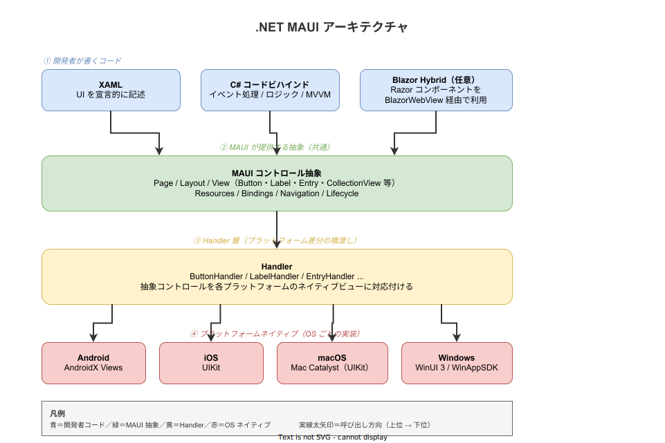
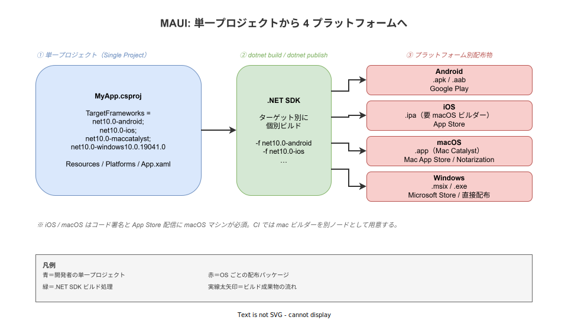

# .NET MAUI: 概要

- 対象読者: C# の基本構文を理解しており、何らかの GUI アプリ（Windows Forms / WPF / Xamarin / Web）を書いた経験がある開発者
- 学習目標: .NET MAUI が何を解決するフレームワークかを説明でき、Hello World レベルのクロスプラットフォームアプリを 1 つのプロジェクトから iOS / Android / macOS / Windows へビルドできるようになる
- 所要時間: 約 40 分
- 対象バージョン: .NET MAUI（.NET 10、2025-11 リリース、LTS）
- 最終更新日: 2026-04-28

## 1. このドキュメントで学べること

- .NET MAUI が「なぜ」必要とされたか（Xamarin.Forms との関係）を説明できる
- 単一プロジェクト（Single Project）と Handler アーキテクチャの考え方を理解できる
- XAML と C# コードビハインドで最小の MAUI ページを書ける
- Android / iOS / macOS / Windows 向けの成果物がどう生成されるかを把握できる
- MVVM や Blazor Hybrid といった発展的な使い方の入口を知ることができる

## 2. 前提知識

- C# の基本構文（クラス・プロパティ・イベントハンドラ・async/await）
- .NET ランタイム（.NET 6 以降）の存在と `dotnet` CLI の基本操作
- 何らかの GUI フレームワークでイベント駆動 UI を書いた経験（WPF / Xamarin.Forms / WinForms / iOS / Android のいずれか）
- XAML の基本（参考: WPF / UWP / Xamarin.Forms 経験者は読み替えしやすい）

## 3. 概要

.NET MAUI（Multi-platform App UI）は、Microsoft が提供するクロスプラットフォーム UI フレームワークである。**1 つの C# プロジェクトから iOS・Android・macOS・Windows の 4 プラットフォームに対応するネイティブアプリを生成する**ことを目的とする。2022 年 5 月に .NET 6 とともに正式版（GA）がリリースされ、Xamarin.Forms の正式な後継として位置付けられた（Xamarin.Forms は 2024 年 5 月にサポート終了）。

従来の Xamarin.Forms ではプラットフォームごとに別プロジェクトを持ち、UI 抽象から OS ネイティブコントロールへの変換は **Renderer** が担っていた。MAUI ではこの構造を再設計し、(1) プロジェクトを 1 つに統合する **Single Project**、(2) Renderer を軽量化した **Handler** アーキテクチャを採用した。これにより、リソース・アイコン・スプラッシュなどの共通アセットを 1 箇所で管理でき、プラットフォーム固有コードは `Platforms/` 配下にだけ置けばよくなった。

MAUI は単独で UI を描画するのではなく、各 OS の**標準ネイティブコントロール**（Android Views / iOS UIKit / Mac Catalyst / WinUI 3）に処理を委ねる。したがってアプリの見た目と挙動は OS のガイドラインに自然に従う。

## 4. 用語の整理

| 用語 | 説明 |
|------|------|
| .NET MAUI | .NET ランタイム上で動く、4 OS 対応のクロスプラットフォーム UI フレームワーク |
| Single Project | iOS / Android / macOS / Windows をひとつの csproj から扱う仕組み。`<TargetFrameworks>` で複数ターゲットを宣言する |
| Handler | MAUI の抽象コントロール（例: `Button`）を、各 OS のネイティブコントロール（例: Android の `AppCompatButton`）に紐付ける橋渡し層。Xamarin.Forms の Renderer の後継 |
| XAML | XML ベースの UI 記述言語。WPF / UWP と同系統だが、MAUI 用の名前空間と要素を使う |
| MVVM | Model-View-ViewModel パターン。`INotifyPropertyChanged` と Data Binding を用いて UI とロジックを分離する |
| Mac Catalyst | iPad 向け UIKit アプリを macOS 上で動かす Apple の技術。MAUI の macOS ビルドはこれに乗る |
| WinUI 3 / WinAppSDK | Windows 向けの最新ネイティブ UI スタック。MAUI の Windows ターゲットはこれを使う |
| Blazor Hybrid | `BlazorWebView` の中で Razor コンポーネントを動かし、ネイティブシェルと組み合わせる構成 |

## 5. 仕組み・アーキテクチャ

MAUI の処理は「開発者コード → MAUI 抽象 → Handler → OS ネイティブ」の 4 階層で流れる。XAML と C# で書いた UI は MAUI の抽象コントロールツリーになり、Handler が実行時に各 OS のネイティブビューへマッピングする。



ビルド時には .NET SDK が `<TargetFrameworks>` に列挙された各ターゲットを個別にビルドし、OS ごとの配布形式（apk / ipa / app / msix）を生成する。iOS / macOS のコード署名と App Store 配信には macOS マシンが必須である。



## 6. 環境構築

### 6.1 必要なもの

- .NET SDK 10.0 以上（[公式インストーラ](https://dotnet.microsoft.com/download)から入手）
- MAUI ワークロード（後述コマンドで導入）
- 各 OS 向けの追加要件:
  - Android: Android SDK / JDK 17（Visual Studio または Android Studio 経由）
  - iOS / macOS: macOS マシン + Xcode（Windows からのリモートビルドも可）
  - Windows: Windows 10/11 + Windows App SDK
- 推奨 IDE: Visual Studio 2026（Windows）/ Visual Studio for Mac は廃止のため macOS では Rider または VS Code + C# Dev Kit + .NET MAUI 拡張

### 6.2 セットアップ手順

```bash
# MAUI ワークロードをインストールする（Android / iOS / Mac / Windows ビルド用ツール一式）
dotnet workload install maui

# 環境が正しく整っているかチェックする
dotnet workload list
```

### 6.3 動作確認

```bash
# 新規 MAUI プロジェクトを作成する
dotnet new maui -n HelloMaui

# プロジェクトディレクトリへ移動する
cd HelloMaui

# Windows をターゲットにビルドして実行する
dotnet build -t:Run -f net10.0-windows10.0.19041.0
```

ウィンドウが立ち上がり、初期テンプレートのカウンターが表示されればセットアップ完了である。Android 実機・エミュレータで実行する場合は `-f net10.0-android` を指定する。

## 7. 基本の使い方

```xml
<!-- ファイルの説明: ボタンを押すたびにカウントを増やす最小の MAUI ページ -->
<!-- MAUI のページとして ContentPage を宣言する -->
<ContentPage xmlns="http://schemas.microsoft.com/dotnet/2021/maui"
             xmlns:x="http://schemas.microsoft.com/winfx/2009/xaml"
             x:Class="HelloMaui.MainPage">

    <!-- VerticalStackLayout は子要素を縦に並べるレイアウト -->
    <VerticalStackLayout Padding="30" Spacing="25" VerticalOptions="Center">

        <!-- 静的なテキストを表示するラベル -->
        <Label Text="Hello, MAUI!" FontSize="32" HorizontalOptions="Center" />

        <!-- 動的に書き換えるラベル。コードから x:Name で参照する -->
        <Label x:Name="CountLabel" Text="クリック数: 0" HorizontalOptions="Center" />

        <!-- ボタン押下で OnCountClicked が呼ばれる -->
        <Button Text="クリック" Clicked="OnCountClicked" />

    </VerticalStackLayout>
</ContentPage>
```

```csharp
// ファイルの説明: MainPage.xaml のコードビハインド。クリック数を保持し更新する。
namespace HelloMaui;

// XAML と対になる partial クラス
public partial class MainPage : ContentPage
{
    // ボタン押下回数を保持するフィールド
    private int _count = 0;

    // コンストラクタで XAML を読み込む
    public MainPage()
    {
        // XAML 側で定義した要素ツリーをロードする
        InitializeComponent();
    }

    // ボタンの Clicked イベントハンドラ
    private void OnCountClicked(object sender, EventArgs e)
    {
        // クリック数をインクリメントする
        _count++;
        // 表示用ラベルを書き換える
        CountLabel.Text = $"クリック数: {_count}";
    }
}
```

### 解説

- **`ContentPage`**: MAUI のページ単位。1 画面に 1 つの ContentPage が対応する
- **レイアウト要素**: `VerticalStackLayout` のほか `Grid` / `HorizontalStackLayout` / `FlexLayout` を使い分ける
- **`x:Name`**: XAML 要素にコード側から参照するための名前を付ける属性
- **イベントハンドラ**: XAML の `Clicked="..."` で名前を指定し、コードビハインドの同名メソッドが自動で結線される
- **`partial class`**: XAML 由来のコード生成と手書きコードを 1 つのクラスとして合成する仕組み

## 8. ステップアップ

### 8.1 MVVM とデータバインディング

直接コードビハインドで UI を書き換える方法はテストが難しい。MVVM パターンでは ViewModel に状態とコマンドを集約し、XAML 側はバインディングで参照する。

```csharp
// ファイルの説明: クリック数を公開する ViewModel。INotifyPropertyChanged を実装する。
using System.ComponentModel;
using System.Runtime.CompilerServices;
using System.Windows.Input;

namespace HelloMaui;

// View に状態と操作を提供するクラス
public class MainViewModel : INotifyPropertyChanged
{
    // 内部状態
    private int _count;

    // バインディングで使うプロパティ
    public int Count
    {
        get => _count;
        // setter で変更通知を発火する
        set { _count = value; OnPropertyChanged(); }
    }

    // ボタンに紐付けるコマンド
    public ICommand IncrementCommand { get; }

    // コンストラクタでコマンドを構築する
    public MainViewModel()
    {
        // Command<T> はラムダで処理を渡せる軽量実装
        IncrementCommand = new Command(() => Count++);
    }

    // INotifyPropertyChanged の実装
    public event PropertyChangedEventHandler? PropertyChanged;

    // プロパティ変更通知を投げるヘルパー
    private void OnPropertyChanged([CallerMemberName] string? name = null)
        => PropertyChanged?.Invoke(this, new PropertyChangedEventArgs(name));
}
```

XAML 側では `BindingContext = new MainViewModel();` を設定し、`<Label Text="{Binding Count}" />`・`<Button Command="{Binding IncrementCommand}" />` のようにバインディングを書く。

### 8.2 Blazor Hybrid

Web 開発資産を活かしたい場合、`BlazorWebView` を使えば Razor コンポーネントを MAUI シェル内で動かせる。Web 版（Blazor WebAssembly / Server）とコンポーネントを共有でき、Web とネイティブの境界をプロジェクト構造でなくホスト方法で切り分けられる。

## 9. よくある落とし穴

- **Xamarin.Forms との混同**: Renderer ベースの記事をそのまま MAUI に適用すると動かない場合が多い。Handler 用 API（`Microsoft.Maui.Handlers`）を参照する
- **TargetFramework のミスマッチ**: NuGet パッケージが特定ターゲットだけ非対応の場合がある。`<TargetFrameworks>` の各値で個別にビルドが通るか確認する
- **iOS ビルドに macOS が無い**: Windows のみで iOS / macOS の最終成果物は作れない。CI には mac ビルダーノードを別途用意する
- **Hot Reload が効かない**: コンストラクタ変更や非同期初期化を含む場合は Hot Reload の対象外。再起動が必要
- **プラットフォーム固有 API の直書き**: `Platforms/Android/` などに OS API を直接呼ぶコードを書くと UI スレッド境界を意識しないとクラッシュする。`MainThread.BeginInvokeOnMainThread(...)` を経由する

## 10. ベストプラクティス

- UI はできる限り XAML + MVVM で書き、コードビハインドはイベント結線と最小限のロジックに絞る
- 共通リソース（画像 / フォント / 色）は `Resources/` 配下に置き、プラットフォーム固有処理は `Platforms/<OS>/` に隔離する
- 非同期 I/O では `async/await` と `MainThread.IsMainThread` を組み合わせ、UI 更新は必ずメインスレッドで行う
- パッケージ更新時は **全ターゲットで** `dotnet build` を回し、回帰がないことを CI で検証する
- 起動時間が問題になる場合は AOT / トリミング（`PublishAot`・`PublishTrimmed`）を検討する。リフレクション依存のライブラリは事前検証が必要

## 11. 演習問題

1. 上記の Hello World に「リセット」ボタンを追加し、クリック数を 0 に戻せるようにせよ
2. MVVM 版に書き換え、`IncrementCommand` と `ResetCommand` の 2 つを ViewModel に持たせよ
3. `dotnet publish -f net10.0-android -c Release` を実行し、生成された apk を実機にインストールしてみよ

## 12. さらに学ぶには

- 公式ドキュメント: <https://learn.microsoft.com/dotnet/maui/>
- サンプル集: <https://github.com/dotnet/maui-samples>
- MVVM Toolkit（CommunityToolkit.Mvvm）: <https://learn.microsoft.com/dotnet/communitytoolkit/mvvm/>
- 関連 Knowledge: （作成予定）`maui_mvvm.md`, `maui_blazor-hybrid.md`

## 13. 参考資料

- .NET MAUI 公式ドキュメント: <https://learn.microsoft.com/dotnet/maui/>
- .NET MAUI GitHub リポジトリ: <https://github.com/dotnet/maui>
- .NET MAUI ロードマップ: <https://github.com/dotnet/maui/wiki/Roadmap>
- Xamarin to .NET MAUI アップグレードガイド: <https://learn.microsoft.com/dotnet/maui/migration/>
