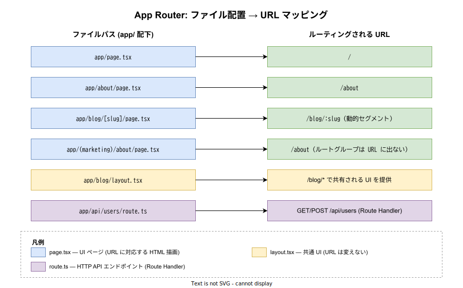
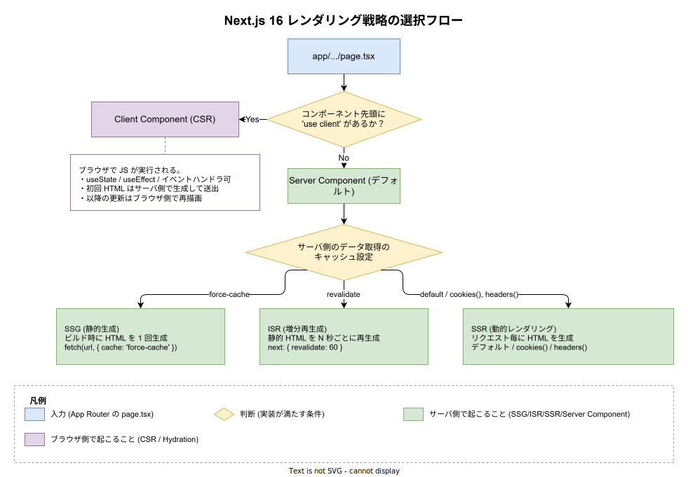

# Next.js: 概要

- 対象読者: HTML・CSS・JavaScript の基本と React の基礎（コンポーネント・Props・State）を理解している開発者
- 学習目標: Next.js が React に上乗せして提供する価値（ルーティング・レンダリング戦略・サーバ実行環境）を説明でき、App Router を使った最小のページとデータ取得を書けるようになる
- 所要時間: 約 50 分
- 対象バージョン: Next.js 16.2 (App Router)
- 最終更新日: 2026-04-28

## 1. このドキュメントで学べること

- Next.js が「React のフレームワーク」として何を担っているかを説明できる
- ファイル配置だけでルーティングが定義される App Router の発想を理解できる
- Server Component と Client Component の違いと使い分けの判断軸を持てる
- レンダリング戦略 (SSG / ISR / SSR / CSR) の差を、対応する API と一緒に説明できる
- 最小のページと API ハンドラを App Router で書ける

## 2. 前提知識

- HTML・CSS・JavaScript（ES2015+）の基礎
- React の基本概念（コンポーネント・Props・State・useState）— 未習得なら [react_basics.md](./react_basics.md) を先に読むこと
- HTTP の GET/POST 程度の知識
- ターミナルで Node.js / npm を実行できる環境

## 3. 概要

Next.js は Vercel が開発する React 用の Web フレームワークで、React がコンポーネントを描画する責務しか持たない部分を補完し、「ルーティング・サーバ実行・データ取得・キャッシュ・ビルド最適化・本番配信」までを 1 セットで提供する。React 単体で SPA (Single Page Application) を組むと、ルーティングは外部ライブラリ（React Router 等）、サーバサイドレンダリングは独自実装、API は別サービス、と都度組み合わせる必要があるが、Next.js はこれらを既定のフォルダ構成と少数の規約で吸収する。

ブラウザに大量の JavaScript を送って初期表示を遅らせる SPA の弱点に対しては、React 19 で安定化した React Server Components を中心に据えた「サーバで描画して、必要なところだけブラウザで動かす」モデルを採用している。これにより、検索エンジンに認識される HTML、初期表示の速さ、コンポーネント単位の段階的な対話性、を両立しやすい。Next.js 16 ではこのアーキテクチャ（App Router）が標準で、旧来の Pages Router はメンテナンスモードに入っている。

## 4. 用語の整理

| 用語 | 説明 |
|------|------|
| App Router | `app/` ディレクトリのファイル配置でルーティングを定義する仕組み。Next.js 13 で導入され、16 で標準 |
| Pages Router | `pages/` ディレクトリで定義する旧来のルーティング。新規採用は非推奨（メンテナンスモード） |
| Server Component | サーバで実行される React コンポーネント。App Router ではすべてのコンポーネントがデフォルトでこれに該当する |
| Client Component | ブラウザで実行される React コンポーネント。先頭に `'use client'` を宣言したファイルが該当する |
| RSC Payload | Server Component の描画結果を表す独自シリアライズ形式。HTML と一緒にブラウザに送られ、後続の遷移ではこれだけが追加で取得される |
| SSG (Static Site Generation) | ビルド時に HTML を 1 回生成して配信する戦略 |
| ISR (Incremental Static Regeneration) | 静的 HTML を一定時間ごとに再生成する戦略 |
| SSR (Server-Side Rendering) | リクエストごとにサーバで HTML を生成する戦略 |
| Server Actions | フォーム送信や状態変更をサーバ側関数として直接書ける機構。API ルートを別途用意せずに済む |
| Route Handler | `app/.../route.ts` で書く HTTP API エンドポイント |
| Turbopack | Next.js 標準のビルダ。Webpack の後継として開発・本番ビルド両方を担う |

## 5. 仕組み・アーキテクチャ

App Router は「ファイル配置 = ルート定義」というルールで動く。`app/` 配下のフォルダ階層がそのまま URL パスになり、特定の予約ファイル名（`page.tsx`・`layout.tsx`・`route.ts` など）がそのフォルダの役割を決める。動的セグメント（`[slug]`）やルートグループ（`(marketing)`）も、フォルダ命名の規約として表現される。



レンダリング戦略は「コンポーネントが Server か Client か」「データ取得時のキャッシュ設定」の 2 軸で決まる。Next.js 16 では `fetch()` がデフォルトでキャッシュされなくなり、明示的に `cache: 'force-cache'` または `next: { revalidate: N }` を指定して静的化する形に変わった。`cookies()` や `headers()` などリクエスト固有の API を呼んだ時点で、そのページは自動的に動的レンダリング（SSR）に切り替わる。



Next.js のサーバは Node.js 上で動く。ビルド時に静的ページの HTML を出力したり、リクエスト時に Server Component を実行したりする。Edge Runtime（V8 isolate ベースの軽量ランタイム）も選択でき、ファイル単位で `runtime` 設定を切り替えられる。

## 6. 環境構築

### 6.1 必要なもの

- Node.js 18.18 以上（Next.js 16 の要件）
- npm（Node.js 同梱）または pnpm / yarn
- テキストエディタ（VS Code を推奨。TypeScript と Tailwind CSS の補完が効く拡張あり）

### 6.2 セットアップ手順

```bash
# Next.js の公式テンプレートからプロジェクトを生成する
npx create-next-app@latest my-next-app

# プロジェクトディレクトリに移動する
cd my-next-app

# 開発サーバを起動する（Turbopack で動く）
npm run dev
```

`create-next-app` 実行時に TypeScript / ESLint / Tailwind CSS / App Router を採用するか対話で聞かれる。本ドキュメントは「TypeScript + App Router」構成を前提にする。

### 6.3 動作確認

ブラウザで `http://localhost:3000` を開き、Next.js の初期画面が表示されればセットアップ完了である。`app/page.tsx` を編集して保存すると、画面が即座に更新される（Fast Refresh）。

## 7. 基本の使い方

```tsx
// 最小の Server Component ページ — トップページ "/" を担当する
// ファイルパス: app/page.tsx

// 商品の型を宣言する
type Product = { id: string; name: string; price: number };

// このファイルはデフォルトで Server Component として扱われる
// async 関数として書けるのは Server Component の特権
export default async function HomePage() {
  // サーバ側で外部 API を呼ぶ。force-cache を指定して SSG にする
  const res = await fetch('https://example.com/api/products', {
    // ビルド時 1 回だけ取得し、以降の配信ではキャッシュを返す
    cache: 'force-cache',
  });

  // レスポンスを商品配列としてパースする
  const products: Product[] = await res.json();

  // JSX を返すと、サーバで HTML 文字列に変換されてブラウザに送られる
  return (
    <main>
      <h1>商品一覧</h1>
      <ul>
        {products.map((p) => (
          // key はリスト描画で React が要素を識別するために必須
          <li key={p.id}>
            {p.name} — {p.price} 円
          </li>
        ))}
      </ul>
    </main>
  );
}
```

### 解説

- ファイルを `app/page.tsx` に置くだけで `/` のルートになる。同じ規約で `app/about/page.tsx` を置けば `/about` が自動で生える
- `export default` した関数がそのページのコンポーネント
- 関数名の前に `async` を書けるのは Server Component の利点で、`await fetch(...)` をトップレベルで書ける（Client Component では不可）
- `cache: 'force-cache'` を指定したので、このページはビルド時に HTML を生成し、以後リクエストには静的ファイルとして応答する（SSG）

## 8. ステップアップ

### 8.1 Client Component への切り替え

ボタンクリックや入力など、ブラウザ側のイベントを扱うときは Client Component に切り替える。ファイル先頭に `'use client'` を書いたファイルだけが対象になり、その境界より下の子コンポーネントもすべて Client 扱いになる。

```tsx
// "use client" を宣言したファイル — ブラウザで実行される
// ファイルパス: app/components/counter.tsx

'use client';

// React の useState を import する
import { useState } from 'react';

// クライアント側の状態を持つカウンター
export default function Counter() {
  // count を State として宣言する
  const [count, setCount] = useState(0);

  // クリックで count を 1 増やす
  return (
    <button onClick={() => setCount(count + 1)}>
      クリック数: {count}
    </button>
  );
}
```

サーバページから Client Component を import する場合、その Client Component とその依存だけがブラウザに JS として配信される。Server / Client は同じファイルツリー上で混在でき、子コンポーネント単位で切り分けられる。

### 8.2 動的ルートと Server Actions

URL の一部を変数として受けるには、フォルダ名を `[param]` にする。フォーム送信は `'use server'` を宣言した関数を `<form action={...}>` に渡すだけで、API ルートを別途書かずにサーバ処理を呼べる。

```tsx
// 動的ルート + Server Actions のサンプル
// ファイルパス: app/items/[id]/page.tsx

// サーバ側関数として宣言。フォーム送信時にサーバで実行される
async function deleteItem(formData: FormData) {
  'use server';
  // FormData から id を取り出す
  const id = formData.get('id') as string;
  // ここで DB 削除等の副作用を実行する
  await fetch(`https://example.com/api/items/${id}`, { method: 'DELETE' });
}

// params で URL パラメータが渡される
export default function ItemPage({ params }: { params: { id: string } }) {
  return (
    <form action={deleteItem}>
      <input type="hidden" name="id" value={params.id} />
      <button type="submit">この商品を削除する</button>
    </form>
  );
}
```

### 8.3 layout.tsx で共通 UI を共有する

`app/blog/layout.tsx` を置くと、`/blog` 配下のすべてのページで共通のヘッダ・サイドバーを共有できる。`children` には各ページの中身が差し込まれ、ページ遷移時にレイアウト側は再描画されない。

```tsx
// /blog 配下のすべてのページで共有されるレイアウト
// ファイルパス: app/blog/layout.tsx

export default function BlogLayout({ children }: { children: React.ReactNode }) {
  return (
    <div>
      <nav>ブログのサイドバー</nav>
      {/* 各ページ（page.tsx）の中身がここに差し込まれる */}
      <section>{children}</section>
    </div>
  );
}
```

## 9. よくある落とし穴

- **Client Component の境界の取り違え**: 親で `'use client'` を書いてしまうと、本来サーバで動かしたい子コンポーネントまでブラウザに送られる。境界はできるだけリーフ近くに置く
- **Server Component で React Hooks を使う**: `useState` / `useEffect` などは Client 限定。Server Component で書くとビルドエラーになる
- **Next.js 14 と 15+ で fetch のデフォルトが違う**: Next.js 15 から `fetch` がキャッシュされなくなった。古いチュートリアルの「デフォルトでキャッシュされる」記述に注意し、明示的に `cache: 'force-cache'` を書く
- **Server Actions に機密情報を渡さない**: クライアントから呼べる API として公開されるため、認可チェックを必ず Server Actions 内で行う
- **layout.tsx の再レンダリング誤解**: `layout.tsx` は子ページ遷移時に再描画されない。状態保持はこの性質を利用しつつも、props 経由で渡した動的データは反映されない点に注意

## 10. ベストプラクティス

- デフォルトの Server Component を主とし、対話性が必要な末端だけを Client Component に切り出す
- データ取得はコンポーネント内で `await fetch` する。プロップドリリングを避けやすい
- 静的化できるページは `cache: 'force-cache'` を明示し、`npm run build` のログで `○ Static` 表記になっているか確認する
- 認証が要るページは `cookies()` を呼ぶことで自動的に動的レンダリングへ切り替わる。誤って静的化されないようにする
- 環境変数のうちブラウザに露出するものだけ `NEXT_PUBLIC_` プレフィックスを付け、それ以外はサーバ側のみで参照する

## 11. 演習問題

1. `app/about/page.tsx` を作成し、`/about` で「自己紹介ページ」を表示せよ
2. 外部 API（例: `https://jsonplaceholder.typicode.com/posts`）から記事一覧を取得し、Server Component で表示する `app/posts/page.tsx` を作成せよ。SSG として配信されることを `npm run build` のログで確認すること
3. `app/posts/[id]/page.tsx` を追加し、特定の記事を `/posts/1` のような URL で表示できるようにせよ
4. Client Component で「いいねボタン」を作成し、`app/posts/[id]/page.tsx` に組み込め

## 12. さらに学ぶには

- 公式ドキュメント: <https://nextjs.org/docs>
- App Router 学習チュートリアル: <https://nextjs.org/learn>
- 関連 Knowledge: [react_basics.md](./react_basics.md), [react_virtual-dom.md](./react_virtual-dom.md)
- React 公式サイト: <https://react.dev/>

## 13. 参考資料

- Next.js 公式ドキュメント (App Router): <https://nextjs.org/docs/app>
- Next.js GitHub リポジトリ: <https://github.com/vercel/next.js>
- Next.js リリースノート (Vercel ブログ): <https://nextjs.org/blog>
