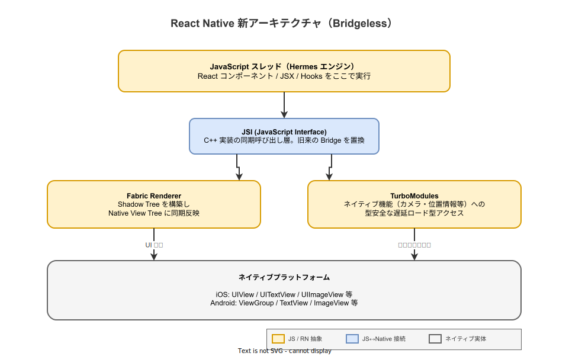
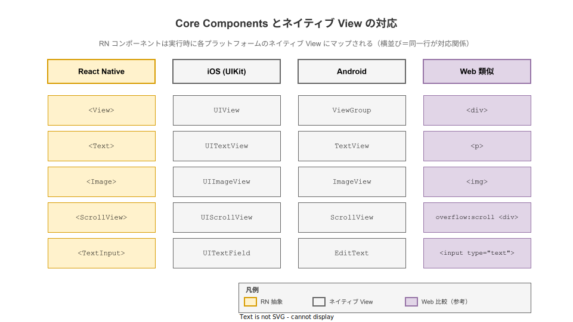

# React Native: 概要

- 対象読者: React の基本（コンポーネント / JSX / Hooks）を理解しているフロントエンド開発者、もしくは iOS / Android のネイティブ開発経験を持ちクロスプラットフォーム化を検討している開発者
- 学習目標: React Native の設計思想と新アーキテクチャ（JSI / Fabric / TurboModules）を説明でき、Expo を使って最小のアプリを起動・編集できるようになる
- 所要時間: 約 45 分
- 対象バージョン: React Native 0.78（2026 年 4 月時点の安定版系列の最新）／ Expo SDK 53 想定
- 最終更新日: 2026-04-28

## 1. このドキュメントで学べること

- React Native が何を解決し、Web の React と何が違うかを説明できる
- 旧アーキテクチャ（Bridge）と新アーキテクチャ（JSI / Fabric / TurboModules / Bridgeless）の関係を理解できる
- Core Components（`View` / `Text` / `Image` / `ScrollView` / `TextInput`）が iOS / Android のどのネイティブ View にマップされるかを把握できる
- Expo を使って最小の React Native アプリを起動し、画面を編集できる
- StyleSheet / Flexbox による RN 固有のスタイリング規約を理解できる

## 2. 前提知識

- React のコンポーネント・JSX・Props・State・Hooks の基本（未習得なら先に [`react_basics.md`](./react_basics.md) を参照）
- ES2015+ の構文（アロー関数、分割代入、`async/await`）
- Node.js のパッケージ管理（npm / npx）の基本操作
- iOS / Android のいずれかでアプリを動かしたことがあると望ましいが必須ではない（シミュレータ／実機の両方が想定対象）

## 3. 概要

React Native は Meta が 2015 年に公開した、JavaScript（および TypeScript）で iOS / Android のネイティブアプリを構築するためのフレームワークである。Web の React がブラウザの DOM を抽象化するのに対し、React Native は **iOS の `UIView` と Android の `ViewGroup` などのネイティブ View を抽象化する**。同じコンポーネントモデル・同じ Hooks API を保ちながら、出力先が HTML 要素ではなくプラットフォーム固有のネイティブ View に変わる点が本質的な違いである。

「Learn once, write anywhere」という設計思想を採り、UI は各プラットフォームのネイティブ View をそのまま使う。Cordova / Ionic のような WebView ベースの方式とは異なり、画面に表示されるのは本物の `UIView` / `ViewGroup` であるため、スクロール・キーボード・アクセシビリティ等のネイティブ挙動がそのまま得られる。

2024 年末リリースの 0.76 で「新アーキテクチャ」がデフォルト有効となり、本稿で扱う 0.78 系列ではさらに React 19 と React Compiler への対応が進んだ。旧来の JSON シリアライズ式 Bridge は廃止方向で、JSI による同期呼び出しが標準である。

## 4. 用語の整理

| 用語 | 説明 |
|------|------|
| Core Components | `View` / `Text` / `Image` 等、RN が標準提供する Native Components |
| Native Components | プラットフォームのネイティブ View をラップしたコンポーネントの総称 |
| JSI（JavaScript Interface） | C++ で実装された JS↔ネイティブ間の同期呼び出し層。旧 Bridge を置換する |
| Fabric | 新しいレンダラ。Shadow Tree を JS と C++ の両方から同期参照できる |
| TurboModules | ネイティブモジュール（カメラ等）への型安全・遅延ロード型アクセスの仕組み |
| Codegen | TypeScript / Flow の型定義から JSI バインディングを自動生成するツール |
| Hermes | RN 向けに最適化された軽量 JS エンジン。0.70 以降デフォルト |
| Bridgeless | 旧 Bridge を完全に排除した実行モード。0.76 でデフォルト、0.82 で旧 Bridge 撤去 |
| Expo | RN を内蔵し、ビルド・配布・更新等を提供する公式推奨フレームワーク |
| Metro | RN 標準の JavaScript バンドラ。HMR とプラットフォーム別解決を担う |

## 5. 仕組み・アーキテクチャ

新アーキテクチャでは、JavaScript 側のコンポーネントツリーが JSI を通じて C++ レイヤに直接到達し、Fabric が UI を、TurboModules がネイティブ機能を扱う。下図のとおり、JS スレッドからネイティブプラットフォームまでの経路は同期的かつ型安全に保たれており、旧来の JSON シリアライズによる非同期 Bridge は介在しない。



開発者が書く `<View>` や `<Text>` は、Fabric によってプラットフォーム固有の View に置換される。下図は標準コンポーネントが iOS / Android のどのクラスにマップされるかを示す。Web の React 経験者は右端の「Web 類似」列を手がかりに直感を持ち込める。



注意点として、RN には HTML タグは存在しない。`<div>` や `<span>` を書いてもビルド時にコンポーネントとして解決できずエラーとなる。テキストはどのような場面でも必ず `<Text>` で囲む必要がある（Web では `<View>` 内に直接テキストを書くと例外になる）。

## 6. 環境構築

### 6.1 必要なもの

- Node.js 20.x 以上（Expo SDK 53 の要件）
- npm（Node.js に同梱）または pnpm / yarn
- iOS シミュレータを使う場合: macOS と Xcode 15 以上
- Android エミュレータを使う場合: Android Studio とエミュレータ（任意の OS で可）
- 実機テストの場合: スマートフォンに Expo Go アプリ

### 6.2 セットアップ手順

公式は 2024 年から **Expo を「新規プロジェクトの推奨フレームワーク」** として位置付けており、本稿でもこれに従う。素の React Native CLI は内部レイヤを学ぶ目的では有用だが、初学者は Expo から入るのが妥当である。

```bash
# 最新 Expo テンプレートで RN プロジェクトを生成する
npx create-expo-app@latest my-rn-app

# プロジェクトディレクトリへ移動する
cd my-rn-app

# 依存パッケージをインストールする（テンプレート生成時に実行済みのことが多い）
npm install
```

### 6.3 動作確認

```bash
# Expo の開発サーバを起動する
npx expo start
```

ターミナルに QR コードが表示されるので、スマホの Expo Go アプリで読み取るか、`i` キーで iOS シミュレータ、`a` キーで Android エミュレータを起動する。`App.tsx` を編集して保存すると、ホットリロードで即座に画面に反映される。

## 7. 基本の使い方

```tsx
// React Native の最小構成サンプル — カウンターと入力欄を持つ画面

// React の基本フックをインポートする
import { useState } from 'react';
// RN の Core Components とスタイル API をインポートする
import { View, Text, TextInput, Pressable, StyleSheet, SafeAreaView } from 'react-native';

// アプリのルートコンポーネント
export default function App() {
  // カウント値を保持する State
  const [count, setCount] = useState(0);
  // テキスト入力の値を保持する State
  const [name, setName] = useState('');

  return (
    // SafeAreaView はノッチや上部ステータスバーを避けて描画する
    <SafeAreaView style={styles.safe}>
      {/* View は他言語の div 相当だが、内部にテキストを直書きできない */}
      <View style={styles.container}>
        {/* テキストはすべて Text コンポーネントで囲む必要がある */}
        <Text style={styles.title}>こんにちは、{name || 'ゲスト'} さん</Text>

        {/* TextInput はネイティブの UITextField / EditText にマップされる */}
        <TextInput
          style={styles.input}
          placeholder="名前を入力"
          value={name}
          onChangeText={setName}
        />

        {/* count を画面に表示する */}
        <Text style={styles.count}>カウント: {count}</Text>

        {/* Pressable は Button より柔軟な押下イベントハンドラ */}
        <Pressable style={styles.button} onPress={() => setCount(count + 1)}>
          {/* ボタン内のラベルも Text で記述する */}
          <Text style={styles.buttonLabel}>+1</Text>
        </Pressable>
      </View>
    </SafeAreaView>
  );
}

// StyleSheet は CSS とは異なり、camelCase のオブジェクトで定義する
const styles = StyleSheet.create({
  // 全画面を覆う安全領域
  safe: { flex: 1, backgroundColor: '#fff' },
  // 内部レイアウト。Flexbox がデフォルトで縦方向（column）になる点が Web との差
  container: { flex: 1, padding: 24, gap: 16 },
  // 見出しテキストのスタイル
  title: { fontSize: 22, fontWeight: '600' },
  // 入力欄のスタイル
  input: { borderWidth: 1, borderColor: '#999', borderRadius: 8, padding: 12 },
  // カウント表示のスタイル
  count: { fontSize: 18 },
  // ボタンのスタイル
  button: { backgroundColor: '#007aff', borderRadius: 8, padding: 12, alignItems: 'center' },
  // ボタンラベルのスタイル
  buttonLabel: { color: '#fff', fontWeight: '600' },
});
```

### 解説

- **テキストは必ず `Text` で囲む**: Web と異なり、`<View>` の直下に文字列を書くと実行時エラーになる
- **スタイルはオブジェクト**: CSS ではなく JS オブジェクトで指定する。プロパティは camelCase、単位は数値（`px` 相当）
- **Flexbox の既定方向が縦**: Web の `flex-direction: row` がデフォルトなのに対し、RN は `column` がデフォルトである
- **タップは `Pressable`**: 押下範囲のフィードバックや長押しを扱うなら `Button` より `Pressable` を使うのが現代的

## 8. ステップアップ

### 8.1 リスト描画と FlatList

要素数が増える場合は `map()` で配列を描画する代わりに `FlatList` を使う。可視範囲のみレンダリングする仮想化が組み込まれており、数万件のリストでもメモリを抑えられる。

```tsx
// FlatList による効率的なリスト描画
import { FlatList, Text, View } from 'react-native';

// 表示するデータ配列
const data = Array.from({ length: 1000 }, (_, i) => ({ id: String(i), label: `Item ${i}` }));

// 仮想化されたリストを描画する
export function BigList() {
  return (
    <FlatList
      data={data}
      keyExtractor={(item) => item.id}
      renderItem={({ item }) => (
        <View style={{ padding: 12 }}>
          <Text>{item.label}</Text>
        </View>
      )}
    />
  );
}
```

### 8.2 画面遷移（Expo Router）

Expo SDK 53 ではファイルベースルーティングの **Expo Router** が標準である。`app/` 配下の `.tsx` がそのまま画面となり、`<Link href="/details">` で遷移する。React Navigation の上に構築されているため、より下位レイヤで制御したい場合は React Navigation を直接利用する選択もある。

### 8.3 ネイティブ機能の利用

カメラ・位置情報・センサー等は Expo の各モジュール（`expo-camera` / `expo-location` 等）を `npx expo install <pkg>` で追加して使う。新アーキテクチャ下では多くが TurboModules 経由で同期 / 非同期問わず型安全に呼び出せる。

## 9. よくある落とし穴

- **`<View>` の中に文字列を直書きする**: `<View>こんにちは</View>` は実行時エラー。必ず `<Text>こんにちは</Text>` で囲む
- **CSS の単位を書く**: `width: '100px'` ではなく `width: 100`。`%` を使う場合のみ文字列で `'100%'` と書く
- **Web 用ライブラリをそのまま使う**: `react-router-dom` や `styled-components/native` 以外の DOM 依存ライブラリは動かない。RN 対応版を選ぶ
- **新アーキテクチャ非対応の旧 Native Module**: `unimplemented` エラーが出る場合は当該ライブラリの新アーキ対応バージョンを確認する
- **シミュレータで動くが実機で動かない**: ネットワーク許可（iOS の `NSAppTransportSecurity`）や権限要求（Android の `AndroidManifest.xml`）の設定漏れが多い

## 10. ベストプラクティス

- 新規プロジェクトは **Expo + TypeScript** で始める。素の RN CLI は学習や特殊要件時のみに留める
- スタイルは `StyleSheet.create()` で集約する。インライン記述よりキャッシュ効率が良い
- リストは要素数が 20 件を超えたら `FlatList` / `SectionList` に切り替える
- 状態管理はまず `useState` / `useContext` で組み、肥大化してから Zustand / Jotai / Redux Toolkit を検討する
- 新アーキテクチャの恩恵を受けるため、依存ライブラリは新アーキ対応版を選ぶ

## 11. 演習問題

1. 上記サンプルを拡張し、入力した名前を配列に追加して `FlatList` で履歴表示するアプリを作成せよ
2. iOS と Android で挙動が異なる API（`Platform.OS` で分岐）を 1 つ調べ、両プラットフォームで意図通り動くサンプルを作成せよ
3. `expo-camera` を導入し、撮影した画像を画面に表示する最小アプリを作成せよ

## 12. さらに学ぶには

- 公式ドキュメント: <https://reactnative.dev/>
- Expo 公式ドキュメント: <https://docs.expo.dev/>
- 新アーキテクチャ解説: <https://reactnative.dev/architecture/landing-page>
- 関連 Knowledge: [`react_basics.md`](./react_basics.md), [`react_virtual-dom.md`](./react_virtual-dom.md)

## 13. 参考資料

- React Native 公式ドキュメント: <https://reactnative.dev/>
- React Native リリース一覧: <https://reactnative.dev/docs/releases>
- React Native 0.78 リリースノート: <https://github.com/facebook/react-native/releases>
- Core Components 一覧: <https://reactnative.dev/docs/intro-react-native-components>
- Expo Router ドキュメント: <https://docs.expo.dev/router/introduction/>
