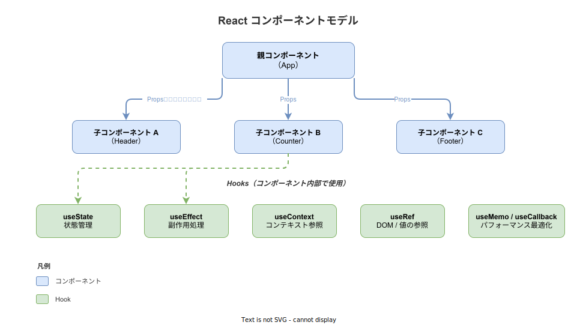

# React: 概要

- 対象読者: HTML・CSS・JavaScript の基本を理解している開発者
- 学習目標: React の設計思想と基本概念を理解し、コンポーネントと Hooks を使った簡単なアプリケーションを書けるようになる
- 所要時間: 約 40 分
- 対象バージョン: React 19
- 最終更新日: 2026-04-12

## 1. このドキュメントで学べること

- React が「なぜ」必要とされるかを説明できる
- コンポーネント・JSX・Props・State の基本概念を理解できる
- useState / useEffect を使った基本的なコンポーネントを書ける
- 仮想 DOM による効率的なレンダリングの仕組みを説明できる

## 2. 前提知識

- HTML のタグ構造と基本属性
- CSS によるスタイリングの基礎
- JavaScript の関数・変数・配列・オブジェクトの操作
- ES2015+ の構文（アロー関数、分割代入、テンプレートリテラル）

## 3. 概要

React は Meta（旧 Facebook）が 2013 年にオープンソースとして公開した、ユーザーインターフェース構築のための JavaScript ライブラリである。Web アプリケーションの UI を「コンポーネント」と呼ばれる再利用可能な部品に分割し、各コンポーネントが自身の状態（State）を管理する設計を採用している。

従来の Web 開発では、DOM を直接操作して UI を更新していた。この方法はアプリケーションが大規模になると、どの操作がどの UI 要素に影響するかの追跡が困難になる。React は「宣言的 UI」というアプローチでこの課題を解決する。開発者は「UI がどのような状態であるべきか」を記述し、状態変化に応じた DOM 更新は React が自動で行う。

## 4. 用語の整理

| 用語 | 説明 |
|------|------|
| コンポーネント（Component） | UI の再利用可能な部品。関数として定義し、JSX を返す |
| JSX | JavaScript 内に HTML 風の構文を書ける拡張記法。トランスパイラが `React.createElement()` に変換する |
| Props | 親コンポーネントから子コンポーネントに渡す読み取り専用のデータ |
| State | コンポーネント内部で管理する変更可能なデータ。変更すると再レンダリングが発生する |
| Hook | `use` で始まる関数。関数コンポーネント内で State やライフサイクルを扱う仕組み |
| 仮想 DOM（Virtual DOM） | 実 DOM の軽量なコピー。差分検出により最小限の DOM 操作で UI を更新する |
| 差分検出（Reconciliation） | 前回と今回の仮想 DOM を比較し、変更箇所だけを実 DOM に反映する処理 |

## 5. 仕組み・アーキテクチャ

React は以下のフローで UI をレンダリングする。開発者が JSX で UI を宣言すると、React が仮想 DOM を構築し、差分検出を経て最小限の DOM 操作を実行する。


コンポーネントはツリー構造で構成される。親コンポーネントから子コンポーネントへ Props でデータを渡し、各コンポーネントは Hooks を使って内部状態や副作用を管理する。



## 6. 環境構築

### 6.1 必要なもの

- Node.js 18 以上
- npm または yarn（Node.js に npm は同梱されている）
- テキストエディタ（VS Code を推奨）

### 6.2 セットアップ手順

```bash
# Vite を使って React プロジェクトを作成する
npm create vite@latest my-react-app -- --template react

# プロジェクトディレクトリに移動する
cd my-react-app

# 依存パッケージをインストールする
npm install
```

### 6.3 動作確認

```bash
# 開発サーバーを起動する
npm run dev
```

ブラウザで `http://localhost:5173` を開き、Vite + React の初期画面が表示されればセットアップ完了である。

## 7. 基本の使い方

```jsx
// React の基本構文を示すサンプル — カウンターコンポーネント

// React の useState フックをインポートする
import { useState } from 'react';

// Greeting コンポーネント: Props で受け取った名前を表示する
function Greeting({ name }) {
  // Props の name を埋め込んだ見出しを返す
  return <h1>Hello, {name}!</h1>;
}

// Counter コンポーネント: ボタンクリックでカウントを増減する
function Counter() {
  // count という State を初期値 0 で宣言する
  const [count, setCount] = useState(0);

  // JSX でボタンと表示を返す
  return (
    <div>
      {/* 現在のカウント値を表示する */}
      <p>カウント: {count}</p>
      {/* クリック時に count を 1 増やす */}
      <button onClick={() => setCount(count + 1)}>+1</button>
      {/* クリック時に count を 1 減らす */}
      <button onClick={() => setCount(count - 1)}>-1</button>
    </div>
  );
}

// App コンポーネント: アプリケーションのルート
export default function App() {
  // Greeting と Counter を組み合わせて表示する
  return (
    <div>
      {/* Props として name を渡す */}
      <Greeting name="React" />
      {/* Counter コンポーネントを配置する */}
      <Counter />
    </div>
  );
}
```

### 解説

- **コンポーネント定義**: 関数が JSX を返すことでコンポーネントになる。関数名は大文字で始める
- **JSX 内の式**: `{}` で囲むと JavaScript の式を埋め込める
- **Props**: `<Greeting name="React" />` の `name` が Props として子に渡される。子は引数で受け取る
- **State**: `useState(初期値)` は `[現在値, 更新関数]` の配列を返す。更新関数を呼ぶと再レンダリングが起きる

## 8. ステップアップ

### 8.1 useEffect による副作用処理

`useEffect` はレンダリング後に実行される処理（API 呼び出し、タイマー設定など）を記述する Hook である。第 2 引数の依存配列により実行タイミングを制御する。

```jsx
// useEffect の基本的な使い方を示すサンプル

// useState と useEffect をインポートする
import { useState, useEffect } from 'react';

// Timer コンポーネント: マウントからの経過秒数を表示する
function Timer() {
  // 経過秒数を管理する State
  const [seconds, setSeconds] = useState(0);

  // コンポーネントのマウント時にタイマーを開始する
  useEffect(() => {
    // 1 秒ごとに seconds を更新するインターバルを設定する
    const id = setInterval(() => setSeconds(s => s + 1), 1000);
    // アンマウント時にインターバルをクリアする（クリーンアップ関数）
    return () => clearInterval(id);
  }, []); // 空配列: マウント時に 1 回だけ実行

  // 経過秒数を表示する
  return <p>経過時間: {seconds}秒</p>;
}
```

### 8.2 条件付きレンダリングとリスト描画

```jsx
// 条件分岐とリスト描画のサンプル

// TodoList コンポーネント: 項目のリストを描画する
function TodoList({ items }) {
  // 項目が空の場合はメッセージを表示する
  if (items.length === 0) {
    return <p>タスクはありません</p>;
  }

  // 配列を map で JSX のリストに変換する
  return (
    <ul>
      {items.map(item => (
        // key は React が要素を識別するために必須
        <li key={item.id}>{item.text}</li>
      ))}
    </ul>
  );
}
```

## 9. よくある落とし穴

- **State の直接変更**: `state.count = 5` のように直接変更しても再レンダリングは起きない。必ず `setCount(5)` のように更新関数を使う
- **key の欠落**: リスト描画時に `key` を省略すると、React が要素を正しく追跡できず意図しない動作が起きる。一意な ID を指定する
- **useEffect の依存配列漏れ**: 依存配列に必要な値を含めないと、古い値を参照し続けるバグ（stale closure）が発生する
- **コンポーネントの直接呼び出し**: `{Article()}` のように関数として直接呼び出すと、Hooks のルールに違反する。`<Article />` と JSX で記述する

## 10. ベストプラクティス

- コンポーネントは 1 つの責任に絞り、大きくなったら分割する
- State はそれを必要とする最も近い共通の親コンポーネントに配置する（State のリフトアップ）
- Props として渡すだけの中間コンポーネントが多い場合は `useContext` の使用を検討する
- `useEffect` 内で行う処理にはクリーンアップ関数を返し、リソースリークを防ぐ

## 11. 演習問題

1. テキスト入力欄とボタンを持つ「Todo アプリ」を作成せよ。入力した文字列をリストに追加できること
2. `useEffect` を使って、コンポーネントのマウント時にブラウザのタイトルを変更するコンポーネントを作成せよ
3. 親コンポーネントから子コンポーネントに配列データを Props で渡し、子がリストとして表示するアプリケーションを作成せよ

## 12. さらに学ぶには

- 公式ドキュメント: <https://react.dev/>
- React チュートリアル（三目並べ）: <https://react.dev/learn/tutorial-tic-tac-toe>
- 関連 Knowledge: （作成予定）`react_hooks.md`, `react_state-management.md`

## 13. 参考資料

- React 公式ドキュメント: <https://react.dev/>
- React GitHub リポジトリ: <https://github.com/facebook/react>
- Vite 公式ドキュメント: <https://vite.dev/>
