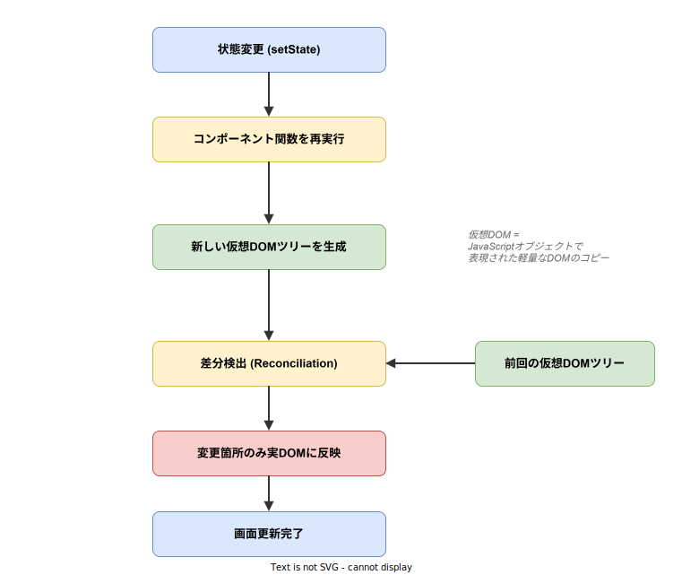

# React: 仮想DOM（Virtual DOM）

- 対象読者: React の基本概念（コンポーネント、State、Props）を理解している開発者
- 学習目標: 仮想DOMの仕組みと差分検出アルゴリズムを理解し、パフォーマンスを意識した実装ができるようになる
- 所要時間: 約 30 分
- 対象バージョン: React 19
- 最終更新日: 2026-04-14

## 1. このドキュメントで学べること

- 仮想DOMが「なぜ」必要とされるかを説明できる
- 仮想DOMの内部構造（JavaScript オブジェクト）を理解できる
- Reconciliation（差分検出）アルゴリズムの仕組みを説明できる
- key 属性が差分検出に与える影響を理解できる
- 仮想DOMのパフォーマンス特性を踏まえた実装判断ができる

## 2. 前提知識

- HTML の DOM 構造に関する基礎知識
- JavaScript のオブジェクトと関数の操作
- React のコンポーネント、State、Props の基本概念（→ [react_basics.md](./react_basics.md)）

## 3. 概要

仮想DOM（Virtual DOM）は、実際のブラウザ DOM に対応する JavaScript オブジェクトのツリー構造である。React はコンポーネントの状態が変化するたびに新しい仮想DOMを生成し、前回の仮想DOMと比較（差分検出）することで、実DOMへの更新を最小限に抑える。

ブラウザの DOM を直接操作するコストは高い。DOM 操作はレイアウト再計算（Reflow）やリペイント（Repaint）を引き起こし、頻繁な操作はパフォーマンスを大幅に低下させる。仮想DOMはこの問題を、「JavaScript オブジェクト同士の比較」という軽量な処理に変換することで解決する。

## 4. 用語の整理

| 用語 | 説明 |
|------|------|
| DOM（Document Object Model） | ブラウザが HTML を解析して構築するツリー構造。直接操作するとレイアウト再計算が発生する |
| 仮想DOM（Virtual DOM） | DOM の構造を JavaScript オブジェクトで表現した軽量なコピー |
| Reconciliation（差分検出） | 前回と今回の仮想DOMツリーを比較し、変更箇所を特定する処理 |
| Diffing | 2 つの仮想DOMツリーの差分を計算するアルゴリズム。Reconciliation の中核 |
| Fiber | React 16 で導入された内部アーキテクチャ。Reconciliation を分割実行可能にした仕組み |
| Commit Phase | 差分検出で特定した変更を実際の DOM に反映するフェーズ |
| key | リスト内の要素を一意に識別するための属性。差分検出の精度を向上させる |

## 5. 仕組み・アーキテクチャ

### 5.1 レンダリングフロー

React は状態変更が起きるたびに、以下のサイクルを実行する。



1. `setState` や Hooks の更新関数が呼ばれると、React が再レンダリングをスケジューリングする
2. コンポーネント関数が再実行され、新しい JSX が返される
3. JSX から新しい仮想DOMツリー（JavaScript オブジェクト）が生成される
4. 新旧の仮想DOMツリーを比較し、差分を検出する（Reconciliation）
5. 検出した差分のみを実DOMに反映する（Commit Phase）

### 5.2 仮想DOMの内部表現

JSX は最終的に以下のような JavaScript オブジェクトに変換される。

```jsx
// 仮想DOMオブジェクトの構造を示すサンプル

// このJSXは
// <div className="container">
//   <h1>タイトル</h1>
//   <p>本文</p>
// </div>

// 内部的に以下のオブジェクトに変換される
const vdom = {
  // 要素タイプを保持する
  type: "div",
  // 属性と子要素をpropsとして保持する
  props: {
    // CSSクラス名を保持する
    className: "container",
    // 子要素を配列で保持する
    children: [
      // h1要素のオブジェクト表現
      { type: "h1", props: { children: "タイトル" } },
      // p要素のオブジェクト表現
      { type: "p", props: { children: "本文" } }
    ]
  }
};
```

### 5.3 Reconciliation（差分検出）アルゴリズム

React は以下のルールに基づいて 2 つのツリーを効率的に比較する。


- **要素タイプが異なる場合**: 古いサブツリー全体を破棄し、新しいツリーをゼロから構築する（例: `<div>` → `<span>` への変更）
- **要素タイプが同じ場合**: 変更された属性のみを更新し、子要素を再帰的に比較する
- **リスト要素で key がある場合**: key で要素の対応関係を識別し、移動・追加・削除を最小化する
- **リスト要素で key がない場合**: インデックス順に比較するため、要素の移動を検出できない

## 6. 環境構築

仮想DOM は React の内部機構であり、追加の環境構築は不要である。React プロジェクトのセットアップは [react_basics.md](./react_basics.md) を参照すること。

## 7. 基本の使い方

```jsx
// key属性による効率的なリストレンダリングのサンプル

// useStateをインポートする
import { useState } from 'react';

// TodoList コンポーネント: keyを使ったリスト管理の例
function TodoList() {
  // タスク一覧をStateで管理する
  const [tasks, setTasks] = useState([
    // 各タスクにユニークなidを持たせる
    { id: 1, text: 'りんごを買う' },
    { id: 2, text: '部屋を掃除する' },
    { id: 3, text: '洗濯をする' },
  ]);

  // 先頭のタスクを削除する関数
  const removeFirst = () => {
    // 先頭以外の要素で新しい配列を作る
    setTasks(tasks.slice(1));
  };

  // タスクリストを描画する
  return (
    <div>
      <ul>
        {tasks.map(task => (
          // keyにユニークなidを指定する（indexは非推奨）
          <li key={task.id}>{task.text}</li>
        ))}
      </ul>
      {/* ボタンクリックで先頭タスクを削除する */}
      <button onClick={removeFirst}>先頭を削除</button>
    </div>
  );
}
```

### 解説

- **key の役割**: `key={task.id}` により、React は各 `<li>` 要素を一意に識別する。先頭要素を削除しても、残りの要素は再作成されず DOM の削除操作のみが行われる
- **index を key に使うべきでない理由**: 配列のインデックスを key にすると、要素の追加・削除時にインデックスがずれ、React が要素の対応関係を誤認識して全要素を再描画する

## 8. ステップアップ

### 8.1 React.memo によるレンダリング最適化

`React.memo` は Props が変化しない場合に再レンダリングをスキップする高階コンポーネントである。仮想DOMの生成自体を省略できるため、描画コストが高いコンポーネントで有効である。

```jsx
// React.memoによるレンダリング最適化のサンプル

// memoをインポートする
import { memo } from 'react';

// ExpensiveList: 描画コストが高いリストコンポーネント
// memoでラップしてPropsが同じなら再レンダリングをスキップする
const ExpensiveList = memo(function ExpensiveList({ items }) {
  // 各アイテムをリスト要素として描画する
  return (
    <ul>
      {items.map(item => (
        // keyでアイテムを識別する
        <li key={item.id}>{item.name}</li>
      ))}
    </ul>
  );
});
```

### 8.2 useMemo / useCallback との関係

仮想DOMの差分検出では、Props の比較にオブジェクトの参照同一性（`===`）を使用する。レンダリングのたびに新しいオブジェクトや関数を生成すると、値が同じでも「変更あり」と判定される。`useMemo` や `useCallback` で参照を安定させることで、`React.memo` と組み合わせて不要な再レンダリングを防止できる。

## 9. よくある落とし穴

- **key にインデックスを使用する**: 要素の順序が変わると全要素が再作成される。データベースの ID など一意な値を使用すること
- **key の欠落**: key を指定しないとコンソールに警告が出るだけでなく、要素の内部状態が別の要素に移行するバグが発生する
- **過剰な最適化**: `React.memo` を全コンポーネントに適用すると Props 比較のオーバーヘッドが増え、逆効果になる場合がある。React DevTools の Profiler で計測してから適用する
- **State の配置が高すぎる**: ツリー上位で State を変更すると配下の全コンポーネントが再レンダリング対象になる。State は必要な最小範囲に配置する

## 10. ベストプラクティス

- リスト要素には必ず安定した一意の `key` を指定する（データベースの ID など）
- 描画コストが高いコンポーネントには `React.memo` の適用を検討する
- コンポーネントの分割粒度を適切に保ち、State 変更の影響範囲を局所化する
- パフォーマンス問題は React DevTools の Profiler で計測してから最適化する

## 11. 演習問題

1. 5 つのアイテムを持つリストで、`key` にインデックスを使った場合と一意な ID を使った場合で、要素削除時の挙動の違いを React DevTools で観察せよ
2. 親コンポーネントの State 更新が子コンポーネントの再レンダリングを引き起こすことを `console.log` で確認し、`React.memo` で防止できることを検証せよ
3. 1000 件のリストを表示するコンポーネントを作成し、Profiler でレンダリング時間を計測せよ

## 12. さらに学ぶには

- 公式ドキュメント（Render and Commit）: https://react.dev/learn/render-and-commit
- 公式ドキュメント（Preserving and Resetting State）: https://react.dev/learn/preserving-and-resetting-state
- 関連 Knowledge: [react_basics.md](./react_basics.md)

## 13. 参考資料

- React 公式ドキュメント: https://react.dev/
- React GitHub リポジトリ: https://github.com/facebook/react
- React Reconciliation 解説: https://legacy.reactjs.org/docs/reconciliation.html
