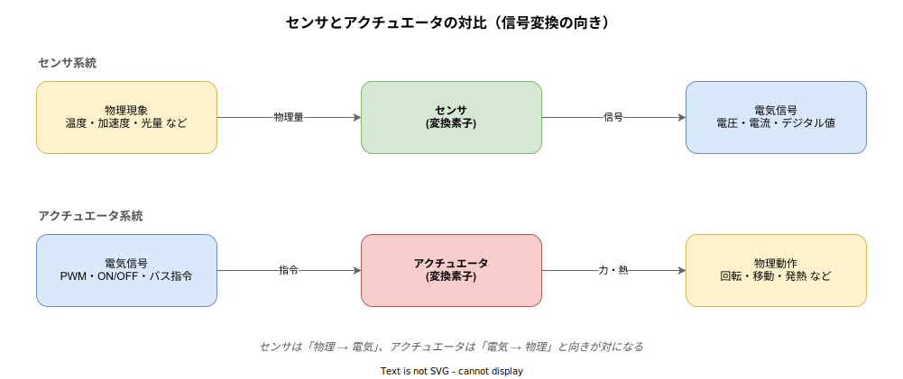
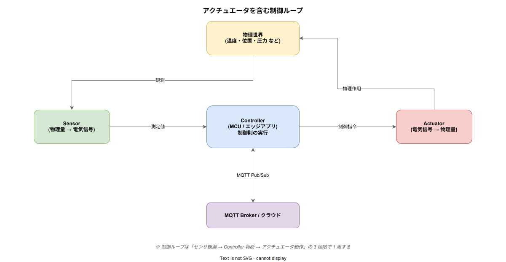

# アクチュエータ: 概要

- 対象読者: IoT / エッジ領域でデバイス制御を扱う開発者、センサとの違いを整理したい組込み初学者
- 学習目標: アクチュエータの定義・センサとの対比・代表的な種類・制御信号の形式・IoT における位置づけを説明でき、最小のコード例で制御信号を生成できる
- 所要時間: 約 30 分
- 対象バージョン: 概念解説（特定製品に依存しない）。コード例は Rust Edition 2024 / `rppal` 0.19 系
- 最終更新日: 2026-04-15

## 1. このドキュメントで学べること

- アクチュエータが「電気信号を物理作用に変換する素子」であることを、センサとの対比で説明できる
- 電気式・流体式・特殊式という代表的な分類と、それぞれの代表的な種類を列挙できる
- ON/OFF・PWM・アナログ・バスといった制御信号の形式と、どのアクチュエータに適合するかを判断できる
- IoT 制御ループ（Sensor → Controller → Actuator）におけるアクチュエータの位置と、MQTT からの指令との繋ぎ方を理解できる
- フェイルセーフや突入電流など、実装時に考慮すべき典型的な落とし穴を把握できる

## 2. 前提知識

- 電気回路の基礎（電圧・電流・デューティ比の概念）
- マイコン GPIO の入出力に関する基礎知識
- 関連: [MQTT の概要](../protocol/mqtt_basics.md)（クラウドからの指令を受け取る文脈で参照）

## 3. 概要

アクチュエータ（actuator）とは、電気信号や流体圧といった「指令エネルギー」を、回転・直線運動・発熱・発光などの「物理作用」に変換する素子の総称である。語源はラテン語の *actus*（動作）で、機械や装置に **能動的に動きを与える部品** という意味を持つ。

センサが「物理現象を電気信号として観測する」入力側の変換器であるのに対し、アクチュエータは「電気信号を物理作用として出力する」出力側の変換器であり、両者は制御系の中で対をなす。制御システムは一般に「センサで状態を観測 → コントローラが判断 → アクチュエータで作用を与える」という閉ループ（フィードバック制御）で構成され、アクチュエータはその末端で現実世界を変化させる唯一の要素である。

IoT エッジにおいては、クラウドからの指令（MQTT コマンドなど）を受けてマイコンが GPIO・PWM・I2C などの出力ピンにアクチュエータを接続し、物理空間に作用する。センサのデータは計測して送るだけだが、アクチュエータは物理的に何かを動かすため、誤動作や停電時の挙動がそのまま事故につながりやすい。このため、ソフトウェア側には冪等性やフェイルセーフの設計責任が強く求められる。



## 4. 用語の整理

| 用語 | 説明 |
|------|------|
| アクチュエータ | 電気・流体などのエネルギーを力・運動・熱・光といった物理作用に変換する素子 |
| トランスデューサ | エネルギー形態を変換する素子の総称。センサとアクチュエータの上位概念 |
| 駆動回路（Driver） | マイコンの微弱な信号を、アクチュエータを動かすだけの電力に増幅する回路。FET、モータードライバ IC など |
| PWM | Pulse Width Modulation。一定周期の中でパルスの幅（デューティ比）を変えて擬似的にアナログ電力を制御する方式 |
| デューティ比 | 1 周期中にパルスが ON である時間の割合。PWM で出力電力を決める値 |
| 突入電流 | 起動直後に瞬間的に流れる大電流。モーターや白熱電球で顕著 |
| フェイルセーフ | 故障・通信断・電源喪失時に、装置が安全側（停止・中立位置など）に遷移する設計原則 |
| スマートアクチュエータ | 駆動回路と制御回路を内蔵し、CAN/Modbus などのバスで指令を受けるアクチュエータ |

## 5. 仕組み・アーキテクチャ

アクチュエータは単体で動作するのではなく、必ず「センサ・コントローラ」と組み合わさった **制御ループ** の中で動く。下図はその典型構造を示す。



コントローラ（MCU やエッジアプリ）はセンサから得た観測値を評価し、目標値とのズレに応じてアクチュエータへの制御指令を決める。決まった指令は駆動回路を経由してアクチュエータへ送られ、物理世界を変化させる。その変化はふたたびセンサに観測され、ループが 1 周する。IoT 構成ではさらに MQTT などを介してクラウドと指令・テレメトリを双方向にやり取りし、遠隔監視や機械学習ベースの制御則更新が可能になる。

### 5.1 アクチュエータの分類

物理作用を生み出すエネルギー源によって、アクチュエータは大きく 3 系統に分かれる。どの系統を選ぶかは、出力パワー・応答速度・設置環境・保守性によって決まる。

| 分類 | 特徴 | 代表的な種類 |
|------|------|--------------|
| 電気式 | 応答が速く制御しやすい。最も広く使われる | DC モーター、ステッピングモーター、サーボモーター、BLDC、リレー、ソレノイド、ヒーター、LED |
| 流体式 | 大きな力を安定して出せる。産業機械や建機で主流 | 空気圧シリンダー、油圧シリンダー、電磁弁 |
| 特殊式 | 小型・精密・特殊環境向け | 圧電素子、形状記憶合金、超音波モーター、ボイスコイル |

組込み・IoT 領域では電気式が中心となるため、以降は電気式を前提に説明する。

### 5.2 制御信号の形式

アクチュエータへの指令は、要求される分解能と応答特性に応じて以下の形式を使い分ける。

| 信号形式 | 解像度 | 代表的な対象 |
|----------|--------|--------------|
| デジタル ON/OFF | 1 bit | リレー、ソレノイド、単純ヒーター |
| PWM | 実効的に 8〜16 bit | DC モーター、LED 調光、ヒーター（低速） |
| ステップパルス | 位置分解能はパルス数 | ステッピングモーター |
| PWM + 位置指令 | モデルによる | ホビー用サーボモーター（PWM パルス幅で角度指定） |
| アナログ電圧 (DAC) | 8〜12 bit | 比例弁、一部のアナログ入力ドライバ |
| バス通信 (I2C/SPI/CAN/Modbus) | 任意 | スマートアクチュエータ、産業用 ECU |

デジタル ON/OFF は最も単純だが、モーターや電球のように起動時に大電流が流れる負荷では、MOSFET やリレーで **駆動回路を必ず介する**。マイコンの GPIO で直接ドライブできるのは LED 数本程度に限られる。

## 6. 環境構築

### 6.1 必要なもの

- マイコンボード: Raspberry Pi（本例では GPIO18 を PWM 出力として使用）
- アクチュエータ: PWM 制御可能な DC モーター 1 個、またはホビー用サーボモーター
- 駆動回路: TB6612FNG などのモータードライバ IC（DC モーターの場合）
- Rust ツールチェーン: `rustup` で stable をインストール

### 6.2 セットアップ手順

1. Raspberry Pi OS をセットアップし、SSH でログインする
2. Rust をインストールする（`curl --proto '=https' --tlsv1.2 -sSf <https://sh.rustup.rs> | sh`）
3. プロジェクトを作成する（`cargo new actuator-demo`）
4. `Cargo.toml` に `rppal = "0.19"` を追加する
5. モータードライバをブレッドボードに配置し、Pi の GPIO18・GND・5V と接続する

### 6.3 動作確認

後述のコードをビルドし、`sudo ./target/release/actuator-demo` として実行する。PWM 出力が段階的に変化し、モーター回転数が 0 → 50% → 100% → 0 と遷移すれば接続と制御の両方が成立している。

## 7. 基本の使い方

Raspberry Pi の GPIO18 にモータードライバ経由で DC モーターを接続し、PWM のデューティ比を段階的に変化させて速度制御する最小例を示す。

```rust
// Raspberry Pi の GPIO18 でハードウェア PWM を生成し、DC モーターの回転数を段階制御する最小サンプル。
// 駆動回路（TB6612FNG 等）を介して接続することを前提とし、GPIO から直接モーターを駆動しない。
use rppal::pwm::{Channel, Polarity, Pwm};
use std::thread;
use std::time::Duration;

// エントリポイント。PWM チャンネルを初期化し、デューティ比を段階的に変化させる。
fn main() -> Result<(), Box<dyn std::error::Error>> {
    // PWM チャンネル 0 (= GPIO18) を 1 kHz・デューティ比 0% で生成する。
    let pwm = Pwm::with_frequency(Channel::Pwm0, 1000.0, 0.0, Polarity::Normal, true)?;
    // 0% → 50% → 100% → 0% の順で 1 秒おきにデューティ比を変更する。
    for duty in [0.0, 0.5, 1.0, 0.0] {
        // set_duty_cycle は 0.0〜1.0 の比率でデューティを指定する。
        pwm.set_duty_cycle(duty)?;
        // 変更後の回転が安定するまで 1 秒待つ。
        thread::sleep(Duration::from_secs(1));
    }
    // 明示的に停止させ、アクチュエータを安全側（出力 0）で終了する。
    pwm.set_duty_cycle(0.0)?;
    Ok(())
}
```

### 解説

- `Pwm::with_frequency` でハードウェア PWM を初期化する。周波数 1 kHz は DC モーターの典型値で、可聴域を避けるなら 18 kHz 以上を選ぶ。
- `set_duty_cycle(0.5)` は「1 周期の 50% を ON にする」意味で、モーター端子に印加される平均電圧は電源電圧の 50% に相当する。
- 終了時に必ず `set_duty_cycle(0.0)` を呼ぶことで、アクチュエータが動きっぱなしになるのを防ぐ。プロセス異常終了時にも停止させたい場合は、ドライバ IC のスタンバイピンを利用したハードウェア側のフェイルセーフが必要になる。

## 8. ステップアップ

### 8.1 MQTT からアクチュエータを制御する

IoT エッジでは、クラウドから `devices/{id}/cmd/motor` のようなトピックで指令を受け、そのペイロードに応じて上記の `set_duty_cycle` を呼び出すのが典型構成となる。指令は QoS 1 で受信し、**同一指令が重複しても結果が変わらない**（冪等な）実装にする。目標値をそのまま送る方式（例: `{"duty": 0.5}`）は冪等性を自然に満たすため、差分指令（`+0.1`）より推奨される。

### 8.2 スマートアクチュエータとバス制御

産業用途では、駆動回路とマイコンを内蔵し、CAN や Modbus RTU でコマンドを受ける「スマートアクチュエータ」が増えている。これにより、1 本のバスに複数アクチュエータを数珠つなぎでき、配線が激減する。アプリケーション側は GPIO や PWM を直接扱わず、バスプロトコルのマスタライブラリ経由でアクチュエータ ID とコマンドを送るだけで済む。

### 8.3 フィードバック制御の導入

DC モーターに目標回転数を与えても、負荷が増えると実回転数は落ちる。このズレを吸収するのが PID 制御であり、センサ（ロータリーエンコーダなど）で現在値を観測しつつ、制御則で PWM デューティを自動調整する。アクチュエータ単体を扱う段階を越えたら、制御則の設計とサンプリング周期の選定が次の学習目標になる。

## 9. よくある落とし穴

- **GPIO 直結**: モーターやリレーを GPIO に直結すると、突入電流でマイコンが破損する。必ず MOSFET やドライバ IC を介す
- **電源分離の不足**: モーターの電源とマイコンの電源を共有すると、モーター起動時のノイズでマイコンがリセットする。**電源を分離**し、GND のみを共通にするのが定石
- **フライバック電圧**: ソレノイドやリレーのコイルを OFF にした瞬間に逆起電力が発生し、駆動素子を壊す。**還流ダイオード**を必ず並列に入れる
- **PWM 周波数とモーター鳴き**: 1〜5 kHz の PWM はモーターが可聴音で鳴く。静音化したい場合は 18 kHz 以上にする
- **プロセス異常終了**: アプリクラッシュ時に PWM が走りっぱなしになり、モーターが止まらない。ハードウェアウォッチドッグか、ドライバ IC のスタンバイ制御で停止側に倒す
- **QoS 0 のコマンド**: MQTT でアクチュエータに指令を流す際、QoS 0 は指令消失があり得る。**制御系は最低 QoS 1**、安全系は QoS 2 とする

## 10. ベストプラクティス

- アクチュエータごとに **「停電時の安全状態」** を明確にし、そこへ自動復帰するようドライバ側にハード機構を組む
- 指令は **絶対値（目標値）** で送る。差分指令は通信断・再送で状態が壊れやすい
- コマンドと状態は別トピックで扱う。`cmd/...` は指令、`state/...` は retained で現状を配信
- 過電流保護（シャント + コンパレータ、またはホール IC）を必ず挟み、ソフトウェアだけに安全性を委ねない
- 起動シーケンスでは先に **安全な既知状態**（出力 0、中立位置）をセットしてから通常運用に移る

## 11. 演習問題

1. LED をアクチュエータとみなし、PWM のデューティ比を 0〜100% まで 10% ずつ変化させて、明るさがリニアに見えるか・対数的に感じるかを観測せよ（人間の知覚はべき乗則に従うため非線形になる）
2. リレーの OFF 時に還流ダイオードを付けた場合／付けない場合で、駆動 FET のドレイン電圧をオシロスコープで観測し、スパイクの違いを比較せよ
3. MQTT で `devices/demo/cmd/motor` トピックを購読し、受信したデューティ比（0.0〜1.0）を上記コード例に適用するプログラムを実装せよ
4. アプリが `panic!` した際にモーターが自動停止するよう、`Drop` トレイトまたはハードウェアウォッチドッグを用いたフェイルセーフを実装せよ

## 12. さらに学ぶには

- 関連 Knowledge: [MQTT の概要](../protocol/mqtt_basics.md) — アクチュエータへ指令を送る経路として参照
- 関連 Knowledge: [Mender の概要](./mender_basics.md) — アクチュエータを含むエッジデバイスへの OTA 配信
- 書籍: 『メカトロニクス計測の基礎』(森北出版) — センサ／アクチュエータ／信号処理を体系的に学ぶ
- 書籍: 『モータ技術のすべてがわかる本』(ナツメ社) — DC・BLDC・ステッピング・サーボの比較

## 13. 参考資料

- IEC 60050-351:2013 International Electrotechnical Vocabulary – Control Technology（アクチュエータの用語定義）: <https://www.electropedia.org/>
- ISO 5598:2020 Fluid power systems and components — Vocabulary（流体式アクチュエータの用語）: <https://www.iso.org/standard/75271.html>
- Raspberry Pi 公式 GPIO ドキュメント: <https://www.raspberrypi.com/documentation/computers/raspberry-pi.html#gpio-and-the-40-pin-header>
- `rppal` クレート（Rust 用 Raspberry Pi ペリフェラルアクセス）: <https://docs.rs/rppal/>
- Toshiba TB6612FNG データシート: <https://toshiba.semicon-storage.com/info/TB6612FNG_datasheet_en_20141001.pdf>
