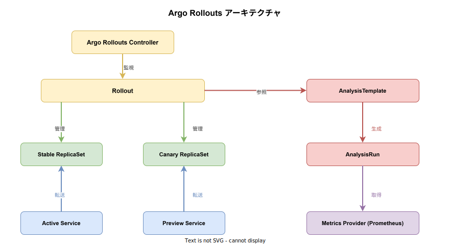
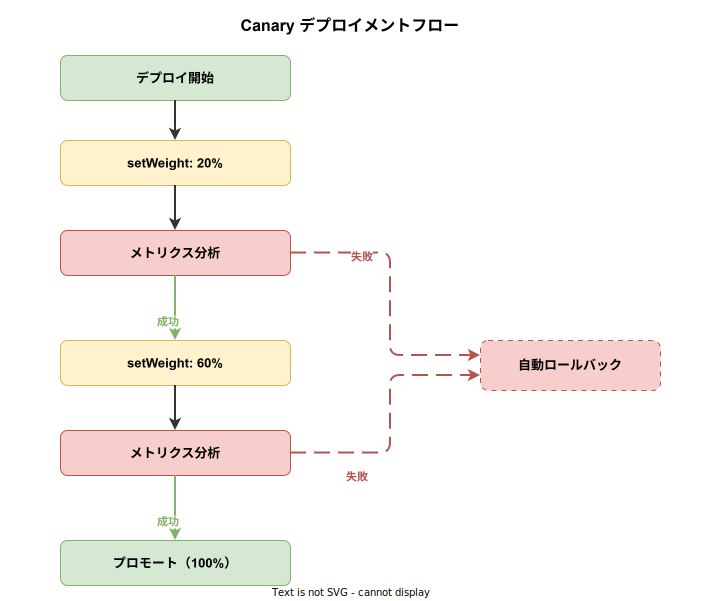

# Argo Rollouts: 基本

- 対象読者: Kubernetes の Deployment・Service の基本操作を理解している開発者
- 学習目標: Argo Rollouts の役割と基本概念を理解し、Canary デプロイメントを設定できるようになる
- 所要時間: 約 40 分
- 対象バージョン: Argo Rollouts v1.7
- 最終更新日: 2026-04-12

## 1. このドキュメントで学べること

- Argo Rollouts が解決する課題と Deployment との違いを説明できる
- Canary デプロイメントと Blue-Green デプロイメントの仕組みを理解できる
- Rollout リソースのマニフェストを記述してデプロイできる
- AnalysisTemplate を使った自動メトリクス検証の基本を理解できる

## 2. 前提知識

- Kubernetes の基本概念（Pod, Deployment, Service, ReplicaSet）
- kubectl の基本操作
- YAML の記法

## 3. 概要

Argo Rollouts は、Kubernetes 上でプログレッシブデリバリー（段階的なデプロイ）を実現するコントローラである。Kubernetes 標準の Deployment は RollingUpdate 戦略しか提供しないが、Argo Rollouts は Canary デプロイメントや Blue-Green デプロイメントなど、より高度なデプロイ戦略を可能にする。

標準の RollingUpdate では全 Pod が一斉に新バージョンへ切り替わるため、問題発生時の影響範囲が大きい。Argo Rollouts はトラフィックの一部だけを新バージョンに振り向け、メトリクスを自動分析して問題がなければ段階的に比率を上げるという制御を宣言的に行える。問題を検出した場合は自動的にロールバックする。

## 4. 用語の整理

| 用語 | 説明 |
|------|------|
| Rollout | Deployment の代わりに使用する CRD。デプロイ戦略を詳細に定義できる |
| Canary | 新バージョンに少量のトラフィックを流し、段階的に比率を上げるデプロイ戦略 |
| Blue-Green | 新旧 2 つの環境を用意し、切り替えで一括リリースするデプロイ戦略 |
| AnalysisTemplate | メトリクス検証の定義テンプレート。閾値で成否を判定する |
| AnalysisRun | AnalysisTemplate から生成される実行インスタンス |
| Promote | Canary を次のステップまたは完全昇格させる操作 |
| Abort | ロールアウトを中断し、Stable バージョンにロールバックする操作 |
| Stable ReplicaSet | 現在の本番バージョンを管理する ReplicaSet |
| Canary ReplicaSet | 新バージョンを管理する ReplicaSet |

## 5. 仕組み・アーキテクチャ

Argo Rollouts は Kubernetes のカスタムコントローラとして動作し、Rollout CRD を監視・制御する。



**主要コンポーネント:**

| コンポーネント | 役割 |
|---------------|------|
| Argo Rollouts Controller | Rollout リソースを監視し、デプロイ戦略に従って ReplicaSet と Service を制御する |
| Rollout | Deployment に代わる CRD。Canary/Blue-Green 戦略とステップを宣言的に定義する |
| AnalysisTemplate | どのメトリクスをどの閾値で評価するかを定義するテンプレート |
| AnalysisRun | 実行時に生成されるメトリクス検証インスタンス。結果に基づき Promote/Abort を判断する |

**Canary デプロイメントの流れ:**



1. Rollout のイメージを更新すると、Canary ReplicaSet が作成される
2. `setWeight` で指定した比率のトラフィックが Canary に振り向けられる
3. 一時停止中にメトリクス分析（AnalysisRun）が実行される
4. 分析が成功すれば次のステップへ進み、失敗すれば自動ロールバックされる
5. 全ステップ完了後、Canary が新しい Stable に昇格する

## 6. 環境構築

### 6.1 必要なもの

- Kubernetes クラスタ（v1.25 以上）
- kubectl
- Argo Rollouts kubectl プラグイン

### 6.2 セットアップ手順

```bash
# Argo Rollouts 用の Namespace を作成する
kubectl create namespace argo-rollouts

# コントローラをインストールする
kubectl apply -n argo-rollouts -f https://github.com/argoproj/argo-rollouts/releases/latest/download/install.yaml

# kubectl プラグインをインストールする（Linux の場合）
curl -LO https://github.com/argoproj/argo-rollouts/releases/latest/download/kubectl-argo-rollouts-linux-amd64
# 実行権限を付与する
chmod +x kubectl-argo-rollouts-linux-amd64
# パスの通ったディレクトリに移動する
sudo mv kubectl-argo-rollouts-linux-amd64 /usr/local/bin/kubectl-argo-rollouts
```

### 6.3 動作確認

```bash
# プラグインのバージョンを確認する
kubectl argo rollouts version

# コントローラの Pod が Running であることを確認する
kubectl get pods -n argo-rollouts
```

## 7. 基本の使い方

以下は Canary 戦略で nginx をデプロイする最小構成の例である。

```yaml
# Canary 戦略による Rollout マニフェスト
# トラフィックを段階的に新バージョンへ移行する
apiVersion: argoproj.io/v1alpha1
kind: Rollout
metadata:
  # Rollout の名前を定義する
  name: my-app
spec:
  # レプリカ数を 3 に設定する
  replicas: 3
  # 管理対象の Pod を label で選択する
  selector:
    matchLabels:
      app: my-app
  # Pod テンプレートを定義する
  template:
    metadata:
      labels:
        app: my-app
    spec:
      containers:
        # コンテナ名とイメージを指定する
        - name: my-app
          image: nginx:1.27
          # コンテナのポートを指定する
          ports:
            - containerPort: 80
  # Canary デプロイ戦略を定義する
  strategy:
    canary:
      steps:
        # トラフィックの 20% を Canary に振り向ける
        - setWeight: 20
        # 5 分間一時停止して状態を観察する
        - pause: {duration: 5m}
        # トラフィックの 60% を Canary に振り向ける
        - setWeight: 60
        # 5 分間一時停止する
        - pause: {duration: 5m}
```

### 解説

- `kind: Rollout`: Deployment の代わりに Rollout を使用する
- `strategy.canary.steps`: Canary デプロイの各ステップを順番に定義する
- `setWeight`: Canary に振り向けるトラフィック比率（%）を指定する
- `pause`: 指定時間だけロールアウトを一時停止する。`duration` を省略すると手動 Promote まで待機する

```bash
# マニフェストを適用する
kubectl apply -f rollout.yaml

# Rollout の状態をリアルタイムで監視する
kubectl argo rollouts get rollout my-app -w

# 手動で次のステップへ進める
kubectl argo rollouts promote my-app

# ロールアウトを中断してロールバックする
kubectl argo rollouts abort my-app
```

## 8. ステップアップ

### 8.1 AnalysisTemplate による自動検証

Prometheus からメトリクスを取得し、成功率を自動検証する例である。

```yaml
# 成功率を検証する AnalysisTemplate
# Prometheus から HTTP 成功率を取得して評価する
apiVersion: argoproj.io/v1alpha1
kind: AnalysisTemplate
metadata:
  # テンプレートの名前を定義する
  name: success-rate
spec:
  args:
    # サービス名を引数として受け取る
    - name: service-name
  metrics:
    # メトリクスの名前を指定する
    - name: success-rate
      # 60 秒間隔で測定する
      interval: 60s
      # 成功条件を定義する（成功率 95% 以上）
      successCondition: result[0] >= 0.95
      # Prometheus プロバイダの設定
      provider:
        prometheus:
          address: http://prometheus.monitoring:9090
          # PromQL クエリで成功率を算出する
          query: |
            sum(rate(http_requests_total{service="{{args.service-name}}",status=~"2.."}[5m]))
            /
            sum(rate(http_requests_total{service="{{args.service-name}}"}[5m]))
```

Rollout のステップに Analysis を組み込むには、`analysis` ステップを追加する。

```yaml
# Canary ステップに分析を組み込む例（strategy.canary.steps 部分）
steps:
  # トラフィックの 20% を Canary へ振り向ける
  - setWeight: 20
  # メトリクス分析を実行する
  - analysis:
      templates:
        # 使用する AnalysisTemplate を指定する
        - templateName: success-rate
      args:
        # サービス名を引数として渡す
        - name: service-name
          value: my-app-svc
  # 分析成功後にトラフィックの 60% へ引き上げる
  - setWeight: 60
  # 一時停止する
  - pause: {duration: 5m}
```

### 8.2 Blue-Green デプロイメント

Active と Preview の 2 つの Service を切り替える Blue-Green 戦略の例である。

```yaml
# Blue-Green 戦略による Rollout マニフェスト
apiVersion: argoproj.io/v1alpha1
kind: Rollout
metadata:
  # Rollout の名前を定義する
  name: my-app-bluegreen
spec:
  # レプリカ数を設定する
  replicas: 3
  selector:
    matchLabels:
      app: my-app
  template:
    metadata:
      labels:
        app: my-app
    spec:
      containers:
        - name: my-app
          image: nginx:1.27
          ports:
            - containerPort: 80
  # Blue-Green 戦略を定義する
  strategy:
    blueGreen:
      # 本番トラフィックを受ける Service を指定する
      activeService: my-app-active
      # プレビュー用の Service を指定する
      previewService: my-app-preview
      # 手動承認を必須とする
      autoPromotionEnabled: false
```

## 9. よくある落とし穴

- **Deployment と Rollout の併用**: 同じ Pod を両方で管理すると競合する。移行時は既存の Deployment を削除する
- **Service の設定漏れ**: Blue-Green では activeService と previewService を事前に作成しておく必要がある
- **pause の duration 省略**: duration を省略すると無期限に停止する。手動承認ゲート以外では必ず指定する
- **Analysis 未設定での運用**: Analysis なしでは手動監視に依存する。Prometheus 等と組み合わせて自動判定を行う

## 10. ベストプラクティス

- Canary のステップは 3〜5 段階が実用的である。多すぎるとデプロイに時間がかかる
- AnalysisTemplate を組み合わせて、メトリクスベースの自動判定を行う
- 初回は `autoPromotionEnabled: false` で手動承認から始め、信頼が得られたら自動化する
- `revisionHistoryLimit` を設定して古い ReplicaSet を自動クリーンアップする

## 11. 演習問題

1. Canary 戦略の Rollout を作成し、イメージを変更してトラフィック比率が段階的に変化する様子を `kubectl argo rollouts get rollout` で観察せよ
2. `pause: {}` のステップを追加し、`kubectl argo rollouts promote` で手動プロモートを実行せよ
3. ロールアウト中に `kubectl argo rollouts abort` を実行し、ロールバック動作を確認せよ

## 12. さらに学ぶには

- 公式ドキュメント: <https://argoproj.github.io/argo-rollouts/>
- Getting Started ガイド: <https://argoproj.github.io/argo-rollouts/getting-started/>
- GitHub リポジトリ: <https://github.com/argoproj/argo-rollouts>

## 13. 参考資料

- Argo Rollouts 公式ドキュメント: <https://argoproj.github.io/argo-rollouts/>
- Argo Rollouts CRD Specification: <https://argoproj.github.io/argo-rollouts/features/specification/>
- Analysis and Progressive Delivery: <https://argoproj.github.io/argo-rollouts/features/analysis/>
